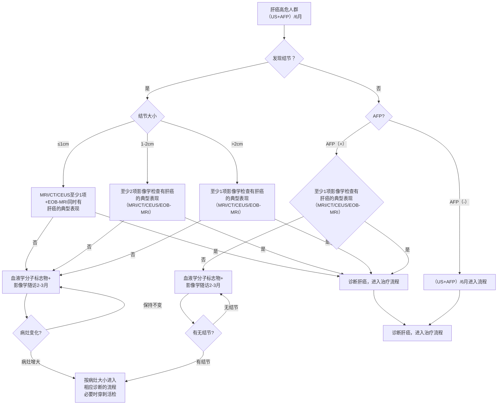
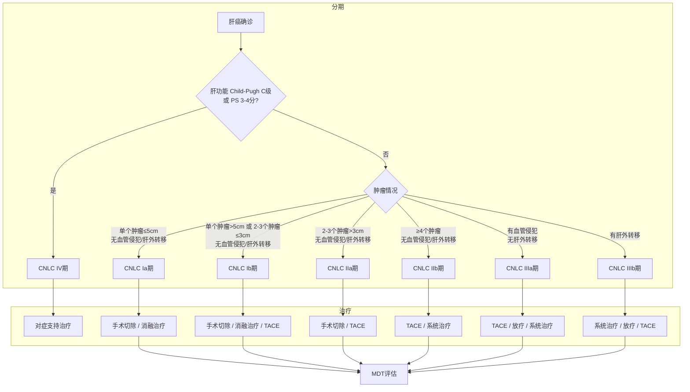

# 原发性肝癌诊疗指南（2024年版）

## 一、概述

根据中国国家癌症中心发布的数据，2022年全国原发性肝癌发病人数36.77万，位列各种癌症新发病人数第4位（肺、结直肠、甲状腺、肝），发病率位列第5位（肺、女性乳腺、甲状腺、结直肠、肝）；2022年因原发性肝癌死亡人数31.65万，死亡人数和死亡率均位列第2位（肺、肝）[1-2]。原发性肝癌主要包括肝细胞癌（hepatocellular carcinoma，HCC）、肝内胆管癌（intrahepatic cholangiocarcinoma，ICC）和混合型肝细胞癌-胆管癌（combined hepatocellular-cholangiocarcinoma，cHCC-CCA）3种不同病理学类型，三者在发病机制、生物学行为、病理组织学、治疗方法以及预后等方面差异较大，其中HCC占75%~85%，ICC占10%~15%[3-4]。本指南中的“肝癌”仅指HCC。

为进一步规范我国肝癌诊疗行为，2017年6月原国家卫生和计划生育委员会医政医管局主持制定并颁布了《原发性肝癌诊疗规范（2017年版）》，之后国家卫生健康委员会医政医管局于2019年12月和2021年12月分别进行了2次更新，并最终修订颁布了《原发性肝癌诊疗规范（2019年版）》和《原发性肝癌诊疗指南（2022年版）》。自《原发性肝癌诊疗指南（2022年版）》发布后，国内、外在肝癌的诊断、分期及治疗方面出现了许多符合循证医学原则的高级别证据，尤其是适应中国国情的研究成果相继问世。为此，国家卫生健康委员会医政司委托中华医学会肿瘤学分会，联合中国抗癌协会肝癌专业委员会、中国医师协会介入医师分会、中国医师协会外科医师分会和中华医学会超声医学分会等组织全国肝癌领域的多学科专家，结合肝癌临床诊治和研究的最新实践，再次修订并更新形成《原发性肝癌诊疗指南（2024年版）》（以下简称指南），以更好地规范肝癌的诊疗行为，反映肝癌诊治的最新进展，提升肝癌患者的总体生存率，进一步推动落实并达成中国政府《“健康中国2030”规划纲要》中实现总体癌症5年生存率提高15%的目标。

证据评价与推荐意见分级、制定和评价方法学（grading of recommendations，assessment，development and evaluation，GRADE）是目前使用最广泛的证据评价和推荐意见分级系统[5]。GRADE系统包括两部分，第一部分为证据评价，根据证据中的偏倚风险、不一致性、间接性、不精确性和发表偏倚，GRADE系统将证据质量分为高、中、低和极低4个水平[6]。第二部分为推荐意见分级，GRADE系统考虑医学干预的利弊平衡、证据质量、价值观念与偏好，以及成本与资源耗费等因素来制定推荐意见，并且将推荐意见分为强推荐和弱推荐（有条件推荐）2种[7]。医学干预的利弊差别越大，证据质量越高、价值观念与偏好越清晰越趋同、成本与资源耗费越小，则越应该考虑强推荐。反之，则应考虑弱推荐（有条件推荐）。本指南中的循证医学证据等级评估参照了上述GRADE分级的指导原则，采用了《牛津循证医学中心分级2011版》（OCEBM levels of evidence）作为辅助工具来具体执行证据分级（证据等级1~5）（附录1）。在从证据转换成推荐意见的方法上，指南专家组主要参考了上述的GRADE对推荐意见分级的指导原则，同时结合了ASCO指南的分级方案[8]对推荐意见分级做了相应的修改（附录2）。最终将推荐强度分为3个等级，分别是强推荐、中等程度推荐和弱推荐（指南正文中分别用推荐A、推荐B和推荐C表示）。强推荐（推荐A）代表专家组对该推荐意见反映了最佳临床实践有很高的信心，绝大多数甚至所有的目标用户均应采纳该推荐意见。中等程度推荐（推荐B）代表专家组对该推荐意见反映了最佳临床实践有中等程度的信心，多数目标用户会采纳该推荐意见，但是执行过程中应注意考虑医患共同决策。弱推荐（推荐C）代表专家组对该推荐意见反映了最佳临床实践有一定的信心，但是应该有条件地应用于目标群体，强调医患共同决策。

## 二、筛查和诊断

### （一）肝癌高危人群的筛查与监测

对肝癌高危人群的筛查与监测[超声显像联合血清甲胎蛋白（alpha-fetoprotein，AFP）检测]，有助于肝癌的早期发现、早期诊断和早期治疗[9]，同时可以显著降低患者的死亡风险[10]（证据等级1，推荐A）。肝癌高危人群的快速、便捷识别是实施大范围肝癌筛查的前提，而对人群肝癌风险的分层评估是制定不同肝癌筛查策略的基础。在我国，肝癌高危人群主要包括：具有乙型肝炎病毒（hepatitis B virus，HBV）和/或丙型肝炎病毒（hepatitis C virus，HCV）感染、过度饮酒、肝脂肪变性或代谢功能障碍相关性肝病、饮食中黄曲霉毒素B1的暴露、其他各种原因引起的肝硬化及有肝癌家族史等人群，尤其年龄>40岁的男性。目前，抗HBV和抗HCV治疗可显著降低肝癌的发生风险，但仍无法完全避免肝癌的发生[11]。由我国学者研发的适用于多种慢性肝病和各种族族的肝癌风险评估模型aMAP评分（age-male-albi-platelets score），可便捷地将肝病人群分为肝癌低风险（aMAP评分0~50分）、中风险（aMAP评分50~60分）和高风险（aMAP评分60~100分）人群，各组人群肝癌的年发生率分别为0~0.2%，0.4%~1.0%和1.6%~4.0%[12]（证据等级2，推荐B）。此外，基于多变量纵向数据（aMAP、AFP）和循环游离DNA（cell-free DNA，cfDNA）特征构建的两种新型肝癌预测模型aMAP-2和aMAP-2Plus，可进一步识别出肝癌发生率高达12.5%的超高风险人群[13]。肝癌筛查应重视将肝癌风险预测评分作为有效工具，开展社区、医院一体化的精准筛查新模式[14]，从而有效提高肝癌早期诊断率，降低病死率。高危人群至少每隔6个月进行1次筛查[9]（证据等级2，推荐A）。

### （二）肝癌的影像学检查

不同影像学检查手段各有特点，应该强调综合应用、优势互补、全面评估。

#### 1. 超声显像

超声显像具有便捷、实时、无创和无辐射等优势，是临床上最常用的肝脏影像学检查方法。

常规灰阶超声显像可以早期、敏感地检出肝内占位性病变，鉴别其是囊性或实性，初步判断良性或恶性。典型肝癌灰阶超声表现为肝内实性占位，圆形或椭圆形，周边常可见低回声的声晕。内部多为低回声，也可表现为等回声、高回声或不均匀回声。灰阶超声还可观察到合并肝硬化的表现，如肝脏回声增粗、肝脏体积缩小、肝表面凸凹不平、门静脉高压等。少数弥漫型肝癌与肝硬化难以区分。

同时，灰阶超声显像可以初步筛查肝内或腹腔内其他脏器是否有转移灶、肝内血管及胆管侵犯情况等。肝内转移灶多表现为肝内肿块周边或肝内其他部位出现大小不等的实性结节，数目不定，直径多<3cm，周边可见声晕。门静脉、肝静脉及胆管癌栓表现为管腔内低回声。癌栓完全充满门静脉管腔时周边可出现细小侧支循环形成，呈蜂窝样改变。肝静脉癌栓可以延续至下腔静脉甚至右心房。肝癌直接侵犯周邻脏器如胆囊、右肾等，灰阶超声也可观察到肿瘤与上述结构分界不清。

彩色多普勒血流成像可以观察病灶血供状况，辅助判断病灶良恶性，显示病灶与肝内重要血管的毗邻关系以及有无肝内血管侵犯，也可以初步判断肝癌局部治疗后的疗效情况。肝癌在彩色多普勒血流成像上表现为病灶内部血流信号增加，呈点状、短线状、树枝状、网篮状、周边环状等多种形态，病灶周围血管可见绕行或受压。脉冲多普勒检测在病灶内部可见动脉性血流信号，阻力指数多>0.6。门静脉、肝静脉及胆管出现癌栓时偶可在癌栓内检出动脉性血流信号。

超声造影检查可以实时动态观察肝肿瘤血流灌注的变化，鉴别诊断不同性质的肝脏肿瘤，术中应用可敏感检出隐匿性小病灶、实时引导局部治疗，术后评估肝癌局部治疗的疗效等[15-23]（证据等级2，推荐A）。

超声对比剂多经外周静脉注射，采用超声造影特异成像技术可追踪对比剂在瘤内、瘤周成像的动态变化。超声对比剂多使用微泡对比剂，微泡内部为惰性气体，其安全性高，过敏反应极少见。目前常用超声对比剂有注射用六氟化硫微泡和注射用全氟丁烷微球。前者为纯血池对比剂，可用于血管期成像；后者可被库普弗细胞吞噬，形成血管后期成像。血管期包括动脉期（注射对比剂30s以内）、门静脉期（31~120s）、延迟期（>120s）。血管后期一般定义为对比剂注射8min后。典型肝癌超声造影多表现为病灶动脉期快速高增强，增强时间早于病灶周围肝实质，门静脉及延迟期快速减退为低回声，即“快进快出”[22-23]增强模式（证据等级1，推荐A）。超声造影表现与病灶大小相关，直径>3.0cm的肝癌多表现为上述典型增强模式，但少数<2.0cm者超声造影表现趋于不典型。门静脉及延迟期对比剂消退速度与肿瘤分化程度有关，高分化者消退慢而低分化者消退较快。

由于超声造影对微细血流的高敏感性，可用于观察肝癌发生发展不同阶段，如再生结节、低度异型增生、高度异型增生、高度异型增生合并局部癌变、早期肝癌、进展期肝癌等的血流变化并辅助诊断，因此超声造影还可用于肝癌高危人群的筛查以及用于监测肝内结节的演变情况[18]。有肝癌高危风险的患者可以考虑采用超声造影肝脏影像报告与数据系统（liver imaging reporting and data system，LI-RADS）提高肝癌诊断的特异性（证据级别3，推荐B）。

肿瘤在超声造影延迟期或血管后相多表现为低增强，与周围肝实质分界明显，因此超声造影尤其适用于肝内多发微小病灶的检出、消融或手术后监测以早期发现复发灶。当肝内病灶延迟期或血管后期表现为低增强时，可在10min后再次注射超声对比剂，观察病灶动脉期有无增强，进而判断病灶的有无及性质。血管后期对比剂（如注射用全氟丁烷微球）因为显影时间长（30~120min），适合用于病灶的检出[23]。

超声造影可用于肿瘤消融的术前规划、穿刺引导、消融后即刻评估和追踪随访；消融即刻评估有助于及时发现未完全消融的残留病灶，及时补充治疗。定量超声造影可测量对比剂到达时间、达峰时间、渡越时间、峰值强度、血流灌注量等指标，可用于评估系统抗肿瘤治疗（化疗、靶向治疗、免疫治疗等）后的疗效以及在早期预测患者对系统抗肿瘤治疗的反应性，辅助临床决策[24-25]。

超声联合动态增强CT、MRI扫描的影像导航技术为肝癌，尤其是常规超声显像无法显示的隐匿性肝癌的精准定位提供了有效的技术手段[26-28]（证据等级3，推荐B）。超声融合影像导航在肝癌消融术前计划、术中监测及安全边缘判断、术后即刻评估疗效中具有一定价值。融合导航中使用超声造影能进一步提高准确性，特别是针对微小病灶、等回声病灶和较大病灶的消融范围的评估[28-29]。

超声剪切波弹性成像可以定量评估肝肿瘤的组织硬度及周边肝实质的纤维化/硬化程度，为规划合理的肝癌治疗方案提供有用的信息[30-31]（证据等级3，推荐B）。定量超声技术可测量非酒精性脂肪性肝病肝内脂肪含量，为非酒精性脂肪性肝病相关肝癌的预警提供辅助信息[32-33]。多模态超声显像技术的联合应用，为肝癌精准的术前诊断、术中定位、术后评估起到了重要作用。术中超声（超声造影）、腹腔镜超声（超声造影）在肝外手术中的应用也越来越普及，能帮助检出隐匿性微小病灶、判断手术切除范围和切缘情况[34]。高频超声有助于发现肝包膜下或位置较表浅的隐匿病灶[16]。超声影像组学对肝癌的鉴别诊断、预测肝癌微血管浸润等生物学行为、选择治疗手段等有一定的意义[35]。随着人工智能技术发展，通过融合患者临床信息和肿瘤影像信息建立肝癌智能预测模型，精准预测肝癌的复发转移，有望为临床选择消融或手术治疗提供科学、合理决策[36,37]。

#### 2. CT和MRI

动态增强CT、MRI扫描是肝脏超声和/或血清AFP筛查异常者明确肝癌诊断的首选影像学检查方法。肝脏动态增强MRI具有无辐射、组织分辨率高、多方位多序列动态增强成像等优势，且具有形态结合功能（包括弥散加权成像等）综合成像能力，成为肝癌临床检出、诊断、分期和疗效评价的优选影像技术。动态增强MRI对直径≤2.0cm肝癌的检出和诊断能力优于动态增强CT[38-39]（证据等级1，推荐A）。动态增强MRI在评价肝癌是否侵犯门静脉、肝静脉主干及其分支，以及腹腔或腹膜后间隙淋巴结转移等方面，较动态增强CT具有优势。采用动态增强MRI扫描评价肝癌治疗疗效时，可使用实体瘤临床疗效评价标准（modified response evaluation criteria in solid tumor，mRECIST）加T₂加权成像及弥散加权成像进行综合判断。

CT/MRI（非特异性钆类对比剂）动态增强三期扫描包括：动脉晚期（门静脉开始强化，通常注射对比剂后约35s扫描）、门静脉期（门静脉已完全强化，肝静脉可见对比剂充盈，肝实质通常达到强化峰值，通常注射对比剂后60~90s扫描）、延迟期（门静脉、肝静脉均有强化但低于门脉期，肝实质可见强化但低于门脉期，通常注射对比剂后3min扫描）。肝细胞特异性MRI对比剂（钆塞酸二钠，Gd-EOB-DTPA）动态增强四期扫描包括：动脉晚期（同上）、门静脉期（同上）、移行期（肝脏血管和肝实质信号强度相同，肝脏强化是由细胞内及细胞外协同作用产生，通常在注射Gd-EOB-DTPA 2~5min后扫描）、肝胆特异期（肝脏实质信号高于肝血管，对比剂经由胆管系统排泄，通常在注射钆塞酸二钠12~20min后扫描；肝功能正常者，一般肝胆特异期12~15min扫描，而肝功能明显降低者，一般只需延迟20min即可）。

肝癌影像学诊断主要根据为动态增强扫描的“快进快出”强化方式[40-42]（证据等级1，推荐A）。动态增强CT和MRI动脉期（主要在动脉晚期）肝肿瘤呈均匀或不均匀明显强化，门静脉期和/或延迟期肝肿瘤强化低于肝实质。“快进”为非环形强化，“快出”为非周边廓清。“快进”在动脉晚期观察，“快出”在门静脉期及延迟期观察。Gd-EOB-DTPA通常在门静脉期观察“快出”征象，但移行期及肝胆特异期“快出”征象可以作为辅助恶性征象。

Gd-EOB-DTPA增强MRI检查显示：肝肿瘤动脉期明显强化，门静脉期强化低于肝实质，肝胆特异期常呈明显低信号。但仍有5%~12%分化较好的肝癌，尤其是小肝癌（直径≤2.0cm），肝胆特异期可见肿瘤部分呈吸收对比剂的稍高信号[43]。

动态增强MRI扫描，尤其用于诊断肿瘤直径≤2.0cm肝癌，强调尚需要结合其他征象（如包膜样强化、T₂加权成像中等信号和弥散受限等）及超阈值增长（6个月内病灶最大直径增大50%）进行综合判断[44]（证据等级3，推荐B）。包膜样强化的定义为：光滑，均匀，边界清晰，大部分或全部包绕病灶，特别在门静脉期、延迟期或移行期表现为环形强化。

直径≤1.0cm的肝癌定义为亚厘米肝癌（subcentimeter hepatocellular carcinoma，scHCC）。根据文献报道，scHCC局部切除术后5年生存率为98.5%，明显高于直径1.0~2.0cm的小肝癌（5年生存率为89.5%）[45]。在高危人群中，排除确定的良性病变后，推荐使用Gd-EOB-DTPA增强MRI来诊断scHCC[46-51]（证据等级2，推荐B），尤其适用于合并肝硬化的患者，同时有助于与高度异型增生结节等癌前病变相互鉴别[52]。

目前CT平扫及动态增强扫描除常应用于肝癌的临床诊断及分期外，也应用于肝癌局部治疗的疗效评价，特别是观察经导管动脉化疗栓塞（transcatheter arterial chemoembolization，TACE）后碘油沉积状况及肿瘤存活有一定优势，特别是有助于决定是否需要再次TACE治疗[53-55]。基于术前CT的影像组学技术也可以用于预测首次TACE治疗的疗效[56]。同时，借助CT后处理技术可以进行三维血管重建、肝脏体积和肝肿瘤体积测量。三维可视化重建技术可以进行肝脏分叶分段处理，术前模拟手术，辅助医生制定最优手术方案。

微血管侵犯（microvascular invasion，MVI）的影像学征象特异性高但敏感性较低，人工智能（包括影像组学和深度机器学习模型）是术前预测MVI的可能突破性（证据等级3，推荐B）。

#### 3. 数字减影血管造影

数字减影血管造影（digital subtraction angiography，DSA）是肝癌患者血管内介入治疗前必须进行的检查，常采用经选择性或超选择性肝动脉插管进行。DSA检查可以清楚显示肝动脉解剖和变异以及肿瘤血管、染色，明确肿瘤数目、大小及其血供丰富程度[61]。DSA联合锥形线束CT（cone beam computed tomography，CBCT）可更清楚显示肿瘤病灶、提高小肝癌的检出率，明确肿瘤供血动脉分支的三维关系、指导肿瘤供血动脉分支的超选择性插管[62]（证据等级2，推荐A）。经肠系膜上动脉或脾动脉的间接门静脉造影，可以评价门静脉血流和门静脉主干或一级分支癌栓栓塞等情况。

#### 4. 核医学影像学检查

（1）正电子发射计算机断层成像（positron emission tomography and computed tomography，PET/CT）：¹⁸F-氟代脱氧葡萄糖（¹⁸F-flurodeoxyglucose，¹⁸F-FDG）PET/CT全身显像的优势在于：①对肿瘤进行分期，通过1次检查能够全面评价有无淋巴结转移及远处器官的转移[63-64]（证据等级1，推荐A）；②再分期，因PET/CT功能影像不受解剖结构的影响，可以准确显示解剖结构发生变化后或者解剖结构复杂部位的复发转移灶[65]（证据等级2，推荐B）；③对于抑制肿瘤活性的靶向药物的疗效评价更加敏感、准确[66-67]（证据等级2，推荐A）；④指导放射治疗生物靶区的勾画、确定穿刺活检部位[65]；⑤评价肿瘤的恶性程度和预后[68-70]（证据等级2，推荐B）。PET/CT对肝癌的诊断灵敏度和特异度有限，可作为其他影像学检查的辅助和补充，在肝癌的分期、再分期和疗效评价等方面具有优势。采用碳-11标记的乙酸盐（¹¹C-acetate）或胆碱（¹¹C-choline）等对比剂PET显像可以提高对高分化肝癌诊断的灵敏度，与¹⁸F-FDG PET/CT显像具有互补作用[71-72]。镓-68或氟-18标记的成纤维激活蛋白抑制剂-04（⁶⁸Ga-DOTA-FAPI-04/¹⁸F-NOTA-FAPI-04）PET/CT可有效提高癌原发灶、转移灶的诊断灵敏度，尤其是中高分化肝细胞癌及肝内胆管癌，补充¹⁸F-FDG PET/CT显像的不足（证据等级3，推荐C）[73-74]。

（2）单光子发射计算机断层成像（single photon emission computed tomography and computed tomography，SPECT/CT）：SPECT/CT已逐渐替代SPECT成为核医学单光子显像的主流设备，选择全身平面显像所发现的病灶，再进行局部SPECT/CT融合影像检查，可以同时获得病灶部位的SPECT和诊断CT图像，诊断准确性得以显著提高[75]（证据等级3，推荐B）。

（3）正电子发射计算机断层磁共振成像（positron emission tomography and magnetic resonance imaging，PET/MRI）：1次PET/MRI检查可以同时获得解剖结构、动态增强MRI信息及PET功能代谢信息，提高肝癌诊断的灵敏度[76]（证据等级4，推荐C）。

### （三）肝癌的血液学分子标志物

血清AFP是当前诊断肝癌和疗效监测常用且重要的指标。血清AFP≥400μg/L，在排除妊娠、慢性或活动性肝病、生殖腺胚胎源性肿瘤以及其他消化系统肿瘤后，高度提示肝癌；而血清AFP轻度升高者，应结合影像学检查或作动态观察，并与肝功能变化对比分析，有助于诊断。异常凝血酶原[protein induced by vitamin K absence/antagonist-II (PIVKA II）或des-gamma carboxyprothrombin（DCP）]、血浆游离微小核糖核酸（microRNA）[77]和血清甲胎蛋白异质体（lens culinaris agglutinin-reactive fraction of AFP，AFP-L3）也可以作为肝癌早期诊断标志物，特别是对于血清AFP阴性人群。基于性别、年龄、AFP、PIVKA II和AFP-L3构建的GALAD模型在诊断早期肝癌的灵敏度和特异度分别为85.6%和93.3%，有助于AFP阴性肝癌的早期诊断[78]（证据等级1，推荐A）。目前已有基于中国人群大样本数据的优化的类GALAD模型（C-GALAD、GALAD-C、C-GALAD II等）用于肝癌的早期诊断。另外，基于性别、年龄、AFP、PIVKA II构建的简化的GAAD模型[79]及ASAP模型[80]与GALAD模型诊断效能类似（证据等级1，推荐A）。基于7个microRNA组合的检测试剂盒诊断肝癌的灵敏度和特异度分别为86.1%和76.8%，对AFP阴性肝癌的灵敏度和特异度分别为77.7%和84.5%[77]（证据等级1，推荐A）。

近年来，“液体活检”包括循环游离microRNA、循环肿瘤细胞（circulating tumor cell，CTC）[81]、cfDNA[82]、循环肿瘤DNA（circulating tumor DNA，ctDNA）[83-84]、游离线粒体DNA、游离病毒DNA和细胞外囊泡等，在肿瘤早期诊断和疗效评价等方面展现出重要价值（附录3）。

### （四）肝癌的穿刺活检

具有典型肝癌影像学特征的肝占位性病变，符合肝癌临床诊断标准的患者，通常不需要以诊断为目的的肝病灶穿刺活检[41,85-87]（证据等级1，推荐A），特别是对于具有外科手术指征的肝癌患者。能够手术切除或准备肝移植的肝癌患者，不建议术前行肝病灶穿刺活检，以减少肝肿瘤破裂出血、播散风险。对于缺乏典型肝癌影像学特征的肝占位性病变，肝病灶穿刺活检可获得明确的病理诊断。肝病灶穿刺活检可以明确病灶性质及肝癌分子分型[88]，为明确肝病病因、指导治疗、判断预后和进行研究提供有价值的信息，故应根据肝病灶穿刺活检的患者受益、潜在风险以及医师操作经验综合评估穿刺活检的必要性。

肝病灶穿刺活检通常在超声或CT引导下进行，可以采用18G或16G肝穿刺空芯针活检获得病灶组织。其主要风险是可能引起出血和肿瘤针道种植转移。因此，术前应检查血小板和出凝血功能，对于有严重出血倾向的患者，应避免肝病灶穿刺活检。穿刺路径应尽可能经过正常肝组织，避免直接穿刺肝脏表面结节。穿刺部位应选择影像检查显示肿瘤活跃的肿瘤内和肿瘤旁，取材后肉眼观察取材的完整性以提高诊断准确性。另外，受病灶大小、部位深浅等多种因素影响，肝病灶穿刺病理学诊断也存在一定的假阴性率，特别是对于直径≤2cm的病灶，假阴性率较高。因此，肝病灶穿刺活检阴性结果并不能完全排除肝癌的可能，仍需观察和定期随访。对于活检组织取样过少、病理结果不支持但临床上高度怀疑肝癌的患者，可以重复进行肝病灶穿刺活检或者密切随访。

**要点论述：**

（1）借助肝脏超声显像联合血清AFP进行肝癌的早期筛查，建议高危人群至少每隔6个月进行1次筛查。

（2）动态增强CT、MRI扫描、Gd-EOB-DTPA动态增强MRI检查以及超声造影是肝脏超声显像和/或血清AFP筛查异常者明确诊断的首选影像学检查方法。

（3）肝癌影像学诊断依据主要根据“快进快出”的强化方式。

（4）肝脏动态增强MRI检查是肝癌临床诊断、分期和疗效评价的优选影像手段。

（5）PET/CT扫描有助于对肝癌进行分期及疗效评价。

（6）血清AFP是诊断肝癌和疗效监测常用且重要的指标。对血清AFP阴性人群，可以借助DCP、基于7个microRNA组合的检测试剂盒、AFP-L3进行早期诊断。

（7）具有典型肝癌影像学特征的肝占位性病变，符合肝癌临床诊断标准的患者，通常不需要以诊断为目的的肝病灶穿刺活检。

### （五）肝癌的病理学诊断

#### 1. 肝癌病理学诊断术语

原发性肝癌：统指起源于肝细胞和肝内胆管上皮细胞的恶性肿瘤，主要包括HCC、ICC和cHCC-CCA。

（1）HCC：是指肝细胞发生的恶性肿瘤。不推荐使用“肝细胞肝癌”或“肝细胞性肝癌”的病理学诊断名称。

（2）ICC：是指肝内胆管衬覆上皮细胞和胆管旁腺发生的恶性肿瘤，以腺癌最为多见。2019版《WHO消化系统肿瘤分类》已不推荐对ICC使用胆管细胞癌（cholangiocellular carcinoma）的病理学诊断名称，且不推荐对细胞管癌使用细胞管细胞癌（cholangiocellular carcinoma）的病理学诊断名称[89]。组织学上可以分为：①大胆管型ICC：起源于肝小叶隔胆管以上至邻近肝门区之间较大的胆管，腺管口径大而不规则，周围可见黏液腺体；②小胆管型ICC：起源于小叶间胆管及隔胆管，腺管口径较小，排列较规则；③细胞管癌：起源于肝间管或细胞管，癌细胞呈小立方形，在透明变性的胶原纤维间质内呈松散的成角小导管或分枝状排列；④胆管板畸形型ICC：肿瘤腺管呈不规则囊状扩张，管腔内含乳头状突起。有研究显示，大胆管型ICC的生物学行为和基因表型特点与其他类型ICC有所不同，临床预后更差[90]。

关于HCC和ICC分子分型的临床和病理学意义多处在研究和论证阶段。新近研究表明，EB病毒相关的ICC具有特殊的临床病理、免疫微环境及分子特征，并对免疫检查点抑制剂治疗有较好的获益，推荐采用EB病毒编码小核糖核酸（Epstein-Barr virus encoded ribonucleic acid，EBER）原位杂交检测来筛选免疫检查点抑制剂治疗获益人群[91]；而丙糖磷酸异构酶1（triose phosphate isomerase 1，TPI1）在ICC组织中高表达是评估术后复发转移风险的有用指标[92]。

（3）cHCC-CCA：是指在同一个肿瘤结节内同时出现HCC和ICC两种组织成分，不包括碰撞癌。有学者建议以两种肿瘤成分占比分别≥30%作为cHCC-CCA的病理学诊断标准[93]，但是目前还没有国际统一的cHCC-CCA两种组织学成分占比的病理诊断标准，有待于大样本多中心研究。为此，建议在cHCC-CCA病理诊断时对两种肿瘤成分的比例状况加以标注，并注意分别对HCC及ICC成分进行组织学分级及亚型分型、MVI分级、淋巴管侵犯，以供临床评估肿瘤生物学特性和制定诊疗方案时参考。对于某种肿瘤成分占比极少时慎用cHCC-CCA的诊断。

#### 2. 肝癌病理诊断规范

肝癌病理学诊断规范由标本处理、标本取材、病理检查和病理报告等部分组成[88,93]。

（1）标本处理要点：①手术医师应在病理检查申请单上明确标注送检标本的部位、种类和数量，是否曾接受转化/新辅助治疗以及方案与周期，对手术切缘和重要病变可以用染料或缝线加以标记；②尽可能在离体30min以内将肿瘤标本完整地送达病理科，由病理医师切开固定。组织库留取标本时应在病理科的指导下进行，以保证取材的准确性，并应首先满足病理诊断的需要；③10%中性缓冲福尔马林溶液固定12~24h。

（2）标本取材要点：肝癌周边区域是肿瘤生物学行为的代表性区域。为此，要求采用“7点”基线取材法（图1），在肿瘤的12点、3点、6点和9点时钟位上于癌与癌旁肝组织交界处按1:1取材；在肿瘤内部至少取材1块；对距肿瘤边缘≤1cm（近癌旁）和>1cm（远癌旁）范围内的肝组织分别取材1块。肝脏最近切缘及单独送检的门静脉栓子需分别取材。ICC标本还应对胆管切缘进行取材。对于单个肿瘤最大直径≤3cm的小肝癌，应全部取材检查。实际取材的部位和数量还须根据肿瘤的直径和数量酌情增加取材[94,95]（证据等级3，推荐B）。

> **图1：肝脏肿瘤标本基线取材部位示意图**
>
> 注：A、B、C、D：分别对应肿瘤12点、3点、6点和9点时钟位的癌与癌旁肝组织交界处；E：肿瘤区域；F：近癌旁肝组织区域；G：远癌旁肝组织区域

#### 3. 肝癌病理检查要点

（1）大体标本观察与描述[96]：对送检的所有手术标本全面观察，重点描述肿瘤的大小、数量、颜色、质地、与血管和胆管的关系、包膜状况、周围肝组织病变、肝硬化类型、肿瘤至切缘的距离以及切缘情况等。

（2）显微镜下观察与描述[96]：对所有取材组织全面观察，肝癌的病理诊断可参照2019年《WHO消化系统肿瘤分类》[93]，重点描述以下内容：HCC的分化程度可以采用国际上常用的Edmondson-Steiner四级（I~IV）分级法或WHO推荐的高中低分化。HCC的组织学类型：常见有细梁型、粗梁型、假腺管型、团片型等；HCC的特殊组织学类型：如纤维板层型、硬化型、透明细胞型、富脂型、嫌色型、富中性粒细胞型、富淋巴细胞型和未分化型等。双表型HCC在临床、影像学、血清学、癌细胞形态和组织结构上均表现为典型的HCC特征，但免疫组化标记显示同时表达肝细胞性标志物和胆管上皮标志物，这类HCC的侵袭性较强[97]，对瑞戈非尼治疗可能敏感[98]。转化/新辅助治疗后手术切除标本还应观察肿瘤坏死和间质反应的程度和范围；肝癌的生长方式：包括癌周浸润、包膜侵犯或突破、MVI和卫星结节等；慢性肝病评估：肝癌常伴随不同程度的慢性病毒性肝炎或肝硬化，推荐采用较为简便的Scheuer评分系统和中国慢性病毒性肝炎组织学分级和分期标准[99-101]，并注意描述肝细胞脂肪变性所占比例，以及脂肪性肝病的诊断和鉴别诊断。

（3）MVI诊断：MVI是指在显微镜下于内皮细胞衬覆的脉管腔内见到癌细胞巢团[102]，肝癌以门静脉分支侵犯（含包膜内血管）最为多见，在ICC可有淋巴管侵犯。MVI病理分级方法[103]：M0：未发现MVI；M1（低危组）：≤5个MVI，且均发生于近癌旁肝组织（≤1cm）；M2（高危组）：M2a定义为>5个近癌旁MVI，且无远癌旁MVI；M2b定义为MVI发生于远癌旁肝组织（>1cm）（图2）。MVI各组患者的术后复发转移风险依次增加，临床预后依次降低[94-95,104]。MVI和卫星灶可视为肝癌发生肝内转移过程的不同演进阶段，当癌旁肝组织内的卫星灶与MVI难以区分时，可一并计入MVI病理分级。MVI是评估肝癌复发转移风险和选择治疗方案的重要参考依据[88,93,105,106]，应作为组织病理学常规检查指标。MVI病理分级是建立在“7点”基线取材的基础上，当送检标本不能满足“7点”基线取材时，应在MVI分级时加以说明（证据等级2，推荐A）。

> **图2：微血管侵犯病理分级标准**
>
> 注：MVI为微血管侵犯。图中展示了四种组织学切片：M0（无MVI）、M1（低危组：≤5个MVI，近癌旁）、M2a（高危组：>5个MVI，近癌旁）、M2b（高危组：MVI发生于远癌旁肝组织>1cm）。

#### 4. 免疫组织化学检查

肝癌免疫组化检查的主要目的是：①肝细胞良性、恶性肿瘤之间的鉴别；②HCC与ICC以及其他特殊类型的肝脏肿瘤之间的鉴别；③原发性肝癌与转移性肝癌之间的鉴别。由于肝癌组织学类型的高度异质性，现有的肝癌标志物在诊断特异度和灵敏度均存在某种程度的不足，常需要合理组合、客观评估，有时还需要与其他系统肿瘤的标志物联合使用。

（1）HCC常用的免疫组化标志物

以下标志物对肝细胞标记阳性，有助于提示肝细胞来源的肿瘤，但不能作为区分肝细胞良性、恶性肿瘤的依据。

①精氨酸酶-1：肝细胞胞浆/胞核染色。

②肝细胞抗原：肝细胞胞浆染色。

③肝细胞膜毛细胆管缘特异性染色抗体：如CD10、多克隆性癌胚抗原和胆盐输出泵蛋白等抗体，可以在肝细胞膜的毛细胆管面出现特异性染色，有助于确认肝细胞性肿瘤。

以下标志物有助于肝细胞良性、恶性肿瘤的鉴别。

①谷氨酰胺合成酶：HCC多呈弥漫性胞浆强阳性；部分肝细胞腺瘤，特别是β-catenin突变激活型肝细胞腺瘤也可以表现为弥漫阳性；在高级别异型增生结节为中等强度灶性染色，阳性细胞数<50%；在肝局灶性结节性增生呈特征性的不规则地图样染色；在正常肝组织仅中央静脉周围的肝细胞染色，这些特点有助于鉴别诊断。

②磷脂酰肌醇蛋白-3：HCC胞浆及胞膜染色。

③热休克蛋白70：HCC胞浆或胞核染色。

④CD34：CD34免疫组化染色虽然并不直接标记肿瘤实质细胞，但可以显示不同类型肝脏肿瘤的微血管密度及其分布模式特点，如HCC为弥漫型、ICC为稀疏型、肝细胞腺瘤为斑片型、肝局灶性结节性增生为条索型等，结合肿瘤组织学形态有助于鉴别诊断。

（2）ICC常用的免疫组化标志物

①ICC通用免疫组化标志物：细胞角蛋白7、细胞角蛋白19、黏蛋白1、上皮细胞黏附分子。

②大胆管型ICC：S100钙结合蛋白、黏蛋白5AC等。

③小胆管型ICC：C反应蛋白、神经性钙黏蛋白、神经细胞相关黏附分子（CD56）。

（3）cHCC-CCA常用的免疫组化标志物

HCC和ICC两种成分分别表达上述各自肿瘤的标志物。此外，CD56、CD117和上皮细胞黏附分子（epithelial cell adhesion molecule，EpCAM）等标志物阳性表达则可能提示肿瘤伴有干细胞分化特征，侵袭性更强。

#### 5. 分子病理检测

肝癌分子病理检测的主要目的是：辅助诊断HCC特殊亚型；ICC常用靶向/免疫治疗药物的筛选。根据分子病理检测在肝癌诊断中的应用，不仅可以鉴别出HCC特殊亚型及筛选出ICC靶向/免疫治疗药物，指导临床预后监测及个体化治疗，同时还可以加深HCC特殊亚型及ICC的病理认识，临床可以依据分子病理改变对患者进行分层管理。

（1）HCC常用的分子病理诊断标志物：

①纤维板层型HCC：具有DNAJB1-PRKACA基因融合[89]。

②硬化型HCC：具有结节性硬化症1/2基因突变[89]。

（2）ICC常用的靶向/免疫治疗标志物：

①大胆管型ICC：常见人类表皮生长因子受体2基因扩增、BRAF V600E基因突变、神经营养因子受体络氨酸激酶基因融合、RET基因融合、微卫星高度不稳定性、高肿瘤突变负荷等[107]。

②小胆管型ICC：常见成纤维生长因子受体2基因突变（重排或融合）[108]与异柠檬酸脱氢酶1/2基因突变[109]。

#### 6. 转化/新辅助治疗后肝癌切除标本的病理学评估

（1）标本取材：对于临床标注有术前行转化/新辅助治疗的肝癌切除标本，可以按以下流程处理：在瘤床（肿瘤在治疗前所处的原始位置）最大直径处切开并测量三维尺寸，详细描述坏死及残存肿瘤范围及占比。直径≤3cm的小肝癌应全部取材；而直径>3cm的肿瘤应在最大直径处按0.5~1.0cm间隔将肿瘤切开，选择肿瘤残留最具代表性的切面全部取材，其他切面选择性取材。注意在取材时同时留取肿瘤床及周边肝组织以相互对照，可以对大体标本照相用于组织学观察的对照。

（2）镜下评估：主要评估肝癌切除标本肿瘤床的3种成分比例，包括存活肿瘤、坏死区域、肿瘤间质（纤维组织及炎细胞）。肿瘤床的这3个面积之和等于100%。在病理报告中应标注取材蜡块数量，在评估每张切片上述3种成分百分比的基础上，取均值确定残存肿瘤的总百分比，并在病理报告中注明。

（3）病理学评估：病理完全缓解（pathologic complete response，pCR）、明显病理缓解（major pathologic response，MPR）评估是评价术前治疗疗效和探讨术后合理干预的重要病理指标。

①pCR：是指在术前治疗后，完整评估肿瘤床标本的组织学后未发现存活肿瘤细胞。

②MPR：是指在术前治疗后，存活肿瘤减少到可以影响临床预后的阈值以下。在肺癌研究中常将MPR定义为肿瘤床残留肿瘤细胞减少到≤10%[110]，这与肝癌术前经TACE治疗后，肿瘤坏死程度与预后的相关性研究结果也相同[111]。但是在转化/新辅助治疗的肝癌切除样本中，肿瘤床残留肿瘤细胞减少到多少有临床意义，目前尚无明确定论，一般认为应至少减少50%以上。建议对初诊为MPR的肿瘤标本进一步扩大取材范围加以明确。

（4）对于免疫检查点抑制剂治疗后肝癌标本，注意描述淋巴细胞浸润程度及三级淋巴结结构[112]，同时注意观察癌周肝组织有无免疫相关性肝损伤，包括肝细胞损伤、小叶内炎症及胆管炎等。

#### 7. 肝癌病理诊断报告

主要由大体标本描述、显微镜下描述、免疫组化检查、病理诊断名称和MVI分级等部分组成，必要时还可以向临床提出说明和建议（附录4）。此外，还可以酌情开展多结节性复发性肝癌克隆起源检测、药物靶点检测、生物学行为评估以及预后判断等相关的分子病理学检查，提供临床参考。

**要点概述：**

（1）肝癌切除标本的规范化处理和及时送检对保持肿瘤组织和细胞的完整及正确病理诊断十分重要。

（2）肝癌标本取材应遵循“7点”基线取材的规范，有利于获得肝癌代表性的病理生物学特征信息。

（3）肝癌病理诊断报告内容应规范全面，应特别重视描述影响肝癌预后的重要因素，如肝癌的组织学类型、分化程度、浸润性生长方式、MVI病理分级以及具有靶向治疗指导意义的靶点的分子病理检测等。

（4）关注转化/新辅助治疗后肝癌切除标本的病理学评估。

### （六）肝癌的临床诊断及路线图

结合肝癌发生的高危因素、影像学特征以及血液学分子标志物，依据路线图的步骤对肝癌进行临床诊断（图3）。

（1）肝癌高危人群，至少每隔6个月进行1次超声显像及血清AFP检测，发现肝内直径≤1cm结节，动态增强MRI、动态增强CT、超声造影3种检查中至少1项检查以及Gd-EOB-DTPA增强MRI检查同时显示“快进快出”的肝癌典型特征，则可以做出肝癌的临床诊断；若不符合上述要求，可以进行每2~3个月的影像学检查随访并结合血清AFP、DCP、7个microRNA组合以明确诊断，必要时进行肝病灶穿刺活检。

（2）肝癌高危人群，随访发现肝内直径1~2cm结节，若动态增强MRI、动态增强CT、超声造影或Gd-EOB-DTPA增强MRI的4种检查中至少2项检查有典型的肝癌特征，则可以做出肝癌的临床诊断；若上述4种影像学检查无或只有1项典型的肝癌特征，可以进行每2~3个月的影像学检查随访并结合血清AFP、DCP、7个microRNA组合以明确诊断，必要时进行肝病灶穿刺活检。

（3）肝癌高危人群，随访发现肝内直径>2cm结节，若动态增强MRI、动态增强CT、超声造影或Gd-EOB-DTPA增强MRI的4项检查中至少1项检查有典型的肝癌特征，则可以做出肝癌的临床诊断；若上述4种影像学检查无典型的肝癌特征，可以进行每2~3个月的影像学检查随访并结合血清AFP、DCP、7个microRNA组合以明确诊断，必要时进行肝病灶穿刺活检。

（4）肝癌高危人群，如血清AFP升高，特别是持续升高，应进行影像学检查以明确肝癌诊断；若动态增强MRI、动态增强CT、超声造影或Gd-EOB-DTPA增强MRI的4种检查中至少1项检查有典型的肝癌特征，即可以临床诊断为肝癌；如上述4种影像学检查未发现肝内结节，在排除妊娠、慢性或活动性肝病、生殖腺胚胎源性肿瘤以及其他消化系统肿瘤的前提下，应每隔2~3个月进行1次影像学复查，同时密切随访血清AFP、DCP、7个microRNA组合变化。

**图3：肝癌诊断路线图（Mermaid流程图）**

> 注：典型表现为动脉期（主要动脉晚期）病灶明显强化，门静脉期、延迟期或移行期强化下降，呈“快进快出”的强化方式。不典型表现为缺乏动脉期病灶强化，门静脉期、延迟期或移行期无廓清，甚至持续强化等。MRI：磁共振成像。CT：计算机断层扫描。CEUS：超声造影。EOB-MRI：肝细胞特异性对比剂（钆塞酸二钠，Gd-EOB-DTPA）增强磁共振扫描。血液学分子标志物包括血清AFP、DCP、7个microRNA组合。AFP（+）为超过血清AFP检测正常值。

## 三、肝癌的分期

肝癌的分期对于治疗方案的选择、预后评估至关重要。国外有多种分期方案，如：巴塞罗那肝癌临床分期（Barcelona Clinic Liver Cancer，BCLC）、TNM分期、日本肝病学会（Japanese Society of Hepatology，JSH）分期和亚太肝病研究学会（Asian Pacific Association for the Study of the Liver，APASL）分期等。结合中国的具体情况和实践积累，依据患者体能状态（performance status，PS）、肝肿瘤及肝功能情况，建立中国肝癌的分期方案（China Liver Cancer Staging，CNLC），包括：CNLC Ia期、Ib期、IIa期、IIb期、IIIa期、IIIb期、IV期，具体分期方案描述见图4。

- **CNLC Ia期**：PS 0~2分，肝功能Child-Pugh A/B级，单个肿瘤、直径≤5cm，无影像学可见血管癌栓和肝外转移。
- **CNLC Ib期**：PS 0~2分，肝功能Child-Pugh A/B级，单个肿瘤、直径>5cm，或2~3个肿瘤、最大直径≤3cm，无影像学可见血管癌栓和肝外转移。
- **CNLC IIa期**：PS 0~2分，肝功能Child-Pugh A/B级，2~3个肿瘤、最大直径>3cm，无影像学可见血管癌栓和肝外转移。
- **CNLC IIb期**：PS 0~2分，肝功能Child-Pugh A/B级，肿瘤数目≥4个，不论肿瘤直径大小，无影像学可见血管癌栓和肝外转移。
- **CNLC IIIa期**：PS 0~2分，肝功能Child-Pugh A/B级，不论肿瘤直径大小和数目，有影像学可见血管癌栓而无肝外转移。
- **CNLC IIIb期**：PS 0~2分，肝功能Child-Pugh A/B级，不论肿瘤直径大小和数目，不论有无影像学可见血管癌栓，但有肝外转移。
- **CNLC IV期**：PS 3~4分，或肝功能Child-Pugh C级，不论肿瘤直径大小和数目，不论有无影像学可见血管癌栓，不论有无肝外转移。

**图4：中国肝癌临床分期与治疗路线图（Mermaid流程图）**

> 注：PS为患者体能状态；CNLC为中国肝癌分期；MDT为多学科诊疗团队；TACE为经导管动脉化疗栓塞术。系统抗肿瘤治疗包括一线治疗：阿替利珠单克隆抗体+贝伐珠单克隆抗体、信迪利单克隆抗体+贝伐珠单克隆抗体类似物、甲磺酸阿帕替尼+卡瑞利珠单克隆抗体、多纳非尼、仑伐替尼、替雷利珠单克隆抗体、索拉非尼、FOLFOX4。二线治疗：瑞戈非尼、阿帕替尼、雷莫西尤单克隆抗体（血清甲胎蛋白水平≥400μg/L）、帕博利珠单克隆抗体、卡瑞利珠单克隆抗体、替雷利珠单克隆抗体。

## 四、治疗

肝癌治疗的特点是多学科参与、多种治疗方法共存，其常见治疗方法包括肝切除术、肝移植术、消融治疗、血管内介入治疗、放射治疗、系统性抗肿瘤治疗、中医药治疗等多种手段，各种治疗手段均存在其特有的优势和局限性，且适应证互有重叠。规范而准确的治疗决策应基于指南及高级别循证医学证据，同时也需兼顾各领域的最新进展及研究结果，而单一学科对其他领域治疗方法的知识更新可能存在局限性和滞后性，因此，肝癌诊疗须重视多学科诊疗团队（multidisciplinary team，MDT）的沟通与合作，以确保为患者选择最适合的治疗决策，并不断推动肝癌治疗的进步。目前肝癌MDT的重要性与必要性已成为业界广泛共识，然而受实际条件的影响，不同地区和不同单位之间肝癌MDT的实施方式和水平仍存在较大差异。建议开展肝癌诊疗工作的各级医院将MDT管理纳入医疗质量管理体系，由医疗行政主管部门和指定的MDT负责人共同管理，以固定时间、固定地点、固定人员的多学科会诊模式开展，基层医院如因条件所限难以自行组织MDT，可通过“医联体”或者“远程医疗”等方式实施。随着国家癌症中心《中国肝癌规范诊疗质量控制指标（2022版）》的公布和实施，将进一步推进全国肝癌诊疗的规范性与同质化。

### （一）外科治疗

肝癌的外科治疗是肝癌患者获得长期生存的重要手段（证据等级2，推荐A），主要包括肝切除术和肝移植。

#### 1. 肝切除术的基本原则

（1）彻底性：完整切除肿瘤，切缘无残留肿瘤。

（2）安全性：保留足够体积且有功能的肝组织（具有良好血供以及良好的血液和胆汁回流）以保证术后肝功能代偿，减少手术并发症、降低死亡率。

#### 2. 患者的全身情况、肝脏储备功能评估及随访

在术前应对患者的全身情况、肝脏储备功能及肝脏肿瘤情况（分期及位置）进行全面评价，常采用美国东部肿瘤协作组提出的功能状态评分（Eastern Cooperative Oncology Group performance status，ECOG PS）评估患者的全身情况；采用肝功能Child-Pugh评分、吲哚菁绿（indocyanine，ICG）清除试验、瞬时弹性成像测定肝脏硬度或终末期肝病模型（model for end-stage liver disease，MELD）评分，评价肝脏储备功能情况[113-118]。研究结果提示：经过选择的合并门静脉高压症的肝癌患者，仍可以接受肝切除手术，其术后长期生存优于接受其他治疗[119-120]（证据等级3，推荐B）。因此，更为精确地评价门静脉高压的程度（如肝静脉压力梯度测定等）[121-122]，有助于筛选适合手术切除的患者。如预期保留肝脏组织体积较小，则采用CT、MRI或肝脏三维重建测定剩余肝脏体积，并计算剩余肝脏体积占标准化肝脏体积的百分比[114]。通常认为，肝功能Child-Pugh A级、ICG 15min滞留率（ICG-R15）<30%是实施手术切除的必要条件；剩余肝脏体积（future liver remnant，FLR）须占标准肝脏体积（standard liver volume，SLV）的40%以上（伴有慢性肝病、肝实质损伤或肝硬化者）或30%以上（无肝纤维化或肝硬化者），也是实施手术切除的必要条件。有肝功能损害者，则需保留更多的FLR。非酒精性脂肪性肝炎引起肝癌的患者手术预后优于酒精性脂肪性肝病引起者[123]（证据等级2，推荐B）。

肝癌术后1~2个月患者需复诊1次，之后需每隔3个月密切监测影像学（超声显像，必要时选择动态增强CT、动态增强MRI扫描以及Gd-EOB-DTPA增强MRI扫描）及血清AFP、DCP和7个microRNA组合等肿瘤学标志物的改变，2年后可适当延长至3~6个月，持续时间建议终身随访（证据等级3，推荐B）。目前的证据不支持更频繁的随访对生存的益处[124]。

#### 3. 肝癌切除的适应证

（1）肝脏储备功能良好的CNLC Ia期、Ib期和IIa期肝癌的首选治疗方式是手术切除。既往研究结果显示：对于直径≤3cm肝癌，手术切除的总体生存时间类似或稍优于消融治疗[125-127]（证据等级1，推荐A）。同时有部分研究显示：手术切除后局部复发率显著低于射频消融后[128-132]。对于复发性肝癌，手术切除的预后优于射频消融[133]（证据等级2，推荐B）。

（2）对于CNLC IIb期肝癌患者，多数情况下不宜首选手术切除，而以TACE为主的非手术治疗为首选。如果肿瘤局限在同一段或同侧半肝者，或可以同时行术中消融处理切除范围外的病灶；即使肿瘤数目>3个，经过MDT讨论，手术切除有可能获得比其他治疗更好的效果[134-137]，也可以推荐行手术切除（证据等级2，推荐B）。

（3）对于CNLC IIIa期肝癌，大多数情况下不宜首选手术切除，尤其是合并门静脉主干癌栓者，而以TACE或TACE联合系统抗肿瘤治疗为主的非手术治疗为首选。但有研究提示与索拉非尼相比，肝切除术治疗晚期非转移性肝癌的总体生存率（overall survival，OS）和无进展生存时间（progression free survival，PFS）显著更优[138]。手术切除治疗CNLC IIIa期肝癌的数据大部分来源于亚洲国家[139-140]，少部分来自于西方国家[141-142]。如符合以下情况，经过MDT讨论，也可考虑行手术切除：①合并门静脉分支癌栓（程氏分型I/II型）者，若肿瘤局限于半肝或肝脏同侧，可以考虑手术切除肿瘤同时切除癌栓，术后再实施TACE治疗、门静脉化疗或其他系统抗肿瘤治疗[143,144]（证据等级3，推荐C）；此类患者术前接受三维适形放射治疗，亦可以改善术后生存[145]（证据等级2，推荐B）；门静脉主干癌栓（程氏分型III型）者术后短期复发率较高，多数患者的术后生存不理想，因此不是手术切除的绝对适应证[146]（证据等级3，推荐B）；②合并胆管癌栓但肝内病灶亦可以切除者；③部分肝静脉受侵犯但肝内病灶可以切除者。

（4）对于伴有肝门部淋巴结转移者（CNLC IIIb期），经过MDT讨论，可以考虑切除肿瘤的同时行肝门淋巴结清扫或术后外放射治疗。周围脏器受侵犯可以一并切除者，也可以考虑手术切除。

此外，对于术中探查发现不适宜手术切除的肝癌，可以考虑行术中肝动脉、门静脉插管化疗或术中其他的局部治疗措施（如消融治疗），或待手术创伤恢复后接受后续治疗。

#### 4. 肝癌根治性切除标准

（1）术中判断标准：①肝静脉、门静脉、胆管以及下腔静脉未见肉眼癌栓；②无邻近脏器侵犯，无肝门淋巴结或远处转移；③肝脏切缘距肿瘤边界≥1cm；如切缘<1cm，则切除肝断面组织学检查无肿瘤细胞残留，即切缘阴性。

（2）术后判断标准：①术后1~2个月行超声、CT、MRI检查（必须有其中两项）未发现肿瘤病灶；②如术前血清AFP、DCP和7个microRNA组合等肿瘤标志物升高者，则要求术后2~3个月肿瘤标志物定量测定，其水平降至正常范围内。术后肿瘤标志物如AFP下降速度，可以早期预测手术切除的彻底性[147]。

#### 5. 手术切除技术

常用的肝切除技术主要是包括入肝和出肝血流控制技术、肝脏离断技术以及止血技术。术前三维可视化技术进行个体化肝脏体积计算和虚拟肝切除有助于在实现肿瘤根治性切除目标的前提下，设计更为精准的切除范围和路径以保护剩余肝脏的管道、保留足够FLR[148-150]（证据等级2，推荐A）。

近年来，微创手术（包括腹腔镜肝切除术和机器人辅助肝切除术）飞速发展。腹腔镜肝切除术具有创伤小和术后恢复快等优点[151-152]（证据等级2，推荐B）。早期肝癌患者接受腹腔镜肝切除术与开腹手术的5年OS相当[153]（证据等级2，推荐B）。与开腹肝切除术相比，腹腔镜肝切除术治疗老年肝癌患者（≥65岁）的手术结局更优，肿瘤学结局相当[154]（证据等级2，推荐B）。腹腔镜肝切除术其适应证和禁忌证尽管原则上与开腹手术类似，但仍然建议根据肿瘤大小、肿瘤部位、肿瘤数目、合并肝脏基础疾病以及手术团队的技术水平等综合评估、谨慎开展。对于巨大肝癌、多发肝癌、位于困难部位及中央区紧邻重要管道肝癌和肝癌合并重度肝硬化者，建议经严格选择后由经验丰富的医师谨慎实施。对于合并门静脉肉眼癌栓、肿瘤破裂出血的肝癌患者，不建议行腹腔镜肝切除术。应用腹腔镜超声检查结合ICG荧光肿瘤显像，可以有助于发现微小病灶、标记切除范围和获得肿瘤阴性切缘[155]。初步研究表明，机器人辅助与开腹肝切除术治疗肝癌的疗效和安全性相当[156]（证据等级3，推荐C）。

解剖性切除与非解剖性切除均为常用的肝切除术，都需要保证有足够的切缘才能获得良好的肿瘤学效果。解剖性切除对于伴有MVI的肝癌病例，相对于非解剖性切除，虽然OS没有区别，但局部复发率更低[157-158]（证据等级3，推荐B）。有研究发现，宽切缘（≥1cm的切缘）的肝切除效果优于窄切缘的肝切除术[159,160]（证据等级2，推荐A），特别是对于术前可预判存在MVI的患者[161]。腹腔镜下解剖性肝切除术与非解剖性肝切除术相比，解剖性肝切除术治疗肝癌的5年无病生存率显著更高[162]（证据等级2，推荐B）。对于巨大肝癌，可以采用最后游离肝周韧带的前入路肝切除术[163]。对于多发性肝癌，可以采用手术切除结合术中消融治疗[164]（证据等级3，推荐C）。对于门静脉癌栓者，行门静脉取栓术时应暂时阻断健侧门静脉血流，防止癌栓播散[165]。对于肝静脉癌栓或腔静脉癌栓者，可以行全肝血流阻断，尽可能整块去除癌栓[166]。对于肝癌伴胆管癌栓者，切除肝脏肿瘤的同时联合胆管切除，争取获得根治切除的机会[167-168]（证据等级3，推荐C）。

#### 6. 手术为基础的综合治疗策略

基于既往的大宗病例的数据，中晚期肝癌（CNLC IIb、IIIa、IIIb期）手术后总体生存虽然不令人满意，但当前系统抗肿瘤治疗与综合治疗取得长足进步，局部治疗和/或系统抗肿瘤治疗控制肿瘤的效果可以为中晚期肝癌患者提高手术切除率、降低术后复发转移和改善预后提供更多可能[169]（证据等级4，推荐B），手术适应证适度扩大成为共识。探索中晚期肝癌以手术为基础的综合治疗新策略已成为近期关注重点。

##### （1）肝癌的转化治疗

转化治疗指不适合手术切除的肝癌患者，经过干预后获得手术切除的机会，干预手段包括有功能的FLR转化、肿瘤学转化等。手术切除是转化成功后患者获得长期生存的重要手段，但仍需随机对照研究的证据支持（证据等级4，推荐C）。

①肝癌转化治疗中有功能的FLR转化

FLR不足是肝癌外科学无法手术切除的重要原因。对于这类患者，转化治疗的目标就是由FLR不足转变为有功能的FLR足够[170]。

A. 门静脉栓塞术（portal vein embolization，PVE）

经门静脉栓塞肿瘤所在的半肝，使剩余肝脏代偿性增生后再切除肿瘤，若合理选择肝癌患者，其转化成功率可为60%~80%，并发症发生率约10%~20%。PVE术后剩余肝脏增生耗时相对较长（通常需4~6周），约有20%以上的患者因等待增生期间肿瘤进展或FLR增生不足而最终失去手术机会[171-172]（证据等级3，推荐B）。对于这部分患者，目前的治疗策略有联合TACE[173]、肝静脉栓塞[174]、动脉结扎[175]，以期进一步促进FLR增生并控制肿瘤进展；或者行拯救性联合肝脏分隔和门静脉结扎的二步肝切除术（associating liver partition and portal vein ligation for staged hepatectomy，ALPPS）切除肿瘤[176]。PVE的禁忌证包括门静脉主干或一级分支癌栓，肿瘤广泛转移，合并严重的门静脉高压症和凝血功能障碍。对于预期有功能的FLR增生时间较长（例如较严重肝硬化、年龄较大的患者），肿瘤进展可能较快的患者需要谨慎使用。

B. ALPPS

作为近期肝脏外科的主要创新技术，ALPPS通常可在1~2周诱导产生高达47%~192%的剩余肝脏增生率，远远高于PVE。因两期手术间隔时间短，故能最大程度减少肿瘤进展风险，肿瘤切除率达95%~100%[177-178]。随着手术技术的进步和经验的积累，与ALPPS相关的手术并发症及死亡率已较ALPPS开展初期大大减少。近年来已出现多种ALPPS改进术式，主要集中于一期手术肝断面分隔操作（部分分隔和使用射频消融、微波、止血带等方式分隔）以及采用腹腔镜微创入路行ALPPS，进一步提高了ALPPS手术的安全性。若ALPPS一期术后2周，有功能的FLR仍不足以达到手术切除要求，则可以行动脉栓塞（transarterial embolization，TAE），此术式被称为TAE挽救性ALPPS（TAE-salvaged ALPPS），1周后几乎达到100%的二期手术切除率[179]。有随机对照研究已经证实，ALPPS较PVE在快速诱导FLR增生的能力方面具有显著优势[180]（证据等级2，推荐A）。ALPPS一般应限定于以下患者：年龄<65岁、肝功能正常（Child-Pugh A级，ICG-R15<20%）、FLR不足（正常肝脏者，FLR/SLV<30%；伴有慢性肝病和肝损伤者，FLR/SLV<40%）、一般状态良好、手术耐受力良好、无严重肝硬化、无严重脂肪肝、无严重门静脉高压症者。

②肝癌转化治疗中的肿瘤学转化

A. 局部治疗在肿瘤学转化中的应用

TACE[181]、肝动脉灌注化疗（hepatic arterial infusion chemotherapy，HAIC）[182]、放疗等局部治疗手段为初始不可切除肝癌患者创造手术切除机会，并且能够转化为生存获益（证据等级3，推荐B）。TACE或HAIC与系统抗肿瘤治疗的联合可进一步提高转化率[183,184]。对于肿瘤负荷较大或合并门脉癌栓（尤其是主干癌栓），暂时不能接受外科手术治疗肝癌患者，多项临床研究显示HAIC治疗具有较高的客观缓解率（objective response rate，ORR），部分患者经HAIC治疗后肿瘤体积缩小或门脉癌栓退缩，提高了转化治疗的成功率（证据等级3，推荐C）。HAIC联合TACE[185]、放疗[186]、靶向药物和/或免疫治疗可能进一步提高转化的成功率。

B. 系统抗肿瘤治疗在肿瘤学转化中的应用

抗血管生成药物联合免疫治疗、靶向药物和/或联合免疫治疗已成为不可切除或中晚期肝癌的重要治疗方式，也是肝癌转化治疗的重要手段（证据等级4，推荐B）。单从系统抗肿瘤治疗方案选择的角度，需要鉴别无法行根治切除的原因、重视病因学的处理、在MDT框架下严格随访肿瘤缓解的持续时间和缓解深度，严密监测系统抗肿瘤治疗的毒性及对转化治疗手段的可能影响，积极探索转化治疗前后肿瘤免疫微环境的变化，积极开展高级别循证医学证据的大型临床研究，力争使患者最大程度获益。

##### （2）肝癌的新辅助治疗

新辅助治疗是指对于适合手术切除但具有术后高危复发转移风险的肝癌患者（CNLC Ib~IIa期和部分CNLC IIb、IIIa期），在术前先进行局部治疗或系统抗肿瘤治疗，以期消灭微小病灶、降低术后复发转移率、延长生存期（证据等级4，推荐C）。术前评估的高危复发转移因素包括：血管侵犯、单发肿瘤直径>5cm、多发肿瘤、邻近脏器受累、术前AFP水平较高、术前血清HBV DNA高载量等。新辅助治疗也存在风险，应严格选择适宜人群，同时根据新辅助治疗的目标选择适宜的治疗方案。治疗方案选择上，在考虑ORR同时应该考虑选择更高疾病控制率的方案，以免因疾病进展而失去手术机会。同时也应选择相对安全、不良反应小的治疗手段，避免增加并发症的发生。

##### （3）肝癌术后辅助治疗

肝癌切除术后5年肿瘤复发转移率高达50%~70%[187-188]。术后辅助治疗是降低肿瘤复发转移风险，改善患者生存的重要手段（证据等级2，推荐B）。相比于新辅助治疗，术后辅助治疗可以根据术后病理及分子分型更进一步精准选择治疗人群及个体化治疗方案，且不会因此而延期手术。术后辅助治疗的人群主要是适合手术切除且具有高危复发转移风险的肝癌患者。虽然不同研究定义的高危复发转移因素不同，但术后评估的高危复发转移因素一般包括：肿瘤破裂、肿瘤直径>5cm、多发肿瘤、微血管侵犯、大血管侵犯、淋巴结转移、切缘阳性或窄切缘、组织分化Edmondson III~IV级等[189-191]。

对于具有术后高危复发转移风险的患者，目前尚无国际标准的辅助治疗方案。两项随机对照研究证实术后TACE治疗可以有效减少复发转移，延长生存[192-193]（证据等级1，推荐A）。采用氟尿嘧啶/奥沙利铂/亚叶酸钙（mFOLFOX）方案的HAIC可以降低合并微血管侵犯的肝癌患者复发转移，改善生存[194]（证据等级1，推荐B）。对于手术切除、射频消融或无水乙醇注射的肝癌患者，活化的细胞因子诱导的杀伤细胞治疗亦可显著延长中位无复发生存时间[195]（证据等级2，推荐B）；免疫调节剂（如胸腺法新[196]）也具有类似作用。另一项前瞻性多中心随机对照III期临床研究证明，中药槐耳颗粒可以减少术后复发转移，延长总生存期[197]（证据等级1，推荐A）。另外，对于HBV感染的肝癌患者，核苷类似物抗病毒治疗有助于降低术后复发转移，应长期服用[198]（证据等级1，推荐A）。对于病毒性肝炎相关肝癌患者，术后辅助使用聚乙二醇化干扰素，可以提高OS及无复发生存率，并且不会带来严重的不良反应[199]（证据等级1，推荐B）。对于HCV感染的肝癌患者，直接抗病毒药物以获得持续的病毒学应答，目前没有确凿的数据表明直接抗病毒药物治疗与肝癌术后肿瘤复发转移风险增加或降低、复发时间或术后生存时间的差异相关[200-201]（证据等级3，推荐C）。此外，对于伴有门静脉癌栓患者术后经门静脉置管化疗联合TACE，也可以延长患者生存期[144]（证据等级3，推荐B）。近年来，系统抗肿瘤治疗在肝癌辅助治疗中的研究也在不断深入，多项在晚期肝癌中有效的治疗方案正在积极探索在辅助治疗中的价值。其中IMbrave050研究结果显示，阿替利珠单克隆抗体联合贝伐珠单克隆抗体可以减少28%的术后复发转移风险[202]（证据等级1，推荐A）。

**要点论述：**

（1）肝切除术是肝癌患者获得长期生存的重要手段。

（2）完善的术前肝脏储备功能评估与肿瘤学评估非常重要。一般认为肝功能Child-Pugh A级、ICG-R15<30%是实施手术切除的必要条件；FLR须占SLV的40%以上（伴有慢性肝病、肝实质损伤或肝硬化者）或30%以上（无肝纤维化或肝硬化者），也是实施手术切除的必要条件。有肝功能损害者，则需保留更多FLR。术前评估，还包括肝脏硬度、门静脉高压程度的测定等。

（3）肝脏储备功能良好的CNLC Ia、Ib和IIa期肝癌的首选治疗是手术切除。在CNLC IIb期和IIIa期肝癌患者中，经MDT评估，部分患者仍有机会从手术切除中获益。

（4）肝切除时经常采用入肝（肝动脉和门静脉）和出肝（肝静脉）血流控制技术；术前三维可视化技术有助于提高肝切除的准确性；腹腔镜技术具有创伤小和术后恢复快等优点，但对于巨大肝癌、多发肝癌、位于困难部位及中央区紧邻重要管道肝癌和肝癌合并重度肝硬化者，建议经严格选择后由经验丰富的医师实施。

（5）肝癌术后患者需每隔3个月密切监测影像学（超声显像，必要时选择动态增强CT、动态增强MRI扫描以及Gd-EOB-DTPA增强MRI扫描）及AFP、DCP和7个microRNA组合等肿瘤学标志物的改变，2年之后可适当延长至3~6个月，建议终身随访。

（6）转化治疗指不适合手术切除的肝癌患者，经过干预后获得手术切除的机会，干预手段包括有功能的FLR转化、肿瘤学转化等。对于FLR不足的肝癌患者，在合适人群中采用ALPPS或PVE以短期内增加有功能的FLR；ALPPS较PVE具有更高的转化效率。系统抗肿瘤治疗和/或联合局部治疗已成为不可切除或中晚期肝癌的重要治疗方式，也是肝癌转化治疗的重要手段。

（7）新辅助治疗是指对于适合手术切除但具有术后高危复发转移风险的肝癌患者，在术前先进行局部治疗或系统抗肿瘤治疗，以期消灭微小病灶，降低术后复发率、延长生存期；但新辅助治疗也存在风险，应严格选择适宜人群，同时根据新辅助治疗的目标选择适宜的治疗方案。

（8）对于适合手术切除同时具有术后高危复发转移风险的肝癌患者，术后可采取抗病毒、TACE、HAIC、放射治疗、系统抗肿瘤治疗等辅助治疗以降低术后复发转移率，延长生存时间。

#### 7. 肝移植术

##### （1）肝癌肝移植适应证

肝移植是肝癌根治性治疗手段之一，尤其适用于肝功能失代偿、不适合手术切除及消融治疗的小肝癌患者（证据等级2，推荐A）。合适的肝癌肝移植适应证是提高肝癌肝移植疗效、保证宝贵的供肝资源得到公平合理应用、平衡有或无肿瘤患者预后差异的关键[203]（证据等级3，推荐B）。

关于肝癌肝移植适应证，国际上主要采用米兰（Milan）标准、美国加州大学旧金山分校（University of California at San Francisco，UCSF）标准、美国器官共享联合网络（United Network for Organ Sharing，UNOS）标准等。国内尚无统一标准，已有多家单位和学者陆续提出了不同的标准，包括上海复旦标准[204]、杭州标准[205]、华西标准[206]和三亚共识[207]等，这些标准对于无大血管侵犯、淋巴结转移及肝外转移的要求都是一致的，但是对于肿瘤大小和数目的要求不尽相同。上述国内标准在未明显降低术后OS的前提下，均不同程度地扩大了肝癌肝移植的适用范围，使更多的肝癌患者因肝移植手术受益，但是需要多中心协作研究以支持和证明，从而获得高级别的循证医学证据。经专家组充分讨论，现阶段本指南推荐采用UCSF标准，即：单个肿瘤直径≤6.5cm；肿瘤数目≤3个，其中最大肿瘤直径≤4.5cm，且肿瘤直径总和≤8.0cm；无大血管侵犯。中国人体器官分配与共享基本原则和核心政策对肝癌肝移植有特别说明，规定肝癌受体可以申请早期肝特例评分，申请成功可以获得MELD评分22分（≥12岁肝脏移植等待者），每3个月进行特例评分续期。

符合肝癌肝移植适应证的肝癌患者在等待供肝期间可以接受桥接治疗控制肿瘤进展，以防止患者失去肝移植机会，是否降低肝移植术后复发转移概率目前证据有限[208,209]（证据等级2，推荐B）。桥接治疗的方式目前主要推荐局部治疗，包括TACE、钇-90放射栓塞、消融治疗、体部立体定向放射治疗（stereotactic body radiation therapy，SBRT）等。移植术前使用免疫检查点抑制是否会增加术后排斥和移植物损失的风险，有待进一步观察[210]。

部分肿瘤负荷超出肝移植适应证标准的肝癌患者可以通过降期治疗将肿瘤负荷缩小而符合适应证范围。降期治疗成功后的肝癌患者，肝移植术后疗效预后优于非肝移植患者[211,212]（证据等级2，推荐B）。最近的多中心前瞻性研究进一步证实肝癌肝移植术前肿瘤降期的可行性以及降期后对生存的益处[213]。降期治疗这个过程也可以作为一种选择工具来识别具有有利的肿瘤生物学特性的肝移植受者。降期治疗引起肝功能失代偿的风险必须重视。

外科技术的发展扩大了可用供肝的范围。活体肝移植治疗肝癌的适应证可以尝试进一步扩大[214-215]（证据等级4，推荐C）。活体肝移植预后仍与受体的选择密切相关[216-218]。

###### （2）肝癌肝移植术后复发转移的预防和治疗

肿瘤复发转移是肝癌肝移植术后面临的主要问题[219]。其危险因素包括肿瘤分期、肿瘤血管侵犯、术前血清AFP水平以及免疫抑制剂用药方案等。术后早期撤除或无激素方案[220]、减少肝移植后早期钙调磷酸酶抑制剂的用量可以降低肿瘤复发转移率[221]（证据等级3，推荐B）。肝癌肝移植术后采用以哺乳动物雷帕霉素靶蛋白抑制剂（如雷帕霉素、依维莫司）为主的免疫抑制方案可以减少肿瘤复发转移[222-226]（证据等级2，推荐B）。

肝癌肝移植术后一旦肿瘤复发转移（75%的病例发生在肝移植术后2年内），病情进展迅速，复发转移后患者的中位生存时间大约为1年[227,228]。在多学科诊疗的基础上，采取包括变更免疫抑制方案、再次手术切除、TACE、消融治疗、放射治疗、系统抗肿瘤治疗等综合治疗手段，可能延长患者生存时间[229,230]（证据等级3，推荐B）。免疫检查点抑制剂用于肝癌肝移植术后的治疗仍需慎重[231]（证据等级4，推荐C）。与标准他克莫司相比，依维莫司联合减量他克莫司方案治疗活体肝移植受者的肝癌复发转移率相似，但肾小球滤过率更高[232]。肝癌肝移植术后最常见的复发转移部位是肺（约40%）及肝脏（33%）。移植术后的密切监测与接受潜在的根治性治疗和改善复发转移后生存有关[233]。

**要点论述：**

（1）肝移植是肝癌根治性治疗手段之一，尤其适用于肝功能失代偿、不适合手术切除及消融治疗的小肝癌患者。

（2）推荐UCSF标准作为中国肝癌肝移植适应证标准。

（3）肝癌肝移植术后早期撤除/无激素方案、减少肝移植后早期钙调磷酸酶抑制剂的用量、采用以哺乳动物雷帕霉素靶蛋白抑制剂（如雷帕霉素、依维莫司）为主的免疫抑制方案等有助于减少肿瘤复发转移。

（4）局部治疗在肝癌肝移植的降期治疗或桥接治疗中具有重要作用。

（5）肝癌肝移植术后一旦肿瘤复发转移，病情进展迅速，在多学科诊疗基础上的综合治疗，可以延长患者生存时间。

### （二）消融治疗

目前消融治疗已经被认为是手术切除之外治疗小肝癌的根治性治疗方式，消融治疗具有对肝功能影响少、创伤小、疗效确切的特点，在一些早期肝癌患者中可以获得与手术切除相类似的疗效。

肝癌消融治疗是借助医学影像技术的引导，对肿瘤病灶靶向定位，局部采用物理或化学的方法直接杀灭肿瘤组织的一类治疗手段。主要包括射频消融（radiofrequency ablation，RFA）、微波消融（microwave ablation，MWA）、无水乙醇注射治疗（percutaneous ethanol injection，PEI）、冷冻消融（cryoablation，CRA）、高强度超声聚焦消融（high intensity focused ultrasound ablation，HIFU）、激光消融（laser ablation，LA）、不可逆电穿孔（irreversible electroporation，IRE）等。消融治疗常用的引导方式包括超声、CT和MRI，其中最常用的是超声引导，具有方便、实时、高效的特点。CT、MRI可以用于观察和引导常规超声无法探及的病灶。CT及MRI引导技术还可以应用于肺、肾上腺、骨等肝癌转移灶的消融治疗。

消融的路径有经皮、腹腔镜、开腹或经内镜4种方式。大多数的小肝癌可以经皮穿刺消融，具有经济、方便、微创等优点。位于肝包膜下的肝癌（特别是突出肝包膜外的肝癌经皮穿刺消融风险较大），影像学引导困难的肝癌或经皮消融高危部位的肝癌（如贴近心脏、膈肌、胃肠道、胆囊等），可以考虑采用经腹腔镜消融、开腹消融或水隔离技术的方法。

消融治疗主要适用于CNLC Ia期及部分Ib期肝癌（即单个肿瘤、直径≤5cm；或2~3个肿瘤、最大直径≤3cm；无血管、胆管和邻近器官侵犯以及远处转移，肝功能Child-Pugh A/B级者），可以获得根治性的治疗效果[131,234-238]（证据等级1，推荐A）。对于不适合单纯手术切除的直径3~7cm的单发肿瘤或多发肿瘤，可以采用消融联合手术切除或TACE治疗，其效果优于单纯的消融治疗[239-243]（证据等级2，推荐B）。

#### 1. 目前常用消融治疗手段

（1）RFA：RFA是肝癌微创治疗常用消融方式，其优点是操作方便、住院时间短、疗效确切、消融范围可控性好，特别适用于高龄、合并其他疾病、严重肝硬化、肿瘤位于肝脏深部或中央型肝癌的患者。对于能够手术的早期肝癌患者，RFA的总体生存时间类似或略低于手术切除，但并发症发生率低、住院时间较短[126,131,234,236-238,244]（证据等级1，推荐A）。对于单个直径≤2cm肝癌，有证据显示RFA的疗效与手术切除类似，特别是位于中央型的肝癌[245-246]（证据等级2，推荐A）。RFA治疗的技术要求是肿瘤整体灭活和具有足够的消融安全边界，并尽量减少正常肝组织损伤，其前提是对肿瘤浸润范围的准确评估和卫星灶的识别。因此，强调精确治疗前多模态影像学检查和治疗前后影像学评估。超声造影技术有助于确认肿瘤的实际大小和形态、界定肿瘤浸润范围、检出微小肝癌和卫星灶，尤其在超声引导消融过程中为制定消融方案、完全灭活肿瘤提供可靠的参考依据。

（2）MWA：近年来MWA应用比较广泛，在局部疗效、并发症发生率以及远期生存方面与RFA相比都无显著差异[247-251]（证据等级1，推荐A）。其特点是消融效率高、所需消融时间短、能降低RFA所存在的“热沉效应”，尤其对于邻近血管的肿瘤、富血供肿瘤和较大肿瘤具有更彻底的消融毁损效果。利用温度监控系统有助于调控功率、时间等参数，确定有效热场范围，保护热场周边组织避免热损伤，提高MWA消融安全性。至于MWA和RFA这两种消融方式的选择，可以根据肿瘤的大小、位置，选择更适宜的消融方式。

（3）PEI：PEI对直径≤2cm的肝癌消融效果确切，远期疗效与RFA类似，但>2cm肿瘤局部复发率高于RFA[252]（证据等级2，推荐B）。PEI的优点是安全，特别适用于病灶贴近肝门、胆囊及胃肠道组织等高危部位，但需要多次、多点穿刺以实现药物在瘤内弥散作用，因而目前多用于热消融技术的辅助治疗。

（4）CRA：CRA治疗途径与RFA和MWA相同，可经皮、经腹腔镜或开腹直视下完成。CRA治疗≤2cm肝癌效果与MWA、RFA治疗手段相似[253]（证据等级2，推荐B）。

#### 2. 基本技术要求

（1）操作医师必须经过严格培训和积累足够的实践经验，掌握各种消融技术手段的优缺点与治疗选择适应证。治疗前应该全面充分地评估患者的全身状况、肝功能状态、凝血功能及肿瘤的大小、位置、数目以及与邻近器官的关系，制定合理的穿刺路径、消融计划及术后照护，在保证安全的前提下，达到有效的消融安全范围。

（2）根据肿瘤的大小、位置，强调选择适合的影像引导设备（超声或CT等）和消融方法（RFA、MWA、CRA或PEI等），有条件的可采用多模态融合影像引导。

（3）邻近肝门部或靠近一、二级胆管的肝癌需要谨慎应用消融治疗，避免发生损伤胆管等并发症。采用PEI的方法较为安全，或消融联合PEI。如果采用热消融方法，肿瘤与一、二级肝管之间要有足够的安全距离（至少>5mm），并采用安全的消融参数（低功率、短时间、间断辐射）。对于有条件的消融设备推荐使用温度监测方法。

（4）消融范围应力求覆盖包括至少5mm的癌旁组织，以获得“安全边缘”，彻底杀灭肿瘤。对于边界不清晰、形状不规则的病灶，在邻近肝组织及结构条件许可的情况下，建议适当扩大消融范围。

#### 3. 对于直径3~5cm的肝癌治疗选择

数项前瞻性随机对照临床试验和系统回顾性分析显示，对于直径3~5cm的肝癌宜首选手术切除[132,237,254]（证据等级1，推荐A）。在临床实践中，应该根据患者的一般状况和肝功能，肿瘤的大小、数目、位置决定，并结合从事消融治疗医师的技术和经验，全面考虑后选择合适的初始治疗手段。通常认为，如果患者能够耐受肝切除术，尤其是肝癌位置表浅、位于肝脏边缘或不适合消融的高危部位肝癌，均应首选手术切除。对于直径3~5cm的单发肝癌，我国最新多中心回顾性研究数据显示，MWA可取得和腹腔镜肝切除术相近的OS，而无病生存稍逊于切除[235]。对于2~3个病灶位于不同区域、或者位居肝脏深部或中央型的肝癌，可以选择消融治疗或者手术切除联合消融治疗。

#### 4. 肝癌消融治疗后的评估和随访

局部疗效评估的推荐方案是在消融后1个月左右，复查动态增强CT、动态增强MRI扫描或超声造影，以评价消融效果。另外，还要检测血清学肿瘤标志物动态变化。影像学评判消融效果可以分为[255]：①完全消融：经动态增强CT、动态增强MRI扫描或超声造影随访，肿瘤消融病灶动脉期未见强化，提示肿瘤完全坏死；②不完全消融：经动态增强CT、动态增强MRI扫描或超声造影随访，肿瘤消融病灶内动脉期局部有强化，提示有肿瘤残留。

对治疗后有肿瘤残留者，可以进行再次消融治疗；若2次消融后仍有肿瘤残留，应放弃消融疗法，改用其他疗法。完全消融后应定期随访复查，通常情况下每隔2~3个月复查血清学肿瘤标志物、超声显像、增强CT或动态增强MRI扫描，以便及时发现可能的局部复发病灶和肝内新发病灶，利用消融治疗微创安全和简便易于反复施行的优点，有效地控制肿瘤进展。

#### 5. 肝癌消融术后预防复发转移的辅助治疗

近期IMbrave050研究结果显示[202]，在以治愈为目的的手术切除或消融后具有术后高危复发转移风险的肝癌患者中，阿替利珠单克隆抗体联合贝伐珠单克隆抗体与主动监测相比，提高了无复发生存率。此项研究中，消融后高危复发转移风险的标准定义为：单个肿瘤且最大肿瘤直径>2cm且≤5cm或多发肿瘤≤4个且最大肿瘤直径≤5cm。

有研究显示，消融治疗可提高肿瘤相关抗原和新抗原释放，增强肝癌相关抗原特异性T细胞应答，激活或者增强机体抗肿瘤的免疫应答反应[256-258]；消融治疗联合免疫治疗可以产生协同抗肿瘤作用[256,259,260]。目前多项相关临床研究正在开展之中。

**要点概述：**

（1）消融治疗适用于CNLC Ia期及部分Ib期肝癌（即单个肿瘤、直径≤5cm；或2~3个肿瘤、最大直径≤3cm），可以获得根治性的治疗效果。对于不能单纯手术切除的直径3~7cm的单发肿瘤或多发肿瘤，可以消融治疗联合TACE或手术切除。

（2）对于直径≤3cm的肝癌患者，消融治疗的总体生存时间类似或稍低于手术切除，但并发症发生率、住院时间低于手术切除。对于单个直径≤2cm肝癌，消融治疗的疗效类似于手术切除，特别是中央型肝癌。

（3）RFA与MWA在局部疗效、并发症发生率以及远期生存方面，两者无显著差异，可以根据肿瘤的大小、位置来选择。

（4）PEI对直径≤2cm的肝癌远期疗效与RFA类似。PEI的优点是安全，特别适用于病灶贴近肝门、胆囊及胃肠道组织等高危部位，但需要多次、多点穿刺以实现药物在瘤内弥散作用。

（5）CRA治疗可借助B超、CT等引导，在腹腔镜或直视下进行，对于≤2cm肝癌消融效果与微波、射频相似。

（6）消融治疗后定期复查动态增强CT、动态增强MRI扫描、超声造影和血清学肿瘤标志物，以评价消融效果。

### （三）经动脉介入治疗

根据动脉插管化疗、栓塞操作的不同，经动脉介入治疗通常分为：①动脉灌注化疗：是指经肿瘤供血动脉灌注化疗药物，包括HAIC，常用化疗药物有蒽环类、铂类和氟尿嘧啶类等，需根据患者的肿瘤负荷、体表面积、肝肾功能状态、血细胞水平、体能状态、既往用药及合并疾病等情况选择配伍与用量，同时根据化疗药物的药代动力学特点设计灌注药物的浓度和时间[261]；②TACE：是指将带有化疗药物的碘化油乳剂或载药微球、辅以颗粒型栓塞剂（如明胶海绵颗粒、空白微球、聚乙烯醇颗粒）等经肿瘤供血动脉支的栓塞治疗；③TAE：单纯用颗粒型栓塞剂栓塞肿瘤的供血动脉分支；④经动脉放射性栓塞（transarterial radioembolization，TARE），指经肿瘤供血动脉注射带有放射性核素的物质（其具体应用见附录6）。其中TACE是肝癌最常用的经动脉介入治疗方法[262-267]。

#### 1. TACE的基本原则

①要求在DSA机下进行；②必须严格掌握适应证和禁忌证；③必须强调超选择插管至肿瘤的供血动脉分支再进行治疗；④必须强调保护患者的肝功能；⑤必须强调治疗的规范化和个体化；⑥经过3~4次TACE治疗后，治疗的靶病灶仍处于疾病进展，应考虑更换TACE方案或联合其他治疗方法，如消融治疗、系统抗肿瘤治疗、放射治疗以及外科手术等。

#### 2. TACE适应证

①CNLC IIb、IIIa期肝癌患者，为首选治疗推荐；②有手术切除或消融治疗适应证，但由于高龄、肝功能储备不足、肿瘤高危部位等非手术原因，不能或不愿接受上述治疗方法的CNLC Ia、Ib和IIa期肝癌患者；③预计通过TACE治疗能控制肝内肿瘤生长而获益的CNLC IIIb期肝癌患者；④门静脉主干未完全阻塞，或虽完全阻塞但门静脉代偿性侧支血管丰富或通过门静脉支架植入可以恢复门静脉血流的肝癌患者；⑤肝动脉-门静脉分流造成门静脉高压出血的肝癌患者；⑥具有高危复发因素（包括肿瘤较大或多发、合并肉眼或镜下癌栓、姑息性手术、术后AFP等肿瘤标志物未降至正常范围等）肝癌患者手术切除后的辅助性TACE治疗；⑦初始不可切除，但可接受术前转化治疗后为手术切除、肝脏移植、消融创造机会的肝癌患者；⑧肝癌肝移植患者等待期的桥接治疗及降期治疗；⑨肝癌自发破裂患者。

#### 3. TACE禁忌证

①肝功能严重障碍（Child-Pugh C级），包括严重黄疸、肝性脑病、难治性腹水或肝肾综合征等；②无法纠正的凝血功能障碍；③门静脉主干完全被癌栓/血栓栓塞，门静脉侧支代偿不足且不能通过门静脉成形术有效复通门静脉向肝血流者；④严重感染或合并活动性肝炎且不能有效控制者；⑤肿瘤弥漫或远处广泛转移，估计生存期<3个月；⑥ECOG PS评分>2分、恶液质或多器官功能衰竭者；⑦肿瘤占全肝体积的比例≥70%（非绝对禁忌，如肝功能基本正常，可考虑采用分次栓塞）；⑧外周血白细胞和血小板显著减少，白细胞<3.0×10⁹/L，血小板<50×10⁹/L（非绝对禁忌，如脾功能亢进者，排除化疗性骨髓抑制）；⑨肾功能障碍：血肌酐>176.8μmol/L或者血肌酐清除率<30ml/min；⑩严重碘对比剂过敏者。

#### 4. TACE操作程序要点和分类[268-269]

（1）动脉造影：全面、规范的动脉造影是TACE成功的基础。通常采用Seldinger方法，经皮穿刺股动脉（或桡动脉）途径插管，将导管置于腹腔动脉或肝总动脉行DSA造影。造影图像采集应包括动脉期、实质期及静脉期，以明确肿瘤部位、大小、数目及供血动脉情况。结合术前影像学检查仔细分析造影表现，若发现肝脏区域血管稀少/缺乏或肿瘤染色不完全，应做肠系膜上动脉、胃左动脉、膈下动脉、肾动脉、胸廓内动脉、肋间动脉、腰动脉等动脉造影，以发现异位起源的肝动脉及肝外动脉侧支供养血管[61]。推荐使用DSA联合CBCT以提高肿瘤病灶显示率和供血动脉分支判断的准确性[62]（证据等级2，推荐强度A）。对于严重肝硬化、门静脉主干及一级分支癌栓者，推荐经肠系膜上动脉或脾动脉行间接门静脉造影，了解门静脉血流情况。

（2）根据栓塞剂的不同，TACE分为常规TACE（conventional-TACE，cTACE）和药物洗脱微球TACE（drug-eluting beads-TACE，DEB-TACE）。cTACE是指采用以碘化油化疗药物乳剂为主，辅以明胶海绵颗粒、空白微球或聚乙烯醇颗粒的栓塞治疗。通常先灌注一部分化疗药物，一般灌注时间不应<20min，然后将另一部分化疗药物与碘化油混合成乳剂进行栓塞。碘化油与化疗药物需充分混合成乳剂，单次用量一般为5~20ml，最多不超过30ml。在透视监视下依据肿瘤区碘化油沉积是否浓密，肿瘤周围是否出现门静脉小分支显影为碘化油乳剂栓塞的终点。在碘化油乳剂栓塞后加用颗粒性栓塞剂，尽量避免栓塞剂反流栓塞正常肝组织或进入非靶器官。DEB-TACE是指采用加载化疗药物的药物洗脱微球为主的栓塞治疗，又称载药微球TACE。载药微球通常加载蒽环类化疗药物，在栓塞肝癌供血动脉使肿瘤缺血坏死的同时作为化疗药物的载体，使化疗药物持续稳定释放，达到肿瘤局部较高血药浓度。根据肿瘤大小、血供丰富情况和治疗目的选择不同粒径的微球，常用为100~300μm、300~500μm。载药微球推注速度推荐1ml/min，需注意微球栓塞后再分布，尽可能充分栓塞远端肿瘤滋养动脉，同时注意保留肿瘤近端供血分支，减少微球反流对正常肝组织损害[270,271]。cTACE与DEB-TACE治疗的总体疗效无显著差异，但肿瘤的客观有效率方面DEB-TACE具有一定的优势[272]（证据等级1，推荐B）。

（3）精细TACE治疗：为减少肿瘤的异质性导致TACE疗效的差异，提倡精细TACE治疗。精细TACE包括：①规范的动脉造影；②微导管超选择插管至肿瘤的供血动脉分支进行栓塞[273]；③术中采用CBCT技术为辅助的靶血管精确插管及监测栓塞后疗效[274]；④栓塞材料的合理联合应用，包括碘化油、明胶海绵颗粒、空白微球、药物洗脱微球等[275]；⑤根据患者肿瘤状况、体能状态、肝功能状态和治疗目的采用不同的栓塞终点。治疗前确定个体化的TACE治疗目标至关重要。对于局限于肝段或直径<5cm的肝癌，应使肿瘤完全去血管化和/或周边门静脉小分支显影，达到肝动脉和门静脉双重栓塞效果[276-277]；对于巨块型肝癌需结合患者的肝功能、体能状态、门静脉通畅等情况，尽量使肿瘤去血管化；对于肿瘤累及全肝且肿瘤负荷较高的患者，可采用分次TACE治疗，先处理负荷较高肝叶的肿瘤，待2~4周患者肝功能恢复后再处理剩余肿瘤，以减少患者肝功能损伤，提高TACE治疗的安全性。

#### 5. TACE术后常见不良反应和并发症

TACE治疗的最常见不良反应是栓塞后综合征，主要表现为发热、疼痛、恶心和呕吐等。发热、疼痛的发生原因是肝动脉被栓塞后引起局部组织缺血、坏死，而恶心、呕吐主要与化疗药物有关。此外，还有一过性肝功能异常、肾功能损害以及骨髓抑制等其他不良反应。TACE治疗后的不良反应可持续5~7天，经对症治疗后大多数患者能完全恢复。

TACE治疗的并发症：急性肝肾功能损害；消化道出血；胆囊炎和胆囊穿孔；肝脓肿和胆汁瘤形成；栓塞剂异位栓塞（包括肺和脑栓塞、消化道穿孔、脊髓损伤、膈肌损伤等）。

#### 6. TACE的疗效评价

最常采用mRECIST和/或欧洲肝病研究学会（European Society for the Study of Liver Diseases，EASL）标准评价TACE疗效[87,278]。分短期疗效评价和长期疗效评价。短期疗效评价指标有ORR、PFS等，长期疗效评价指标为OS。基于mRECIST标准评估的ORR与OS有一定相关性，早期获得肿瘤客观缓解，特别是完全缓解者，预后较好[279-281]（证据等级2，推荐强度B）。

#### 7. 影响TACE疗效的主要因素

①肿瘤分期；②肿瘤负荷；③肿瘤包膜完整性；④肿瘤血供情况；⑤肿瘤的病理分型；⑥血清AFP水平；⑦肝硬化程度；⑧肝功能状态；⑨伴慢性HBV感染者的血清乙型肝炎e抗原（hepatitis Be antigen，HBeAg）状态、HBV DNA水平；⑩ECOG PS评分；⑪是否联合消融、分子靶向治疗、免疫治疗、放射治疗以及外科手术等综合治疗。

#### 8. 随访及TACE间隔期间治疗

一般建议第1次TACE治疗后4~6周时复查动态增强CT和/或动态增强MRI扫描、肿瘤相关标志物、肝肾功能和血常规检查等；再次TACE治疗应遵循按需原则[282-283]，若影像学随访显示肝脏肿瘤灶内碘油沉积浓密、肿瘤组织坏死无强化且无新病灶，暂时可以不做TACE治疗。后续是否需要TACE治疗及频次应依随访结果而定，主要包括患者对上一次治疗的反应、肝功能和体能状况的变化。随访间隔1~3个月或更长时间，依据动态增强CT和/或动态增强MRI动态增强扫描评价肝脏肿瘤的存活情况，以决定是否需要再次TACE治疗。对于大肝癌/巨块型肝癌需要3~4次或以上的TACE治疗，目前主张TACE联合其他治疗方法，目的是控制肿瘤、提高患者生活质量和延长生存。

#### 9. 以TACE为基础的综合治疗

需重视TACE联合其他局部治疗和/或系统抗肿瘤治疗，以进一步提高TACE疗效[262]。

（1）在TACE基础上采用门静脉内支架置入术联合碘-125粒子条或碘-125粒子门静脉支架置入术，有助于恢复门静脉向肝血流、缓解门静脉高压、有效处理门静脉主干癌栓[284-286]（证据等级2，推荐B）。采用碘-125粒子条或直接穿刺植入碘-125粒子治疗门静脉一级分支癌栓[287-289]（证据等级2，推荐B）。

（2）TACE联合消融治疗：为了提高TACE疗效，主张在TACE治疗基础上酌情联合消融治疗，包括RFA、MWA以及CRA等治疗[290-291]。对不能手术切除的CNLC Ib、IIa期直径3~7cm的单发或多发肿瘤，效果优于单纯消融治疗[240,241,292]（证据等级2，推荐B）。目前临床有两种TACE联合热消融治疗方式：①序贯消融：先行TACE治疗，术后1~4周内加用消融治疗；②同步消融：在TACE治疗的同时给予消融治疗，可以明显提高临床疗效，并减轻肝功能损伤[290,293]。

（3）TACE联合外放射治疗：TACE联合外放射治疗可提高肿瘤局部缓解率。联合治疗常用于局限性大肝癌介入治疗后、伴有门静脉或下腔静脉癌栓及肝外转移的CNLC III期肝癌[294,295]（证据等级2，推荐B）。

（4）TACE联合外科治疗：

①外科治疗前桥接、降期或转化治疗：TACE可有效降低肿瘤负荷，将部分超越肝移植标准的患者转化至符合肝移植标准，提高肝移植率，降低移植术后复发转移率，转化后的肝移植患者OS与标准内患者类似[211,296-298]（证据等级2，推荐B）。TACE还可为初始不可切除肝癌患者创造潜在手术切除机会，并转化为长期生存获益[181]。TACE联合HAIC、放疗等局部治疗以及靶向/免疫治疗可以提高转化成功率[299-300]（证据等级2，推荐B）。

②外科术后高危复发转移患者辅助性TACE治疗：辅助性TACE可及时发现外科术后残留或复发的肝癌病灶，并进行有效治疗。对存在术后复发高危因素者，如术前肿瘤破裂、直径>5cm、多病灶肿瘤、微血管侵犯/脉管瘤栓、切缘阳性、组织分化差、术后肿瘤标志物水平未降至正常水平，推荐术后辅助性TACE治疗[192,193,301-303]（证据等级1，推荐A）。

（5）TACE联合HAIC治疗：对于肝癌伴门静脉癌栓（尤其是主干癌栓）、明显或广泛动-静脉瘘TACE不能良好栓塞、巨大肿瘤以及多次TACE治疗产生抵抗的肝癌患者，采用TACE联合mFOLFOX-HAIC治疗能进一步提高TACE疗效[304-305]（证据等级3，推荐B）。

（6）TACE联合系统抗肿瘤治疗：对于中或高肿瘤负荷、TACE治疗抵抗或失败的患者，应尽早联合分子靶向药物治疗[306-307]（证据等级2，推荐B）。目前，TACE联合分子靶向药物疗效优于单一分子靶向药物[184,308]（证据等级2，推荐B）。采用TACE联合靶向和免疫治疗能延长中晚期肝癌患者生存期，疗效优于单一TACE治疗[309-311]（证据等级2，推荐A）。

（7）TACE联合抗病毒治疗：对有HBV、HCV背景肝癌患者TACE治疗同时应积极抗病毒治疗[312,313]（证据等级1，推荐A）。

#### 10. HAIC

HAIC作为一种经动脉介入治疗方式，目前尚未形成统一治疗技术标准。近年来，我国学者采用mFOLFOX为基础的灌注方案使晚期肝癌患者HAIC疗效得以提高[314]。研究表明，mFOLFOX-HAIC治疗对于多次TACE治疗产生抵抗、肝癌伴门静脉癌栓、肝外寡转移的肝癌患者，疗效优于索拉非尼治疗[182,183,315]（证据等级1，推荐A）；另外对肝癌伴门静脉癌栓患者（CNLC IIIa期）采用HAIC联合索拉非尼治疗疗效优于单用索拉非尼治疗[183]（证据等级1，推荐A）。

**要点论述：**

（1）TACE是肝癌最常用的经血管内介入治疗方法，主要适用于CNLC IIb、IIIa和部分IIIb期肝癌患者。

（2）TACE必须遵循规范化和个体化的方案，提倡精细TACE治疗，以减少肿瘤异质性导致TACE疗效的差异。

（3）对肝癌伴门静脉主干或一级分支癌栓可以在TACE基础上联合使用门静脉内支架联合碘-125粒子条或碘-125粒子门静脉支架治疗或直接穿刺植入碘-125粒子治疗。

（4）提倡TACE联合消融治疗、放射治疗、外科手术、HAIC、分子靶向药物、免疫治疗和抗病毒治疗等综合治疗，以进一步提高TACE疗效。

（5）mFOLFOX-HAIC治疗对于多次TACE治疗产生抵抗、肝癌伴门静脉癌栓、肝外寡转移的肝癌患者，疗效优于索拉非尼治疗。

### （四）放射治疗

放射治疗分为外放射治疗和内放射治疗。外放射治疗是利用放疗设备产生的射线（光子或粒子）从体外进入体内对肿瘤照射。内放射治疗是利用放射性核素，经机体管道或通过针道植入肿瘤内。肝癌对放射敏感，中等剂量的放疗，就可以获得较好的肿瘤缓解率。

#### 1. 外放射治疗

##### （1）外放射治疗适应证

①CNLC Ia、部分Ib期肝癌患者，如无手术切除或消融治疗适应证或不愿接受有创治疗，可以考虑采用SBRT作为有效治疗手段[316-323]（证据等级2，推荐B）；②CNLC IIa、IIb期肝癌患者，TACE联合外放射治疗，可以改善局部控制率、延长生存时间，较单用TACE、索拉非尼或TACE联合索拉非尼治疗的疗效好，可以适当采用[294,318,324-330]（证据等级2，推荐B）；③CNLC IIIa期肝癌患者，可以切除的伴门静脉癌栓的肝癌行术前新辅助放射治疗[331]或术后辅助放射治疗，延长生存[145,332]（证据等级2，推荐B）；对于不能手术切除的，可行姑息性放射治疗，或放射治疗与TACE等联合治疗，尤其TACE前放疗，可显著延长患者生存时间[294,329,330,333,334]（证据等级2，推荐B）；④CNLC IIIb期肝癌患者，部分寡转移灶者，可以行SBRT，延长生存时间；淋巴结、肺、骨、脑或肾上腺等转移灶，外放射治疗可以减轻转移灶相关疼痛、梗阻或出血等症状，延长生存时间[295,335-337]（证据等级3，推荐B）；⑤放疗可与手术联合，能改善部分肝癌患者生存。外放射治疗可用于等待肝癌肝移植术前的桥接治疗[338,339]（证据等级2，推荐B）；与可切除门静脉癌栓的肝癌类似，部分中央型肝癌（指紧邻肝门，距离主要的血管结构<1cm的肝癌，其通常位于Couinaud I、IV、V、VIII段，或者位于中央段的交界处）可行术前新辅助放疗，其疗效较好且患者耐受性佳[340]；放射治疗可联合介入或免疫检查点抑制剂治疗[300]，使部分无法手术切除的肝癌患者，在肿瘤缩小或降期后转化为手术切除[295,320]（证据等级3，推荐B）；肝癌术后病理提示有MVI者、肝癌手术切缘距肿瘤≤1cm的窄切缘者，术后辅助放射治疗可以减少病灶局部复发或远处转移延长患者无瘤生存期[341-344]（证据等级2，推荐B）；⑥放疗可与分子靶向类、免疫检查点抑制剂联合：部分CNLC III期或伴MVI等不良预后因素的患者，放射治疗前、后使用索拉非尼[345]等分子靶向药可能延长生存时间[346-348]，但同步使用这类药物须谨慎[349,350]；免疫检查点抑制剂联合SBRT治疗肝癌，有研究结果提示可能起到相互协同增效的作用[351-355]（证据等级3，推荐C）。

##### （2）外放射治疗禁忌证

肝癌患者如肝内病灶弥散分布，或CNLC IV期者，不建议行外放射治疗。

##### （3）外放射治疗实施原则与要点

肝癌外放射治疗实施原则为综合考虑肿瘤照射剂量，周围正常组织耐受剂量，以及所采用的放射治疗技术。肝癌外放射治疗实施要点为：①放射治疗计划制定时，肝内病灶在增强CT中定义，必要时参考MRI影像等多种影像资料，可以利用正常肝组织的增生能力，放射治疗时保留部分正常肝不受照射，以期部分正常肝组织获得增生。②肝癌照射剂量，与患者生存时间及局部控制率密切相关，基本取决于周边正常组织的耐受剂量[186,356]。肝癌照射剂量：SBRT一般推荐≥45~60Gy/3~10分次（fraction，Fx）[357]、放射治疗生物等效剂量（biological effective dose，BED）≥80Gy（α/β比值取10Gy），病灶可获得较好的放疗效果[317]；常规分割放射治疗为50~75Gy；新辅助放射治疗门静脉癌栓的剂量可以为3Gy×6Fx[145]。具有图像引导放射治疗（image guided radiation therapy，IGRT）技术条件者，部分肝内病灶、癌栓或肝外淋巴结、肺、骨等转移灶可行低分割放射治疗者尽量采用低分割放疗，以提高单次剂量、缩短放射治疗时间、疗效不受影响甚至可以提高[358-360]；非SBRT的低分割外放射治疗，可以利用模型计算BED，有HBV感染患者的肝细胞α/β比值取8Gy，肿瘤细胞α/β比值取10~15Gy，作为剂量换算参考[186,295,361]。③正常组织耐受剂量需考虑：放射治疗分割方式、肝功能Child-Pugh分级、正常肝（肝脏-肿瘤）体积[362]、胃肠道淤血和凝血功能状况等（附录7）；④肝癌放射治疗技术：建议采用三维适形或调强放射治疗、IGRT或SBRT等技术。IGRT优于非IGRT技术[356]，螺旋断层放射治疗适合多发病灶的肝癌患者。呼吸运动是导致肝脏肿瘤在放射治疗过程中运动和形变的主要原因，目前可以采取多种技术以减少呼吸运动带来的影响，如门控技术、实时追踪技术、呼吸控制技术以及腹部加压结合4D-CT确定内靶区技术等[363]。⑤目前尚缺乏较高级别的临床证据以支持肝癌患者质子放射治疗的生存率优于光子放射治疗[318]。

##### （4）放疗疗效评估

肝癌放疗的疗效可以参考EASL或mRECIST标准进行评价[318]。增强CT和/或动态增强MRI扫描常用来评价肝癌放疗后疗效。放疗后早期（3周～3个月）肿瘤多为凝固坏死，缩小缓慢，疗效评价多为稳定[364]；放疗后期（约3~6个月后），肿瘤坏死被逐渐吸收表现为肿瘤明显缩小，可平均缩小36%以上，肿瘤动脉期强化显著降低或不强化[365]。

##### （5）外放射治疗主要并发症

放射性肝病（radiation-induced liver disease，RILD）是肝脏外放射治疗的剂量限制性并发症，分典型性和非典型性两种：①典型RILD：碱性磷酸酶升高>2倍正常值上限、无黄疸性腹腔积液、肝肿大；②非典型RILD：碱性磷酸酶>2倍正常值上限、谷丙转氨酶>正常值上限或治疗前水平5倍、肝功能Child-Pugh评分下降≥2分，但是无肝大和腹腔积液。诊断RILD必须排除肝肿瘤进展、病毒性或药物性所致临床症状和肝功能损害[295,362]。

临床影像学所见局灶放射性肝损伤是对应于肝脏受到较高剂量照射的区域，如在此基础上出现RILD相关临床症状体征、实验室指标异常，并需临床干预治疗，才可诊断放射性肝病。早期，局灶放射性肝损伤CT表现多为边界清楚肝内低密度区，MRI表现为T₁加权成像低信号/T₂加权成像高信号，T₁加权成像增强动脉期强化下降[364]。晚期，增强CT或MRI均表现为病变区局部萎缩、动脉及延迟期呈不均质强化，该强化退出缓慢[366-368]，随访时需与局部复发或进展相鉴别[295,369]。

#### 2. 质子束放射疗法与内放射治疗

质子束放射疗法对于术后复发或残留肝癌病灶（大小<3cm，数目≤2个）的疗效与RFA相似[370]（证据等级2，推荐B）。

内放射治疗是肝癌局部治疗的一种方法，包括钇-90微球疗法、碘-131单克隆抗体、放射性碘化油、碘-131粒子植入等[336-337]。RFA治疗肝癌后序贯使用碘-131-美妥昔单克隆抗体治疗，可以降低RFA治疗后局部复发率，改善患者生存[371]（证据等级2，推荐B）。粒子植入技术包括组织间植入、门静脉植入、下腔静脉植入和胆道内植入，分别治疗肝内病灶、门静脉癌栓、下腔静脉癌栓和胆管内癌或癌栓。氯化锶（⁸⁹Sr）发射出β射线，可以用于靶向治疗肝癌骨转移病灶[372]（证据等级3，推荐C）。

**要点论述：**

（1）CNLC IIIa期肝癌患者，合并可切除门脉癌栓的肝癌患者可以行术前新辅助放射治疗或术后辅助放射治疗，延长生存；对于不能手术切除者，可以行姑息性放射治疗，或放射治疗与TACE等联合治疗，延长患者生存。

（2）CNLC IIIb期肝癌患者，淋巴结、肺、骨、脑或肾上腺转移可采用外放射治疗减轻疼痛、梗阻或出血等症状。

（3）肝肿瘤照射剂量：SBRT一般推荐≥45~60Gy/3~10Fx，常规分割放射治疗一般为50~75Gy，照射剂量与患者生存密切相关。部分肝内病灶或肝外转移灶可以行低分割放射治疗，以提高单次剂量、缩短放射治疗时间。

（4）正常组织的耐受剂量必须考虑：放射治疗分割方式、肝功能Child-Pugh分级、正常肝（肝脏-肿瘤）体积、胃肠道淤血和凝血功能状况等。

（5）IGRT优于三维适形放射治疗或调强放射治疗，SBRT必须在IGRT下进行。

（6）内放射治疗是肝癌局部治疗的一种方法。

### （五）系统治疗

系统治疗或称之为全身性治疗，主要指抗肿瘤治疗，包括分子靶向药物治疗、免疫检查点抑制剂治疗、化学治疗和中医中药治疗等；另外还包括了针对肝癌基础疾病的治疗，如抗病毒治疗、保肝利胆和支持对症治疗等。

由于肝癌起病隐匿，首次诊断时只有不到30%的肝癌患者适合接受根治性治疗，系统抗肿瘤治疗在中晚期肝癌的治疗过程中发挥重要的作用。系统抗肿瘤治疗可以控制疾病的进展，延长患者的生存时间，部分患者可获得肿瘤部分或完全缓解。系统抗肿瘤治疗在不可手术切除的中晚期肝癌中的适应证主要为：①CNLC IIIa、IIIb期肝癌患者；②不适合手术切除或TACE治疗的CNLC IIb期肝癌患者；③TACE治疗抵抗或TACE治疗失败的肝癌患者。

#### 1. 一线系统抗肿瘤治疗

（1）阿替利珠单克隆抗体联合贝伐珠单克隆抗体：阿替利珠单克隆抗体联合贝伐珠单克隆抗体被批准用于既往未接受过全身系统性治疗的不可切除肝癌患者（证据等级1，推荐A）。IMbrave150全球多中心III期研究结果显示[373-374]，阿替利珠单克隆抗体联合贝伐珠单克隆抗体组的中位生存时间和PFS较索拉非尼组均有明显延长，死亡风险降低34%，疾病进展风险降低35%。对于中国亚群人群，联合治疗组患者也有明显的临床获益，与索拉非尼相比死亡风险降低47%，疾病进展风险降低40%。并且联合治疗延迟了患者报告的中位生命质量恶化时间。常见的不良反应有高血压、蛋白尿、肝功能异常、腹泻以及食欲下降等。

（2）信迪利单克隆抗体联合贝伐珠单克隆抗体类似物：信迪利单克隆抗体联合贝伐珠单克隆抗体类似物已在我国被批准用于既往未接受过系统抗肿瘤治疗的不可切除或转移性肝癌的一线治疗（证据等级1，推荐A）。ORIENT-32全国多中心III期研究结果显示[375]，信迪利单克隆抗体联合贝伐珠单克隆抗体类似物疗效显著优于索拉非尼组，与索拉非尼组相比，联合治疗组死亡风险下降43%，疾病进展风险下降44%。联合方案安全性较好，联合治疗组最常见的不良反应为蛋白尿，血小板减少、谷草转氨酶升高、高血压和甲状腺功能减退等。

（3）甲磺酸阿帕替尼联合卡瑞利珠单克隆抗体：甲磺酸阿帕替尼联合卡瑞利珠单克隆抗体在我国被批准用于不可切除或转移性肝癌患者的一线治疗（证据等级1，推荐A）。CARES-310国际多中心III期研究结果显示[376]，甲磺酸阿帕替尼联合卡瑞利珠单克隆抗体组与索拉非尼单药组相比，联合治疗组死亡风险降低38%，疾病进展风险下降48%。联合治疗组≥3级不良事件主要是高血压、手足综合征和氨基转移酶升高。

（4）多纳非尼：多纳非尼在我国已被批准用于既往未接受过全身系统性抗肿瘤治疗的不可切除肝癌患者（证据等级1，推荐A）。与索拉非尼相比，多纳非尼能够明显延长晚期肝癌的中位生存时间，死亡风险下降17%；多纳非尼和索拉非尼两组的中位PFS相似，但多纳非尼组具有良好的安全性和耐受性[377]。最常发生的不良反应为手足皮肤反应、谷草转氨酶升高、总胆红素升高、血小板降低和腹泻等。

（5）仑伐替尼：仑伐替尼适用于不可切除的肝功能Child-Pugh A级的晚期肝癌患者（证据等级1，推荐A）。临床III期对照研究显示[378]，其总体生存期非劣于索拉非尼，研究达到非劣效终点（风险比为0.92，95%置信区间为0.79~1.06）。仑伐替尼组中位PFS显著优于索拉非尼组，疾病进展风险下降34%，ORR也高于索拉非尼。常见不良反应为高血压、蛋白尿、腹泻、食欲下降、疲劳、手足综合征以及甲状腺功能减退等。

（6）替雷利珠单克隆抗体：替雷利珠单克隆抗体在我国被批准一线治疗不可切除或转移性肝癌患者（证据等级1，推荐A）。RATIONALE-301全球多中心III期研究结果显示[379]，与索拉非尼相比，达到了预设的主要研究终点，OS为非劣效性（风险比为0.85，95%置信区间为0.71~1.02），死亡风险降低了15%。常见不良反应为谷草转氨酶升高、谷丙转氨酶升高和总胆红素升高。

（7）索拉非尼：索拉非尼是第一个被批准用于肝癌系统抗肿瘤治疗的分子靶向药物。多项临床研究表明，索拉非尼对于不同国家地区、不同肝病背景的晚期肝癌患者都具有一定的生存获益[380-381]（证据等级1，推荐A）。索拉非尼可以用于肝功能Child-Pugh A/B级的患者，但是相对于肝功能Child-Pugh B级，Child-Pugh A级的患者生存获益比较明显[382]。治疗过程中应定期评估疗效和监测毒性。常见的不良反应为腹泻、手足综合征、皮疹、高血压、纳差以及乏力等，一般发生在治疗开始后的2~6周内。治疗过程中需要密切监测血压，定期检查肝肾功能、HBV DNA、血常规、凝血功能以及尿蛋白等。在治疗过程中，还需要注意心肌缺血风险，特别高龄患者应给予必要的监测和相关检查。

（8）系统化疗：FOLFOX4方案在我国被批准用于一线治疗不适合手术切除或局部治疗的局部晚期和转移性肝癌[383-384]（证据等级1，推荐A）。另外，三氧化二砷对中晚期肝癌具有一定的姑息治疗作用[385]（证据等级3，推荐C），在临床应用时应注意监测和防止肝肾毒性。

（9）其他一线系统抗肿瘤治疗进展：双免疫联合治疗在不可手术切除的中晚期肝癌一线治疗领域也取得了成功。全球III期临床试验HIMALAYA研究结果显示[386]，与索拉非尼对比，程序性死亡受体配体1抑制剂度伐利尤单克隆抗体联合细胞毒性T淋巴细胞相关抗原4抑制剂替西木单克隆抗体（STRIDE方案：单次给药300mg替西木单克隆抗体+度伐利尤单克隆抗体1500mg每4周1次常规间隔给药）具有较好的临床疗效和可控的安全性，降低死亡风险22%。STRIDE方案使得亚洲（除日本以外）患者死亡风险降低了29%，HBV阳性患者的死亡风险降低了34%。STRIDE方案被美国FDA、欧盟和日本批准用于治疗不可切除的肝癌患者。但该方案用于不能切除肝癌的一线治疗在我国尚未得到批准。

此外，免疫检查点抑制剂单药在肝癌一线治疗中也获得了一定的进展。如HIMALAYA研究中[386]，度伐利尤单克隆抗体与索拉非尼对比用于晚期肝癌一线治疗，度伐利尤单克隆抗体达到了预设的非劣效终点，死亡风险降低了14%。目前，多项免疫检查点抑制剂/双免疫联合抗血管生成药物[387]、免疫检查点抑制剂联合化疗、多免疫检查点抑制剂联合等一线治疗不可切除肝癌的临床研究正在进行中，结果值得期待。

#### 2. 二线系统抗肿瘤治疗

（1）瑞戈非尼：瑞戈非尼被批准用于既往接受过索拉非尼治疗的肝癌患者（证据等级1，推荐A）。国际多中心III期RESORCE研究评估了瑞戈非尼用于索拉非尼治疗后出现进展的肝癌患者的疗效和安全性。其结果显示[388]，与安慰剂相比，瑞戈非尼组患者死亡风险显著降低37%，疾病进展风险下降54%。常见不良反应为高血压、手足皮肤反应、乏力及腹泻等。其不良反应与索拉非尼类似，因此，不适合用于那些对索拉非尼不能耐受的患者。

（2）阿帕替尼：甲磺酸阿帕替尼是我国自主研发的小分子靶向新药，已被批准单药用于既往接受过至少一线系统性抗肿瘤治疗后失败或不可耐受的晚期肝癌患者（证据等级1，推荐A）。阿帕替尼二线治疗中国晚期肝癌的III期临床研究结果表明[389]，与安慰剂相比，阿帕替尼显著延长二线或以上晚期肝癌患者的中位生存时间，死亡风险降低21.5%，疾病进展风险下降52.9%。常见不良反应是高血压、蛋白尿、白细胞减少症以及血小板减少症等。在使用过程中，应密切随访患者的不良反应，需要根据患者的耐受性给予必要的剂量调整。

（3）雷莫西尤单克隆抗体：雷莫西尤单克隆抗体被批准用于既往接受过索拉非尼治疗且AFP≥400ng/ml的肝癌患者的治疗（证据等级1，推荐A）。REACH-2研究结果显示[390]，在既往索拉非尼治疗失败，AFP≥400ng/ml的晚期肝癌患者中，与安慰剂相比，雷莫西尤单克隆抗体显著改善患者的OS和PFS，死亡风险降低29.0%，疾病进展风险下降54.8%。REACH-2 China III期扩展研究结果提示[391]，与安慰剂相比，雷莫西尤单克隆抗体在既往接受过索拉非尼治疗且AFP≥400ng/ml的中国肝癌患者中，死亡风险降低14.6%，疾病进展风险降低51.2%。常见不良反应为疲劳、外周水肿、高血压和食欲下降。

（4）帕博利珠单克隆抗体：帕博利珠单克隆抗体在我国批准单药用于治疗既往接受过索拉非尼或含奥沙利铂化疗的肝癌患者（证据等级1，推荐A）。KEYNOTE-394研究[392]评估帕博利珠单克隆抗体或者安慰剂联合最佳支持治疗对此前接受索拉非尼或奥沙利铂化疗的亚洲晚期肝癌患者的疗效，其中80%的患者来自中国。结果显示，帕博利珠单克隆抗体组与安慰剂相比，死亡风险降低21%，疾病进展风险降低26%。常见的不良反应为谷草转氨酶/谷丙转氨酶升高、皮疹、瘙痒和血胆红素增高。

（5）卡瑞利珠单克隆抗体：卡瑞利珠单克隆抗体已被批准用于既往接受过索拉非尼治疗和/或含奥沙利铂系统化疗的晚期肝癌患者的治疗（证据等级3，推荐B）。卡瑞利珠单克隆抗体在既往系统抗肿瘤治疗过的中国肝癌的II期临床研究结果显示[393]，ORR为14.7%，6个月生存率为74.4%，12个月生存率为55.9%。常见的不良反应是反应性毛细血管增生症、谷草转氨酶升高、谷丙转氨酶升高、甲状腺功能减退和乏力等。多项临床研究表明[394-395]，卡瑞利珠单克隆抗体和阿帕替尼联合应用后，反应性毛细血管增生症的发生率明显下降。

（6）替雷利珠单克隆抗体：替雷利珠单克隆抗体被批准用于既往接受过索拉非尼或仑伐替尼或含奥沙利铂全身化疗的晚期肝癌患者的治疗（证据等级3，推荐B）。一项全球、多中心旨在评估替雷利珠单克隆抗体用于治疗既往接受过至少一种全身治疗的不可切除的肝癌的疗效和安全性的II期研究（RATIONALE-208）结果显示[396]，中位PFS 2.7个月，中位生存时间13.2个月。总人群的ORR为13%。安全性良好，主要不良反应为谷草转氨酶升高、谷丙转氨酶升高、无力、瘙痒和甲状腺功能减退等。

（7）其他二线系统抗肿瘤治疗方案：美国FDA批准纳武利尤单克隆抗体联合伊匹木单克隆抗体用于既往索拉非尼治疗后进展或无法耐受索拉非尼的肝癌患者[397]，卡博替尼用于一线系统抗肿瘤治疗后进展的肝癌患者[398]。免疫检查点抑制剂治疗与靶向药物、化疗药物、局部治疗等的联合方案，以及双靶点免疫检查点抑制剂（程序性死亡受体1/细胞毒性T淋巴细胞相关抗原4双抗、程序性死亡受体1/血管内皮生长因子双抗）用于肝癌的二线治疗的研究也在不断地探索之中。

#### 3. 系统抗肿瘤治疗的选择

鉴于IMbrave150、ORIENT-32和CARES-310研究结果显示，肝癌一线治疗中阿替利珠单克隆抗体联合贝伐珠单克隆抗体、信迪利单克隆抗体联合贝伐珠单克隆抗体类似物和甲磺酸阿帕替尼联合卡瑞利珠单克隆抗体近期及远期疗效均优于索拉非尼单药治疗，可作为一线治疗的优先选择。2023年更新的AASLD/NCCN/JSH等肝癌指南和共识[399-401]对系统抗肿瘤治疗一线方案均优先推荐阿替利珠单克隆抗体联合贝伐珠单克隆抗体或度伐利尤单克隆抗体联合替西木单克隆抗体组合（STRIDE方案）。STRIDE方案在欧盟、美国及日本批准用于肝癌的一线治疗，其优势是不增加门静脉高压导致的出血风险。但该方案用于不能切除肝癌的一线治疗在我国尚未获得批准。

由于贝伐珠单克隆抗体有导致出血的风险，建议使用阿替利珠单克隆抗体联合贝伐珠单克隆抗体或信迪利单克隆抗体联合贝伐珠单克隆抗体类似物治疗前接受胃镜检查，评估高危静脉曲张或其他胃肠道出血风险，并依据相关指南进行治疗。对于最近6个月内发生胃肠道出血和内镜检查显示高危出血的患者，贝伐珠单克隆抗体治疗前充分治疗食管胃底静脉曲张，或选用其他治疗方案。系统抗肿瘤治疗对于中重度肝功能不全患者（Child-Pugh评分7以上）的研究数据有限，此类患者需在医师指导下谨慎使用，并严密监测肝功能。

目前二线治疗药物的适应证获批是基于针对一线索拉非尼或系统化疗失败后与安慰剂对照的III期临床研究。对于一线接受免疫联合方案、免疫单药或酪氨酸激酶抑制剂单药治疗的患者，二线治疗方案国内外目前尚未提供高级别循证医学证据。可根据疾病进展情况及一线治疗的具体方案，选择批准的二线治疗药物，也可选择未曾使用过的一线治疗药物。

#### 4. 系统抗肿瘤治疗的疗效评价

对于采用系统抗肿瘤治疗的患者，目前大多采用RECIST 1.1标准进行疗效评价。对于接受抗血管分子靶向治疗的患者，可以联合应用mRECIST标准。对于接受免疫检查点抑制剂治疗的患者，也可以应用iRECIST标准[402]。

#### 5. 中医传统方药治疗

在病证辨治[403]中西医结合临床医学体系指导下，针对肝癌早期、中晚期、终末期等不同阶段，采取病证结合[404]临床诊疗模式，以肝癌的核心病机“癌毒盛衰”为着眼点，综合运用中国医药学方药、现代中药制剂以及中医药特色诊疗技术，与现代医学技术互补协作，形成系统规范方案，以期达到协同抗癌、提高治疗耐受性、减少术后并发症、预防复发转移、减轻不良反应及延长生存期的作用。

##### （1）中国医药学方药分阶段治疗

①早期肝癌（CNLC Ia~IIa期）

治疗原则：应着眼于正气受损、癌毒未净，重点在于预防治疗术后复发转移，包括维护肝功能储备、增强机体免疫力、提高手术成功率、减少术后并发症。此阶段中医辨证常见以下两种证型：

A. 肝气郁结证

辨识要点：胁肋胀痛，痛无定处，脘腹胀满，胸闷、善太息，急躁易怒，舌质淡红，苔薄白，脉弦。

治疗理法：舒肝解郁，理气和胃。

治疗推荐：《景岳全书》柴胡舒肝散加减：柴胡、陈皮、白芍、枳壳、香附、川芎、郁金、八月札、石见穿、土茯苓、鸡内金、甘草等，常规剂量，每日2次水煎送服。

B. 气滞血瘀证

辨识要点：症见上腹肿块，质硬，有结节感，疼痛固定拒按，或胸胁掣痛，入夜尤甚，或见肝掌、蜘蛛痣和腹壁青筋暴露，甚则肌肤甲错，舌边瘀暗或暗红，舌苔薄白或薄黄，脉弦细或细涩无力。兼有郁热者多伴烦热口苦，大便干结，小便黄或短赤。

治疗理法：活血化瘀，软坚散结。

推荐治疗：《医林改错》膈下逐瘀汤加减：生地、当归、赤芍、川芎、桃仁、红花、五灵脂、枳壳、桔梗、甘草、柴胡、玄参等，常规剂量，每日2次水煎送服。

②中晚期肝癌（CNLC IIb~IIIb期）

治疗原则：应着眼于癌毒内壅、正气未衰，综合运用中药方剂，有利于减少或缓解并发症、提高疗效及生活质量。此阶段中医辨证常见以下两种证型：

A. 肝郁脾虚证

辨识要点：胸腹胀满，食后尤甚，肿块触痛，倦怠消瘦，短气乏力，纳少失眠，口干不欲饮，大便溏数，甚则腹水黄疸，下肢浮肿，舌质胖大，苔白，脉濡。

治疗理法：疏肝健脾，理气消。

推荐治疗：《太平惠民合剂局方》逍遥散加减。柴胡、当归、白芍、党参、白术、茯苓、薏苡仁、半枝莲、七叶一枝花、干蟾皮、蜈蚣、厚朴、甘草等。

B. 湿热毒蕴证

辨识要点：右胁胀满，疼痛拒按，发热，口苦或口臭，身黄目黄，小便黄，黄如橘色或烟灰，腹水或胸腔积液，恶心呕吐，大便秘结或黏腻不爽，舌质红，苔黄腻，脉滑数。

治疗理法：清热利湿，解毒消。

推荐治疗：《伤寒论》茵陈蒿汤合五苓散加减。茵陈蒿、大黄、栀子、猪苓、茯苓、白术、泽泻、虎杖、白花蛇舌草、八月札、半枝莲、赤芍、人工牛黄、猫人参、石见穿、山慈菇、鸡内金等。

③终末期肝癌（CNLC IV期）

治疗原则：应着眼于癌毒炽盛、正气亏虚，治疗以扶正为主，治疗目标在于发挥整体调节优势、减轻症状、提高生活质量、适当延长生存期。终末期肝癌常见肝肾不足、气阴两亏等证候表现。

辨识要点：疲乏无力、纳呆厌食，常伴腹胀肢肿，腹大，青筋暴露，四肢消瘦，短气喘促，颧红口干，潮热或手足心热，烦躁不眠，便秘，甚则神昏谵语，齿臭，或二便下血，舌红少苔，脉细数无力。

治疗理法：益气养阴、扶正消。

推荐治疗：《柳州医话》一贯煎加减：生地黄、麦冬、沙参、枸杞子、五味子、黄芪、当归、党参、白术、茯苓、山茱萸、西洋参、八月札、龟板、鳖甲、猫人参、石见穿、山慈菇、鸡内金等，常规剂量，每日2次水煎送服。

##### （2）现代中药制剂治疗

阿可拉定（淫羊藿素）软胶囊是一种从天然药用植物暨传统草本中药淫羊藿中提取、分离和纯化获得的单分子创新药物，具有抑制肿瘤生长、调节免疫等多重作用[405]。在我国已经附条件批准用于不适合标准治疗的晚期肝癌患者的治疗，具体的适应证：不适合或拒绝接受标准治疗，且既往未接受过全身系统性治疗的、不可切除的肝癌患者，同时患者外周血复合标志物满足以下检测指标的至少2项：AFP≥400ng/ml；TNF-α<2.5pg/ml；IFN-γ≥7.0pg/ml。

除阿可拉定软胶囊外，我国国家药品监督管理局已经批准了若干种现代中药制剂用于治疗晚期肝癌，如槐耳颗粒、榄香烯注射液、华蟾素、康莱特注射液、康艾注射液、艾迪注射液、肝复乐胶囊、金龙胶囊、鸦胆子油软胶囊、复方斑蝥胶囊和慈丹胶囊[406-413]等。另外，槐耳颗粒[197]、华蟾素注射液联合解毒颗粒[414]、慈丹胶囊联合TACE[413]可以用于肝癌手术切除后的辅助治疗。

##### （3）中医药现代特色诊疗技术

①针灸治疗

根据病情及临床实际可以选择应用体针、头针、电针、耳针、腕踝针、眼针、灸法、穴位埋线、穴位敷贴、耳穴压豆和拔罐等方法。

针灸治疗的取穴以肝俞、足三里为主穴，配以阳陵泉、期门、章门、三阴交等；穴位敷贴以章门、期门、肝俞、内关、公孙为主穴，疼痛者配外关、足三里、阳陵泉；腹水配气海、三阴交、阴陵泉等。

②其他治疗

根据病情酌情使用活血化瘀、清热解毒等中药、中成药，进行外敷治疗、中药泡洗、中药熏洗等。

#### 6. 抗病毒治疗及其他保肝治疗

对于所有确诊肝癌患者，应常规筛查乙型肝炎表面抗原（hepatitis B surface antigen，HBsAg）、乙型肝炎表面抗体（hepatitis B surface antibody，HBsAb）和乙型肝炎核心抗体（hepatitis B core antibody，HBcAb）。对于HBsAg阳性或HBcAb阳性患者，应进一步行血清HBV DNA定量检测。HBV相关肝癌患者只要HBsAg阳性，无论HBV DNA是否可检测出，均建议给予一线抗病毒治疗[415]。对既往HBV感染，即HBcAb阳性、HBsAg阴性的肝癌患者，应密切监测HBsAg、HBV DNA、谷丙转氨酶指标变化[416]。HBV相关肝癌患者推荐使用一线抗病毒药物恩替卡韦、替诺福韦酯、丙酚替诺福韦或艾米替诺福韦（证据等级1，推荐A）[415-416]。合并HBV感染的肝癌患者，口服核苷（酸）类似物抗病毒治疗应始终贯穿治疗的全过程。接受核苷（酸）类似物抗病毒治疗的患者，每3~6个月检测病毒学、血生化等指标；未接受抗病毒治疗的患者，每3~6个月检测HBV DNA、HBsAg及谷丙转氨酶等指标。推荐使用高灵敏血清HBV DNA检测，及时发现低病毒血症患者，调整抗病毒治疗药物，最大限度抑制病毒复制。对于HCV相关肝癌，HCV RNA阳性均建议采用直接抗病毒药物行抗病毒治疗（证据等级1，推荐A）[416-417]。抗病毒治疗终点为治疗结束后12周，采用敏感检测方法检测不到血清或血浆中HCV RNA。

肝癌患者在自然病程中或治疗过程中可能会伴随肝功能异常，应及时适当地使用具有抗炎、利胆、抗氧化、解毒和肝细胞膜修复保护作用的药物，如异甘草酸镁注射液、甘草酸二铵、复方甘草酸苷、腺苷蛋氨酸、熊去氧胆酸、双环醇、水飞蓟素、还原型谷胱甘肽、多烯磷脂酰胆碱和乌司他丁[418]等。

#### 7. 对症支持治疗

肝癌患者往往合并有肝硬化、脾脏肿大，并因抗肿瘤治疗等导致一系或多系血细胞减少，可考虑给予药物治疗或血制品输注。中性粒细胞减少患者可酌情给予粒细胞集落刺激因子（granulocyte colony stimulating factor，G-CSF，包括PEG-rhG-CSF和rhG-CSF）[419]。血红蛋白<80g/L的患者，可根据贫血的病因给予铁剂、叶酸、维生素B12和促红细胞生成素等治疗。慢性肝病引起血小板减少的患者根据病情需要可以使用重组人血小板生成素或血小板生成素受体激动剂（如阿伐曲泊帕、芦曲泊帕）等提升血小板计数[420]。

对于终末期肝癌患者，应给予最佳支持治疗，包括积极镇痛、纠正低白蛋白血症、加强营养支持，控制合并糖尿病患者的血糖水平，处理腹水、黄疸、肝性脑病、消化道出血及肝肾综合征等并发症。针对有症状的骨转移患者，可以使用双膦酸盐类药物或地舒单抗。另外，适度的康复运动可以增强患者的免疫功能。同时，要重视患者的心理干预，增强患者战胜疾病的信心，把消极心理转化为积极心理，通过舒缓疗护让其享有安全感、舒适感，而减少抑郁与焦虑。

**要点论述：**

（1）系统抗肿瘤治疗在不可手术切除的中晚期肝癌中的适应证主要为：CNLC IIIa、IIIb期肝癌患者，不适合手术切除或TACE治疗的CNLC IIb期肝癌患者，TACE治疗抵抗或TACE治疗失败的肝癌患者。

（2）一线系统抗肿瘤治疗方案可以优先选择阿替利珠单克隆抗体联合贝伐珠单克隆抗体、信迪利单克隆抗体联合贝伐珠单克隆抗体类似物或甲磺酸阿帕替尼联合卡瑞利珠单克隆抗体。多纳非尼、仑伐替尼、替雷利珠单克隆抗体、索拉非尼或者FOLFOX4方案的系统化疗仍然用于肝癌的一线治疗。

（3）二线系统抗肿瘤治疗方案，在我国可以选择瑞戈非尼、阿帕替尼、帕博利珠单克隆抗体、雷莫西尤单克隆抗体（血清AFP水平≥400μg/L）、卡瑞利珠单克隆抗体和替雷利珠单克隆抗体。对于一线接受免疫联合方案、免疫单药或酪氨酸激酶抑制剂单药治疗的患者，二线治疗方案选择可根据疾病进展方式和具体一线方案不同，选择批准的二线治疗药物，也可选择未曾使用过的一线治疗的药物。

（4）可根据病情选择中医传统方药治疗。除阿可拉定软胶囊外，我国已经批准了若干种现代中药制剂用于治疗晚期肝癌。另外，槐耳颗粒可以用于肝癌手术切除后的辅助治疗。

（5）在抗肿瘤治疗的同时，抗病毒治疗应始终贯穿治疗全过程。

### （六）肝癌自发破裂的治疗

肝癌自发破裂是肝癌潜在的致死性并发症，单纯保守治疗在院病死率极高，但并非影响患者长期生存的决定因素，获得手术切除可以使部分患者具有明显的生存获益[421]。因此，在最初抢救成功后，应充分评估患者血流动力学、肝功能、全身情况以及肿瘤是否可切除，制订后续个体化的治疗方案[422-426]。

1. 对于肝肿瘤可切除、肝脏储备功能良好、血流动力学稳定的患者，首选手术切除[427-428]（证据等级3，推荐B）。

2. 对于肝脏储备功能差，血流动力学不稳定、无手术条件的患者，可以选择TAE[429]（证据等级4，推荐B）。

3. 受急诊条件限制，肝功能及肝肿瘤情况无法充分评估，可以先行TAE，结合后续评估再选择相应治疗方案，若能行二期手术切除可以获得显著的生存获益[427]（证据等级3，推荐B）。

4. 肝癌自发破裂是手术后的高危复发因素，术中应充分的冲洗腹腔；术后辅助治疗有助于延长生存[421,430]；术后应加强监测，术后单纯腹膜转移的患者可以考虑行积极根治性切除[431]（证据等级3，推荐C）。

**要点论述：**

肝癌自发破裂是肝癌潜在的致死性并发症，应充分评估患者血流动力学、肝功能、全身情况以及肿瘤是否可切除，制订个体化的治疗方案。

## 五、声明

本指南的编撰工作独立于任何赞助单位，并且所有编写人员都承诺编撰内容与是否受到资助无关。

---

### 附录1：证据等级（牛津循证医学中心2011版）

| （临床）问题                         | 步骤1（证据等级1\*）                             | 步骤2（证据等级2\*）                   | 步骤3（证据等级3\*）                             | 步骤4（证据等级4\*）                             | 步骤5（证据等级5\*） |
| :----------------------------------- | :----------------------------------------------- | :------------------------------------- | :----------------------------------------------- | :----------------------------------------------- | :------------------- |
| 这个疾病有多普遍？（患病率）         | 当地的，当前的随机样本调查（或普查）             | 与当地情况相匹配调查的系统综述\*\*     | 当地的，非随机样本调查\*\*                       | 病例系列\*\*                                     | N/A                  |
| 诊断或监测实验是否准确（诊断）       | 一致地应用了参考标准和盲法的横断面研究的系统综述 | 一致地应用了参考标准和盲法的横断面研究 | 非连续病例研究，或研究未能一致地应用参考标准\*\* | 病例对照研究，或应用了差的或非独立的参考标准\*\* | 基于机制的推理       |
| 若不给予这个治疗会发生什么？（预后） | 起始队列研究的系统综述                           | 起始队列研究                           | 队列研究或随机研究的对照组\*                     | 病例系列或病例对照研究，或低质量预后队列研究\*\* | N/A                  |

注：\*根据研究质量、精确度、间接性，各个研究间不一致，若绝对效应值小，证据等级会被调低；若效应值很大，等级会被上调；\*\*系统综述普遍地优于单项研究。

### 附录2：推荐强度

| 推荐强度     | 定义                                                         | 描述                                                                                                                                                                                                                                    |
| :----------- | :----------------------------------------------------------- | :-------------------------------------------------------------------------------------------------------------------------------------------------------------------------------------------------------------------------------------- |
| 强推荐       | 非常确信真实值接近效应估计值。                               | 基于：高质量研究证据支持净获益（例如，利大于弊）；研究结果一致性好，没有或很少有例外；对研究质量轻微或没有疑虑；和/或获得专家组成员的同意。其他基于高质量证据，确信利明显大于弊（包括指南的文献回顾和分析中讨论的内容）也可支持强推荐。 |
| 中等程度推荐 | 对效应估计值有中等程度信心。                                 | 基于：较好研究证据支持净获益（例如，利大于弊）；研究结果一致，有轻微和/或少数例外；对研究质量轻微或少量疑虑；和/或获得专家组成员的同意。其他基于中等质量证据且利大于弊（包括指南的文献回顾和分析中讨论的内容）也可形成中度推荐。        |
| 弱推荐       | 对效应估计值信心有限，该推荐为临床实践提供了目前最好的指导。 | 基于：有限的研究证据支持净获益（例如，利大于弊）；研究结果一致，但有重要的例外；研究质量有重要的疑虑；和/或获得专家组成员的同意。其他基于有限的证据（包括指南的文献回顾和分析中讨论的内容）也可导致弱推荐。                             |

注：推荐强度“强推荐、中等程度推荐、弱推荐”正文中分别用“A、B、C”表示。

### 附录3：肝癌的液体活检

液体活检技术具有无创取样、多次检测、高度敏感等特性，常用标志物包括循环肿瘤细胞（circulating tumor cell，CTC）、循环游离DNA（cell-free DNA，cfDNA）、循环肿瘤DNA（circulating tumor DNA，ctDNA）等，在肝癌的早期筛查及诊断、预后评估、疾病监测、疗效评估中展现出较高价值[432]。

CTC检测可以成为一种肝癌预后预测和疗效评价的临床新工具[81,433]。有报道，外周血上皮细胞黏附分子阳性CTC具有干细胞样特性，是肝癌切除术后早期复发转移的独立预测指标[434]；检测CTC总体负荷、CTC异质性亚型对肝癌患者经导管动脉化疗栓塞治疗后及放射治疗后肿瘤复发转移和进展具有预测作用[435,436]；不同部位、不同时点检出的CTC能预测不同器官转移类型[437,438]；术前CTC负荷可以指导外科手术切缘大小，降低复发转移可能[439]。此外，动态检测CTC可以用于监控肝癌肝移植术后肿瘤复发转移[440]。

cfDNA是通过细胞凋亡、坏死和分泌释放到血液中的DNA物质。在癌症患者中，总cfDNA的主要成分是由肿瘤细胞释放的特异性突变DNA片段，即ctDNA组成，能够反映肿瘤的遗传信息。据报道，ctDNA用于肝癌早期诊断的灵敏度和特异度均优于血清甲胎蛋白[83,441]，还可以动态反映肝癌手术切除效果[442,443]、评估仑伐替尼、免疫检查点抑制剂治疗的疗效[444,445]。有研究报道利用外周血低覆盖率全基因组cfDNA片段组学特征，可实现肝癌早期诊断和鉴别诊断，曲线下面积达0.995，有望在临床推广应用[82]。

近期研究发现，利用特定基因表观遗传修饰特征，如甲基化[446]、5-hmc[84,447]等也可以用于肝癌早期诊断。基于外周血cfDNA甲基化检测的ELSA-seq技术平台，所建立的MCDBT-1模型可以用于癌症溯源和肝癌早期筛查，显著优于其他癌种[448]。也有研究报道，通过对cfDNA的体细胞突变和甲基化特征的多重同步分析，相互补充，可以更为有效地发现早期肝癌[449]。

此外，其他新型液体活检标志物如血清自身抗体[450]、血浆代谢物[451]、肿瘤相关血小板[452]、循环T细胞受体库[453]、外周血免疫细胞亚群检测[454]等在肝癌早期诊断、疗效监测中也表现出一定潜力。

### 附录4：推荐肝癌病理诊断报告及主要描述指标

| 项目                               | 内容                                                                                                                                                                                |
| :--------------------------------- | :---------------------------------------------------------------------------------------------------------------------------------------------------------------------------------- |
| **请临床协助填写：**               | 肿瘤部位及术式：肝叶切除/肝段切除/局部切除/其他：                                                                                                                                   |
|                                    | 术前治疗：无/有，介入/消融/靶向/免疫检查点抑制剂/其他：                                                                                                                             |
| **肿瘤大体所见**                   | 肿瘤数量（n=）；肿瘤大小：（多结节性肿瘤应尽可能逐一测量cm×cm×cm）                                                                                                                  |
|                                    | 肿瘤取材方式：“7点”取材；其他：                                                                                                                                                     |
|                                    | 大体类型：                                                                                                                                                                          |
|                                    | 肝细胞癌：单结节型有包膜/单结节型无包膜、多结节型、巨块型、弥漫型、其他：                                                                                                           |
|                                    | 肝内胆管癌：管周浸润型、肿块型、混合型、其他：                                                                                                                                      |
|                                    | 坏死：无/有（具体比例）                                                                                                                                                             |
| **组织学类型**                     | 肝细胞癌：细梁型、粗梁型、假腺管型、团片型                                                                                                                                          |
|                                    | 特殊亚型：双表型、纤维板层型、硬化型、透明细胞型、富脂型、嫌色型、富中性粒细胞型、富淋巴细胞型和未分化型、其他：                                                                    |
|                                    | 肝内胆管癌：大胆管型、小胆管型、细胞管癌、胆管板畸形型                                                                                                                              |
|                                    | 特殊亚型：腺鳞癌、淋巴上皮瘤样型、肉瘤样型、其他：                                                                                                                                  |
|                                    | 混合型肝细胞癌-胆管癌（分别描述两种肿瘤成分的比例）                                                                                                                                 |
| **分化分级**                       | 肝细胞癌（I、II、III、IV/高、中、低）                                                                                                                                               |
|                                    | 肝内胆管癌（高、中、低）                                                                                                                                                            |
| **卫星灶**                         | 无/有                                                                                                                                                                               |
| **MVI**                            | 无/有                                                                                                                                                                               |
| **血管内松散悬浮癌细胞**           | 无/有                                                                                                                                                                               |
| **大血管癌栓（巨检/手术所见）**    | 无/有                                                                                                                                                                               |
| **大血管癌栓位置（根据临床信息）** |                                                                                                                                                                                     |
| **大胆管癌栓（巨检/手术所见）**    | 无/有                                                                                                                                                                               |
| **小胆管癌栓（显微镜下所见）**     | 无/有                                                                                                                                                                               |
| **MVI病理分级**                    | M0：未发现MVI； M1（低危组）：≤5个MVI，均发生于近癌旁肝组织（≤1cm）； M2a（高危组）：＞5个MVI，均发生于近癌旁肝组织（≤1cm）； M2b（高危组）：MVI发生于远癌旁肝组织（>1cm） |
| **肝细胞异型增生结节**             | 无/有，低级别/高级别                                                                                                                                                                |
| **胆管上皮内瘤变**                 | 无/有，低级别/高级别                                                                                                                                                                |
| **肝硬化**                         | 无/有，小结节/大结节/混合结节型                                                                                                                                                     |
| **胆管内乳头状肿瘤**               | 无/有，低级别/高级别                                                                                                                                                                |
| **切缘**                           | 无癌，距肿瘤最近距离cm                                                                                                                                                              |
| **肝被膜**                         | 未侵犯/侵犯                                                                                                                                                                         |
| **癌周围肝组织**                   | 肝细胞异型增生：无/肝细胞大、小细胞变                                                                                                                                               |
|                                    | 周围神经侵犯：无/有                                                                                                                                                                 |
|                                    | 脂肪变程度：无、轻度、中度、重度                                                                                                                                                    |
|                                    | 淋巴结/远处转移：无/有，部位：                                                                                                                                                      |
|                                    | 肝炎：无/有，肝炎程度G，纤维化分期S                                                                                                                                                 |
|                                    | 胆囊侵犯：无/有                                                                                                                                                                     |
|                                    | 肝损伤：无/有，肝细胞损伤、小叶内肝炎、胆管炎                                                                                                                                       |
| **转化治疗评估**                   | pCR、MPR百分比：                                                                                                                                                                    |

注：MVI为微血管侵犯；pCR为病理学完全缓解；MPR为明显病理学缓解。

### 附录5：经动脉介入治疗进展

（略）

### 附录6：TARE治疗进展

（略）

### 附录7：肝癌外放射治疗正常组织具体耐受剂量参考

1. **立体定向放射治疗**：①肝功能Child-Pugh A级，放射治疗分次数3~5Fx，正常肝体积[肝脏体积-大体肿瘤体积，Liver-Gross tumor volume(GTV)] >700ml或>800ml，Liver-GTV平均剂量分别<15Gy或<18Gy；放射治疗分次数6Fx，Liver-GTV体积>800ml，平均剂量<20Gy；每次肿瘤分割剂量4~8Gy，Liver-GTV平均剂量<23Gy为安全剂量（证据等级3，推荐B）[474,475]。②亚洲肝癌患者常伴有肝硬化和脾功能亢进，导致胃肠道淤血和凝血功能差，胃肠道的放射耐受剂量低于RTOG推荐的剂量[476]；目前文献及专家共识认为，放射治疗分次数3~5Fx，胃和小肠最大剂量均应<22.2~35Gy，最佳<30Gy。③放射治疗分次数3~5Fx，双肾平均剂量最佳<10Gy，脊髓最大剂量<21.9~30Gy，最佳<18~23Gy[477]。

2. **常规分割剂量放射治疗**：①肝功能Child-Pugh A级，Liver-GTV平均剂量<28~30Gy；肝功能Child-Pugh B级者，肝脏对射线的耐受量明显下降，最佳<6Gy，避免肝功能Child-Pugh C级患者行肝区放射治疗[295,475]。②胃和小肠最大剂量均应<54Gy，胃V45<45%，小肠V50≤5%。③双肾平均剂量≤15Gy，如一侧肾脏平均剂量大于19Gy则另一侧肾脏尽量避开；脊髓最大剂量<45Gy[474]。