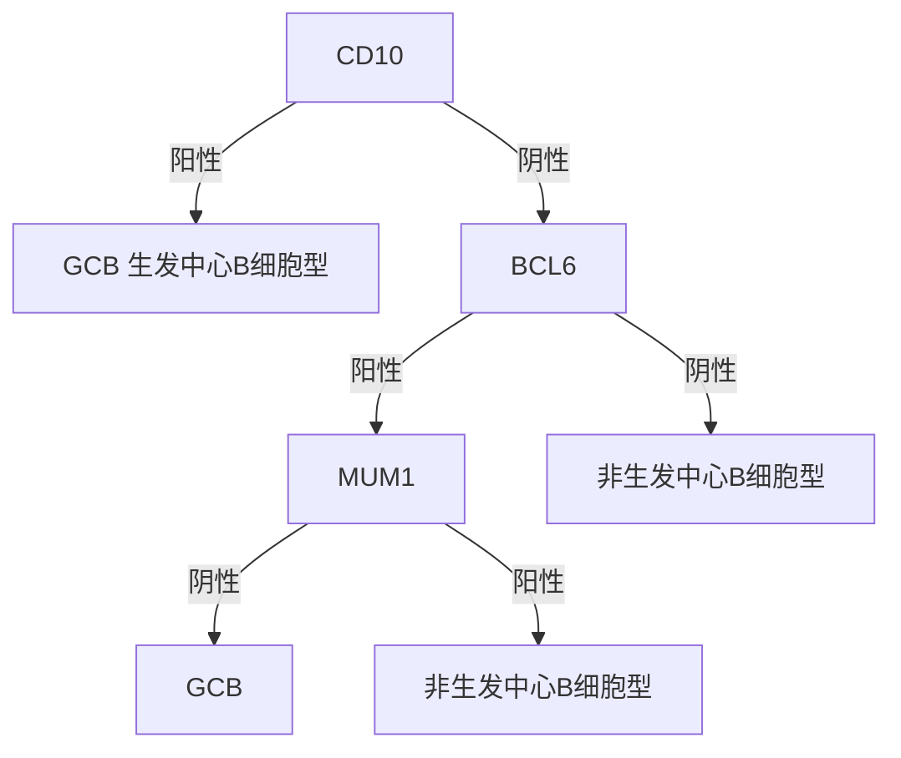

# 弥漫性大B细胞淋巴瘤诊疗指南（2022年版）

## 一、概述

弥漫性大B细胞淋巴瘤（diffuse large B cell lymphoma，DLBCL）是一种来源于成熟B细胞的侵袭性肿瘤，是最常见的非霍奇金淋巴瘤类型，约占全部非霍奇金淋巴瘤的 \(25\% \sim 50\%\) 。DLBCL临床异质性大，2016年WHO分类中列出了下列大B细胞淋巴瘤亚型：

1. 非特指型。
   （1）生发中心B细胞亚型。（2）活化B细胞亚型。
2. 富T/组织细胞的大B细胞淋巴瘤。
3. 原发中枢神经系统弥漫大B细胞淋巴瘤。
4. 原发皮肤弥漫大B细胞淋巴瘤，腿型。
5. EB病毒阳性弥漫大B细胞淋巴瘤，非特指型。
6. EB病毒阳性粘膜溃疡。
7. 慢性炎症相关的弥漫大B细胞淋巴瘤。
8. 淋巴瘤样肉芽肿
9. 原发纵隔大B细胞淋巴瘤。
10. 血管内大B细胞淋巴瘤。
11. ALK阳性大B细胞淋巴瘤。
12. 浆母细胞淋巴瘤。
13. 原发渗出性淋巴瘤。
14. 疱疹病毒8阳性弥漫大B细胞淋巴瘤，非特指型。
15. 伯基特淋巴瘤
16. 伴有11q异常的伯基特样淋巴瘤
17. 高级别B细胞淋巴瘤，伴有MYC和BCL2和/或BCL6重排。
18. 高级别B细胞淋巴瘤，非特指型。
19. B细胞淋巴瘤不能分类型，介于DLBCL和经典霍奇金淋巴瘤之间。

由于各亚型的预后及诊疗存在差异，本文将以弥漫大B细胞淋巴瘤，非特指型为主讨论诊疗指南。

## 二、诊断及鉴别诊断

### （一）临床表现

1. **症状**  
   淋巴结（累及淋巴结）或结外（累及淋巴系统外的器官或组织）症状：任何淋巴结外部位都可能累及。患者通常出现进行性肿大的无痛性肿物，多见于颈部或腹部。累及淋巴结外者根据累及部位不同出现相应症状，常见的有：胃肠道、中枢神经系统、骨骼。也可以在肝脏、肺、肾脏或膀胱等罕见部位发生。可以出现疾病或治疗相关的肿瘤溶解综合征，即肿瘤细胞内容物自发释放或由于化疗反应而释放到血液中，引起电解质和代谢失衡，伴有进行性系统性毒性症状、严重时可导致心律失常、多器官衰竭、癫痫发作和死亡。

2. **体格检查**  
   可触及相应部位淋巴结肿大（通常在颈部、腋窝或腹股沟）或肿块；可有肝大和/或脾大。可有B症状，包括：不明原因持续发热（ \(>38^{\circ}C\) ）；不明原因的体重减轻6个月内体重减轻 \(>10\%\) ；盗汗。

3. **病理学检查**  
   确诊DLBCL需要进行病灶部位的病理活检，可以通过手术切除或粗针穿刺淋巴结或结外组织获得标本。并对肿瘤进行显微镜下形态学和免疫组化分析，确定弥漫大B细胞淋巴瘤，并进行分类：

   （1）**免疫组化**：生发中心B细胞来源（GCB）、非生发中心B细胞来源（nonGCB）鉴定，如CD10、MUM-1和BCL-6；有助于危险度评估的分子，如C-MYC、BCL-2、CD5、TP53、Ki-67等；潜在治疗靶标，如CD20、CD19、CD30等以及有助于鉴别诊断的其他分子，如CD23、CD138、SOX11、PAX5、 \(\kappa /\lambda\) 等。

   （2）**荧光原位杂交（FISH）检查**：EB病毒原位杂交检查；应该对所有DLBCL患者进行MYC、BCL-2、BCL-6重排的FISH检查、排除双/三重打击淋巴瘤，出于医疗资源节约的目的，临床针对C-MYC表达 \(\geqslant 40\%\) 的患者完善双/三重打击淋巴瘤排查。

4. **实验室检查**  
   全血细胞分类计数可用于初步评估骨髓功能；血清乳酸脱氢酶；肝功能、肾功能评估；人类免疫缺陷病毒和乙型肝炎病毒等感染相关检测；监测尿酸水平，发现肿瘤溶解综合征。骨髓检查：骨髓细胞学、流式细胞学、染色体、骨髓活检及免疫组化（标本需 \(>1.6\) cm）同时做骨髓穿刺抽吸骨髓液、检查骨髓细胞学及免疫分型，除外 DLBCL 累及。有中枢神经系统淋巴瘤高危因素患者需要进行腰椎穿刺术，完成脑脊液检查。颅脑增强核磁检查，有条件的单位建议采用流式细胞术检测脑脊液中的淋巴瘤细胞。

   肿瘤溶解综合征的实验室表现：
   （1）高尿酸血症（尿酸水平 \(>8 \mathrm{mg / dL}\) 或 \(475.8 \mu \mathrm{mol / L}\) ）。
   （2）高钾血症（钾水平 \(>6 \mathrm{mmol / L}\) ）。
   （3）高磷血症（磷水平 \(>4.5 \mathrm{mg / dL}\) 或 \(1.5 \mathrm{mmol / L}\) ）。
   （4）低钙血症（校正后的钙离子 \(< 7 \mathrm{mg / dL}\) 或 \(1.75 \mathrm{mmol / L}\) ；钙离子 \(< 1.12 \mathrm{mg / dL}\) 或 \(0.3 \mathrm{mmol / L}\) ）。

5. **影像学检查**  
   建议患者在治疗前、中期和终末行全身PET/CT检查。如无法行PET/CT检查，可以进行颈、胸、腹部及盆腔增强CT检查。以明确疾病分期和疗效评估（表1）。

**表1 原发于淋巴结淋巴瘤的AnnArbor分期**

| 分期   | 淋巴结累及                 | 结外状态                         |
| :----- | :------------------------- | :------------------------------- |
| 局限期 |                            |                                  |
| I      | 一个淋巴结或一组淋巴结区域 | 单个结外病变，无淋巴结侵犯（IE） |

> 说明：PET/CT作为分期检查方法，无条件应用PET/CT的患者也可以选择CT、MRI或B超。扁桃体、韦氏环、脾脏不属于结外器官。

### （二）诊断和鉴别诊断

1. **诊断**  
   弥漫大B细胞淋巴瘤特征的组织病理学分析：肿瘤性大B淋巴细胞的弥漫性增殖，正常组织结构完全或部分破坏。进行免疫表型分析明确诊断，并区分生发中心B细胞来源和非生发中心B细胞来源。免疫组化检查需要包括：CD20，PAX5，CD3，CD5，CD10，CD45，BCL2，BCL6，Ki-67，IRF4/MUM-1，P53和MYC。

   临床常用Hans系统根据免疫组化进行：生发中心B细胞型和活化B细胞型或非生发中心B细胞型分类（图1）：

**图1 Hans系统**

其他有助于确定淋巴瘤亚型及便于选择靶向治疗的免疫组化检查还有：CD79a，Cyclin D1，SOX11，CD19，CD30，CD138，EB病毒原位杂交（EBER- ISH），ALK，HHV8，P53，PD- 1和PD- L1等。进一步通过荧光原位杂交进行MYC、BCL2、BCL6、IRF4等断裂重组检查。

2. **鉴别诊断**  
   除了与非肿瘤性疾病如：单核细胞增多症、结节病等鉴别，还需鉴别其他成熟B细胞肿瘤，如滤泡性淋巴瘤、边缘区淋巴瘤、套细胞淋巴瘤、侵袭性（高级别）淋巴瘤亚型（约占全部淋巴瘤的7%）、伯基特淋巴瘤等。

## 三、危险度评估

### （一）国际预后指数

1. **国际预后指数（international prognostic index，IPI）**

   （1）危险因素：

   | 危险因素          | 分值 |
   | :---------------- | :--- |
   | 年龄 > 60岁       | 1    |
   | 乳酸脱氢酶 > 正常 | 1    |
   | ECOG评分 2~4      | 1    |
   | Ann Arbor Ⅲ~Ⅳ期   | 1    |
   | 结外累及部位 > 1  | 1    |

   （2）危险度分层：

   | 风险分级 | IPI分值 |
   | :------- | :------ |
   | 低危     | 0～1    |
   | 中低危   | 2       |
   | 中高危   | 3       |
   | 高危     | 4～5    |

2. **年龄调整的IPI（aaIPI）（年龄 \(\leq 60\) 岁）**

   （1）危险因素：

   | 危险因素            | 分值 |
   | :------------------ | :--- |
   | 乳酸脱氢酶 > 正常值 | 1    |
   | Ⅲ～Ⅳ期              | 1    |
   | ECOG评分 2～4       | 1    |

   （2）危险度分层：

   | 风险分级 | aaIPI分值 |
   | :------- | :-------- |
   | 低危     | 0         |
   | 中低危   | 1         |
   | 中高危   | 2         |
   | 高危     | 3         |

### （二）其他标准化治疗患者的主要不良预后因素

1. 非生发中心B细胞亚型（活化B细胞亚型）。
2. MYC和BCL-2和/或BCL-6重排。
3. MYC和BCL2高表达。
4. TP53突变。
5. EB病毒相关疾病。

## 四、治疗

### （一）治疗目标

持久的完全缓解以期根治。

### （二）诱导治疗

弥漫大B细胞淋巴瘤的治疗根据患者年龄、Ann Arbor分期和IPI以及肿瘤的免疫和分子表型特征选择适当的方案。

1. **局限期弥漫性大B细胞淋巴瘤[Ann Arbor I期和II期非大肿块（ \(< 7.5 \mathrm{cm}\) ）疾病]**：一线治疗包括R-CHOP方案化疗三个疗程，并对受累部位进行放疗；或R-CHOP方案化疗4个疗程加2程利妥昔单抗治疗（ \(\mathrm{IPI} = 0\) 分）；或R-CHOP方案化疗6个疗程 \(\pm\) 受累野放疗。

2. **局限期弥漫性大B细胞淋巴瘤[Ann Arbor I期和II期伴有大肿块（ \(\geqslant 7.5 \mathrm{cm}\) ）]**：一线治疗 R- CHOP 方案化疗 6 个疗程，在某些患者进行放疗；初始大肿块（ \(>7.5 \mathrm{cm}\) ）部位放疗。

3. **晚期弥漫大 B 细胞淋巴瘤（Ann Arbor III～IV期）**：一线治疗包括：使用 R-CHOP 方案或 R-DA-EPOCH 方案进行化疗。初始大肿块（ \(>7.5 \mathrm{cm}\) ）部位放疗。

4. **对于高龄或不适合标准化疗的患者**，可以考虑 R-GemOx、R- miniCHOP、R-CDOP、R-CEPP、R-GCVP 等或靶向治疗为主的方案。

5. **双/三重打击淋巴瘤**：倾向于高剂量方案：R-DA-EPOCH、R- hyperCVAD/MA 或者 R-COD0X/MA 方案，获得完全缓解的患者可考虑进行自体外周血干细胞移植。

6. **维持治疗**：对于老年患者（ \(\geqslant 60\) 岁）患者诱导治疗结束后可以考虑来那度胺维持治疗。

7. **中枢神经系统淋巴瘤预防**

   适用于以下高危因素患者：
   （1）由 IPI 评分中的 5 个危险因素和肾上腺/肾脏累及组成 CNS-IPI，积分 4～6 分的高危患者。
   （2）累及以下器官：睾丸、乳腺、鼻窦、硬脑膜等。
   （3）人类免疫缺陷病毒相关淋巴瘤。
   （4）双重打击及双表达淋巴瘤。
   （5）原发性皮肤 DLBCL，腿型。

   目前临床常用中枢预防的方法包括三联鞘内注射和高剂量甲氨蝶呤，但是最佳方法尚未建立。

8. **肿瘤溶解综合征的处理**

   识别高危因素，包括大包块、乳酸脱氢酶高于正常上限2倍，自发性肿瘤溶解综合征，白细胞水平升高，累及骨髓，高尿酸血症，别嘌醇治疗无效和累及肾脏。

   治疗方法包括化疗前水化、降尿酸治疗，监测血尿酸、肌酐、电解质。

9. **乙型肝炎或丙型肝炎感染**

   对伴HBsAg阳性患者，需要预防性抗病毒治疗。对于HBcAb阳性/HBsAg阴性患者，需持续监测HBV DNA或者预防性抗病毒治疗。选择抗病毒治疗时推荐耐药率低的恩替卡韦或替诺福韦。对于伴发丙型肝炎病毒感染患者可以考虑根治性抗丙型肝炎病毒治疗。

### （三）疗效评估

1. **PET/CT 5分法**
   （1）无高于背景摄取。
   （2）摄取 \(\leq\) 纵隔血池。
   （3）摄取 \(>\) 纵隔血池，但是 \(\leq\) 肝脏血池。
   （4）摄取中度 \(>\) 肝血池（轻度）。
   （5）摄取显著 \(>\) 肝和/或新发病灶。

   新发摄取区域与淋巴瘤无关。

2. **疗效标准**

| 反应                         | 部位                        | PET/CT（代谢反应）                                                                                                               |
| :--------------------------- | :-------------------------- | :------------------------------------------------------------------------------------------------------------------------------- |
| **完全反应**                 | 淋巴结和结外部位            | 1，2，3分，伴或不伴残留肿块                                                                                                      |
|                              | 非可测量病灶                | 不适用                                                                                                                           |
|                              | 器官肿大                    | 不适用                                                                                                                           |
|                              | 新病灶                      | 无                                                                                                                               |
|                              | 骨髓                        | 骨髓无氟代脱氧葡萄糖（fluorodeoxyglucose，FDG）亲和病变                                                                          |
| **部分缓解**                 | 淋巴结和结外部位            | 4，5分，但是比基线摄取减低。无新发和进展性病灶。中期评估提示有治疗反应。终末评估提示残留病灶。                                   |
|                              | 非可测量病灶                | 不适用                                                                                                                           |
|                              | 器官肿大                    | 不适用                                                                                                                           |
|                              | 新病灶                      | 无                                                                                                                               |
|                              | 骨髓                        | 残留摄取高于正常但是与基线比较减低（弥漫性摄取可以是治疗后反应性变化）。如果有淋巴结治疗反应的同时有骨髓持续变化，需要活检或随访 |
| **无治疗反应或疾病稳定状态** | 淋巴结/结节性肿块，结外病灶 | 4，5分并且较基线无明显FDG摄取变化。无新发或进展疾病                                                                              |
|                              | 非可测量病灶                | 不适用                                                                                                                           |
|                              | 器官肿大                    | 不适用                                                                                                                           |
|                              | 新病灶                      | 无                                                                                                                               |
|                              | 骨髓                        | 较基线无变化                                                                                                                     |
| **疾病进展**                 | 淋巴结/结节性肿物，结外病变 | 4，5分伴有比基线升高摄取和/或新发FDG亲和性的淋巴瘤病灶                                                                           |
|                              | 非可测量病灶                | 不适用                                                                                                                           |
|                              | 新病灶                      | 新的FDG亲和性淋巴瘤而不是其它病因所致（如感染、炎症）。如果不确定新病灶病因，需要活检或随访                                      |
|                              | 骨髓                        | 新发或当前的FDG亲和病灶                                                                                                          |

### （四）随访

3个月一次随访，包括体格检查、B超直至2年，CT检查建议间隔3～6个月以上或在可疑疾病复发时，2年后6个月随访一次到5年，5年以后建议每年随访1次。

### （五）复发/难治弥漫大B细胞淋巴瘤

1. **总体预后**：弥漫大B细胞淋巴瘤患者的5年总体生存率大约60%～70%。大约50%～60%的患者在一线治疗后可以获得并维持完全缓解；30%～40%的患者复发，通常在治疗结束后2年内复发；10%的患者为难治性疾病。

2. **难治定义**：治疗结束后6个月内复发，或治疗期间无明显疗效。

3. **治疗**：最佳挽救性方案尚未明确，推荐参加临床研究。可以应用R-ICE、R-DHAP、R-GDP、R-MINE、BR或R-Gemox等方案，化疗敏感且符合移植标准的患者可以进行自体造血干细胞移植巩固。60～80岁的患者可采用来那度胺维持治疗。此外对于有条件的复发难治患者亦可以考虑CD19-CAR-T细胞治疗或异基因造血干细胞移植。对于特定患者考虑联合维布妥昔单抗（BV）、BTK抑制剂、来那度胺、维奈托克等新药。