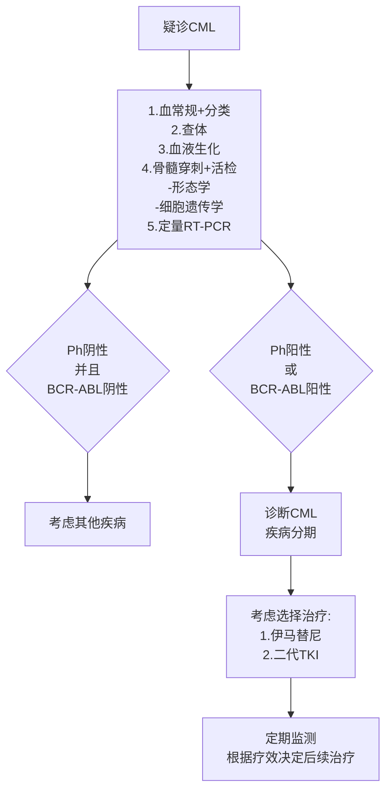

# 慢性髓性白血病诊疗指南（2022年版）

## 一、概述

慢性髓性白血病（chronic myelogenous leukemia，CML）是一种以髓系增生为主的造血干细胞恶性疾病。CML全球的年发病率为 \((1\sim 2) / 10\) 万，占成人白血病总数的 \(15\% \sim 20\%\) 各个年龄组中均可发生；随着年龄增长发病率逐渐增加，中位诊断年龄在亚洲国家偏年轻（ \(40\sim 50\) 岁），欧美国家年长（ \(55\sim 65\) 岁），男女比例约 \(1.4:1\) ，自然病程为 \(3\sim 5\) 年，酪氨酸激酶抑制剂（tyrosine kinase inhibitor，TKI）的应用使CML的病程彻底改观，对于绝大多数患者来说，CML已经成为一种慢性可控制的肿瘤。

## 二、诊断标准

### （一）诊断。

如果患者出现白细胞（white blood cell，WBC）增多或伴脾大，外周血中可见髓系不成熟细胞，应高度怀疑CML。存在Ph染色体和/或BCR-ABL融合基因阳性是诊断CML的必要条件。

### （二）鉴别诊断。

疑诊CML时，需注意患者有无其他疾病史（如感染、自身免疫性疾病）、特殊服药史、妊娠或应激状况。如果WBC增多不能以类白血病反应解释，需要进行细胞遗传学和分子

（此处第2页内容为大量数字，疑似扫描错误，已省略）

## 三、疾病分期

### （一）疾病分期。

CML的疾病过程一般分为3个阶段：慢性期（chronic phase，CP）、加速期（accelerated phase，AP）和急变期（blast phase，BP）。大部分CML患者就诊时处于CP，常隐匿起病，约 \(20\% \sim 40\%\) 的患者没有症状，在常规检查时发现白细胞计数增多，也可以表现为疲劳、体重下降、盗汗、脾大、贫血或血小板增多。有些患者没有经过CP就以BP就诊，大部分CP患者自然病程3～5年内即可发展为进展期（AP和BP）CML。疾病的进展伴随着临床表现的恶化及严重的贫血、血小板减少与脾大所带来的相关症状。约 \(70\%\) BP患者转变为急性髓细胞性白血病， \(20\% \sim 30\%\) 转变为急性淋巴细胞白血病。CML的分期标准见表1。

**表1.CML分期**

| 分期   | WHO标准                                                                                                                                                                                                                                                               |
| ------ | --------------------------------------------------------------------------------------------------------------------------------------------------------------------------------------------------------------------------------------------------------------------- |
| 慢性期 | 未达到诊断加速期或急变期的标准                                                                                                                                                                                                                                        |
| 加速期 | (1)外周血和/或骨髓有核细胞中原始细胞占10%～19% (2)外周血嗜碱性粒细胞≥20% (3)与治疗无关的血小板降低(<100×10³/L)或治疗无法控制的持续血小板增多(>1000×10³/L) (4)治疗无法控制的进行性脾脏增大和白细胞计数增加 (5)治疗中出现除费城染色体外的细胞遗传学克隆演变 |
| 急变期 | 符合至少1项下列指标: (1)外周血白细胞或骨髓有核细胞中原始细胞≥20% (2)髓外原始细胞浸润 (3)骨髓活检出现大片状或灶状原始细胞                                                                                                                                     |

注：WHO标准中原始细胞可来源于髓系（包括中性粒细胞、嗜酸性粒细胞、嗜碱性粒细胞、单核细胞、红系、巨核系或上述任意组合）和/或淋巴系，对于少数形态学难以分辨原始细胞来源者，推荐免疫分型予以确认；片状和簇状巨核细胞增生伴有显著的网硬蛋白或胶原蛋白纤维化和/或严重粒细胞发育不良提示加速期。上述现象常伴随加速期其他特征，目前尚未作为独立诊断依据。

### （二）CP患者的疾病危险度。

目前，常用的评分系统为Sokal和ELTS（EUTOSlong term survival）积分，均以临床指标作为与CML相关生存期的预测因素，计算公式如表2所示。研究显示，ELTS积分的年龄权重低于Sokal，对高危组的长期结局预测更准确。无论哪种评分系统，高危均预示治疗反应差和生存期缩短，应进行更严密的疗效监测和更积极的治疗。

**表2.Sokal和ELTS积分公式**

| 公式                                                                | 低危                                 | 中危     | 高危 |
| ------------------------------------------------------------------- | ------------------------------------ | -------- | ---- |
| Sokal积分                                                           | Exp[0.0116×(年龄-43.4)]+0.0345×(0.8) | 0.8～1.2 | >1.2 |
| （脾脏大小-7.51）+0.188×(血小板/700)²-0.563]+0.0887×(原始细胞-2.10) |                                      |          |      |

# ELTS积分

注：血小板单位为 \(\times 10^{9} / \mathrm{L}\) ，年龄单位为岁，脾脏大小单位为肋下厘米数，原始细胞为外周血分类中所占百分数。所有数据应在任何CML相关治疗开始前获得。

## 四、临床表现

超过 \(85\%\) 的患者发病时处于慢性期，部分患者无任何症状，因查体或偶然发现血常规异常或脾大。典型症状包括乏力、低热、盗汗、左上腹胀满、体重下降等症状。查体可触及肿大的脾脏，或腹部B超显示脾大。如果疾病处于加速期或急变期，病情恶化，常伴有不明原因的发热、骨痛、脾脏进行性肿大等症状。

## 五、实验室检查

### （一）血常规。

WBC增多，可伴有血红蛋白下降或血小板增多。外周血白血病分类可见不成熟粒系细胞，嗜碱性粒细胞和嗜酸性粒细胞增多。

### （二）骨髓形态学。

增生极度活跃，以粒系增生为主，可伴有巨核细胞系增生，相对红系增殖受抑。

### （三）细胞遗传学分析。

以显带法进行染色体核型，可见Ph染色体。

### （四）分子学检测。

外周血或骨髓标本经逆转录聚合酶链反应（reverse transcription PCR，RT-PCR）检测，确认存在BCR-ABL融合基因。如果BCR-ABL融合基因为阴性，需检测JAK2、CARL和MPL突变等髓系增殖性肿瘤相关的基因突变。

## 六、治疗

2000年后，针对CML发病机制中关键靶分子BCR-ABL融合蛋白研发上市的首个TKI药物——甲磺酸伊马替尼，开启了CML的靶向治疗时代。伊马替尼能相对特异的抑制BCR-ABL激酶活性，在体外实验中，抑制CML细胞增殖，并诱导其凋亡。伊马替尼的问世，显著地改善了CML患者生存期， \(80\% \sim 90\%\) 的患者的生存期接近正常人，并提高了患者的生活质量。伊马替尼作为一线治疗初发CML-CP患者长期结果证实，10年生存率为 \(80\% \sim 90\%\) 。二代TKI（如尼洛替尼、达沙替尼、博舒替尼和拉多替尼）、三代TKI（如普纳替尼）的陆续面世，加快和提高了患者的治疗反应率和反应深度，有效克服了大部分伊马替尼耐药，也为伊马替尼不耐受患者提供了更多选择，使致命的CML成为一种可控的慢性疾病。

### （一）CP患者的一线治疗。

国际上推荐的CP患者一线TKI包括伊马替尼、尼洛替尼、达沙替尼、博舒替尼和拉多替尼。CML中国诊断与治疗指南（2020年版）推荐的药物及其用法包括伊马替尼 \(400\mathrm{mg / d}\) 或尼洛替尼 \(600\mathrm{mg / d}\) 或氟马替尼 \(600\mathrm{mg / d}\) 或达沙替尼 \(100\mathrm{mg / d}\) 。

CML的治疗目标包括延长生存期、减少疾病进展、改善生活质量和获得无治疗缓解（即停药）。一线TKI的选择应当在明确治疗目标基础上，依据患者的疾病分期和危险度、年龄、共存疾病和合并用药等因素选择恰当的药物。中高危患者疾病进展风险高于低危患者，适合选用二代TKI作为一线治疗。对于期望停药的年轻患者，选择二代TKI有望快速获得深层分子学反应（deep molecular response, DMR），达到停药的门槛。对于年老和或存在基础疾病的患者，一代TKI具有更好的安全性，而二代TKI相关的心脑血管栓塞性事件、糖脂代谢异常和肺部并发症可能是致死性的不良反应，特别需要谨慎使用。

### （二）TKI治疗期间的疗效监测。

疾病监测已成为TKI治疗中密不可分的组成，它不仅用于评估患者体内白血病负荷的变化，判断治疗反应，还有助于保证治疗的依从性，发现早期耐药，预测远期疗效，指导个体化治疗干预，并降低总体治疗费用。TKI治疗期间的监测包括血液学、细胞遗传学、分子学和ABL激酶区突变反应分析。

血液学监测包括全血细胞计数和外周血及骨髓细胞形态学分析，以判断疾病分期并评估血液学反应。细胞遗传学监测包括传统的染色体显带（G显带或R显带）技术和荧光原位杂交技术（Fluorescence in situ hybridization, FISH），观察Ph阳性细胞的比例，以评估细胞遗传学反应，并可以发现Ph染色体变异和Ph阳性（Ph+）或Ph阴性（Ph-）细胞的附加异常，识别高危人群和疾病进展。分子学监测采用实时定量逆转录PCR（quantitative reverse transcriptase-mediated PCR，qRT-PCR）方法，精确识别体内BCR-ABL转录物水平，是最常用和敏感的评估CML疾病负荷的方法，敏感性为 \(0.001\% \sim 0.01\%\) 。qRT-PCR推荐以外周血为标本，具有方便、微痛、可重复、价格低廉、患者依从性好等优点。ABL激酶区突变分析可以应用外周血或骨髓为标本，推荐的方法为直接测序法（Sanger测序法，敏感性为 \(10\% \sim 20\%\) ）或针对BCR-ABL激酶区的二代测序，以发现ABL激酶区点突变，识别TKI耐药，指导后续治疗选择。

### （三）治疗反应。

CML患者的治疗反应包括血液学、细胞遗传学和分子学反应，标准见表3。

**表3 CML患者的治疗反应**

| 反应       | 定义                                                   |
| ---------- | ------------------------------------------------------ |
| 血液学*    | 完全血液学反应（Complete hematological response, CHR） |
|            | 外周血无髓系不成熟细胞                                 |
|            | 外周血嗜碱性粒细胞<5%                                  |
|            | 无髓外浸润的症状或体征，脾脏不可触及                   |
| 细胞遗传学 | 完全细胞遗传学反应                                     |

（注：表3后续内容在原始PDF中缺失，此处保留已有部分）

注：\*，血液学反应达到标准需持续 \(\geq 4\) 周；IS，国际标准化（International scale）。

TKI用于一线治疗时，在重要时间点根据血液学、细胞遗传学和分子学监测的指标，欧洲白血病网（European LeukemiaNet，ELN）推荐（2013年版）将患者疗效分为最佳、警告和失败，见表4。

**表4 欧洲白血病网推荐（2013年版）一线酪氨酸抑制剂治疗反应标准**

|              | 最佳                    | 警告                            | 失败                                           |
| ------------ | ----------------------- | ------------------------------- | ---------------------------------------------- |
| 基线         | NA                      | 高危，或 CCA/Ph+，              | NA                                             |
| 3个月        | BCR-ABL≤10%和/或Ph+≤35% | BCR-ABL>10%和/或Ph+36%～95%     | 无 CHR 和/或Ph+>95%                            |
| 6个月        | BCR-ABL<1%和/或Ph+0     | BCR-ABL 1%～10%和/或Ph+ 1%～35% | BCR-ABL>10%和/或Ph+ >35%                       |
| 12个月       | BCR-ABL≤0.1%            | BCR-ABL>0.1%～1%                | BCR-ABL>1%和/或Ph+ >0                          |
| 之后任何时间 | BCR-ABL≤0.1%            | CCA/Ph-(−7或7q−)                | 丧失 CHR 丧失 CCyR 确认丧失 MMR* 突变 |

注：CCyR，完全细胞遗传学反应；CHR：完全血液学反应；MMR，主要分子学反应即BCR-ABL \(\leq 0.1\%\) 或更好；NA，不适用；\*，在连续2次检测中，其中1次的BCR-ABL转录水平 \(\geq 1\%\) ；CCA/Ph+，Ph+细胞克隆性染色体异常；CCA/Ph-，Ph-细胞克隆性染色体异常。

ELN推荐（2020年版）更强调各个时间点分子学反应的重要性，并且TKI一线和二线治疗反应评估标准统一共用一个。相同的观点是，达到“最佳”反应的患者预示持久获得良好的治疗结果，可维持原治疗；达到“失败”的患者疾病进展和死亡的风险显著增加，需要及时转换治疗；“警告”则是处于二者之间的灰色地带，患者需要密切监测，一旦达到“失败”标准，应尽快转换治疗方案。

### （四）二线TKI治疗。

ABL突变类型是选择二线TKI的首要指标，见表5。伊马替尼耐药患者中只有 \(20\% \sim 50\%\) 存在ABL突变，而绝大多数突变对两种二代TKI用药的敏感性并无差异或者并不清楚有无差异。在这种情况下，需要根据患者的疾病分期、年龄、共存疾病及药物不良反应来选择药物种类和剂量。对于CP患者，达沙替尼和尼洛替尼均可选择，而对于进展期患者，达沙替尼更有优势。如有肺部疾病、出血病史以及正在接受非甾体抗炎药治疗的患者，尼洛替尼可能更为合适。相反，达沙替尼更适合有胰腺炎、糖尿病的患者。但对于大多数患者，没有明确的可以指导选择用药的依据时，可参考医生对药物的熟悉程度、患者的生活习惯、价格等做出选择。老年患者和既往有TKI不耐受患者，可以考虑适当减少剂量的治疗。

**表5 根据ABL突变状态选择治疗方式**

| 突变             | 治疗选择                                |
| ---------------- | --------------------------------------- |
| T315I            | 普纳替尼，造血干细胞移植，临床试验      |
| V299L            | 普纳替尼，尼洛替尼                      |
| T315A            | 普纳替尼，尼洛替尼，伊马替尼*，博苏替尼 |
| F317L/V/I/C      | 普纳替尼，尼洛替尼，博苏替尼            |
| Y253H，E255K/V， | 普纳替尼，达沙替尼，博苏替尼            |
| F359C/V/I        |                                         |
| 任意其他突变     | 普纳替尼，达沙替尼，尼洛替尼，博苏替尼  |

注：\\*，如果是在达沙替尼治疗中出现的。目前博苏替尼针对伊马替尼耐药突变的临床数据不多，部分体外数据显示E255K/V突变对博苏替尼敏感性不足。

### （五）无治疗缓解。

对于已经取得长期、稳定、深层分子学反应的CML-CP患者，停用TKI、追求无治疗缓解（Treatment free remission，TFR）可以视为一个新的治疗目标。虽然已有数版欧美国家TFR指南的公布，但很多问题尚未解决。由血液病专家和CML患者倡导者（部分有停药经历）组成的欧洲指导组，以患者为中心，旨在指导患者的治疗选择（包括TFR），帮助建立更好的医患关系，并满足患者的情感和心理需求。欧洲指导组从患者-医生联合的独特视角，发布了如何认识和实践TFR的讨论推荐，包括以下几个主要方面：什么是TFR，TFR的合适时机，哪些人符合或不符合停药，患者停药需要考虑的因素，停药综合征，潜在的患者心理问题，分子学复发和重启治疗。这是迄今为止最为全面和具有可操作性的关于CML患者追求停药和尝试TFR的综合推荐，值得关注该领域的中国患者和医生借鉴，内容见表6。

**表6 欧洲指导组综合CML患者-医生的讨论，对停药和尝试TFR的建议**

| 主题                      | 内容                                                                                                                                                                                                                                                                                                                                    |
| ------------------------- | --------------------------------------------------------------------------------------------------------------------------------------------------------------------------------------------------------------------------------------------------------------------------------------------------------------------------------------- |
| CML治疗目标               | （1）早期目标是快速减少肿瘤负荷或白血病数量 （2）长期目标是最长的生存期 （3）与诊断CML前相同的生活质量                                                                                                                                                                                                                            |
| TFR的定义和时机           | （1）定义：TFR指停止TKI治疗的患者持续维持MMR且不需要重启治疗的一种状态 （2）时机：CML慢性期患者持续达到稳定DMR至少2年可以考虑停药、尝试TFR                                                                                                                                                                                           |
| 哪些患者符合尝试TFR的标准 | （1）初诊时处于慢性期 （2）未曾在任何时间、对任何TKI发生耐药 （3）达到DMR至少2年 （4）患者应该充分知情TFR，并积极主动的停药而非迫于压力 （5）患者应当充分理解分子学复发并不代表治疗“失败”，此时需要重启治疗 （6）分子学监测可在2～4周内重复进行                                                                          |
| 哪些患者不适于尝试TFR     | 已经取得MMR但仍未达到DMR的患者不适合尝试TFR！                                                                                                                                                                                                                                                                                           |
|                           | （1）医生应该确保这些患者持续治疗并达到治疗目标或处于安全港湾，获得与普通人相似的寿命 （2）这些患者可以维持原治疗，等待达到更深层分子学反应，只要达到持续DMR，TFR就有可能尝试 （3）如果患者渴望停药或有特殊需求需要改变治疗，医生应当同患者沟通转换2代TKI，以帮助患者取得更深的分子学反应 （4）医生需要告知患者不同TKI的副作用 |
| 患者考虑停止TKI治疗       | 患者停药前应当考虑或知晓以下因素： （1）医生应该强调随访的重要性和频率，患者需要更加频繁的就诊 （2）TFR并不意味着疾病治愈，任何时候都可能出现分子学复发，并需要重启治疗 （3）即使获得TFR，医生也应当提醒患者需要持续甚至终生门诊随访和定期监测                                                                                 |
| TKI停药综合征             | 对于考虑停药的患者，医生应当与之沟通TKI停药综合征以及如何处理： （1）有些患者停药后会出现肌肉骨骼痛，一般给予止痛药即可 （2）除了持续监测疾病，常规门诊检查能够帮助识别出先前TKI治疗引起的长期毒性，即使已经停药仍可发生 （3）停药综合征应该予以监测并可以治疗                                                                 |
| 停药和尝试TFR的心理影响   | （1）指导组提倡关注TFR患者潜在的心理问题并作常规监测，因为专业的心理帮助对某些患者是有必要的 （2）医生应当意识到TFR监测中BCR-ABL水平波动可能会导致患者出现焦虑                                                                                                                                                                       |
| 分子学复发和重启治疗      | 患者应该知晓无治疗期持续时长不一，几个月或数年。医生应解释由于分子学复发引起重启治疗的可能性                                                                                                                                                                                                                                            |

注：DMR，深层分子学反应即BCR-ABL转录物 \(\leq 0.01\%\) ；MMR，主要分子学反应即BCR-ABL转录物 \(\leq 0.1\%\) ；TFR，无治疗缓解。

欧洲指导组强调了符合TFR条件患者需要考虑的因素，并提倡CML患者应该到能够提供高质量、规律性分子学监测、具有专业的CML医生和心理支持的医院就诊。尽管当前不确定哪些患者是尝试TFR的最佳群体，哪些因素可以预测停药后主要分子学反应丧失，但持久的TKI治疗时间和DMR持续时间、规律的高质量分子学监测是TFR成功的有利保障。目前，进行停药试验和尝试TFR的患者中大部分是持续接受伊马替尼治疗的，尚未无证据显示停止伊马替尼和二代TKI用药后分子学复发的概率有别，即伊马替尼和二代TKI停药获得TFR的成功率无显著差异，但接受二代TKI治疗的确可以缩短达到符合停药的标准。随着尝试TFR成为许多CML患者的追求和疾病管理的一部分，患者对停药的担忧将是患者-医生讨论中的首要问题。因此，充分的知情和更多的TFR数据将会使更多的CML患者愿意尝试停药。强调充分的沟通、合适的人群、合适的时机、规范的高质量监测和管理是CML患者追求TFR成功的必要条件。

### （六）进展期患者的治疗。

针对AP和BP患者，伊马替尼推荐初始剂量为 \(600\mathrm{mg / d}\) 或 \(800\mathrm{mg / d}\) ，尼洛替尼为 \(400\mathrm{mg}\) 每日2次，达沙替尼为 \(70\mathrm{mg}\) 每日2次或 \(140\mathrm{mg}\) 每日1次。

关于进展期患者的治疗，分为未曾使用过TKI的和在TKI治疗中由CP疾病进展至AP或BP的2种。所有BP患者和未获得最佳治疗反应的AP患者均应在TKI或联合化疗获得反应后推荐异基因造血干细胞移植。

---

## 附录1：慢性髓性白血病诊治流程图

