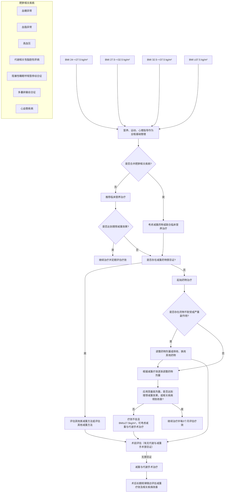

# 肥胖症诊疗指南 (2024年版)

## 一、概述

近年来，我国超重和肥胖人群的患病率呈持续上升趋势。作为慢性疾病中的独立病种及多种慢性疾病的重要致病因素，肥胖症已成为我国重大公共卫生问题，是我国第六大致死致残主要危险因素[1]。多学科协作（multi-disciplinary team, MDT）诊疗模式可有效提升肥胖症诊疗水平。为规范我国肥胖症临床诊疗，为患者提供个性化诊疗方案，并不断提高医疗机构肥胖症诊疗同质化水平，提升肥胖症治疗效果，改善长期预后，特制定本指南。

## 二、肥胖症的病因学

### （一）遗传因素

遗传因素在肥胖症的发生发展中具有重要作用。流行病学调查表明，肥胖症具有家族聚集性[2]，提示肥胖症可能与家族中的遗传背景相关。人类遗传学研究结果显示，与肥胖易感性相关的遗传基因可能涉及能量代谢、食欲调控、脂肪细胞分化等多个方面[3]。一些罕见的遗传病，如Prader-Willi综合征（Prader-Willi Syndrome, PWS）和家族性瘦素受体（leptin receptor, LEPR）基因突变等，亦可导致肥胖症的发生[4,5]。

#### 1. 饮食

过多摄入高能量、高脂肪、高糖、低膳食纤维的食物和饮料，通过刺激神经中枢摄食神经元，引发进食过量、进食行为不规律等不良饮食习惯可导致肥胖症[6]。此外，长期高油、高糖膳食会破坏能量摄入消耗和脂肪合成分解平衡[7,8]。保持营养均衡的饮食，合理摄入蛋白质、脂肪、碳水化合物、维生素和矿物质等营养素，有助于降低肥胖症发生风险[9]。

#### 2. 身体活动

缺乏身体活动是导致肥胖症的重要原因。身体活动可以消耗能量，有助于控制体重。此外，身体活动产生的一系列代谢有益分子对抑制进食和增强人体能量消耗有额外益处[10]。身体活动亦可增加肌肉力量和肌肉含量，减少脂肪堆积，增强胰岛素受体敏感性[11]。

#### 3. 精神心理

精神压力会影响人体下丘脑-垂体-肾上腺轴，促进皮质醇释放，引起食欲上升和进食行为改变[12]。精神压力还可能影响胰岛素的分泌和外周组织受体功能变化。胰岛素不适当分泌和外周组织胰岛素抵抗的共同作用促进肥胖症的发生[13]。此外，暴食、亚健康的压力性进食以及精神科药物也可导致肥胖症。

#### 4. 睡眠习惯

不良的睡眠习惯也是肥胖症的重要危险因素。睡眠时间不足可导致胃饥饿素、瘦素和肽YY（Peptide YY, PYY）分泌失衡从而引起进食增多和能量消耗减少。而睡眠时间过长使机体处于低能耗状态，能量转化为脂肪储存于体内，引发生理失调性肥胖[14]。

### （二）疾病和药物因素

一些疾病如库欣综合征等，以及一些药物，如类固醇药物中的泼尼松和氢化可的松，和抗抑郁药物中的米氮平、曲唑酮、度洛西汀和阿米替林等，均可导致体重增加，引发肥胖症[15-17]。此外，肠道菌群失调也与肥胖症及其代谢紊乱发生的风险增加相关[7][18]。

### （三）环境和社会因素

经济快速发展、城市化进程加速、粮食供给模式改变、环境污染、以久坐为主的工作方式、拥挤的生活环境等均可促使公众的生活方式发生改变，进而导致易感个体出现超重和肥胖症[3]。社会因素如经济状况、文化背景、社会时尚、社会规范、社会舆论、政策导向等也会对公众的体重产生潜移默化的影响[19]。

## 三、肥胖症的流行病学

根据《中国居民营养与慢性病状况报告（2020年）》，按照我国标准，中国成年人（≥18岁）超重率为 \(34.3\%\)，肥胖症患病率为 \(16.4\%\)，6-17岁青少年儿童超重率和肥胖症患病率分别为 \(11.1\%\) 和 \(7.9\%\)，6岁以下儿童的超重率和肥胖症患病率分别为 \(6.8\%\) 和 \(3.6\%\)[20]。中国人群肥胖症的流行病学特征呈现五个特点：（1）男性超重率和肥胖症患病率比例均高于女性[21]；（2）男性超重率和肥胖症患病率的高峰年龄比女性小，男性超重比例在50-54岁达到峰值，而女性在65-69岁达到峰值；男性肥胖症患病率在35-39岁达到峰值，而女性为70-74岁[22]；（3）超重率和肥胖症患病率存在明显的地域差异，北方地区普遍高于南方地区[22]；（4）超重率和肥胖症患病率显示出与人均国内生产总值（gross domestic product, GDP）的相关性，人均GDP较低地区的超重率和肥胖症患病率更高[22]；（5）受教育程度较低的女性超重率和肥胖症患病率较高，男性则相反[21]。

超重和肥胖症会对健康造成严重影响，并引发一系列疾病，这些疾病会导致严重残疾和过早死亡。2019年全球疾病负担研究显示：超重和肥胖症导致的死亡在全因死亡中占比由1990年的 \(2.8\%\)，上升至2019年的 \(7.2\%\)；在慢性非传染性疾病相关死亡中占比由1990年的 \(3.9\%\)，上升至2019年的 \(8.0\%\)。超重和肥胖症导致的死亡在全因伤残调整寿命年损失中占比由1990年的 \(1.9\%\)，显著上升至2019年的 \(6.5\%\)；在慢性非传染性疾病相关伤残调整寿命年损失中占比由1990年的 \(3.2\%\)，显著上升至2019年的 \(7.7\%\)[1]。

## 四、肥胖症的定义、诊断标准、分型、分期及相关疾病

### （一）肥胖症的定义

世界卫生组织（World Health Organization, WHO）将肥胖症定义为对健康产生不良影响的异常或者过度脂肪蓄积[23]。通常，脂肪组织并非在全身均匀分布，腹腔内脏脂肪和皮下脂肪比例存在个体间差异，故呈现出对人体代谢影响的不同表现特征[24]。近年来，也有一些学术组织和学者建议以“以肥胖为基础的慢性疾病”（adiposity-based chronic disease, ABCD）来定义肥胖症[25]。

### （二）肥胖症的诊断标准

#### 1. 基于体质指数的诊断标准

体质指数（body mass index, BMI, \(\mathrm{kg/m^2}\)）是评估全身性肥胖的通用标准[23]，该指数应用身高对体重进行校正，以减少身高因素对肥胖症评估的影响，其计算方式为：体重（kg）除以身高（m）的平方。研究显示，一般人群BMI与体脂比具有良好的相关性[26,27]，并可反映肥胖症相关疾病的患病风险[28,29]。在我国成年人群中，BMI低于 \(18.5\mathrm{kg/m^2}\) 为低体重状态，达到 \(18.5\mathrm{kg/m^2}\) 且低于 \(24\mathrm{kg/m^2}\) 为正常体重，达到 \(24\mathrm{kg/m^2}\) 且低于 \(28\mathrm{kg/m^2}\) 为超重，达到或超过 \(28\mathrm{kg/m^2}\) 为肥胖症[30]。为指导临床诊疗，需要对肥胖症的程度进一步分级，根据肥胖症国际分级标准及亚洲人群特征，以及本指南专家组的讨论共识，建议BMI达到 \(28.0\mathrm{kg/m^2}\) 且低于 \(32.5\mathrm{kg/m^2}\) 为轻度肥胖症、达到 \(32.5\mathrm{kg/m^2}\) 且低于 \(37.5\mathrm{kg/m^2}\) 为中度肥胖症、达到 \(37.5\mathrm{kg/m^2}\) 且低于 \(50\mathrm{kg/m^2}\) 为重度肥胖症、达到或超过 \(50\mathrm{kg/m^2}\) 为极重度肥胖症[31,32]。

然而，应用BMI作为肥胖症评估指标，存在一定的局限性。随着年龄增长，瘦体重（去脂体重）逐渐降低，体脂含量逐渐上升，因而具有相同BMI的青年人和老年人，体脂比会存在差异；在相同BMI水平下，经常从事高强度体力活动者和专业运动员的体脂比通常低于一般人群[33]。

#### 2. 基于体型特征的诊断标准

脂肪组织在人体内的分布存在异质性，我国人群以腹腔内脏脂肪分布较多为主要特征，故较易形成中心性肥胖（腹型肥胖）。内脏脂肪过多与代谢紊乱及心脑血管疾病风险升高相关性更强[34]，且与过早死亡具有相关性[35]。腰围是反映中心性肥胖的常用指标，基于我国成年人群特点和健康风险评估，正常腰围定义为 \(< 85\mathrm{cm}\)（男性）和 \(< 80\mathrm{cm}\)（女性），腰围 \(\geq 90\mathrm{cm}\)（男性）和 \(\geq 85\mathrm{cm}\)（女性）即可诊断为中心性肥胖[30]。此外，腰围/臀围比（waist-hip ratio, WHR）是另一个反映中心性肥胖的指标，当 \(\mathrm{WHR} \geq 0.90\)（男性）和 \(\geq 0.85\)（女性）时，也可诊断为中心性肥胖[36]。同样，值得注意的是，腰围和WHR随着年龄增长呈缓慢增长趋势[37]。

#### 3. 基于体脂比的诊断标准

体脂比是指人体内脂肪重量在人体总体重中所占的比例，又称体脂百分数，以反映人体内脂肪含量的多少。常采用的测量方法包括：皮褶厚度测量、生物电阻抗分析（bioelectrical impedance analysis, BIA）[38]和双能X射线吸收测定法（dual energy X-ray absorptiometry, DEXA）、用于测量体内脂肪的计算机断层扫描（computer tomography, CT）[39]和磁共振成像（magnetic resonance imaging, MRI）[40]等。目前将成年人体脂比超过 \(25\%\)（男性）或者 \(30\%\)（女性）定义为体脂过多，但其局限性在于较难全面反映体内脂肪组织的分布，不是常规的临床诊断方法[41]。

#### 4. 儿童青少年肥胖症的诊断标准

根据有关行业标准，对于7岁以下儿童，可以性别年龄别BMI的标准差作为评价方法[42]；对于6岁-18岁学龄儿童青少年，可以性别年龄别BMI作为筛查超重与肥胖标准，并与中国成人超重、肥胖筛查标准接轨[43]。

### （三）肥胖症的分型

#### 1. 基于病因的分型

按照病因，通常分为原发性肥胖症和继发性肥胖症两种类型。

**原发性肥胖症**，是指由于环境与遗传多种因素共同作用所导致的肥胖症。其中，环境因素主要包括：久坐的生活方式、高能量或不均衡饮食、缺乏身体活动、睡眠不足等。原发性肥胖症的遗传因素和确切病因通常很难被精准确定。

**继发性肥胖症**，是指病因明确的肥胖，相对少见，去除病因可以使肥胖症得到显著改善甚至恢复到正常体重。继发性肥胖症主要包括：（1）内分泌系统疾病导致的肥胖症，如库欣综合征、甲状腺功能减退症、性腺功能减退症等；（2）药物导致的肥胖症，如糖皮质激素类药物、部分抗精神病药物等；（3）综合征性肥胖症或单基因肥胖症，通常罕见、早发、严重，其特征是常常表现为自幼出现的贪食、食欲亢进和严重肥胖，同时常伴有神经发育迟缓或畸形等临床表现[44]，包括PWS、Bardet-Biedl综合征（Bardet-Biedl syndrome, BBS）、先天性瘦素缺乏、先天性瘦素受体缺陷、前促黑素皮质素（pro-opiomelanocortin, POMC）缺陷、前蛋白转化酶枯草溶菌素1（proprotein convertase subtilisin/kexin type 1, PCSK1）缺陷、黑素皮质素受体4（melanocortin-4 receptor, MC4R）缺陷等[44,45]。

#### 2. 基于有无代谢异常的分型

基于有无代谢异常进行肥胖症分型的方式，是根据腰围、BMI、内脏脂肪、瘦体重及代谢异常（参考代谢综合征诊断标准[46]），划分为不同的肥胖症分型（表1）。该分型方式有助于更好地评估肥胖症相关健康风险，并指导制定适合的治疗方案[47]。

**表1 基于有无代谢异常的肥胖症分型**

| 分型                       | 腰围    | BMI      | 内脏脂肪 | 瘦体重 | 代谢异常 |
| -------------------------- | ------- | -------- | -------- | ------ | -------- |
| 代谢健康体重正常（MHNW）   | 正常    | 正常范围 | 正常     | 正常   | 无       |
| 代谢不健康体重正常（MUNW） | 正常/高 | 正常范围 | 高       | 正常   | 有       |
| 代谢健康肥胖症（MHO）      | 正常    | 肥胖     | 正常     | 高     | 无       |
| 代谢不健康肥胖症（MUO）    | 高      | 肥胖     | 高       | 正常   | 有       |
| 肌少性肥胖症（SO）         | 高      | 肥胖     | 高       | 低     | 有       |

注：MHNW: metabolically healthy normal weight; MUNW: metabolically unhealthy normal weight; MHO: metabolically healthy obese; MUO: metabolically unhealthy obese; SO: sarcopenic obese.

#### 3. 基于病理生理的分型

基于病理生理的分型体系将肥胖症分为四种表型，分别为脑饥饿型、胃肠饥饿型、情绪饥饿型、低代谢型。其中，脑饥饿型指自由进食大于同性别人群进食量的第75百分位，即女性 \(>894\mathrm{Kcal}\)/餐，男性 \(>1376\mathrm{Kcal}\)/餐；胃肠饥饿型指胃排空加速，即放射性标记固体餐排空时间小于同性别人群的第25百分位，即女性 \(< 101\) 分钟，男性 \(< 86\) 分钟；情绪饥饿型指享乐性进食的异常，即焦虑行为问卷评分大于人群第75百分位数，或者医院焦虑抑郁量表（Hospital anxiety and depression scale, HADS） \(\geq 7\) 分；低代谢型指静息能量消耗（resting energy expenditure, REE）小于人群的第25百分位数，即女性 \(< 96\%\) 预计REE，男性 \(< 94\%\) 预计REE。该分型有助于指导基于病理生理的肥胖症治疗[48-50]。

### （四）肥胖症的分期

考虑到常用的人体测量学指标（如体重、BMI、腰围、WHR、体脂比等）与健康状况间相关联的局限性，目前国际上有多个人肥胖症分期系统试图“以肥胖症相关疾病为中心”的方法来更精准地诊断和管理肥胖症患者，如埃德蒙顿肥胖分期系统、心脏代谢疾病分期以及以肥胖为基础的慢性疾病分期等（表2）。

#### 1. 埃德蒙顿肥胖分期系统

埃德蒙顿肥胖分期系统（Edmonton obesity staging system, EOSS）将肥胖症患者分为0到4共五个分期，从肥胖症相关疾病、身体功能状态、精神心理三个方面进行肥胖症分期，有利于识别出健康风险高的人群，为其选择最佳干预方案，合理利用医疗资源与卫生服务[51]。

#### 2. 心脏代谢疾病分期

肥胖症会加重胰岛素抵抗，促进心脏代谢疾病的进展。根据心脏代谢疾病分期（cardiometabolic disease staging, CMDS）对肥胖症患者进行分期，可以独立于BMI预测多种肥胖症相关疾病的发病率和死亡风险，从而优化肥胖症干预措施的收益/风险比[52]。

#### 3. 以肥胖为基础的慢性疾病分期

以肥胖为基础的慢性疾病分期由美国临床内分泌医师协会（American association of clinical endocrinology, AACE）与美国内分泌协会（American college of endocrinology, ACE）联合建议提出，其中A代表肥胖症的病因，B代表BMI，C代表肥胖症相关疾病，D代表相关疾病的严重程度，因其引入了肥胖症的病因和相关疾病，故有利于针对病因的肥胖症治疗，也可以更好地对肥胖症相关疾病作出全面评估[25]。

**表2 不同肥胖症分期比较**

| 肥胖症分期系统         | EOSS | CMDS | ABCD |
| ---------------------- | ---- | ---- | ---- |
| 分期                   | 5期  | 5期  | √    |
| 肥胖症病因             |      |      | √    |
| 肥胖合并疾病及严重程度 | √    | √    | √    |
| 身体/器官功能状态      | √    |      |      |
| 精神/心理状态          | √    |      |      |
| BMI                    |      |      | √    |
| 腰围                   |      |      | √    |

### （五）肥胖症相关疾病

#### 1. 血糖异常

超重和肥胖症是糖尿病前期和2型糖尿病（type 2 diabetes mellitus, T2DM）的重要原因。肥胖程度越高，发生糖尿病前期和T2DM的风险越大。在肥胖症人群中糖尿病前期和T2DM的患病率分别为 \(43.1\%\) 和 \(23.0\%\)[53]。与体重正常的T2DM患者相比，超重和肥胖症的T2DM患者心血管危险因素更不容易得到良好控制[54]，且发生代谢相关脂肪性肝病、心血管疾病、慢性肾病等风险更高[55]。对于超重或肥胖症患者，通过积极减轻体重可预防从糖尿病前期发展至糖尿病；对于超重或肥胖症的T2DM患者，通过有效减重或可实现T2DM及其部分并发症的改善甚至缓解[56-60]。

#### 2. 血脂异常

肥胖症患者常合并血脂紊乱，其中以甘油三酯（triglyceride, TG）水平增高尤为突出，且与肥胖程度呈正相关。此外，亦常见低密度脂蛋白胆固醇（low density lipoprotein cholesterol, LDL-C）和总胆固醇（total cholesterol, TC）水平增高、高密度脂蛋白胆固醇（High density lipoprotein cholesterol, HDL-C）水平降低[61]。我国接受减重与代谢手术的肥胖症患者中， \(46\%\) 术前存在以TG升高为主要表现的血脂异常[62]。其机制包括：（1）机体组织对游离脂肪酸的动员和利用减少，导致血液中游离脂肪酸过多积聚；（2）肥胖症患者常合并高胰岛素血症，而胰岛素有促进脂肪合成、抑制脂肪分解的作用等[63]。肥胖症患者通过有效的减重治疗，可改善血脂异常，甚至使其恢复正常。值得注意的是，虽然TG异常是肥胖人群血脂异常的常见表现，但在肥胖症人群中血脂管理仍着重于其LDL-C水平的达标[32]。

#### 3. 高血压

肥胖症患者常合并有高血压。我国接受减重与代谢手术的肥胖症患者中， \(52\%\) 在术前患有高血压[62]。肥胖相关性高血压的诊断切点定为 \(\geq 140/90\mathrm{mmHg}\)，由于肥胖患者上臂围显著增大，应选择合适尺寸的袖带准确测量血压[64]。肥胖致高血压的病理生理机制主要涉及心输出量增加、血浆容量扩张和钠潴留（盐敏感）、交感神经系统激活、肾素-血管紧张素-醛固酮系统激活、胰岛素抵抗、脑肠轴功能异常、脂肪因子失衡、炎症/氧化应激、血管外脂肪功能异常以及睡眠呼吸暂停综合征等。肥胖症患者合并的高血压，有可能表现为难治性高血压，较非肥胖个体往往需要使用更多的降压药物，且合并隐蔽性高血压和单纯舒张期高血压的比例高于正常体重人群。对于肥胖相关性高血压人群推荐达标值为小于 \(140/90\mathrm{mmHg}\)，如合并有多种心血管代谢危险因素或肾脏损害者应小于 \(130/80\mathrm{mmHg}\)[65]。肥胖相关性高血压的药物治疗应遵循控制体重和相关代谢紊乱与降低血压并重。研究显示，对于合并高血压的肥胖症患者，进行积极减重治疗，可有效降低动脉收缩压和舒张压[66,67]。

#### 4. 非酒精性脂肪性肝病

非酒精性脂肪性肝病（nonalcoholic fatty liver disease, NAFLD）是一系列临床病理综合征，包括单纯性脂肪肝（nonalcoholic fatty liver, NAFL）、脂肪性肝炎（nonalcoholic steatohepatitis, NASH）及其相关肝纤维化和肝硬化[68-70]。NAFLD是肥胖症患者最常见的并发症之一，超重和肥胖症人群中NAFLD患病率高达 \(60\%-90\%\)[71]，且与肥胖程度呈正相关。NAFLD患者的主要死亡原因为心血管疾病、肝外恶性肿瘤和肝脏相关并发症[72]。减重治疗是NAFLD的基石，减重 \(5\%\) 可改善肝脏脂肪变性，减重 \(10\%\) 以上可改善肝脏炎症和纤维化[73]。

随着对NAFLD发病机制的深入认识，2020年国际专家共识建议将NAFLD更名为代谢相关脂肪性肝病（metabolic dysfunction-associated fatty liver disease, MAFLD）[74]，2023年又进一步更名为代谢功能障碍相关性脂肪性肝病（metabolic dysfunction-associated steatotic liver disease, MASLD）[75]。三者的定义及异同比较见表3。

**表3 NAFLD、MAFLD和MASLD的定义及异同比较**

| 中文名称               | 非酒精性脂肪性肝病                     | 代谢相关脂肪性肝病                                                                                                                                                                                                                                                                                                                                                               | 代谢功能障碍相关性脂肪性肝病                                                                                                                                                                                                                                                 |
| ---------------------- | -------------------------------------- | -------------------------------------------------------------------------------------------------------------------------------------------------------------------------------------------------------------------------------------------------------------------------------------------------------------------------------------------------------------------------------- | ---------------------------------------------------------------------------------------------------------------------------------------------------------------------------------------------------------------------------------------------------------------------------- |
| 定义                   | 肝脏脂肪变性，并除外过量饮酒及其他病因 | 肝脏脂肪变性，合并超重或肥胖或2型糖尿病或7项代谢危险因素中至少符合2项（见下）                                                                                                                                                                                                                                                                                                    | 肝脏脂肪变性，合并超重或肥胖或2型糖尿病或代谢危险因素中任何1项（见下）                                                                                                                                                                                                       |
| 时间                   | 1986*                                  | 2020**                                                                                                                                                                                                                                                                                                                                                                           | 2023***                                                                                                                                                                                                                                                                      |
| 排他性诊断             | 是                                     | 否                                                                                                                                                                                                                                                                                                                                                                               | 否                                                                                                                                                                                                                                                                           |
| 代谢功能障碍           | 不考虑                                 | 强调                                                                                                                                                                                                                                                                                                                                                                             | 强调                                                                                                                                                                                                                                                                         |
| 代谢功能障碍的工作定义 | /                                      | 符合三项中的一项：1. 超重或肥胖（BMI≥23kg/m²）；2. 2型糖尿病；3. 7项代谢危险因素中至少符合2项： (1)腰围≥90cm/80cm（亚洲人，男性/女性）；(2)血压≥130/85mmHg或使用降压药物；(3)TG≥1.70mmol/L或使用降脂药物；(4)HDL-C<1.0mmol/L/1.3mmol/L（男性/女性）或使用降脂药物；(5)糖尿病前期（FPG 5.6-6.9mmol/L或P2BG 7.8-11.0mmol/L或HbA1c 5.7-6.4%）；(6)HOMA-IR指数≥2.5；(7)hsCRP>2mg/L。 | 符合5项中任何1项：1. BMI≥23kg/m²或腰围>94cm/80cm（男性/女性）；2. FPG≥5.6mmol/L或P2BG≥7.8mmol/L或HbA1c≥5.7%或诊断2型糖尿病或进行2型糖尿病治疗；3. 血压≥130/85mmHg或使用降压药物；4. TG≥1.70mmol/l或使用降血脂药物；5. HDL-C≤1.0mmol/L/1.3mmol/L（男性/女性）或使用降脂药物。 |

注：FPG: 空腹血糖；HbA1c: 糖化血红蛋白；HDL-C: 高密度脂蛋白胆固醇；HOMA-IR: 稳态模型胰岛素抵抗指数；hsCRP: 超敏C反应蛋白；P2BG: 餐后2h血糖；TG: 甘油三酯  
*：Schaffner F, Thaler H. Nonalcoholic fatty liver disease. Prog Liver Dis. 1986;8:283-98.  
**：A new definition for metabolic dysfunction-associated fatty liver disease: An international expert consensus statement. J Hepatol. 2020 Jul;73(1):202-209.  
***：A multisociety Delphi consensus statement on new fatty liver disease nomenclature. J Hepatol. 2023 Dec;79(6):1542-1556.

NAFLD、MAFLD或者MASLD，尤其是合并有超重或肥胖症的治疗仍以减重治疗为基础治疗。对于合并肥胖症的NAFLD患者，减重 \(10\%\) 以上可显著改善肝脏脂肪变性和炎症，甚至逆转纤维化[76-80]。

#### 5. 阻塞性睡眠呼吸暂停综合征

阻塞性睡眠呼吸暂停综合征（obstructive sleep apnea syndrome, OSAS）是指在睡眠期间反复发作上呼吸道阻塞/塌陷，从而引起的夜间通气障碍。除年龄因素外，肥胖尤其是中心性肥胖是OSAS的重要危险因素。在BMI超过 \(30\mathrm{kg/m^2}\) 的肥胖症人群中，OSAS患病率高达 \(40\%\)；且 \(90\%\) 以上BMI超过 \(40\mathrm{kg/m^2}\) 的肥胖症患者合并OSAS[81,82]。在我国接受减重与代谢手术的肥胖症患者中， \(57\%\) 术前合并有不同程度的OSAS[62]。此外，OSAS与高血压、T2DM、血脂异常、缺血性心脏病、抑郁症、生活质量降低、心脑血管意外风险增加，以及与预期寿命缩短相关[83,84]。同时，OSAS导致的睡眠质量下降和睡眠时长缩短，也是体重增加的高风险因素。研究表明，通过运动和饮食控制使体重轻度减轻，即可有效改善OSAS患者的呼吸紊乱指数[85,86]。减重与代谢手术对肥胖症患者合并的OSAS治疗作用最为确切，超过 \(80\%\) 的患者在接受减重与代谢手术后，OSAS得到显著改善或完全缓解[87]。

#### 6. 生殖健康

多囊卵巢综合征（polycystic ovary syndrome, PCOS）是育龄女性最常见的代谢性生殖内分泌疾病，我国育龄女性患病率约为 \(7.8\%\)[88]。在我国接受减重与代谢手术的育龄期女性中，PCOS的患病率约为 \(19\%\)[62]。肥胖症相关代谢紊乱是导致PCOS卵巢功能障碍的重要病因[89,90]。肥胖症合并PCOS患者辅助生殖成功率更低[91]。肥胖症与PCOS患者不孕不育症、妊娠期糖尿病、妊娠期高血压、早产等妊娠并发症发生的风险增高相关。改变生活方式、服用减重药物或接受减重与代谢手术治疗能有效改善PCOS患者胰岛素敏感性，提高自然受孕率[92]。在未合并PCOS的女性育龄人群中，肥胖症也与生育能力降低相关，肥胖会损害女性排卵、卵母细胞质量、子宫内膜功能、受精卵着床，降低肥胖症女性自然受孕的机率[93]。同时，肥胖症会增加孕产妇的并发症风险。2009年美国医学研究所（Institute of Medicine, IOM）发布的妊娠期体重建议指出，肥胖孕妇足月分娩建议妊娠期增重 \(5-9\mathrm{kg}\)。目前也有研究表明，妊娠期体重增长低于当前IOM建议的下限值在肥胖孕妇中可能是安全的，并且可能对重度肥胖症孕妇有益，以有助于降低与孕前肥胖症相关的不良母婴健康结局的负担[94]。

此外，肥胖症会引起男性生殖内分泌功能异常。在中青年男性中，肥胖症患者BMI水平与血清睾酮水平、精子浓度、形态、活力呈负相关，与血清泌乳素和雌二醇水平呈正相关[95]。肥胖症还会影响睾丸和附睾的正常结构并进一步影响精子的发生发育，甚至引起子代的健康问题[96]。

#### 7. 心血管疾病

肥胖症是心血管疾病的独立危险因素。肥胖症患者常合并有动脉粥样硬化、冠心病、充血性心力衰竭、心律失常、心肌病等，使得心血管意外风险显著增加。其机制与肥胖症患者常合并有高血压、血脂异常、机体炎症反应、胰岛素抵抗等相关[97]。减重治疗可作为肥胖症患者降低心血管事件的有效干预措施[98]。

此外，Framingham研究显示，成年人中肥胖症使心房颤动（以下简称房颤）发生风险增加 \(49\%\)[99]。BMI每增加 \(1\mathrm{kg/m^2}\)，房颤的发生风险增加 \(4\%-5\%\)[100]。肥胖人群的病理生理机制是多方面的，除了血流动力学因素影响的心房重构，局部组织瘢痕的形成和心脏周围脂肪组织的聚集以及炎症因子的增加，均会对肥胖症患者房颤的发生产生重要影响。减重治疗可有效改善心脏的结构重塑，降低心律失常的发生。减重 \(10\%\) 及以上较减重 \(3\%-9\%\) 可有效降低从阵发性房颤发展为持续性房颤的可能[101]。

BMI与心力衰竭（以下简称心衰）发生相关。研究显示，与正常体重人群相比，超重和肥胖症人群的BMI水平与整体心衰的发病风险呈剂量依赖性正相关，BMI每增加1个标准差，心衰整体发病风险显著增加 \(29\%\)，其中射血分数保留的心衰（heart failure with preserved ejection fraction, HFpEF）发病风险增加 \(38\%\)，射血分数降低的心衰（heart failure with reduced ejection fraction, HFrEF）发病风险增加 \(10\%\)。此外，超重和肥胖症均显著增加HFpEF的发病风险，不增加HFrEF发病风险；而中重度肥胖可显著增加HFrEF的发病风险。总之，肥胖主要增加HFpEF发病风险，对HFrEF发病风险的影响相对较弱[102,103]。对于心衰A期和B期患者，通过减轻体重可以减少心衰发病风险[104]；对于心衰C期（症状性心衰）患者，无论是HFrEF还是HFpEF，均可使用具有心血管获益的减重药物[102,103]。

#### 8. 肿瘤

一些恶性肿瘤疾病在超重和肥胖症人群中发病率显著增高。研究表明，BMI异常增高与结直肠癌、食管腺癌、肾癌和胰腺癌风险呈强相关性；此外，男性甲状腺癌、女性胆囊癌、子宫内膜癌和绝经后乳腺癌的患病风险也随着BMI水平的增加而相应升高[105,106]。而白血病、男性恶性黑色素瘤、男性多发性骨髓瘤、男性直肠癌症、以及女性绝经前乳腺癌与肥胖症程度呈弱相关性[107]。

#### 9. 精神心理异常

肥胖症和精神心理健康状况密切相关，是精神心理健康状况恶化的一个危险因素，二者常相互影响。肥胖症引起的焦虑是最常见的行为特征，且肥胖症患者患抑郁症的风险显著增加[108]。同时，在肥胖症患者中，饮食行为紊乱非常普遍，会显著增加进食障碍的风险，如暴食症与大量暴饮暴食有关，并伴有失控感，是最常见的一种进食障碍[109]。此外，肥胖症与双相障碍密切相关，其发生率显著增加。肥胖症还可能与欺凌、睡眠质量、生活质量、适应问题等有关，而上述问题对肥胖症治疗的进展和预后也会产生负面影响。研究还显示肥胖症患者存在不同程度和类型的认知功能受损，如执行功能、短时记忆；并会加速认知功能衰退，这可能与肥胖症导致的代谢问题和脑血管疾病有关[110]。

#### 10. 其他相关疾病

中心性肥胖是胆石症的高风险因素，可能与肥胖症患者过多摄入高脂肪含量的食物相关[111]。由于承重应力作用，肥胖症也是膝、骨关节炎、腰椎疾病等发病和疾病进展的主要风险因素[112]。此外，高BMI水平累积风险及BMI变化与脑亚健康改变（包括大脑体积减少、白质微结构损伤以及白质病变的增多）显著相关[113,114]。

## 五、肥胖症的评估

### （一）病因调查评估

1. 既往肥胖症相关病史  
   包括：（1）儿童青少年时期超重或肥胖症病史；（2）体重变化的诱因（如明显的生活变故、工作变更、戒烟等）；（3）既往曾经尝试过的减重方式及效果；（4）有无可能引起体重增加的疾病史（如甲状腺疾病、垂体疾病、肾上腺疾病等）；（5）有无可能引起体重增加的药物史（如糖皮质激素、抗精神病类药物等）；（6）肥胖症相关疾病病史及治疗史。

2. 家族史  
   包括：肥胖症家族史及主要的肥胖症相关疾病家族史。

3. 个人史（生活方式调查）  
   包括：（1）饮食习惯（如口味喜好、有无暴饮暴食等）；（2）运动习惯；（3）睡眠情况；（4）工作性质及工作强度；（5）吸烟史；（6）饮酒史等。

### （二）精神心理评估

建议对超重或肥胖症患者进行初步的精神心理评估，以发现导致超重或肥胖以及由超重或肥胖导致的潜在精神心理问题。常用心理评估初步筛查量表包括但不限于：（1）9项患者健康问卷（patient health questionnaire-9, PHQ-9[115]）；（2）7项广泛性焦虑障碍量表（generalized anxiety disorder 7-item, GAD-7[116]）；（3）进食障碍调查量表（eating disorder inventory, EDI[117]），建议由精神心理专业医师作出诊断。

### （三）体格检查项目

1. 人体测量学指标及相关指标计算：身高、体重、腰围、臀围、BMI、腰臀比，具体测量/计算方法见附件1。
2. 肥胖症相关疾病或导致继发性肥胖症的疾病相关体征：如黑棘皮、满月脸、水牛背、腹部宽大紫纹、甲状腺肿等。

### （四）实验室检查项目

1. 肥胖症相关疾病评估，需至少包括：（1）血糖、糖化血红蛋白、胰岛素水平；（2）血脂谱：TC、HDL-C、LDL-C、TG；（3）血尿酸；（4）肝功能：谷丙转氨酶、谷草转氨酶、直接胆红素、间接胆红素；（5）肾功能：血肌酐、肾小球滤过率（estimated glomerular filtration rate, eGFR）等。
2. 评估有无导致肥胖症的继发性原因，需至少包括：（1）甲状腺功能：促甲状腺激素（thyroid stimulating hormone, TSH）及游离T4水平（free thyroxine, FT4）；（2）库欣综合征筛查：当临床疑似存在库欣综合征时进行筛查；（3）性腺功能：当临床疑似存在性腺功能减退时进行筛查。

### （五）体脂含量及内脏脂肪含量测定

#### 1. 体脂含量测定

体脂含量是指体内脂肪的含量或脂肪占总体重的百分比，目前测定脂肪含量的方法有BIA、DEXA、皮褶厚度法等。BIA法可作为临床初步筛查应用，如需进一步精确评估，可使用DEXA法，以较为准确地评估脂肪、肌肉、骨骼的含量及分布。

#### 2. 内脏脂肪含量测定

内脏脂肪含量测定可反映内脏脂肪聚积程度，常用的方法有腹部CT和MRI，二者均可较为精准地反映脂肪在内脏及外周组织的分布，但上述影像学检查多用于研究，通常不作为临床常规检查项目。

### （六）肥胖症相关疾病评估

肥胖症相关疾病初筛可以问卷方式进行，常用问卷包括健康状况调查问卷（36-item short-form, SF-36[118]、摩尔海德生活质量问卷[119]）、体重对生活质量影响量表（the impact of weight on quality of life, IWQOL-Lite[120]）、抑郁自评量表（self-rating depression scale, SDS[121]）、焦虑自评量表（self-rating anxiety scale, SAS[122]）、Epworth嗜睡程度评价表[123]）、睡眠呼吸暂停初筛量表（STOP-Bang questionnaire, STOP-BANG[124]）、胃食管反流自测量表（gastroesophageal reflux disease questionnaire, GERD-Q[125]）等。在此基础上，对于OSAS，可应用便携式睡眠监测记录仪进行评估，必要时可行多导睡眠监测（polysomnography, PSG）。对于NAFLD，可行腹部（肝脏）超声、肝脏瞬时弹性成像、腹部（肝脏）CT或MRI检查，采用肝纤维化4因子指数（fibrosis 4 score, FIB-4）[126,127]、NAFLD肝纤维化评分（NAFLD fibrosis score, NFS）[128]，必要时通过肝脏活检病理进一步评估肝脏疾病进展。

其他导致肥胖症的继发性病因筛查，包括但不限于：（1）甲状腺：临床疑似甲状腺相关疾病时可进行甲状腺超声检查；（2）肾上腺：临床疑似肾上腺相关疾病时可进行肾上腺CT或超声检查；（3）脑垂体：临床疑似垂体相关疾病时可进行垂体MRI检查。

### （七）功能学检查

流行病学研究显示，超重或肥胖症与生活质量下降以及心血管疾病发生风险增加密切相关，因此有必要对肥胖症患者进行身体功能评估，了解体重对于其生活的影响，必要时还需要对重要脏器功能进行评估，包括如超声心动图、心肺运动功能评估、运动能力评估、基础代谢分析等相关检查。

### （八）其他评估内容

为了充分了解肥胖症患者的病因，并制定最合理的个体化诊疗方案，还需要对患者进行家庭、社会资源支持评估，并了解患者减重的动机以及预期目标，与患者共同商讨合理的减重计划。

## 六、肥胖症的治疗原则

肥胖症治疗的主要目的在于减少蓄积在体内过多的脂肪，降低肥胖症相关疾病的发生风险，缓解或改善已合并的肥胖症相关疾病和精神心理异常，提高肥胖症患者的健康水平和社会适应能力。此外，改善与肥胖相关的精神心理障碍和症状、提高肥胖症患者的社会适应水平也是肥胖症治疗的重要内容。肥胖症的减重目标应进行分层设定，需综合考虑肥胖症的程度以及肥胖症相关疾病的风险和程度。对于大多数超重和轻度肥胖症患者，可设定为在3-6个月之内至少将体重降低 \(5\%-15\%\) 并维持；对于中、重度肥胖症患者则可设定更高的减重目标，以获得代谢异常和相关临床结局的更优改善。同时，减重的速率也需要关注，减重速率与肥胖症程度和所采取的减重方式相关，减重过程中需关注脱水、肌少症和内分泌系统的变化，建议每3-6个月对减重效果和代谢指标进行评估。

肥胖症治疗有多种手段，包括行为心理干预、运动干预、临床营养治疗、药物治疗、外科手术治疗以及中医药治疗等。此外，近年来数字健康工具，如可穿戴设备、移动健康应用程序、远程监测设备等在肥胖症管理中得到研究和应用。在制定减重治疗方案时，应充分考虑患者心理预期，通过医患共同决策，综合使用不同手段，以期获得最佳治疗效果。一般建议所有患者均应接受营养、运动、心理指导作为全程基础管理。根据超重和肥胖症程度、肥胖症相关疾病风险和程度，在基础治疗之上，本指南推荐采取如下诊疗路径（图1）。

**图1 超重和肥胖症诊疗路径**

## 七、行为心理干预

肥胖症不仅是病理生理问题，而且与生活方式、行为模式、心理因素和社会因素之间存在复杂的关联，因此，行为与心理干预在肥胖症管理中具有重要作用。

肥胖症的行为干预方式主要包括：（1）行为技能训练：辅导有效的应对压力技巧，避免因情绪波动导致过度进食。训练正念饮食，提高对饥饿和饱足感的感知能力；（2）目标设定与追踪：与患者共同设立短期和长期减重目标，定期进行进度评估，强化正面反馈，提高自我管理能力[129,130]。

肥胖症的心理干预方式包括：（1）认知行为疗法（Cognitive Behavioral Therapy, CBT）：包括6-9次面对面的治疗，每次90分钟，涉及行为疗法和认知疗法两个主要部分。其中，行为疗法包括健康教育、营养和饮食习惯、体育运动3个模块，在健康教育模块，治疗师要向患者介绍肥胖的相关科普知识，与患者建立积极良好的关系，介绍CBT治疗原则，帮助患者建立自我监测和制定合适的目标；营养和饮食习惯模块中，帮助患者自我监控饮食，并养成运动习惯，做出健康的食物选择，管理饮食行为、承担饮食后果；体育运动模块中，带领患者学习时间管理技能，增加日常活动，建立电子产品使用的家庭规则，并寻找替代活动，识别并寻找行为改变的阻力。认知疗法包括识别消极想法和情绪、自动思维、压力管理、问题解决、自尊和身体形象、维持和预防复发共6个模块。识别消极想法和情绪模块中，帮助患者识别和记录与饮食和身体活动习惯相关的想法和情绪；自动思维模块讨论参与者如何影响他们的自动思维，并挑战消极认知的有效性和作用；压力管理模块学习情绪调节策略，避免情绪化进食；问题解决模块学习区分饥饿和渴望，学习处理食物有关的困难情境；自尊和身体形象模块促进自尊和健康的身体形象；维持预防和预防复发模块包括回顾行为矫正目标和应对计划，学习采用认知策略来帮助改善体重的维持，学习制定应对高风险情况的计划。CBT强调认知、感觉和行为之间的关系，并利用涉及动机增强、目标设定、问题解决和知识/技能获取的技术来促进可持续的饮食行为改变；CBT有助于帮助肥胖症患者思考与饮食习惯相关的情绪和消极的自动想法，帮助调节情绪，促进解决问题，以应对难以控制食物的高风险情况，改变自尊和身体形象，以及预防复发的认知策略[131,132]；（2）情感支持：提供情感支持，处理由肥胖症带来的心理困扰，如自卑、抑郁、焦虑等，通过精神心理医师晤谈帮助患者提升自我接纳和自尊[129]；（3）互助团体支持：鼓励患者参与互助小组或支持团体，构建良好的社区支持网络，提高患者的社会适应能力和坚持治疗的信心[133]。

实施行为与心理干预后，应定期进行随访评估，观察干预效果，适时调整治疗方案，并根据患者的变化动态调整心理辅导内容。

## 八、运动干预

主动运动是肥胖症运动干预的重要措施[134]。对于肥胖症患者，运动干预方案应以注重患者安全为原则，在运动风险评估（包括机械性损伤风险和运动诱发疾病风险）的基础上，根据患者的BMI、体能、基础疾病和肥胖症相关疾病制定个体化运动处方[135]，包括运动频率、强度、方式、时间、总量、以及减重过程中的运动进阶，随访运动执行情况，并进行动态评估，适时根据心肺功能和健康状况的改善逐渐增加运动总量和强度。

**评估与筛查**：了解运动习惯和参与意愿，排除常见合并症，建议测定体脂成分和肌肉含量，并强烈推荐使用心肺运动试验以了解运动中的氧脉搏（即心脏每次搏动输出的血量所摄取的氧量，可以用每分摄氧量除以心率来计算）拐点，确定安全的运动干预中的无氧阈心率，界定有氧运动的可靠参数，比如乳酸阈、通气阈、缺血阈，以供指导运动干预，提高心血管安全。

**力量抗阻训练**[136]：推荐力量训练，尤其是注重下肢和脊柱的稳定性训练，可以保持肌肉弹性和肌肉保有量，保持运动中的主动摄氧量，推荐稳定性训练；推荐自重抗阻训练，主要针对大肌肉群进行静态或等长阻力训练，比如站立踮脚、贴墙站马步，以增加大体重者足弓足踝的坚固坚实度，保证各项动态训练的安全，减少受伤风险。静态或等长抗阻运动每次持续2分钟，运动12-15分钟；动态抗阻的力量训练建议每周2-3次，针对主要肌群，采用个人最大负荷强度的50%-70%，每组肌群抗阻训练重复次数需循序渐进，以达到主观疲劳水平为适量。

**有氧耐力运动**[137,138]：进行有氧耐力运动需先测量静态心率，然后计算出靶心率，并在运动时监测心率，使心率处于有氧耐力运动靶心率区间。靶心率的计算公式：靶心率=[(220-年龄)-静态心率]*(60%-80%)+静态心率。在减重期间，成年人应该每周进行150-420分钟的有氧耐力运动；在体重维持阶段，应该每周进行200-300分钟的有氧耐力运动，如步行、骑车、游泳等持续性、有节奏的、运动大肌肉群的运动。

同时，建议进行静态/动态等拉伸以增强身体柔韧性，如每周2-3次，静态拉伸每次持续10-30秒，每个动作重复2-4次。此外，培养运动习惯和爱好，帮助患者了解最大摄氧量概念和安全心率概念，以激发运动兴趣和对运动能量消耗概念的认知，对维持减重效果和长期运动习惯显得尤为重要。

## 九、临床营养治疗

### （一）临床营养治疗标准化流程及减重膳食推荐

临床营养治疗（medical nutrition therapy, MNT）是肥胖症综合治疗的基础疗法，指在临床条件下对肥胖症采取特殊营养干预措施的总称，包括个体化营养筛查、营养状况评定、营养诊断、制定营养干预计划，并在一定时期内实施与监测[139]。开发基于患者代谢状态、生活方式和口味偏好的个性化饮食计划并提供营养治疗方案定制的流程和工具。

针对临床营养治疗肥胖症而采用的标准化流程，旨在提高医学减重的质量，同时有助于改善患者的临床结局。肥胖症临床营养治疗可分四步，即营养筛查及评估、干预、监测、营养教育与管理。医学减重膳食是为了满足肥胖症患者的基本能量需求和减重需求而采取的调整营养素比例的膳食方式，主要包括限能量饮食、高蛋白饮食、轻断食模式、低碳水化合物饮食等方式（见表4）[140,141]。

**表4 常用医学减重膳食方法的临床应用比较**

| 减重膳食种类     | 膳食特点                                                                                                                                   | 适用人群                                             | 临床应用                                                                                                   | 局限性                                                                                       |
| ---------------- | ------------------------------------------------------------------------------------------------------------------------------------------ | ---------------------------------------------------- | ---------------------------------------------------------------------------------------------------------- | -------------------------------------------------------------------------------------------- |
| 限能量饮食       | 在限制能量摄入（日常饮食能量减去30%）的基础上营养素比例符合平衡膳食的要求                                                                  | 各类人群                                             | 显著减轻体重及体脂量，改善血脂及胰岛素抵抗，降低动脉粥样硬化发生风险，可长期施行                           | 需长期改变生活习惯，孕期、儿童青少年应满足生育及生长发育的营养需求                           |
| 极低能量饮食     | 每日仅摄入600-800 kcal能量饮食，保持蛋白质和碳水化合物的最低需要量                                                                         | 重度肥胖症                                           | 速减重治疗，仅短期应用                                                                                     | 短期内快速体重降低，改善糖脂代谢；不适于长期应用，应在严格医学监督下防止营养不良及低代谢发生 |
| 高蛋白饮食       | 每日蛋白质摄入量超过20%，但一般不高于35%的膳食模式                                                                                         | 肾功能正常且需要短期快速减重的伴有糖脂代谢异常的人群 | 有助于快速减重、保护肌肉组织，及用于减重后体重维持                                                         | 不建议长期应用，并监测肾功能变化                                                             |
| 轻断食模式       | 也称间歇性断食，一般采用5+2模式，1周中5天相对正常进食，其他2天（非连续）则摄取平常的1/4能量（男性600Kcal/d，女性500Kcal/d）的膳食模式      | 各类有减重需求的人群                                 | 可根据耐受情况长期应用；有效减少体脂；调节血糖、血脂；改善胰岛素敏感性；延缓衰老及减少肿瘤风险             | —                                                                                            |
| 低碳水化合物饮食 | 目前尚无碳水化合物供能比的统一标准，一般在20%-40%，<20%为极低碳水化合物饮食                                                                | 肥胖/超重、代谢性疾病风险人群（2型糖尿病、脂肪肝）等 | 短期应用在短期、快速降低体重中优于其他饮食方法，有一定卫生经济学效益                                       | 难以长期坚持，并应监测酮体生成情况，预防酸中毒发生，糖尿病患者应加强监测谨慎应用             |
| 低脂饮食         | 目前尚无脂肪供能比统一标准，一般在20%-25%或全天脂肪摄入量低于50g                                                                           | 超重肥胖、合并脂代谢异常的其他代谢性患者群           | 减少总能量摄入，尤其是饱和脂肪酸摄入，易于动员体脂肪，短期体重有效下降                                     | 注意防止精制碳水化合物或添加糖的过量应用                                                     |
| 代餐饮食         | 为满足成年人控制体重期间一餐或两餐的营养需要，代替一餐或两餐，专门加工配制而成的一种控制能量食品。大部分具有低热量、高纤维、易饱腹的特点。 | 各种超重、肥胖症患者                                 | 有助于降低肥胖、糖尿病、血脂异常症、肠癌等发病风险，控制能量密度，减重期间有更好的依从性，有助于长期减重。 | 完全代餐饮食降低生活质量，并应在医学监督下预防营养素缺乏导致的营养不良                       |

医学减重膳食应注意，一种膳食方案并非适于所有肥胖症患者，应根据代谢状态和身体状况在临床营养（医）师指导和临床监测下进行，目前尚无研究证据表明其长期的健康效益。

### （二）临床营养与常见肥胖症相关疾病的治疗

#### 1. 肥胖症合并T2DM

在制定膳食处方时应注意食物多样性，首选全谷类食物而非精制谷物和淀粉，增加非淀粉类蔬菜的摄入。多种膳食模式均可推荐来帮助糖尿病前期和T2DM患者减重，但要求在专业人员的指导下并结合患者的代谢目标和个人喜好（例如：风俗、文化、宗教、健康理念、经济状况等）完成，同时监测血脂、肾功能以及内脏脂肪含量的变化[142]。

#### 2. 肥胖症合并NAFLD

通过生活方式改善体重后NAFLD可以得到不同程度改善。可通过综合减重措施，达到能量摄入与消耗的负平衡（500-1000Kcal），根据个体情况酌情选择相适应的饮食模式[143,144]。

#### 3. 肥胖症合并高尿酸血症

肥胖症患者减轻体重可降低尿酸水平，同时需限制高嘌呤食物（每 \(100\mathrm{g}\) 含量超过 \(150\mathrm{mg}\)）的摄入，保证足量饮水，以减少痛风性关节炎的发生风险。已有临床证据表明采用地中海饮食或得舒饮食（dietary approaches to stop hypertension, DASH），不仅可以减轻体重，还可降低痛风的发生风险[145,146]。

#### 4. 肥胖症合并PCOS

对于超重和肥胖症PCOS患者给予生活方式干预减轻体重，可改善中心性肥胖、胰岛素抵抗、糖耐量异常、血脂异常以及生殖和心理健康。减轻 \(5\%-10\%\) 的体重即可带来显著的临床改善，各种能量限制的健康饮食、高蛋白饮食、低碳水化合物饮食或低脂饮食在体重减轻的效果并无差异。

#### 5. 肥胖症合并高血压

MNT是肥胖症合并高血压的主要生活干预方式之一，原则为控制能量平衡膳食。建议肥胖症男性每日能量摄入为1500-1800Kcal，肥胖症女性为每日1200-1500Kcal，或在目前能量摄入水平基础上减少500-700Kcal/d。同时，减少钠摄入，食盐摄入量 \(< 5\mathrm{g/d}\)。选择富钾食物。肾功能正常时可适当选择高钾低钠盐，以增加钾摄入。DASH饮食及地中海饮食等适用于高血压患者[64,147]。

#### 6. 肥胖症合并血脂异常

肥胖症患者的肝脏合成、释放胆固醇和甘油三酯的速度和量较正常人更快、更易并发血脂异常。坚持低脂肪膳食，脂肪供能比不超过 \(20\%-25\%\)，烹调用油不超过 \(25\mathrm{g/d}\)。同时，减少动物油等饱和脂肪酸摄入，选择富含n-3多不饱和脂肪酸的食物，多选用海产品、豆类制品等。增加膳食纤维摄入，如多选用粗粮、蔬菜、水果[148]。

#### 7. 肥胖症合并心血管疾病

促进心脏代谢健康的高质量饮食模式主要包括：调整能量摄入和消耗，维持健康体重；适量增加水果和蔬菜摄入；多选用全谷物食品；多选用植物蛋白、鱼类及低加工瘦肉等优质蛋白；低盐、低脂以及限制酒精摄入等[149,150]。

## 十、药物治疗

近些年来，减重药物的研发进展迅速，尤其是以胰高血糖素样肽-1受体激动剂（glucagon-like peptide-1 receptor agonist, GLP-1 RA）为基础的新型减重药物不断问世，减重效果也不断提升。目前在我国共有五种药物获得国家药品监督管理局批准用于成年原发性肥胖症患者减重治疗，包括奥利司他、利拉鲁肽、贝那鲁肽、司美格鲁肽及替尔泊肽。我国目前尚未批准用于治疗遗传性肥胖症的药物。需要注意的是，应用药物治疗肥胖症应该严格把握适应证，规范使用，需要在充分评估患者病情及有无禁忌证后方可起始应用，同时在使用药物减重的过程中也需要定期在专业医师指导下进行规律随访，监测药物的有效性及安全性，根据情况适时调整治疗方案。

### （一）减重药物的适应证

当超重且伴有至少一种体重相关合并症，如高血糖、高血压、血脂异常、脂肪肝、阻塞性睡眠呼吸暂停综合征、心血管疾病等通过生活方式干预无法达到减重目标时，可在生活方式干预的基础上联合应用减重药物治疗。肥胖症通过生活方式干预无法达到减重目标时，可在生活方式干预的基础上联合应用减重药物治疗。

### （二）减重药物及其应用

#### 1. 奥利司他

奥利司他是一种脂肪酶抑制剂，通过抑制胃肠道的脂肪酶，减少肠腔黏膜对膳食中甘油三酯的吸收，促进脂肪从肠道排出体外，在我国被批准用于超重或肥胖症患者的减重治疗。奥利司他禁忌用于吸收不良综合征、胆汁淤积症、继发性肥胖的患者，由于奥利司他会干扰抗移植排斥反应的药物，器官移植者以及服用环孢霉素患者禁用。奥利司他的副作用主要为胃肠道反应，包括脂肪泻、大便次数增多、胃肠排气增多等。长期使用需注意监测药物相关副作用。该药建议餐时或餐后一小时内口服，每日三次，每次推荐口服剂量120mg。临床试验显示持续应用奥利司他，去除安慰剂效应后的体重下降幅度约为 \(3.1\%\)[151]，减重幅度达到 \(5\%\) 以上的患者比例为 \(49.7\%\)[152]。在长达四年的时间中，去除安慰剂效应后减重幅度仍可达 \(2.8\%\)[153]。

#### 2. 利拉鲁肽

利拉鲁肽为GLP-1 RA的长效制剂。该药物作用于下丘脑，增加饱食信号，减少饥饿信号；同时作用于胃肠道，延缓胃排空，减少胃酸分泌，从而达到通过减少能量摄入使体重降低的效果。虽然有研究显示利拉鲁肽在临床相关的药物暴露水平可能导致啮齿类动物甲状腺C细胞肿瘤，目前尚无证据表明该药会导致人类甲状腺C细胞肿瘤（包括甲状腺髓样癌），但鉴于安全性考虑，利拉鲁肽不得用于有甲状腺髓样癌既往史或家族史的患者以及2型多发性内分泌肿瘤综合征患者。利拉鲁肽主要的副作用为胃肠道反应，也是治疗期间最常见的不良反应，包括恶心、呕吐、腹泻、便秘、消化不良、腹痛等。该药为一天一次皮下注射，用于成人减重最高剂量为每日 \(3.0\mathrm{mg}\)。如果使用利拉鲁肽16周，体重减少无法达到基线体重的 \(4\%\) 以上，则建议考虑停用利拉鲁肽，因为这类患者即使继续使用，实现具有临床意义的体重减轻的概率也很低。临床试验显示持续应用利拉鲁肽，去除安慰剂效应后的体重下降幅度约为 \(4.7\%\)[151]，减重幅度达到 \(5\%\) 以上的患者比例为 \(64\%\)[152]。在一项用药56周的研究中，去除安慰剂效应后，利拉鲁肽平均减重幅度为 \(5.4\%\)[154]。

#### 3. 贝那鲁肽

贝那鲁肽为GLP-1 RA的短效制剂，通过增加饱腹感、延缓胃排空达到减轻体重的作用。贝那鲁肽治疗的禁忌证为对该药所含任何成分过敏者禁用。该药在非临床研究、以及临床试验过程中尚未发现与甲状腺C细胞相关的不良反应，但因其他GLP-1类似物有可能导致啮齿类动物甲状腺C细胞肿瘤，因此本品同样不得用于有甲状腺髓样癌既往史或家族史患者以及2型多发性内分泌肿瘤综合征患者。贝那鲁肽副作用主要为胃肠道反应，其他在研究中观察到的不良反应还包括头晕、头痛、非严重低血糖事件、注射部分反应等。贝那鲁肽用于减重的剂量为每次 \(0.2\mathrm{mg}\)，每日三次皮下注射。临床试验显示持续应用贝那鲁肽12-24个月时，去除安慰剂效应后的体重下降幅度为 \(3.6\%\)，减重幅度达到 \(5\%\) 以上的患者比例为 \(58.2\%\)[155]。

#### 4. 司美格鲁肽

司美格鲁肽为GLP-1 RA的长效制剂，同样通过作用于中枢降低饥饿感，增加饱腹感，降低能量摄入，改善饮食控制实现减重。研究显示在啮齿类动物中，司美格鲁肽可能引起甲状腺C细胞肿瘤，但目前尚无证据表明该药会导致人类甲状腺C细胞肿瘤，包括甲状腺髓样癌。出于安全性考虑，司美格鲁肽不得用于有甲状腺髓样癌既往史或家族史患者以及2型多发性内分泌肿瘤综合征患者，同时在使用该类药物时，应告知患者可能的甲状腺髓样癌风险及甲状腺肿瘤的症状。同时该药品也禁用于对其活性成分或其中任何辅料过敏者。司美格鲁肽最常见的不良反应为胃肠系统疾病，包括恶心、腹泻、便秘、呕吐等。司美格鲁肽起始剂量为 \(0.25\mathrm{mg}\) 每周一次皮下注射，维持剂量为 \(2.4\mathrm{mg}\) 或 \(1.7\mathrm{mg}\) 每周一次。在亚洲地区主要包括日本、韩国为主的超重或肥胖人群中进行的研究显示，去除安慰剂效应后，司美格鲁肽 \(2.4\mathrm{mg}\) 在68周时的减重幅度可达 \(11.1\%\)[156]，在以中国人为主的超重或肥胖人群中进行的 研究显示，去除安慰剂效应后，司美格鲁肽 \(2.4\mathrm{mg}\) 在44周时的减重幅度可达 \(8.5\%\)，司美格鲁肽组 \(85\%\) 的受试者减重幅度达到 \(5\%\) 或以上[157]。同时，司美格鲁肽 \(2.4\mathrm{mg}\) 还显示具有心血管保护作用，在一项旨在研究司美格鲁肽 \(2.4\mathrm{mg}\) 对已确诊心血管疾病的非糖尿病的超重/肥胖成人主要不良心血管事件（major adverse cardiac events, MACE）风险降低的研究中，随访39.8月，司美格鲁肽 \(2.4\mathrm{mg}\) 每周一次皮下注射可显著降低主要心血管不良事件发生风险达 \(20\%\)，同时改善多种心血管疾病风险因素[98]。在一项旨在研究司美格鲁肽 \(2.4\mathrm{mg}\) 对射血分数保留的心力衰竭（HFpEF）合并肥胖，伴或不伴2型糖尿病的成人疗效研究中，司美格鲁肽 \(2.4\mathrm{mg}\) 组的堪萨斯城心肌病调查问卷-临床汇总评分（Kansas city cardiomyopathy questionnaire clinical summary score, KCCQ-CSS）改善情况均显著高于安慰剂组，肥胖伴HFpEF患者的症状、活动受限和运动功能均得到显著改善[103,158]。

#### 5. 替尔泊肽

替尔泊肽是针对GLP-1受体和葡萄糖依赖性促胰岛素分泌多肽（glucose-dependent insulinotropic polypeptide, GIP）受体的双靶点激动剂，可通过调节食欲来减少食物摄入、降低体重和减少脂肪量。研究显示替尔泊肽可能导致大鼠甲状腺C细胞肿瘤，但目前尚无证据表明该药会引起人类甲状腺C细胞肿瘤，包括甲状腺髓样癌。出于安全性考虑，应用替尔泊肽时应告知患者关于甲状腺髓样癌的潜在风险和甲状腺肿瘤的症状。替尔泊肽的禁忌证包括：具有甲状腺髓样癌的个人病史或家族史，或2型多发性内分泌腺瘤综合征患者以及已知对替尔泊肽或产品中的任何辅料成分存在严重超敏反应者禁用。替尔泊肽最常见的不良反应为胃肠道反应，包括恶心、呕吐、腹泻、便秘、腹痛、消化不良等。替尔泊肽推荐起始剂量为 \(2.5\mathrm{mg}\)，皮下注射，每周一次，最大给药剂量为 \(15\mathrm{mg}\)，皮下注射，每周一次。临床试验显示持续应用替尔泊肽 \(10-15\mathrm{mg}\) 每周一次12-24个月时，根据使用剂量不同，去除安慰剂效应后的体重下降幅度为 \(11.9\%-17.8\%\)，减重幅度达到 \(5\%\) 以上的患者比例为 \(85\%-91\%\)[159]。在中国人群中的替尔泊肽减重效果研究中，去除安慰剂效应后，使用 \(10-15\mathrm{mg}\) 替尔泊肽的减重幅度可达 \(11.3\%-15.1\%\)，减重幅度达到 \(5\%\) 以上的患者比例为 \(85.8\%-87.7\%\)[160]。

#### 6. 其他药物

目前在我国有五种减重药物获得国家药品监督管理局批准用于成年原发性肥胖症患者减重，具体比较详见表5。

另外，在合并超重或肥胖的T2DM患者中，本指南未提及的其他GLP-1 RA以及钠-葡萄糖共转运蛋白2（sodium-glucose cotransporter2, SGLT2）抑制剂也显示具有弱于上述药物的中等强度的减重效果[161]。

**表5 国内已获批用于治疗原发性肥胖症的药物比较**

| 药品名称                    | 机制                  | 12-24个月时去除安慰剂效应后体重下降幅度(%)          | 12-24个月时减重幅度达到5%以上的患者比例(%) | 副作用                                    | 禁忌证                                                                                                                                                                     |
| --------------------------- | --------------------- | --------------------------------------------------- | ------------------------------------------ | ----------------------------------------- | -------------------------------------------------------------------------------------------------------------------------------------------------------------------------- |
| 奥利司他                    | 脂肪酶抑制剂          | 3.1% (95% CI 2.7-3.5)                               | 49.7%                                      | 常见的：腹胀，脂肪泻；罕见：肝衰竭        | 对奥利司他或药物制剂中任何一种成分过敏，慢性吸收不良综合征、胆汁淤积症，继发性肥胖（如甲状腺功能减退），器官移植者以及服用环孢霉素者（奥利司他会干扰抗移植排异反应的药物） |
| 利拉鲁肽（最高剂量3.0mg）   | GLP-1受体激动剂       | 4.7% (95% CI 4.1-5.3)                               | 64%                                        | 常见：恶心、呕吐、便秘；罕见/可能：胰腺炎 | 具有甲状腺髓样癌的个人或家族史的或者，或患有多发性内分泌腺瘤病2型的患者                                                                                                    |
| 贝那鲁肽                    | GLP-1受体激动剂       | 3.6% (95% CI 4.6-2.6)                               | 58.2%                                      | 常见：恶心、呕吐、便秘；罕见/可能：胰腺炎 | 对本品所含任何成分过敏者                                                                                                                                                   |
| 司美格鲁肽（最高剂量2.4mg） | GLP-1受体激动剂       | 12.1% (95% CI 10.7-13.5)                            | 85.8%                                      | 常见：恶心、呕吐、便秘；罕见/可能：胰腺炎 | 具有甲状腺髓样癌的个人或家族史的或者，或患有多发性内分泌腺瘤病2型的患者                                                                                                    |
| 替尔泊肽（最高剂量15mg）    | GLP-1/GIP双受体激动剂 | 根据不同剂量，可达到11.9% (95% CI 10.4-13.4)到17.8% | 根据不同剂量，可达到85%-91%                | 常见：恶心、呕吐、便秘；罕见/可能：胰腺炎 | 具有甲状腺髓样癌的个人或家族史的或者，或患有多发性内分泌腺瘤病2型的患者                                                                                                    |

#### 7. 减重药物治疗与体重反弹

一项基于美国人群的真实世界数据显示，在2021年开始使用GLP-1 RA作为减重药物的患者中，约2/3的患者在1年内因各种原因（包括药物副作用、经济负担、健康保险覆盖范围等）停用GLP-1 RA[162]。目前已有部分研究关注了GLP-1 RA停药后的减重效果，结果均显示停药后会出现不同程度的体重反弹，而继续使用药物体重可进一步下降[163-165]。此外，肥胖症患者对药物治疗的反应存在差异，部分患者通过药物治疗无法达到具有临床意义的体重减轻（体重降幅至少5%）[166]，对于这种情况，建议停止药物治疗。

#### 8. 减重药物治疗与肌少性肥胖症

近年来，肌少性肥胖症受到关注，国际学术组织倡议对肥胖症患者筛查是否合并肌少症[167]。目前尚无临床证据表明减重药物对肌少性肥胖症的治疗效果和潜在风险，然而对于肌少性肥胖症患者应用减重药物进行减重治疗需警惕肌少症的加重。

## 十一、减重与代谢手术治疗

### （一）手术分类

减重与代谢手术的机制是通过缩小胃容积和/或缩短小肠有效长度，以达到限制摄食量和/或减少营养吸收，从而减轻体重。因此类手术同时可有效改善甚至缓解肥胖症相关疾病，包括T2DM、NAFLD、OSAS、PCOS、高血压等[168-170]，且其机制独立于体重减轻，故将此类手术命名为减重与代谢手术。

按照机制可分为三类手术方式：（1）以限制摄食量为主，包括：胃袖状切除术（sleeve gastrectomy, SG）和胃内球囊技术（intragastric balloons, IGB）等；（2）以减少营养吸收为主，包括：单吻合口十二指肠回肠旁路联合胃袖状切除术/单吻合口十二指肠转位术（single anastomosis duodeno-ileal bypass with sleeve gastrectomy/one anastomosis duodenal switch, SADI-S/OADS）和胆胰转流并十二指肠转位术（biliopancreatic diversion with duodenal switch, BPD-DS），通常认为旷置较长胆胰肠襻的单吻合口胃旁路术（one anastomosis gastric bypass, OAGB）也属于此类手术[171]；（3）平衡摄食量限制和营养吸收减少，包括Roux-en-Y胃旁路术（Roux-en-Y gastric bypass, RYGB）。

### （二）手术适应证

基于高级别临床证据，综合国际肥胖和代谢病外科联盟（international federation for the surgery of obesity and metabolic disorders, IFSO）与美国代谢与减重外科学会（American society for metabolic and bariatric surgery, ASMBS）联合发布的亚洲人群减重与代谢手术的适应证[172-175]，以及国内相关临床指南、专家共识[176-178]，推荐手术适应证如下：（1）18-70周岁人群 \(\mathrm{BMI} \geq 32.5 \mathrm{~kg/m^2}\)，或者 \(\mathrm{BMI} \geq 27.5 \mathrm{~kg/m^2}\) 合并T2DM（无论T2DM内科治疗是否有效）；（2）18-70周岁人群BMI达到 \(27.5\mathrm{kg/m^2}\) 且低于 \(32.5\mathrm{kg/m^2}\)，内科减重无效，或者合并肥胖症相关其他疾病，内科治疗无效；（3） \(\geq 70\) 周岁的老年人群，可参考18-70周岁人群手术适应证，但同时需综合考虑合并疾病及身体机能，经多学科讨论及充分知情同意后决定；（4） \(< 18\) 周岁的儿童青少年，体重超过同龄人 \(95\%\) 百分位的 \(140\%\)，或者体重超过同龄人 \(95\%\) 百分位的 \(120\%\) 且合并肥胖症相关疾病而内科治疗无效，需综合考虑合并疾病、发育状况及对未来的影响，经多学科讨论及充分知情同意后决定；（5）重度肥胖症患者手术后，如依然处于肥胖症状态和/或病理状态，需要持续性治疗肥胖症和（或）肥胖症相关疾病，包括非手术治疗及再次手术治疗。（6）此外，18-70周岁人群BMI达到 \(25.0\mathrm{kg/m^2}\) 且低于 \(27.5\mathrm{kg/m^2}\)，且合并T2DM，内科强化治疗血糖控制不能达标，如进行手术治疗探索，需经伦理委员会正式批准研究方案，并充分知情同意。

### （三）手术禁忌证

（1）处于妊娠期的女性；（2）滥用药物或酒精成瘾者；（3）患有精神疾病，精神症状未有效控制或者稳定期不足6个月者；（4）智力障碍或智力不成熟，行为不能自控者；（5）不能配合术后饮食及生活习惯的改变，依从性差者；（6）对手术预期不符合实际者。

### （四）手术前准备

（1）帮助患者做好接受手术的心理准备和生活方式改变，包括戒烟、戒酒、饮食方式、食物选择、适应术后早期饮食要求等；（2）对肥胖症及相关疾病进行评估，包括营养筛查、血糖、血脂、血尿酸、血压、肝肾功能、胃镜、腹部彩超等，并在术前进行积极改善；（3）评估影响手术安全性的潜在风险，包括心血管、肺、肝、肾等主要脏器的功能、是否合并睡眠呼吸暂停及程度、是否合并贫血及程度、术前用药情况、幽门螺杆菌筛查、出血及静脉血栓栓塞症风险等，必要时在术前进行预防和处理，以降低手术风险。术前不要求所有患者进行预减重，然而对于重度及以上肥胖症、尤其是合并重度脂肪肝的患者，术前预先减重 \(5\%-10\%\)，不仅可使手术操作难度降低，而且可减少围手术期并发症发生率[179,180]。

### （五）手术方式推荐

结合临床证据以及国际、国内学术组织发布的指南共识，并结合我国肥胖症人群特点[174,176,181]，推荐如下具有高级别临床证据支持的手术方式：SG、RYGB、OAGB、SADI-S/OADS、BPD-DS、IGB（需国家药监局正式批准的球囊器械）。其他手术方式（包括部分“袖状胃加”术式）和内镜下治疗方式（包括胃镜下袖状胃成形术（endoscopic sleeve gastroplasty, ESG）、胃镜下胃转流支架置入等），可在医学伦理委员会审核通过后，进行临床探索[182]。

### （六）出院指征

（1）可耐受经口流食；（2）疼痛控制良好；（3）可自由活动；（4）无早期并发症的征象，包括不可解释的心动过速、发热、白细胞计数异常增高、气促、下肢肌肉疼痛、以及其他潜在并发症可能[179]。

### （七）术后营养管理原则

术后膳食营养原则：（1）水分摄入量应大于 \(2000\mathrm{mL}/\)日，夏季和气候干燥地区应酌情增加；（2）蛋白质摄入量为 \(40-80\mathrm{g}/\)日，以减少营养吸收为主的手术方式，术后应在此基础上增加 \(30\%\)；（3）补充足量的多种维生素与微量元素，术后常规服用复合维生素和微量元素制剂，并补充关键元素包括铁剂（ \(45-60\mathrm{mg}/\)日）、钙剂（ \(1200-1500\mathrm{mg}/\)日）、维生素 \(\mathrm{D_3}\) \((>3000\mathrm{IU}/\)日）、维生素 \(\mathrm{B_1}\) \((50-100\mathrm{mg}/\)日）、叶酸（如术前叶酸水平正常，需常规口服补充 \(400-800\mu \mathrm{g}/\)日；如术前叶酸水平缺乏，建议口服补充 \(1000\mu \mathrm{g}/\)日，至升至正常水平后，改为 \(400-800\mu \mathrm{g}/\)日；育龄期女性建议 \(800-1000\mu \mathrm{g}/\)日；每日剂量均建议不超过 \(1000\mu \mathrm{g}\)）[183]。建议终生服用复合维生素和微量元素制剂，并根据年度检查情况，必要时需额外补充必要的微量元素和维生素[184]。

通常建议术后2-3周内，应为全流质饮食；2-3周之后可开始糊状半流质饮食；4-6周之后开始易消化软质饮食；2-3个月后逐步恢复至正常饮食。饮食过渡需充分评估患者的耐受度，如在食物转化阶段不能耐受新阶段的饮食，则返回上一阶段的饮食，并于3-5天后重新尝试。

### （八）术后随访

减重与代谢手术术后应由经过培训的专科医师或专科护士进行终生随访。术后第一年，应在出院后一周之内进行电话或者线上随访，了解术后恢复情况及问题，并对患者再次进行术后指导；在术后1、3、6和12个月分别进行门诊随访，除监测体重变化外，主要针对患者的血液生化指标变化情况及营养指标进行检查，重点关注血糖、血脂、血压、血尿酸、肝脏转氨酶、性激素，以及是否伴有缺铁性贫血、低蛋白血症、维生素D缺乏等，并评估患者的依从性、不良进食行为和精神心理状态，针对性地对患者进行指导。此后每年除了常规进行体检，需额外重点关注营养指标。IGB治疗的术后随访，应持续至胃内球囊取出后的6个月。育龄期女性在术后1年内需常规避孕，如有生育需求，可在术后至少12个月后尝试受孕，且预期受孕前3-6个月根据临床营养（医）师指导优化营养管理，并确保患者在受孕前和整个妊娠期坚持服用多种维生素和矿物质补充剂，如叶酸、钙和维生素 \(\mathrm{B_{12}}\) 等，且孕期需定期监测胎儿发育情况。

对于术前已经合并T2DM、高血压、血脂异常、高尿酸血症及其他疾病的患者，术后不应立即停药，需在动态评估的基础上，逐步调整用药，必要时由相应专科医师诊治。

术后应在可耐受口服药物时，尽早启动质子泵抑制剂（proton pump inhibitor, PPI）治疗，以预防吻合口溃疡的发生，建议服药周期不少于2个月，根据溃疡发生风险，适当延长使用期限；非甾体类抗炎药和糖皮质激素可增加吻合口溃疡、穿孔和漏的风险，故术后早期应尽量避免使用，如果必须使用此类药物，需要同时服用PPI。此外，术后早期体重快速下降，是胆石形成的高风险因素，建议尽早启动熊去氧胆酸治疗，建议 \(250\mathrm{mg}\)，每日口服两次，不少于3个月[179]。

因术后体重减轻造成的过多赘余组织可引起局部感染、不适，并影响美观，如需要行身体塑形手术，一般可在体重下降至最低点并稳定后3-6个月，即术后至少12-18个月之后进行[179,184]。

### （九）术后并发症预防

术后近期应关注消化道漏、腹腔出血、消化道出血、消化道梗阻、静脉血栓形成、手术切口感染等，如有发生应及时诊断处理。术后远期应重点关注营养不良、肠道功能改变等情况的发生，并及时给予对症治疗[176]。

### （十）术后减重不足和体重反弹

接受减重与代谢手术后，体重一般在术后12-24个月间达到最低点[185]，此后体重通常会有轻度的反弹进而达到一个平衡点，并维持相对稳定。如果在体重最低点时，与术前体重相比，多余体重减轻百分比不足 \(50\%\)，则为减重不足。从最低点反弹超过 \(15\%\)，则视为体重反弹[186]。对于减重不足和体重反弹的患者，可在加强生活方式干预的基础上，应用减重药物治疗[187]；如上述治疗无效，且符合减重与代谢手术适应证，可考虑再次行减重与代谢手术[186]。

## 十二、中医药治疗

肥胖症的中医药治疗遵循整体观念和辨证论治。在生活方式干预基础上，可依患者体质、中医辨证、季节时令、地理环境等因素进行辨证施膳；可采用中医导引法（如24式太极拳功法、八段锦功法、易筋经功法）辅助进行体重管理；也可运用“正念干预”作为中医心理调适方案进行行为心理干预。根据现有中医诊疗专家共识和研究文献，肥胖症的中医辨证分型可包括四种证型：脾虚湿阻证、胃肠湿热证、肝郁气滞证和脾肾阳虚证，其辨证论治详见表6[188]。

**表6 肥胖症的辨证论治**

| 辨证分型   | 症候表现                                                                             | 治则治法           | 推荐方药                                                                                                                                        | 辨证施膳                                             |
| ---------- | ------------------------------------------------------------------------------------ | ------------------ | ----------------------------------------------------------------------------------------------------------------------------------------------- | ---------------------------------------------------- |
| 脾虚湿阻证 | 肥胖，浮肿，头胀，肢体困重，懒言少动，腹满，口淡纳差，尿少，舌淡红，苔白腻，脉缓     | 健脾益气，渗利水湿 | 参苓白术散。参照《中医方剂大辞典》推荐组方及剂量：莲子肉15g、薏苡仁20g、砂仁10g、桔梗10g、白扁豆20g、茯苓15g、人参10g、甘草6g、白术15g、山药15g | 白扁豆、大枣、山药、龙眼肉、茯苓、橘皮、莲子、薏苡仁 |
| 胃肠实热证 | 肥胖，头胀眩晕，消谷善饥，口臭口干，口渴喜饮，大便秘结，舌红，苔黄腻，脉滑数         | 清泄胃热，通腑泄浊 | 佩连麻黄汤。参照文献推荐组方及剂量：佩兰15g、黄连20g、麻黄6g                                                                                    | 决明子、昆布、胖大海、荷叶、葛根                     |
| 肝郁气滞证 | 肥胖，胸胁苦满，胃脘痞满，女性可见月经不调或闭经，失眠多梦，舌暗红，苔白或薄腻，脉弦 | 疏肝解郁，行气化痰 | 逍遥散。参照《中医方剂大辞典》推荐组方及剂量：当归10g、茯苓15g、白芍10g、白术10g、柴胡15g、甘草6g、生姜6g、薄荷3g                               | 佛手、橘皮、薄荷、白萝卜                             |
| 脾肾阳虚证 | 肥胖，虚浮肿胀，畏寒，疲乏无力，腰酸腿软，腹胀痞满，纳呆，便溏，舌淡，苔薄白，脉沉细 | 补益脾肾，温阳利水 | 真武汤加减。参照《中医方剂大辞典》推荐组方及剂量：茯苓15g、白芍15g、生姜10g、白术10g、熟附子10g                                                 | 芡实、山药、茯苓、肉桂、生姜                         |

此外，对于针灸相关疗法，如毫针/电针疗法、温针疗法、耳穴贴压疗法、穴位埋针法、穴位埋线法，建议在中医师辨证指导下采用，以充分发挥中医病证结合的治疗理念与治疗效果。

## 十三、儿童青少年肥胖症的治疗原则

随着全球儿童肥胖症患病率的不断增长，肥胖症相关代谢异常呈现低龄化趋势。儿童期肥胖如未能有效控制，大多可延续至成年，显著增加代谢综合征、心脑血管事件的发生率，同时还会伴有一系列心理和社会问题。儿童肥胖症的总体治疗原则是减少能量摄入、增加能量消耗，在不影响生长发育的情况下实现减重增肌目的。治疗方法主要包括：行为心理干预、运动干预、临床营养治疗、药物治疗、外科手术治疗以及中医药治疗等[189-191]。

行为心理干预、运动干预、临床营养治疗是首要治疗手段。饮食总体原则是保证儿童青少年正常生长发育的营养需求，选择相对低脂、低糖、低盐、高蛋白、适量纤维素的食物；尽量减少零食、加餐及快餐食品；纠正错误的饮食习惯，鼓励不要过食，细嚼慢咽。身体活动方面，应进行适合年龄和个人能力的、形式多样的身体活动，建议儿童和青少年每天应保证足够时间和强度的身体活动，以消耗能量，即6岁以下儿童强调户外活动，每天至少保证180分钟的各强度活动，其中60分钟为中等至高强度身体活动；6岁以上儿童和青少年每天至少进行60分钟中等至较高强度且以有氧运动为主的身体活动，每周至少3天进行较高强度的有氧运动及增强肌肉和骨骼健康的锻炼[192]。养成良好的生活习惯，限制久坐行为和视屏时间，养成健康良好睡眠习惯，必要时行睡眠干预。此外，需关注肥胖症儿童青少年行为心理问题，如因肥胖症影响自尊、身体形象和社交，所引起的焦虑抑郁症状的发生，及可能增加成年期情绪障碍的风险。因此，需加强心理支持，早期识别并积极干预，同时注重健康减重和减重同时的心理健康教育，避免出现厌食症。

减重药物治疗建议仅针对经强化生活方式干预减重无效或为改善肥胖症相关疾病的儿童青少年，不建议在超重儿童或青少年中使用[189]。目前我国暂未批准用于儿童或青少年的减重药物。二甲双胍可改善肥胖症儿童胰岛素抵抗，没有足够证据表明可用于儿童减重治疗。

患有肥胖症的儿童或青少年减重与代谢手术选择应严格遵循手术指征，按照个体化原则决定手术的必要性、时机及手术方式，并需充分考虑患者依从性以及家属配合术后饮食管理的能力[174,193]。

此外，也可在中医辨证论治基础上，采用中医药治疗，如辨证为脾虚湿盛证，可予苓桂术甘汤或二陈汤加味；胃热湿阻证，可予泻黄散加减治疗；肝郁脾虚证，可予逍遥散治疗；脾肾阳虚证，可予真武汤合苓桂术甘汤治疗等。亦可结合毫针针刺疗法、耳穴贴压疗法、穴位埋针法、穴位埋线法、中医导引、推拿、捏脊等外治疗法，以期取得减重效果。

儿童青少年的肥胖症防控，需要在政府指导下联合学校、家庭、医院、社区闭环管理，对于儿童遗传性肥胖症、肥胖症相关疾病的治疗，需要多学科协作诊疗模式，制定个体化减重方案[194]。

## 十四、肥胖症的多学科协作诊疗模式

肥胖症的病因复杂，且常合并多种相关疾病，干预治疗手段多样（包括：行为心理干预、运动干预、临床营养治疗、药物治疗、外科手术治疗及中医药治疗等），因此，对于肥胖症的诊断和治疗应当积极倡导“以患者为中心的多学科协作诊疗模式”，以有效整合医疗资源、提供高质量医疗服务。

对于肥胖症患者的多学科协作诊疗，应强调医患互动，实现医患共同决策(shared decision making, SDM)[195-197]，以提高治疗依从性：（1）主诊医师了解患者的减重预期；（2）主诊医师根据患者情况，提出减重目标及减重方案（通常为以一种干预或治疗方式为主的综合治疗方案）；（3）在患者充分知情前提下，医患共同讨论个体化减重目标，共同制定可执行的减重方案；（4）主诊医师对肥胖症相关疾病进行评估，决定是否需要由专科医师进行肥胖症相关疾病的专科治疗。

同时，应注重干预和治疗方案的有效实施和效果评估，并及时调整治疗方案，以提升患者近远期临床疗效、改善临床结局：（1）应当密切监测与评估肥胖症患者的减重速率、减重程度以及相关疾病改善；（2）关注肥胖症患者在治疗期间的生活行为方式及治疗依从性；（3）采用医患共同决策，以客观评估治疗效果，分析存在问题，调整干预和治疗方案。

肥胖症的多学科协作诊疗模式，需由经过培训且相对固定的多学科医师和专科护士共同组成，以制定最合理的规范化、个体化、连续化的综合干预和治疗方案。多学科协作团队建议包括但不限于：（1）专科护士或者全科医师，负责对患者进行健康教育、信息建档、分诊转诊和筛查随访等；（2）临床营养（医）师，负责对患者进行营养指导、干预评估和临床营养治疗；（3）内分泌代谢医师，负责对患者进行内分泌代谢评估和药物治疗；（4）心血管医师，负责对患者进行心血管风险评估和药物干预；（5）精神心理医师，负责对患者进行精神心理评估和行为心理干预；（6）运动康复（医）师，负责对患者进行运动干预和评估；（7）减重与代谢外科医师，负责对患者进行外科手术治疗和围术期管理；（8）中医医师，负责对患者在辨证施治下进行中医药及针灸等治疗。此外，开展肥胖症多学科协作诊疗的医疗机构应具备肥胖症相关疾病的诊疗能力，包括消化内科、呼吸内科、肾脏内科、耳鼻喉科、妇产科、骨科等。

肥胖症的多学科协作诊疗模式，应采取开放、科学的态度，充分认识各种干预和治疗方法的优势和局限，并持续关注相关领域的最新临床进展，为肥胖症患者制订科学、合理及规范的个体化治疗方案，提供基于循征医学证据的有效诊疗。同时，基于上述诊疗模式的建立，积极推动对疾病和患者更有利的新方法、新技术、新策略的创新和研究。对于存在的争议，积极运用循征医学的方法，通过符合医学伦理的临床科学研究来验证其有效性和安全性。

## 十五、总结

本诊疗指南基于现有临床证据和肥胖症诊治相关的多学科专家共识，并广泛征求专家意见，对肥胖症的病因学、流行病学、定义、诊断、评估、治疗方式以及多学科协作诊疗模式进行了系统性阐述，以指导各级医疗机构从业人员的临床工作。由于目前本领域进展迅速，未来将基于新的临床证据对本指南进行不断更新完善。

## 附件1 人体测量学指标测量及计算方法

| 指标   | 测量/计算方法                                                                                                                                 |
| ------ | --------------------------------------------------------------------------------------------------------------------------------------------- |
| 身高   | 患者脱鞋、脱帽，站立体位，双脚并拢，放松双肩及腹部，平稳呼吸，目视前方，使用经过校准且在校准有效期内的身高计进行测量                          |
| 体重   | 患者空腹状态，排尿后，着单衣，使用经过校准且在校准有效期内的体重秤进行称量                                                                    |
| 腰围   | 患者着单衣，站立体位，放松双肩及腹部，平稳呼吸，双脚分开25-30cm；使用皮尺在腋中线上髂前上棘和第12肋下缘连线中点处水平位置环绕腹部一周进行测量 |
| 臀围   | 垂直站立位，使用皮尺围绕从耻骨联合至臀大肌最凸出位置（即臀部最突出的位置）一周，测量周径                                                      |
| 血压   | 患者安静休息后，使用经过校准后的水银柱血压计或电子血压计进行测量                                                                              |
| BMI    | 体重（kg）/［身高（m）］²                                                                                                                     |
| 腰臀比 | 腰围（cm）/臀围（cm）                                                                                                                         |