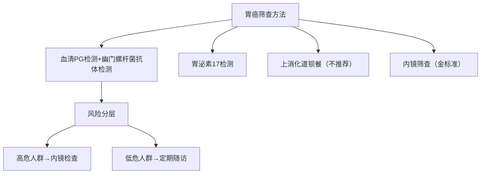
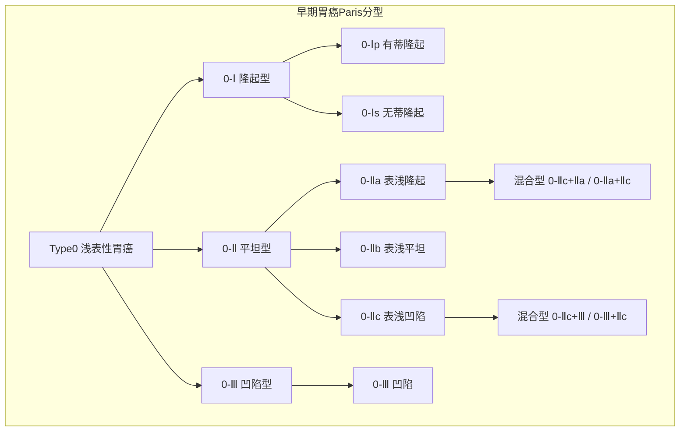
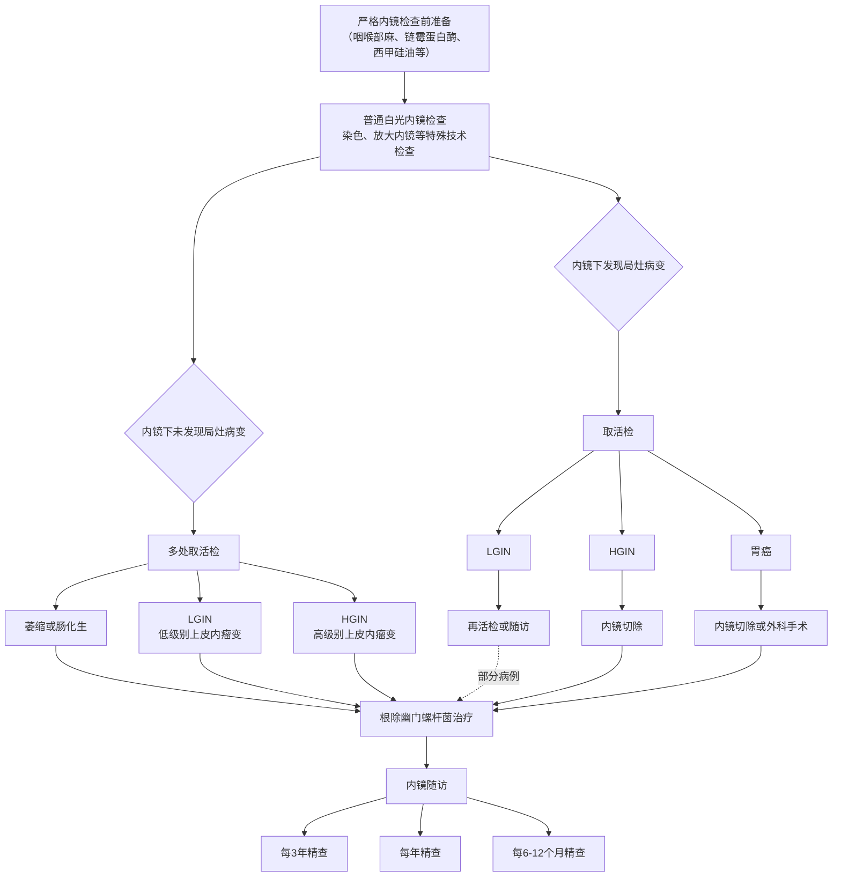
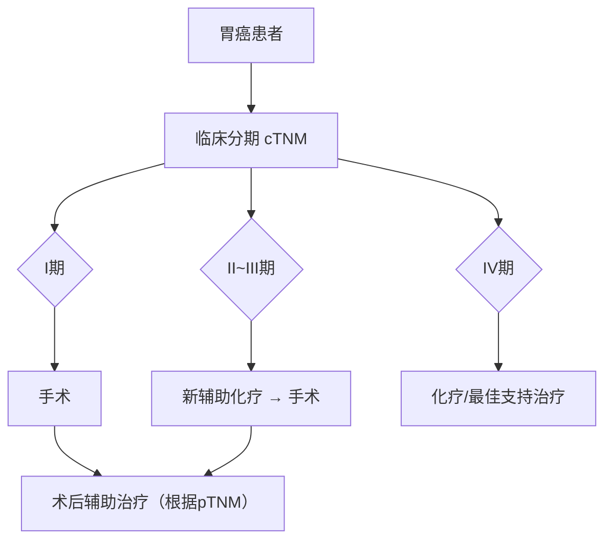
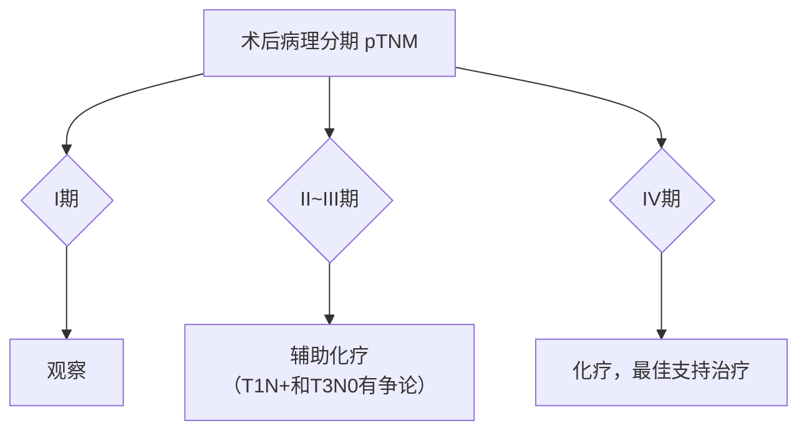
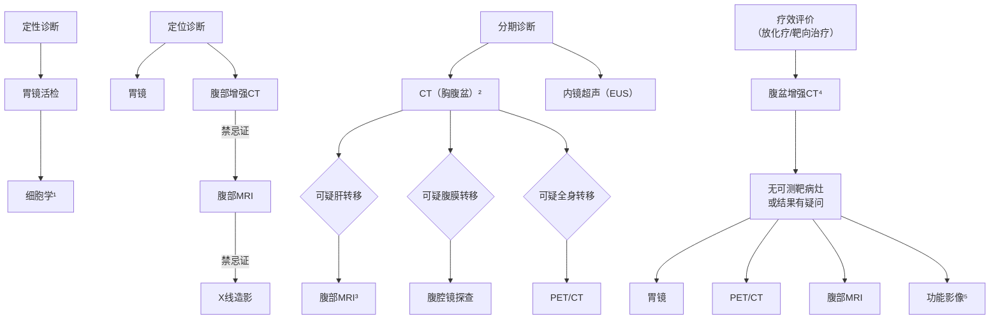

# 胃癌诊疗指南（2022年版）

## 一、概述

胃癌是指原发于胃的上皮源性恶性肿瘤。根据2020年中国最新数据，胃癌发病率和死亡率在各种恶性肿瘤中均位居第三。全球每年新发胃癌病例约120万，中国约占其中的 \(40\%\) 。我国早期胃癌占比很低，仅约 \(20\%\) ，大多数发现时已是进展期，总体5年生存率不足 \(50\%\) 。近年来随着胃镜检查的普及，早期胃癌比例逐年增高。

胃癌治疗的总体策略是以外科为主的综合治疗，为进一步规范我国胃癌诊疗行为，提高医疗机构胃癌诊疗水平，改善胃癌患者预后，保障医疗质量和医疗安全，特制定本指南。本指南所称的胃癌是指胃腺癌（以下简称胃癌），包括胃食管结合部癌。

## 二、诊断

应当结合患者的临床表现、内镜及组织病理学、影像学检查等进行胃癌的诊断和鉴别诊断。

### （一）临床表现。

早期胃癌患者常无特异的症状，随着病情的进展可出现类似胃炎、溃疡病的症状，主要有：
① 上腹饱胀不适或隐痛，以饭后为重；
② 食欲减退、嗳气、反酸、恶心、呕吐、黑便等。

进展期胃癌除上述症状外，常出现：
① 体重减轻、贫血、乏力。
② 胃部疼痛，如疼痛持续加重且向腰背放射，则提示可能存在胰腺和腹腔神经丛受侵。胃癌一旦穿孔，可出现剧烈腹痛的胃穿孔症状。
③ 恶心、呕吐，常为肿瘤引起梗阻或胃功能紊乱所致。贲门部癌可出现进行性加重的吞咽困难及反流症状，胃窦部癌引起幽门梗阻时可呕吐宿食。
④ 出血和黑便，肿瘤侵犯血管，可引起消化道出血。小量出血时仅有大便隐血阳性，当出血量较大时可表现为呕血及黑便。
⑤ 其他症状如腹泻（患者因胃酸缺乏、胃排空加快）、转移灶的症状等。晚期患者可出现严重消瘦、贫血、水肿、发热、黄疸和恶病质。

### （二）体征。

一般胃癌尤其是早期胃癌，常无明显的体征，进展期乃至晚期胃癌患者可出现下列体征：
① 上腹部深压痛，有时伴有轻度肌抵抗感，常是体检可获得的唯一体征；
② 上腹部肿块，位于幽门窦或胃体的进展期胃癌，有时可扪及上腹部肿块；女性患者于下腹部扪及可推动的肿块，应考虑Krukenberg瘤的可能；
③ 胃肠梗阻的表现：幽门梗阻时可有胃型及震水音，小肠或系膜转移使肠腔狭窄可导致部分或完全性肠梗阻；
④ 腹水征，有腹膜转移时可出现血性腹水；
⑤ 锁骨上淋巴结肿大；
⑥ 直肠前窝肿物；
⑦ 脐部肿块等。

其中，锁骨上窝淋巴结肿大、腹水征、下腹部盆腔包块、脐部肿物、直肠前窝种植结节、肠梗阻表现均为提示胃癌晚期的重要体征。因此，仔细检查这些体征，不但具有重要的诊断价值，同时也为诊治策略的制订提供了充分的临床依据。

### （三）影像学检查。

#### 1. X线气钡双重对比造影

定位诊断优于常规CT或MRI，对临床医师手术方式及胃切除范围的选择有指导意义。

#### 2. 超声检查

超声检查（ultrasonography，US）因简便易行、灵活直观、无创无辐射等特点，可作为胃癌患者的常规影像学检查。充盈胃腔之后常规超声可显示病变部位胃壁层次结构，判断浸润深度，是对胃癌T分期的有益补充；彩色多普勒血流成像可以观察病灶内血供；超声双重造影可在观察病灶形态特征的基础上观察病灶及周围组织的微循环灌注特点；此外超声检查可发现腹盆腔重要器官及淋巴结有无转移，颈部、锁骨上淋巴结有无转移；超声引导下肝脏、淋巴结穿刺活检有助于肿瘤的诊断及分期。

#### 3. CT

CT检查应为首选临床分期手段，我国多层螺旋CT广泛普及，特别推荐胸腹盆腔联合大范围扫描。在无CT增强对比剂禁忌情况下均采用增强扫描，常规采用1mm左右层厚连续扫描，并推荐使用多平面重建图像，有助于判断肿瘤部位、肿瘤与周围脏器（如肝脏、胰腺、膈肌、结肠等）或血管关系及区分肿瘤与局部淋巴结，提高分期信心和准确率。为更好地显示病变，推荐口服阴性对比剂（一般扫描前口服 \(500\sim 800\)ml水）使胃腔充分充盈、胃壁扩张，常规采用仰卧位扫描，对于肿瘤位于胃体下部和胃窦部，可以依检查目的和患者配合情况采用特殊体位（如俯卧位、侧卧位等），建议采用多期增强扫描。

CT对进展期胃癌的敏感性约为 \(65\%-90\%\) ，早期胃癌约为 \(50\%\) ；T分期准确率为 \(70\%-90\%\) ，N分期为 \(40\%-70\%\) 。因而不推荐使用CT作为胃癌初诊的首选诊断方法，但在胃癌分期诊断中推荐为首选影像方法。

#### 4. MRI

推荐对CT对比剂过敏者或其他影像学检查怀疑转移者使用。MRI有助于判断腹膜转移状态，可酌情使用。增强MRI是胃癌肝转移的首选或重要补充检查，特别是注射肝特异性对比剂更有助于诊断和确定转移病灶数目、部位。腹部MRI检查对了解胃癌的远处转移情况与增强CT的准确度基本一致，对胃癌N分期的准确度及诊断淋巴结侵犯的敏感性较CT在不断提高，MRI多b值弥散加权成像对胃癌N/T分级有价值。MRI具有良好的软组织对比，随着磁共振扫描技术的进步，对于进展期食管胃结合部癌，CT平扫不能明确诊断，或肿瘤导致内镜超声检查（endoscopic ultrasonography，EUS）无法完成时，推荐依据所在中心实力酌情尝试MRI。

#### 5. 正电子发射计算机体层成像

正电子发射计算机体层成像（positron emission tomography-computed tomography，PET-CT）可辅助胃癌分期，但不做常规推荐。如CT怀疑有远处转移可应用PET-CT评估患者全身情况，另外，研究显示PET-CT对于放化疗或靶向治疗的疗效评价也有一定价值，但亦不做常规推荐。在部分胃癌组织学类型中，肿瘤和正常组织的代谢之间的呈负相关联系，如黏液腺癌，印戒细胞癌，低分化腺癌通常是 \(^{18}\mathrm{F}\) -FDG 低摄取的，故此类患者应慎重应用。

#### 6. 单光子发射计算机体层摄影

骨扫描在探测胃癌骨转移病变方面应用最广、经验丰富、性价比高，且具有较高的灵敏度，但在脊柱及局限于骨髓内的病灶有一定的假阴性率，可与MRI结合提高探测能力。对高度怀疑骨转移的患者可行骨扫描检查。

#### 7. 肿瘤标志物

广泛应用于临床诊断，而且肿瘤标志物的联合检测为我们提供了动态观察肿瘤发生发展及临床疗效评价和患者的预后，从而提高了检出率和鉴别诊断准确度。建议常规推荐CA72-4、癌胚抗原（carcinoembryonic antigen，CEA）和CA19-9，可在部分患者中进一步检测甲胎蛋白（alpha-fetoprotein，AFP）和CA125，CA125对于腹膜转移，AFP对于特殊病理类型的胃癌，均具有一定的诊断和预后价值。CA242和肿瘤特异性生长因子、胃蛋白酶原（pepsinogen，PG）I和PGII的敏感性、特异性尚有待公认。目前肿瘤标志物检测常用自动化学发光免疫分析仪及其配套试剂。

#### 8. 胃镜检查

##### （1）筛查：

1）筛查对象：胃癌在一般人群中发病率较低（33/10万），内镜检查用于胃癌普查需要消耗大量的人力、物力资源，且患者接受度低。因此，只有针对胃癌高危人群进行筛查，才是可能行之有效的方法。我国建议以40岁以上或有胃癌家族史者需进行胃癌筛查。符合下列第1条和第2～6条中任一条者均应列为胃癌高危人群，建议作为筛查对象：
① 年龄40岁以上，男女不限；
② 胃癌高发地区人群；
③ 幽门螺杆菌感染者；
④ 既往患有慢性萎缩性胃炎、胃溃疡、胃息肉、手术后残胃、肥厚性胃炎、恶性贫血等胃癌前疾病；
⑤ 胃癌患者一级亲属；
⑥ 存在胃癌其他高危因素（高盐、腌制饮食、吸烟、重度饮酒等）。

2）筛查方法：见图1。

血清PG检测：我国胃癌筛查采用PGI浓度 \(\leq 70\mu \mathrm{g} / \mathrm{L}\) 且PGI/PGII \(\leq 3.0\) 作为胃癌高位人群标准。根据血清PG检测和幽门螺杆菌抗体检测结果对胃癌患病风险进行分层，并决定进一步检查策略。

胃泌素17（gastrin-17，G-17）：血清G-17浓度检测可以诊断胃窦（G-17水平降低）或仅局限于胃体（G-17水平升高）的萎缩性胃炎。

上消化道钡餐：X线钡餐检查可能发现胃部病变，但敏感性及特异性不高，已被内镜检查取代，不推荐使用X线消化道钡餐进行胃癌筛查。

内镜筛查：内镜及内镜下活检是目前诊断胃癌的金标准，近年来无痛胃镜发展迅速，并已应用于胃癌高危人群的内镜筛查，极大程度上提高了胃镜检查的患者接受度。

**图1 胃癌筛查方法**

##### （2）内镜检查技术

1）普通白光内镜：普通白光内镜是内镜检查技术的基础，对于病变或疑似病变区域首先进行白光内镜观察，记录病变区域自然状态情况，而后再进行其他内镜检查技术。

2）化学染色内镜：化学染色内镜是在常规内镜检查的基础上，将色素染料喷洒至需观察的黏膜表面，使病灶与正常黏膜对比更加明显。
- 物理染色（靛胭脂、亚甲蓝）：指染料与病变间为物理覆盖关系，由于病变表面微结构与周围正常黏膜不同，染料覆盖后产生对光线的不同反射，从而突出病变区域与周围正常组织间的界限。
- 化学染色（醋酸、肾上腺素）：指染料与病变区域间发生化学反应，从而改变病变区域颜色，突出病变边界。

3）电子染色内镜：电子染色内镜可通过特殊光滑晰观察黏膜浅表微血管形态，常见电子染色内镜包括窄带成像技术、智能电子分光技术及智能电子染色内镜。

4）放大内镜：放大内镜可将胃黏膜放大并观察胃黏膜腺体表面小凹结构和黏膜微血管网形态特征的细微变化，可用于鉴别胃黏膜病变的良恶性，判断恶性病变的边界和范围。

5）EUS：EUS是将超声技术与内镜技术相结合的一项内镜诊疗技术。用于评估胃癌侵犯范围及淋巴结情况。

6）其他内镜检查技术：激光共聚焦显微内镜：可显示最高可放大1000倍的显微结构，达到光学活检的目的。荧光内镜：以荧光为基础的内镜成像系统，能发现和鉴别普通内镜难以发现的癌前病变及一些隐匿的恶性病变。但上述方法对设备要求高，目前在临床常规推广应用仍较少。

##### （3）胃镜检查操作指南：

胃镜检查是确诊胃癌的必须检查手段，可确定肿瘤位置，获得组织标本以行病理检查。内镜检查前必须充分准备，建议应用去泡剂和去黏液剂等。经口插镜后，内镜直视下从食管上端开始循腔进镜，依次观察食管、贲门、胃体、胃窦、幽门、十二指肠球部及十二指肠降部。退镜时依次从十二指肠、胃窦、胃角、胃体、胃底贲门、食管退出。依次全面观察、应用旋转镜身、屈曲镜端及倒转镜身等方法观察上消化道全部，尤其是胃壁的大弯、小弯、前壁及后壁，观察黏膜色泽、光滑度、黏液、蠕动及内腔的形状等。如发现病变则需确定病变的具体部位及范围，并详细在记录表上记录。检查过程中，如有黏液和气泡应用清水或去泡剂和去黏液剂及时冲洗，再继续观察。保证内镜留图数量和质量：为保证完全观察整个胃腔，如果发现病灶，另需额外留图。同时，需保证每张图片的清晰度。国内专家较为推荐的是至少40张图片。必要可酌情选用色素内镜/电子染色内镜或放大内镜等图像增强技术。

##### （4）早期胃癌的内镜下分型：见图2。

1）早期胃癌的内镜下分型依照2002年巴黎分型标准及2005年巴黎分型标准更新。浅表性胃癌（Type0）分为隆起型病变（0-Ⅰ）、平坦型病变（0-Ⅱ）和凹陷型病变（0-Ⅲ）。0-Ⅰ型又分为有蒂型（0-Ⅰp）和无蒂型（0-Ⅰs）。0-Ⅱ型根据病灶轻微隆起、平坦、轻微凹陷分为0-Ⅱa、0-Ⅱb和0-Ⅱc3个亚型。

2）0-Ⅰ型与0-Ⅱa型的界限为隆起高度达到 \(2.5\mathrm{mm}\) （活检钳闭合厚度），0-Ⅲ型与0-Ⅱc型的界限为凹陷深度达到 \(1.2\mathrm{mm}\) （活检钳张开单个钳厚度）。同时具有轻微隆起及轻微凹陷的病灶根据隆起/凹陷比例分为0-Ⅱc+Ⅱa及0-Ⅱa+Ⅱc型。凹陷及轻微凹陷结合的病灶则根据凹陷／轻微凹陷比例分为0-Ⅲ+Ⅱc和0-Ⅱc+Ⅲ型。

**图2 胃癌的镜下分型示意图**

3）早期胃癌精查及随访流程见图3。

**图3 胃癌精查和随访流程**

##### （5）活检病理检查：

1）如内镜观察和染色等特殊内镜技术观察后未发现可疑病灶，可不取活检。

2）活检部位：为提高活检阳性率，不同类型病变取活检时应注意选取活检部位。

- **带蒂病变**：应于病变头部取活检，不应活检病变蒂部。
  
  > **图：带蒂病变活检部位示意**  
  > 绿色圆点：适宜活检部位（头部）  
  > 红色圆点：不适宜活检部位（蒂部）

- **隆起型病变**：应于病变顶部活检，不应活检病变基底部。
  
  > **图：隆起型病变活检部位示意**  
  > 绿色圆点：适宜活检部位（顶部）  
  > 红色圆点：不适宜活检部位（基底部）

- **溃疡型病变**：应于溃疡堤内侧活检，不应活检溃疡底或溃疡堤外侧。
  
  > **图：溃疡型病变活检部位示意**  
  > 绿色圆点：适宜活检部位（溃疡堤内侧）  
  > 红色圆点：不适宜活检部位（溃疡底、溃疡堤外侧）

3）怀疑早期肿瘤性病变：直径2cm以下病变取1～2块活检，直径每增加1cm可增加1块；倾向进展期癌的胃黏膜，避开坏死的区域，取材6～8块。

4）胃镜活检标本处理指南：

① 标本前期处置：活检标本离体后，立即将标本展平，使黏膜的基底层面贴附在滤纸上。

② 标本固定：置于充足（大于10倍标本体积）的 \(10\%\) 中性缓冲福尔马林溶液（含 \(4\%\) 甲醛）中。包埋前固定时间须大于6小时，小于48小时。

③ 石蜡包埋：去除滤纸，将组织垂直定向包埋。包埋时，烧烫的镊子不能直接接触标本，先在蜡面减热后再夹取组织，防止灼伤组织。

④ 苏木精-伊红（hematoxylin and eosin，HE）染色制片标准：修整蜡块，要求连续切 \(6\sim 8\) 个组织面，捞取在同一张载玻片上。常规HE染色，封片。

#### 9. EUS

EUS被认为胃肠道肿瘤局部分期的最精确方法，在胃癌T分期（特别是早期癌）和N分期不亚于或超过CT，常用以区分黏膜层和黏膜下层病灶，动态观察肿瘤与邻近脏器的关系，并可通过EUS引导下穿刺活检淋巴结，明显提高局部T、N分期准确率，但EUS为操作者依赖性检查，因此，推荐在医疗水平较高的医院或中心。对拟施行内镜下黏膜切除（Endoscopic mucosal resection，EMR）、内镜下黏膜下剥离术（Endoscopic submucosal dissection，ESD）等内镜治疗者必须进行此项检查。EUS能发现直径5mm以上淋巴结。淋巴结回声类型、边界及大小作为主要的判断标准，认为转移性淋巴结多为圆形、类圆形低回声结构，其回声常与肿瘤组织相似或更低，边界清晰，内部回声均匀，直径 \(>1 \mathrm{cm}\) ；而非特异性炎性肿大淋巴结常呈椭圆形或三角形高回声改变，边界模糊，内部回声均匀。

**超声胃镜检查操作指南**：规范的操作过程及全面、无遗漏的扫查是准确分期的基础，以胃肿瘤分期为目标的EUS应该至少包括自幽门回撤至食管胃结合部的全面扫查过程，为准确评估第一站淋巴结，推荐自十二指肠球部回撤。在回撤过程中进行分期评估，并且留存肿瘤典型图像及重要解剖标志处图像，如能做到动态的多媒体资料留存，可提高分期的准确率并提供回溯可能。扫查过程中应当注意胃腔的充盈及合适的探头频率选择和适当的探头放置，合适的焦距下图像更加清晰，并避免压迫病变导致错误分期。

### （四）胃癌的诊断标准及内容。

#### 1. 定性诊断

采用胃镜检查进行病变部位活检及病理检查等方法明确病变是否为癌、肿瘤的分化程度以及特殊分子表达情况等与胃癌自身性质和生物行为学特点密切相关的属性与特征。除常规组织学类型，还应该明确Laurén分型及HER2表达状态。

#### 2. 分期诊断

胃癌的分期诊断主要目的是在制订治疗方案之前充分了解疾病的严重程度及特点，以便为选择合理的治疗模式提供充分的依据。胃癌的严重程度可集中体现在局部浸润深度、淋巴结转移程度以及远处转移存在与否3个方面，在临床工作中应选择合适的辅助检查方法以期获得更为准确的分期诊断信息。

#### 3. 临床表现

临床表现不能作为诊断胃癌的主要依据，但是在制订诊治策略时，应充分考虑是否存在合并症及伴随疾病会对整体治疗措施产生影响。

### （五）鉴别诊断。

#### 1. 胃良性溃疡

与胃癌相比较，胃良性溃疡一般病程较长，曾有典型溃疡疼痛反复发作史，抗酸剂治疗有效，多不伴有食欲减退。除非合并出血、幽门梗阻等严重的合并症，多无明显体征，不会出现近期明显消瘦、贫血、腹部肿块甚至左锁骨上窝淋巴结肿大等。更为重要的是X线钡餐和胃镜检查，良性溃疡直径常小于 \(2.5\mathrm{cm}\) ，圆形或椭圆形龛影，边缘整齐，蠕动波可通过病灶；胃镜下可见黏膜基底平坦，有白色或黄白苔覆盖，周围黏膜水肿、充血，黏膜皱襞向溃疡集中。而癌性溃疡与此有很大的不同，详细特征参见胃癌诊断部分。

#### 2. 胃淋巴瘤

占胃恶性肿瘤的 \(2\%-7\%\) 。 \(95\%\) 以上的胃原发恶性淋巴瘤为非霍奇金淋巴瘤，常广泛浸润胃壁，形成一大片浅溃疡。以上腹部不适、胃肠道出血及腹部肿块为主要临床表现。

#### 3. 胃肠道间质瘤

间叶源性肿瘤，约占胃肿瘤的 \(3\%\) ，肿瘤膨胀性生长，可向黏膜下或浆膜下浸润形成球形或分叶状的肿块。瘤体小症状不明显，可有上腹不适或类似溃疡病的消化道症状，瘤体较大时可扪及腹部肿块，常有上消化道出血的表现。

#### 4. 胃神经内分泌肿瘤

神经内分泌肿瘤（neuroendocrine neoplasm，NEN）是一组起源于肽能神经元和神经内分泌细胞的具有异质性的肿瘤，所有神经内分泌肿瘤均具有恶性潜能。这类肿瘤的特点是能储存和分泌不同的肽和神经胺。虽然胃肠胰NEN是一种少见的疾病，占胃肠恶性肿瘤不足2%的比例，但目前在美国NEN是发病率仅次于结直肠癌的胃肠道恶性肿瘤。其诊断仍以组织学活检病理为金标准，然常规的HE染色已不足以充分诊断NEN，目前免疫组织化学染色方法中突触素蛋白和嗜铬粒蛋白A染色为诊断NEN的必检项目，并需根据核分裂象和Ki-67百分比对NEN进行分级。

#### 5. 胃良性肿瘤

约占全部胃肿瘤的2%左右，按组织来源可分为上皮细胞瘤和间叶组织瘤，前者常见为胃腺瘤，后者以平滑肌瘤、脂肪瘤、神经鞘瘤等较为常见。一般体积较小，发展较慢。胃窦和胃体为多发部位。多无明显临床表现，X线钡餐为圆形或椭圆形的充盈缺损，而非龛影；胃镜下则表现为黏膜下肿块。

## 三、胃癌的病理与分期

### （一）术语和定义。

#### 1. 胃癌

来源于胃黏膜上皮细胞的恶性肿瘤。

#### 2. 上皮内瘤变/异型增生

胃癌的癌前病变，上皮内瘤变和异型增生2个名词可通用。涉及胃上皮内瘤变/异型增生的诊断有3种。

（1）无上皮内瘤变（异型增生）：胃黏膜炎症、化生及反应性增生等良性病变。

（2）不确定上皮内瘤变（异型增生）：不是最终诊断名词，而是在难以确定胃黏膜组织和细胞形态改变的性质时使用的一种实用主义的描述。往往用于小活检标本，特别是炎症背景明显的小活检标本，难以区分位于黏膜颈部区增生带的胃小凹上皮增生及肠上皮化生区域化生上皮增生等病变的性质（如反应性或增生性病变）时。对此类病例，可以通过深切、重新取材等方法来明确诊断。

（3）上皮内瘤变（异型增生）：以出现不同程度的细胞和结构异型性为特征的胃黏膜上皮增生，性质上是肿瘤性增生，但无明确的浸润性生长的证据。病变累及小凹全长，包括表面上皮，这是诊断的重要依据。根据组织结构和细胞学特征，胃上皮内瘤变（异型增生）可以分为腺瘤型（肠型）和小凹或幽门型（胃型）两种类型。大体检查，胃黏膜上皮内瘤变（异型增生）可以呈息肉样、扁平型或轻度凹陷状生长。根据病变程度，将胃黏膜上皮内瘤变（异型增生）分为低级别和高级别2级。

- **1）低级别上皮内瘤变**：黏膜结构改变轻微；腺上皮细胞出现轻-中度异型，细胞核变长，但仍有极性，位于腺上皮基底部；可见核分裂。对息肉样病变，也可使用低级别腺瘤。

- **2）高级别上皮内瘤变**：黏膜腺体结构异型性明显；细胞由柱状变为立方形，细胞核大、核浆比增高、核仁明显；核分裂象增多，可见病理性核分裂。特别重要的是细胞核延伸至腺体腔侧面、细胞极性丧失。对息肉样病变，也可使用高级别腺瘤。

#### 3. 早期胃癌

局限于黏膜或黏膜下层的浸润性癌，无论是否有淋巴结转移。

#### 4. 进展期胃癌

癌组织侵达固有肌层或更深者，无论是否有淋巴结转移。

#### 5. 食管胃交界部腺癌

食管胃交界部腺癌是横跨食管胃交界部的腺癌。解剖学上食管胃交界部是指管状食管变为囊状胃的部位，即食管末端和胃的起始，相当于腹膜返折水平或希氏角或食管括约肌下缘，与组织学上的鳞柱交界不一定一致。

### （二）标本类型及固定。

#### 1. 标本类型

日常工作中常见的标本类型包括：内镜活检标本，EMR/ESD，姑息性/根治切除术标本（近端胃切除标本、远端胃切除标本和全胃切除标本）。

#### 2. 标本固定

（1）应及时、充分固定，采用 \(10\%\) 中性缓冲福尔马林固定液（含 \(4\%\) 甲醛），应立即固定（手术切除标本也尽可能半小时内），固定液应超过标本体积的10倍以上，固定时间6～72小时，固定温度为正常室温。

（2）内镜活检标本：标本离体后，应由内镜医师或助手用小拨针将活检钳上的组织立即取下，并应在手指上用小拨针将其展平，取小块滤纸，将展平的黏膜平贴在滤纸上，立即放入固定液中固定。

（3）EMR/ESD标本：应由内镜医师展平标本，黏膜面向上，使用不生锈的细钢针固定于软木板（或泡沫板）上，避免过度牵拉导致标本变形，亦不应使标本皱褶，标记口侧及肛侧方向，立即完全浸入固定液中。

（4）根治切除标本：通常是沿胃大弯侧打开胃壁，如肿瘤位于胃大弯，则避开肿瘤沿大弯侧打开胃壁，黏膜面向上，使用大头针固定于软木板（或泡沫板）上，板上应垫纱布，钉好后黏膜面向下，尽快（离体30分钟内）完全浸入固定液中。

### （三）取材及大体描述指南。

取材时，应核对基本信息，如姓名、送检科室、床位号、住院号、标本类型、数量等。

#### 1. 活检标本

（1）描述及记录：描述送检组织的大小及数目。

（2）取材：送检黏膜全部取材，应将黏膜包于滤纸中以免丢失，取材时应滴加伊红，利于包埋和切片时技术员辨认。大小相差悬殊的要分开放入不同脱水盒，防止小块活检组织漏切或过切。包埋时需注意一定要将展平的黏膜立埋（即黏膜垂直于包埋盒底面包埋）。一个蜡块中组织片数不宜超过3片、平行方向立埋。蜡块边缘不含组织的白边尽量用小刀去除，建议每张玻片含6-8个连续组织片，便于连续观察。

#### 2. EMR/ESD标本

（1）大体检查及记录：测量并记录标本大小（最大径×最小径×厚度），食管胃交界部标本要分别测量食管和胃的长度和宽度。记录黏膜表面的颜色，是否有肉眼可见的明显病变，病变的轮廓是否规则，有无明显隆起或凹陷，有无糜烂或溃疡等，记录病变的大小（最大径×最小径×厚度）、大体分型（见附录）以及病变距各切缘的距离（至少记录病变与黏膜侧切缘最近距离）。复杂标本建议临床病理沟通或由手术医师提供标本延展及重建的示意图。

（2）取材：EMR/ESD标本应全部取材。垂直于最近侧切缘取材。黏膜侧切缘与基底切缘可用墨汁或碳素墨水标记（有条件的可于口侧和肛侧涂不同颜色以便于辨别），以便在镜下观察时能够对切缘做出定位，并评价肿瘤切缘情况。食管胃交界部标本宜沿口侧-肛侧的方向取材，以更好的显示肿瘤与食管胃交界的关系。每间隔 \(2\sim 3\mathrm{mm}\) 平行切开，全部取材。如果标本太大，可以进行改刀，将1条分为多条，分别标记a、b等。按同一方向立埋（包埋第一块和最后一块的刀切面，如果第一块和最后一块镜下有病变，再翻转 \(180^{\circ}\) 包埋，以确保最终切片观察黏膜四周切缘情况），并记录组织块对应的包埋顺序/部位。记录组织块对应的部位（建议附照片或示意图并做好标记）。建议将多块切除的本分别编号和取材，不需考虑侧切缘的情况，其他同单块切除标本。

#### 3. 根治术标本

（1）大体检查及记录：应根据幽门及贲门的特征来正确定位。测量胃大弯、小弯长度，胃网膜的体积；检查黏膜面，应描述肿瘤的部位、大小（新辅助治疗后标本，测量瘤床的大小；内镜下黏膜切除术后标本，描述溃疡/黏膜缺损区/瘢痕的大小以及有无肿瘤的残余）、数目、大体分型（见附录）、外观描写、浸润深度、浸润范围、肿瘤与两侧切缘及环周切缘的距离。应观察除肿瘤以外的胃壁黏膜是否有充血、出血、溃疡、穿孔等其他改变；观察浆膜面有无充血、出血、渗出、穿孔、肿瘤浸润等；肿瘤周围胃壁有无增厚及弹性情况；如有另送的脾脏、十二指肠等，依次描述。近端胃癌建议报与食管胃交界部的关系：累及/未累及食管胃交界部（肿瘤与食管胃交界部的关系：肿瘤完全位于食管，未累及食管胃交界部；肿瘤中心位于远端食管，累及食管胃交界部；肿瘤中心位于食管胃交界部；肿瘤中心位于近端胃，累及食管胃交界部）。累及食管胃交界部者，记录肿瘤中心距食管胃交界部的距离（单位：cm）（用于Siewert分型，见附录）。远端胃癌建议报与十二指肠的关系。

（2）取材：可自肿瘤中心从口侧切缘至肛侧切缘取一条组织分块包埋（包括肿瘤、肿瘤旁黏膜及两端切缘），并记录组织块对应的方位（宜附照片或示意图并做好标记）。推荐纵向取两端切缘与肿瘤的关系，对肿瘤距两端切缘较远者，也可横向取两端切缘。单独送检的闭合器切缘应剔除闭合器后全部取材观察。对肿瘤侵犯最深处及可疑环周切缘受累处应重点取材。对早期癌或新辅助治疗后病变不明显的根治术标本，建议将可疑病变区和瘤床全部取材。对周围黏膜糜烂、粗糙、充血、出血、溃疡、穿孔等改变的区域或周围食管/胃壁内结节及食管胃交界部组织应分别取材。若附其他邻近器官应观察取材。应按外科医师已分组的淋巴结取材。如外科医师未送检分组淋巴结，应按淋巴结引流区域对胃周淋巴结进行分组。应描述淋巴结的数目及大小，有无融合，有无与周围组织粘连，如有粘连，注意需附带淋巴结周围的结缔组织。所有检出淋巴结均应取材。未经新辅治疗的根治术标本应至少检出16枚淋巴结，最好30枚淋巴结以上。推荐取材组织大小不大于 \(2.0\mathrm{cm}\times 1.5\mathrm{cm}\times 0.3\mathrm{cm}\)。

### （四）病理诊断分型、分级和分期方案。

1. 组织学分型（见附录）：推荐同时使用WHO（消化系统肿瘤）和Laurén分型（肠型、弥漫型、混合型，未分型）。

2. 组织学分级：依据腺体的分化程度分为高分化、中分化和低分化（高级别、低级别）。

3. 胃癌分期：推荐美国癌症联合会（American Joint Committee on Cancer，AJCC）和国际抗癌联盟（Union for International Cancer Control，UICC）联合制定的分期。

4. 新辅助治疗后根治术标本的病理学评估：新辅助治疗后病理学改变的基本特征包括肿瘤细胞退变、消退，大片坏死、纤维组织增生、间质炎症细胞浸润、钙盐沉积等。可能出现大的无细胞黏液湖，不能将其认为是肿瘤残余。胃癌的疗效分级系统宜采用美国病理学家学会/美国国家综合癌症网络（The National Comprehensive Cancer Network，NCCN）指南的标准（见附录）。

### （五）病理报告内容及指南。

胃癌的病理报告应包括与患者治疗和预后相关的所有内容，如标本类型、肿瘤部位、大体分型、大小及数目、组织学类型、亚型及分级、浸润深度、脉管和神经侵犯、周围黏膜情况、淋巴结情况、环周及两端切缘情况等。推荐报告最后注明 pTNM 分期。

1. 大体描写：包括标本类型、肿瘤部位、大体分型、大小（肿瘤大小应量出三维的尺寸）及数目。

2. 主体肿瘤：组织学类型及分级、Laurén 分型（肠型、弥漫型、混合型或不确定型）、浸润深度（包括黏膜固有层、黏膜肌层、黏膜下层、浅肌层、深肌层、浆膜下层、浆膜层及周围组织或器官。对于黏膜下层浸润癌，如为内镜下切除标本，应测量黏膜下层浸润深度，建议区分 SM1（黏膜下层侵犯深度<500μm）和 SM2（黏膜下层侵犯深度>500μm）；如为根治切除术标本，建议区分 SM1（黏膜下层上1/3）、SM2（黏膜下层中1/3）和 SM3（黏膜下层下1/3））、切缘（内镜下切除标本包括侧切缘和基底切缘，根治切除标本包括口侧、肛侧切缘及环周切缘；切缘的情况要说明，包括浸润癌或上皮内瘤变/异型增生；建议注明距切缘的距离）、淋巴管/血管浸润（尤其是对于内镜下切除标本，如果怀疑有淋巴管/血管浸润，建议做免疫组化 CD31/CD34、D2-40 确定是否有淋巴管/血管浸润；EVG 染色判断有无静脉侵犯）、神经侵犯。胃的溃疡病灶或溃疡瘢痕可影响 EMR/ESD 手术及对预后的判断，是病理报告中的一项重要内容。

3. 癌旁：上皮内瘤变/异型增生及程度，有无胃炎及类型。

4. 淋巴结转移情况：转移淋巴结数/淋巴结总数。宜报转移癌侵及淋巴结被膜外的数目。

5. 治疗反应（新辅助治疗的病例）。

6. 应报告合并的其他病变。

7. 胃腺癌和食管胃交界部腺癌应做HER2免疫组化检测及错配修复蛋白（MLH1、PMS2、MSH2、MSH6）免疫组化检测和/或MSI检测。在有条件的单位开展PD-L1检测。

8. 备注报告内容包括重要的相关病史（如相关肿瘤史和新辅助治疗史）。

9. pTNM分期。

### （六）内镜下切除病理报告中的几个问题。

1. 肿瘤侵犯深度：肿瘤侵犯深度的判断是以垂直切缘阴性为前提的，黏膜下层的浸润深度还是判断病变是否完整切除的重要指标之一，侵犯黏膜下层越深则淋巴结转移的可能性越高。胃以 \(500\mu \mathrm{m}\) 为界，不超过为SM1，超过为SM2。黏膜下层浸润深度的测量方法，根据肿瘤组织内黏膜肌层的破坏程度不同而不同。若肿瘤组织内尚可见残存的黏膜肌层，则以残存的黏膜肌层下缘为基准，测量至肿瘤浸润前锋的距离。若肿瘤组织内没有任何黏膜肌层，则以肿瘤最表面为基准，测量至肿瘤浸润前锋的距离。

2. 切缘情况：组织标本的电灼性改变是ESD标本切缘的标志。切缘阴性是在切除组织的各个水平或垂直电灼缘均未见到肿瘤细胞。切缘阴性，但癌灶距切缘较近，应记录癌灶与切缘最近的距离；水平切缘阳性，应记录阳性切缘的块数；垂直切缘阳性，应记录肿瘤细胞所在的部位（固有层或黏膜下层）。电灼缘的变化对组织结构、细胞及其核的形态的观察会有影响，必要时可做免疫组织化学染色帮助判断切缘是否有癌灶残留。

3. 脉管侵犯情况：ESD标本有无淋巴管、血管（静脉）的侵犯是评判是否需要外科治疗的重要因素之一。肿瘤侵犯越深，越应注意有无侵犯脉管的状况。黏膜下浸润的肿瘤组织如做特殊染色或免疫组织化学染色（如CD31/CD34、D2-40），常能显示在HE染色中易被忽略的脉管侵犯。

4. 有无溃疡和黏膜其他病变：胃的溃疡或溃疡瘢痕可影响ESD手术，以及对预后的判断，是病理报告中的一项重要内容。而周围黏膜的非肿瘤性病变，包括炎症、萎缩、化生等改变及其严重程度也应有所记录。

5. pT1低分化癌、脉管侵犯、切缘阳性，应当再行外科手术扩大切除范围。其他情况，内镜下切除充分即可，但术后需定期随访。

6. 预后不良的组织学特征包括：低分化，血管、淋巴管浸润，切缘阳性。

7. 阳性切缘定义为：肿瘤距切缘小于1mm或电刀/超声刀切缘可见癌细胞。

## 四、胃癌的治疗

### （一）治疗原则。

应当采取综合治疗的原则，即根据肿瘤病理学类型及临床分期，结合患者一般状况和器官功能状态，采取多学科综合治疗（multidisciplinary team，MDT）模式（包括胃肠外科、消化内科、肿瘤内科、内镜中心、放疗科、介入科、影像科、康复科、营养科、分子生物学家、生物信息学家等），有计划、合理地应用手术、化疗、放疗和生物靶向等治疗手段，达到根治或最大幅度地控制肿瘤，延长患者生存期，改善生活质量的目的。

1. 早期胃癌且无淋巴结转移证据，可根据肿瘤侵犯深度，考虑内镜下治疗或手术治疗，术后无需辅助放疗或化疗。

2. 局部进展期胃癌或伴有淋巴结转移的早期胃癌，应当采取以手术为主的综合治疗。根据肿瘤侵犯深度及是否伴有淋巴结转移，可考虑直接行根治性手术或术前先行新辅助化疗，再考虑根治性手术。成功实施根治性手术的局部进展期胃癌，需根据术后病理分期决定辅助治疗方案（辅助化疗，必要时考虑辅助化放疗）。

3. 复发/转移性胃癌应当采取以药物治疗为主的综合治疗手段，在恰当的时机给予姑息性手术、放疗、介入治疗、射频治疗等局部治疗，同时也应当积极给予镇痛、支架置入、营养支持等最佳支持治疗。

### （二）早期胃癌内镜治疗。

早期胃癌的治疗方法包括内镜下切除和外科手术。与传统外科手术相比，内镜下切除具有创伤小、并发症少、恢复快、费用低等优点，且疗效相当，5年生存率均可超过 \(90\%\) 。因此，国际多项指南和本共识均推荐内镜下切除为早期胃癌的首选治疗方式。早期胃癌内镜下切除术主要包括EMR和ESD。

#### 1. 内镜治疗有关定义及术语

（1）整块切除：病灶在内镜下被整块切除并获得单块标本。

（2）水平／垂直切缘阳性：内镜下切除的标本固定后每隔 \(2\mathrm{mm}\) 垂直切片，若标本侧切缘有肿瘤细胞浸润为水平切缘阳性，若基底切缘有肿瘤细胞浸润则称为垂直切缘阳性。

（3）完全切除：整块切除标本水平和垂直切缘均为阴性称为完全切除。

（4）治愈性切除：达到完全切除且无淋巴结转移风险。

（5）非治愈性切除：存在下列情况之一者：
① 非完全切除，包括非整块切除和/或切缘阳性；
② 存在引起淋巴结转移风险的相关危险因素，如黏膜下侵及深度超过 \(500\mu \mathrm{m}\) 、脉管浸润、肿瘤分化程度较差等。

（6）局部复发：指术后6个月以上原切除部位及周围1cm内发现肿瘤病灶。

（7）残留：指术后6个月内原切除部位及周围1cm内病理发现肿瘤病灶。

（8）同时性复发：指胃癌内镜治疗后12个月内发现新的病灶：即内镜治疗时已存在但被遗漏的、术后12个月内经内镜发现的继发性病灶。

#### 2. 内镜治疗术前评估

需根据以下内容判定是否行 ESD 或 EMR。

（1）组织学类型：组织病理学类型通常由活检标本的组织病理学检查来确定，虽已有报道指出，组织病理学类型可一定程度通过内镜预测，但尚缺乏充足证据。

（2）大小：采用常规内镜检测方法测量病变大小容易出错，难以准确判断术前病灶大小，因此，一般以切除后组织的测量及病理学检查作为最终检查结果。

（3）是否存在溃疡：注意观察病变是否存在溃疡，如存在，需检查是属于活动性溃疡还是溃疡瘢痕。溃疡组织病理定义为至少 UL-Ⅱ深度的黏膜缺损（比黏膜肌层更深）。术前胃镜中，活动性溃疡一般表现为病变表面覆盖白色渗出物，不包括浅表糜烂。此外，溃疡处在愈合或瘢痕阶段时，黏膜皱襞或褶皱会向一个中心聚合。

（4）浸润深度：目前常规使用内镜检查来判断早期胃癌的侵犯深度，并推荐使用放大内镜辅助判断。当前述方法难以判断浸润深度时，EUS可以作为辅助诊断措施，效果明显。

#### 3. 内镜治疗技术

（1）EMR：EMR 指内镜下将黏膜病灶整块或分块切除、用于胃肠道表浅肿瘤诊断和治疗的方法。目前尚缺乏足够的证据支持其作为早期胃癌的首选治疗。

（2）ESD：

1) 定义：ESD 是在 EMR 基础上发展起来的新技术，根据不同部位、大小、浸润深度的病变，选择使用的特殊电切刀，如 IT 刀、Dual 刀、Hook 刀等，内镜下逐渐分离黏膜层与固有肌层之间的组织，最后将病变黏膜及黏膜下层完整剥离的方法。

2) 操作步骤：操作大致分为 5 步：
① 病灶周围标记；
② 黏膜下注射，使病灶明显抬起；
③ 环形切开黏膜；
④ 黏膜下剥离，使黏膜与固有肌层完全分离开，一次完整切除病灶；
⑤ 创面处理：包括创面血管处理与边缘检查。

（3）其他治疗技术：内镜下其他治疗方法包括激光疗法、氩气刀和微波治疗等，它们只能去除肿瘤，但不能获得完整病理标本，也不能肯定肿瘤是否完整切除。因此，多用于胃癌前病变的治疗，治疗后需要密切随访，不建议作为早期胃癌的首选治疗方式。

#### 4. 早期胃癌内镜治疗适应证（表1）

**表1 早期胃癌内镜治疗绝对和相对适应证**

| 浸润深度 | 分化                                                     | 未分化         |
| :------- | :------------------------------------------------------- | :------------- |
| cT1a(M)  | UL(-) ≤ 2cm UL(-) > 2cm UL(+) ≤ 3cm UL(+) > 3cm | ≤ 2cm > 2cm |
| cT1b(SM) | ≤ 3cm > 3cm                                           | -              |

*仅适用于ESD

**绝对适应证**：肉眼可见黏膜内（cT1a）分化癌，必须无溃疡（瘢痕）发生，即UL（-）。当侵犯深度、病变直径、分化程度和合并溃疡UL（+）其中一项超出上述标准，淋巴结转移风险极低时，也可以考虑进行内镜治疗。对于EMR/ESD治疗后局部黏膜病灶复发患者，可行扩大适应证进行处理。

#### 5. 早期胃癌内镜治疗禁忌证

国内目前较为公认的内镜切除禁忌证为：
（1）明确淋巴结转移的早期胃癌；
（2）癌症侵犯固有肌层；
（3）患者存在凝血功能障碍。

另外，ESD的相对手术禁忌证还包括抬举征阴性，即指在病灶基底部的黏膜下层注射盐水后局部不能形成隆起，提示病灶基底部的黏膜下层与肌层之间已有粘连；此时行ESD治疗，发生穿孔的危险性较高，但是随着ESD操作技术的熟练，即使抬举征阴性也可以安全地进行ESD。

#### 6. 围手术期处理

（1）术前准备：术前评估患者全身状况，排除麻醉及内镜治疗禁忌证。取得患者及家属知情同意后，签署术前知情同意书。

（2）术后处理：术后第1天禁食；密切观察生命体征，无异常术后第2天进流质或软食。术后1周是否复查内镜尚存争议。

（3）术后用药：
- 溃疡治疗：内镜下切除早期胃癌后溃疡，可使用质子泵抑制剂（proton pump inhibitor，PPI）或 \(\mathrm{H}_{2}\) 受体拮抗剂（ \(\mathrm{H}_{2}\) receptor antagonist， \(\mathrm{H}_{2}\mathrm{RA}\) ）进行治疗。
- 抗菌药物使用：对于术前评估切除范围大、操作时间长和可能引起消化道穿孔者，可以考虑预防性使用抗菌药物。

#### 7. 术后并发症及处理

ESD术后常见并发症主要包括出血、穿孔、狭窄、腹痛、感染等。

（1）出血：术中出血推荐直接电凝止血，迟发性出血可用止血夹或电止血钳止血。

（2）穿孔：术中穿孔多数病例可通过金属夹闭裂口进行修补。当穿孔较大时，常难以进行内镜治疗而需要紧急手术。

（3）狭窄：胃腔狭窄或变形发生率较低，主要见于贲门、幽门或胃窦部面积较大的ESD术后。内镜柱状气囊扩张是一种有效的治疗方式。

#### 8. 预后评估及随访

在内镜切除后的治愈性评价方面，现行内镜的治愈性切除和R0切除容易混淆。R0切除意味着阴性切缘，但内镜下的阴性切缘并不能意味着治愈性切除。为统一预后评估标准，本指南推荐采用eCura评价系统（表2）。随访方法见表3。

**表2 eCura评价系统**

| 分期       | 溃疡/深度 | 分化型       | 未分化型     |
| :--------- | :-------- | :----------- | :----------- |
| pT1a（M）  | UL（-）   | ≤2cm >2cm | ≤2cm >2cm |
|            | UL（+）   | ≤3cm >3cm | -            |
| pT1b（SM） | SM1       | ≤3cm >3cm | -            |
|            | SM2       | -            | -            |

\*需满足en bloc整块切除，HM0，VM0，ly（-），v（-）

**表3 不同eCura评价结果的随访方法**

| eCura分级 | 随访方法                                  |
| :-------- | :---------------------------------------- |
| eCura A   | 每6~12个月进行内镜随访                    |
| eCura B   | 每6~12个月进行内镜随访 + 腹部超声或CT随访 |
| eCura C1  | 建议行补充治疗（手术或非手术）或密切随访  |
| eCura C2  | 建议手术治疗或充分知情后随访              |

**eCura C1**: 在分化型癌中，满足eCura A或B的其他条件，但未实现en bloc切除或HM0的局部未能完整切除的病例，即eCura C1。可以采用局部治疗，例如再次行ESD、内镜下消融等，同样也可以考虑到ESD的热效应，采取积极随访的办法。

**eCura C2**: 病理提示淋巴结转移风险高。虽然存在较高的淋巴结转移风险，但是根据病例具体情况，在充分告知淋巴结转移风险后，可以选择ESD的方式给予治疗。

值得关注的是eCura C患者在选择是否追加手术及手术时机的掌控方面尚存在争论，主要集中在以下3个方面：
（1） \(80\%\) 以上的eCura C患者并未出现局部复发或淋巴结转移。
（2）对于脉管浸润、神经侵犯、淋巴结侵犯及水平/垂直切缘等用于评价的危险因素在病变复发中起到的作用及影响尚需进一步细化。
（3）ESD术后立即追加手术的eCura C患者与ESD术后发生局部复发再行手术的患者，在预后方面并无显著差异。

综上所述，eCura C 患者是否需要立即追加手术尚需更详细的临床研究数据支持。

### （三）手术治疗。

#### 1. 手术治疗原则

手术切除是胃癌的主要治疗手段，也是目前治愈胃癌的唯一方法。胃癌手术分为根治性手术与非根治性手术。根治性手术应当完整切除原发病灶，并且彻底清扫区域淋巴结，主要包括标准手术、改良手术和扩大手术；非根治性手术主要包括姑息手术和减瘤手术。

（1）根治性手术：
① 标准手术是以根治为目的，要求必须切除2/3以上的胃，并且进行D2淋巴结清扫。
② 改良手术主要针对分期较早的肿瘤，要求切除部分胃或全胃，同时进行D1或 \(\mathrm{D1 + }\) 淋巴结清扫。
③ 扩大手术包括联合脏器切除或（和）D2以上淋巴结清扫的扩大手术。

（2）非根治性手术：
① 姑息手术主要针对出现肿瘤并发症的患者（出血、梗阻等），主要的手术方式包括胃姑息性切除、胃空肠吻合短路手术和空肠营养管置入术等。
② 减瘤手术主要针对存在不可切除的肝转移或者腹膜转移等非治愈因素，也没有出现肿瘤并发症所进行的胃切除，目前不推荐开展。

#### 2. 治疗流程

根据cTNM分期，以外科为主的治疗流程见图4，术后治疗流程见图5。

**图4 治疗流程**

**图5 术后治疗（根据术后pTNM分期）**

#### 3. 安全切缘的要求

（1）对于T1肿瘤，应争取2cm的切缘，当肿瘤边界不清时，应进行内镜定位。

（2）对于T2以上的肿瘤，BorrmannI型和II型建议至少3cm近端切缘，BorrmannIII型和IV型建议至少5cm近端切缘。

（3）以上原则不能实现时，建议冰冻切片检查近端边缘。

（4）对于食管侵犯的肿瘤，建议切缘3-5cm或冰冻切片检查争取R0切除。

#### 4. 胃切除范围的选择

对于不同部位的胃癌，胃切除范围是不同的。位于胃下部癌进行远侧胃切除术或者全胃切除术，位于胃体部癌进行全胃切除术，位于胃食管结合部癌进行近侧胃切除术或者全胃切除术。

根据临床分期：

（1）cT2-4或cN（+）的胃癌，通常选择标准胃部分切除或者全胃切除术。

（2）cT1N0M0胃癌，根据肿瘤位置，除了可以选择上述手术方式以外，还可以选择近端胃切除、保留幽门的胃切除术、胃局部切除等。

（3）联合脏器切除的问题，如果肿瘤直接侵犯周围器官，可行根治性联合脏器切除。对于肿瘤位于胃大弯侧，存在No.4sb淋巴结转移时，考虑行联合脾切除的全胃切除手术。其他情况下，除了肿瘤直接侵犯，不推荐行预防性脾切除术。

#### 5. 淋巴结清扫

根据目前的循证医学证据和国内外指南，淋巴结清扫范围要依据胃切除范围来确定（表3）。

- **D1切除**包括切除胃大、小网膜及其包含在贲门左右、胃大、小弯以及胃右动脉旁的幽门上、幽门下淋巴结以及胃左动脉旁淋巴结。对于cT1aN0和cT1bN0、分化型、直径 \(< 1.5\mathrm{cm}\) 的胃癌行D1清扫；对于上述以外的cT1N0胃癌行D1+清扫。
- **D2切除**是在D1的基础上，再清扫腹腔干、肝总动脉、脾动脉和肝十二指肠韧带的淋巴结（胃周淋巴结分组见附录）。至少清扫16枚以上的淋巴结才能保证准确的分期和预后判断。对于cT2-4或者cN（+）的肿瘤应进行D2清扫。

当淋巴结清扫的程度不完全符合相应D标准时，可以如实记录为：D1（+No.8a）、D2（- No10）等。

**表3 淋巴结清扫范围**

| 手术方式             | D0   | D1                        | D1+                           | D2                                                   |
| :------------------- | :--- | :------------------------ | :---------------------------- | :--------------------------------------------------- |
| **全胃切除术**       | <D1  | No.1~7                    | D1 + No.8a、9、11p *No.110 | D1 + No.8a、9、11p、11d、12a *No.19、20、110、111 |
| **远端胃切除术**     | <D1  | No.1、3、4sb、4d、5、6、7 | D1 + No.8a、9                 | D1 + No.8a、9、11p、12a                              |
| **近端胃切除术**     | <D1  | No.1、2、3a、4sa、4sb、7  | D1 + No.8a、9、11p *No.110 | -                                                    |
| **保留幽门胃切除术** | <D1  | No.1、3、4sb、            | D1+                           | -                                                    |

注：\*肿瘤侵及食管

**扩大的淋巴结清扫**：对于以下情况，应该考虑D2以上范围的扩大淋巴结清扫。
① 浸润胃大弯的进展期胃上部癌推荐行 \(\mathrm{D2 + No.10}\) 清扫。
② 胃下部癌同时存在No.6组淋巴结转移时推荐行 \(\mathrm{D2 + No.14v}\) 淋巴结清扫。
③ 胃下部癌发生十二指肠浸润推荐行 \(\mathrm{D2 + No.13}\) 淋巴结清扫。

**脾门淋巴结清扫**的必要性以及如何清扫存在较大争议。不同文献报道脾门淋巴结转移率差异较大。T1、T2期胃癌患者不需行脾门淋巴结清扫。因此建议以下情形行脾门淋巴结清扫：原发肿瘤 \(>6\mathrm{cm}\) ，位于大弯侧，且术前分期为T3或T4的中上部胃癌。

#### 6. 胃食管结合部癌

目前对于胃食管结合部癌，胃切除术范围与淋巴结清扫范围尚未形成共识。根据目前的循证医学证据，有以下推荐：

（1）肿瘤中心位于胃食管结合部上下2cm以内、长径 \(< 4\) cm食管胃结合部癌可以选择近端胃切除（+下部食管切除）或者全胃切除术（+下部食管切除）。cT1肿瘤推荐清扫淋巴结范围No.1、2、3、7、9、19、20。cT2-4肿瘤推荐清扫淋巴结范围No.1、2、3、7、8a、9、11p、11d、19、20。肿瘤中心位于食管胃结合部以上的追加清扫下纵隔淋巴结。

（2）肿瘤侵犯食管 \(< 3\mathrm{cm}\) 时，推荐经腹经膈肌手术；侵犯食管长度 \(>3 \mathrm{cm}\) 且可能是治愈手术时，应考虑开胸手术。

#### 7. 腹腔镜手术

指征：胃癌侵润深度在T2以内者，或进行腹腔镜探查分期。目前有越来越多的临床研究结果证实了进展期胃癌实施腹腔镜的安全性和远期疗效，但各中心应根据自己团队的经验谨慎选择其指征，进一步开展随机对照研究进行探索。

#### 8. 消化道重建

不同的胃切除方式，有不同的消化道重建方式。重建推荐使用各种吻合器，以增加吻合的安全性和减少并发症。根据目前的循证医学证据，针对不同的胃切除方式，做出如下推荐。

（1）全胃切除术后重建方式：Roux-en-Y吻合、空肠间置法。

（2）远端胃切除术后重建方式：Billroth I式、Billroth II式联合Braun吻合、Roux-en-Y吻合、空肠间置法。

（3）保留幽门胃切除术后重建方式：胃胃吻合法。

（4）近端胃切除术后重建方式：食管残胃吻合、空肠间置法。

#### 9. 其他

（1）脾切除：原发T2-T4肿瘤直接侵入脾脏或位于胃上部大弯。不推荐淋巴结清扫为目的的脾切除。

（2）对于T1/T2肿瘤，可以保留距胃网膜血管弓超过3cm的大网膜。

（3）原发或转移病灶直接侵入邻近器官的肿瘤，可以进行所涉及器官的联合切除，以期获得 R0 切除。

#### 10. 围手术期药物管理

（1）抗菌药物：

- **预防性使用**：胃癌手术的切口属Ⅱ类切口，可能污染的细菌为革兰阴性杆菌，链球菌属，口咽部厌氧菌（如消化链球菌），推荐选择的抗菌药物种类为第一、二代头孢菌素，或头霉素类；对 \(\beta\) -内酰胺类抗菌药物过敏者，可用克林素霉+氨基糖苷类，或氨基糖苷类+甲硝唑。给药途径为静脉滴注；应在皮肤、黏膜切开前 \(0.5\sim 1\) 小时内或麻醉开始时给药，在输注完毕后开始手术，保证手术部位暴露时局部组织中抗菌药物已达到足以杀灭手术过程中沾染细菌的药物浓度。抗菌药物的有效覆盖时间应包括整个手术过程。如手术时间超过3小时或超过所用药物半衰期的2倍以上，或成人出血量超过 \(1500\mathrm{ml}\) ，术中应追加1次。Ⅱ类切口手术的预防用药为24小时，必要时可延长至48小时。过度延长用药时间并不能进一步提高预防效果，且预防用药时间超过48小时，耐药菌感染机会增加。

- **治疗使用**：根据病原菌、感染部位、感染严重程度和患者的生理、病理情况及抗菌药物药效学和药动学证据制订抗菌治疗方案，包括抗菌药物的选用品种、剂量、给药频次、给药途径、疗程及联合用药等。一般疗程宜用至体温正常、症状消退后 \(72\sim 96\) 小时。

（2）营养支持治疗：推荐使用患者参与的主观全面评定（patient-generated subjective global assessment, PG-SGA）联合营养风险筛查（nutritional risk screening, NRS）2002 进行营养风险筛查与评估。

\(NRS2002 \geq 3\) 分或 PG-SGA 评分在 2\~8 分的患者，应术前给予营养支持； \(NRS2002 \geq 3\) 分 PG-SGA 评分 \(\geq 9\) 分的择期手术患者给予 10\~14 天的营养支持后手术仍可获益。开腹大手术患者，无论其营养状况如何，均推荐手术前使用免疫营养 5\~7 天，并持续到手术后 7 天或患者经口摄食 \(>60\%\) 需要量时为止。免疫增强型肠内营养应同时包含 \(\omega - 3\) 多不饱和脂肪酸、精氨酸和核苷酸三类底物。单独添加上述 3 类营养物中的任 1 种或 2 种，其作用需要进一步研究。首选口服肠内营养支持。

中度营养不良计划实施大手术患者或重度营养不良患者建议在手术前接受营养治疗 1\~2 周，即使手术延迟也是值得的。预期术后 7 天以上仍然无法通过正常饮食满足营养需求的患者，以及经口进食不能满足 \(60\%\) 需要量 1 周以上的患者，应给予术后营养治疗。

术后患者推荐首选肠内营养；鼓励患者尽早恢复经口进食，对于能经口进食的患者推荐口服营养支持；对不能早期进行口服营养支持的患者，应用管饲喂养，胃癌患者推荐使用鼻空肠管行肠内营养。

**补充性肠外营养给予时机**： \(NRS2002 \leq 3\) 分或 NUTRIC 评分 \(\leq 5\) 分的低营养风险患者，如果肠内营养未能达到 \(60\%\) 目标能量及蛋白质需要量超过7天时，才启动肠外营养支持治疗； \(\mathrm{NRS}2002 \geq 5\) 分或NUTRIC评分 \(\geq 6\) 分的高营养风险患者，如果肠内营养在 \(48\sim 72\) 小时内无法达到 \(60\%\) 目标能量及蛋白质需要量时，推荐早期实施肠外营养。当肠内营养的供给量达到目标需要量 \(60\%\) 时，停止肠外营养。

（3）疼痛的处理：不推荐在术前给予患者阿片类药物或非选择性非甾体抗炎药，因为不能获益。

手术后疼痛是机体受到手术刺激（组织损伤）后的一种反应。有效的术后疼痛治疗，可减轻患者痛苦，也有利于康复。推荐采用多模式镇痛方案，非甾体抗炎药被美国和欧洲多个国家的指南推荐为术后镇痛基础用药。多模式镇痛还包括口服对乙酰氨基酚、切口局部浸润注射罗哌卡因或联合中胸段硬膜外镇痛等。由于阿片类药物不良反应较大，包括影响胃肠功能恢复、呼吸抑制、头晕、恶心、呕吐等，应尽量避免或减少阿片类镇痛药物的应用。

（4）术后恶心呕吐的处理：全部住院患者术后恶心呕吐（postoperative nausea and vomiting，PONV）的发生率 \(20\% \sim 30\%\) ，主要发生在术后 \(24\sim 48\) 小时内，少数可持续达 \(3\sim 5\) 天。相关危险因素：女性、术后使用阿片类镇痛药、非吸烟、有PONV史或晕动病史。

**PONV的预防**：确定患者发生PONV的风险，无PONV危险因素的患者，不需预防用药。对低、中危患者可选表4中1或2种预防。对于高危患者可用2～3种药物预防。

不同作用机制的药物联合防治优于单一药物。5-羟色胺3受体抑制剂、地塞米松和氟哌利多或氟哌啶醇是预防PONV最有效且副作用小的药物。临床防治PONV的效果判定金标准是达到24小时有效和完全无恶心呕吐。

**表4 常用预防PONV药物的使用剂量和时间**

| 药物       | 给药时间           | 成人剂量         | 小儿剂量                                    |
| :--------- | :----------------- | :--------------- | :------------------------------------------ |
| 昂丹司琼   | 手术结束前         | 4mg IV           | 0.05～0.1mg/kg IV（最大剂量4mg） 8mg ODT |
| 多拉司琼   | 手术结束前         | 12.5mg IV        | 0.35mg/kg IV（最大剂量12.5mg）              |
| 格拉司琼   | 手术结束前         | 0.35～3mg IV     | 0.04mg/kg IV（最大剂量6mg）                 |
| 托烷司琼   | 手术结束前         | 2mg IV           | 0.1mg/kg IV（最大剂量2mg）                  |
| 帕洛诺司琼 | 诱导前             | 0.075mg IV       | -                                           |
| 阿瑞匹坦   | 诱导前             | 40mg PO          | -                                           |
| 地塞米松   | 手术结束后         | 4～5mg IV        | 0.15mg/kg IV（最大剂量5mg）                 |
| 氟哌利多   | 手术结束前         | 0.625～1.25mg IV | 0.01～0.015mg/kg IV（最大剂量1.25mg）       |
| 氟哌啶醇   | 手术结束前或诱导后 | 0.5～2mg IM或IV  | -                                           |
| 苯海拉明   | 诱导时             | 1mg/kg IV        | 0.5mg/kg IV（最大剂量25mg）                 |
| 东茴苄碱   | 手术前晚或         | 贴剂             | -                                           |

注：IV，静脉注射；ODT，口腔崩解片；PO，口服；IM，肌内注射。

**PONV 的治疗**：对于患者离开麻醉恢复发生持续的恶心呕吐时，应首先床旁检查排除药物刺激或机械性因素后，进行镇吐治理。

若患者无预防性用药，第一次出现 PONV，应开始小剂量5-羟色胺3受体抑制剂治疗，通常为预防剂量的1/4。也可给予地塞米松 \(2\sim 4\mathrm{mg}\) ，氟哌利多 \(0.625\mathrm{mg}\) 或异丙嗪 \(6.25\sim 12.5\mathrm{mg}\) 。若患者在麻醉后恢复室内发生 PONV 时，可考虑静注丙泊酚 \(20\mathrm{mg}\) 。

如已预防性用药，则治疗时应换用其他类型药物。如果在三联疗法预防后患者仍发生 PONV，则 6 小时内不能重复使用，应换为其他药物；若 6 小时发生，可考虑重复给予 5-羟色胺 3 受体抑制剂和氟哌利多或氟哌啶醇，剂量同前。不推荐重复应用地塞米松。

（5）围手术期液体管理：围手术期液体平衡能够改善胃切除手术患者预后，既应避免因低血容量导致的组织灌注不足和器官功能损害，也应注意容量负荷过多所致的组织水肿和心脏负荷增加。术中以目标导向为基础的治疗策略，可以维持患者合适的循环容量和组织氧供。

（6）应激性溃疡的预防：应激性溃疡是指机体在各类严重创伤、危重症或严重心理疾病等应激状态下，发生的急性胃肠道黏膜糜烂、溃疡病变，严重者可并发消化道出血、甚至穿孔，可使原有疾病程度加重及恶化，增加病死率。对于重症患者PPI优于 \(\mathrm{H}_{2}\mathrm{RA}\) ，推荐标准剂量PPI静脉滴注，每12小时1次，至少连续3天，当患者病情稳定可耐受肠内营养或已进食、临床症状开始好转或转入普通病房后可改为口服用药或逐渐停药；对于非重症患者，PPI与 \(\mathrm{H}_{2}\mathrm{RA}\) 疗效相当，由于临床出现严重出血的发生率较低，研究表明该类患者使用药物预防出血效果不明显，因此对于非重症患者术后应激性溃疡的预防，无法做出一致推荐。

（7）围手术期气道管理：围手术期气道管理，可以有效减少并发症、缩短住院时间、降低再入院率及死亡风险、改善患者预后，减少医疗费用。围手术期气道管理常用治疗药物包括抗菌药物、糖皮质激素、支气管舒张剂（ \(\beta_{2}\) 受体激动剂和抗胆碱药物）和黏液溶解剂。对于术后呼吸道感染的患者可使用抗菌药物治疗具体可依据《抗菌药物临床应用指导原则（2015年版）》；糖皮质激素、支气管舒张剂多联合使用，经雾化吸入，每天2～3次，疗程7～14天；围手术期常用黏液溶解剂为盐酸氨溴索，可减少手术时机械损伤造成的肺表面活性物质下降、减少肺不张等肺部并发症的发生。对于呼吸功能较差或合并慢性阻塞性肺疾病等慢性肺部基础疾病的患者，建议术前预防性应用直至术后。需要注意的是，盐酸氨溴索为静脉制剂，不建议雾化吸入使用。

（8）其他：伴有基础疾病的患者围手术期其他相关用药管理及调整，可参考UpToDate围手术期用药管理专题。情况较为复杂的患者，建议请相关专科共同商议。

### （四）化疗。

分为姑息化疗、辅助化疗和新辅助化疗和转化治疗，应当严格掌握临床适应证，排除禁忌证，并在肿瘤内科医师的指导下施行。化疗应当充分考虑患者的疾病分期、年龄、体力状况、治疗风险、生活质量及患者意愿等，避免治疗过度或治疗不足。及时评估化疗疗效，密切监测及防治不良反应，并酌情调整药物和/或剂量。按照RECIST疗效评价标准（见附录）评价疗效。不良反应评价标准参照NCI-CTC标准。

#### 1. 姑息化疗

目的为缓解肿瘤导致的临床症状，改善生活质量及延长生存期。适用于全身状况良好、主要脏器功能基本正常的无法切除、术后复发转移或姑息性切除术后的患者。禁忌用于严重器官功能障碍，不可控制的合并疾病及预计生存期不足3个月者。常用的系统化疗药物包括：5-氟尿嘧啶、卡培他滨、替吉奥、顺铂、奥沙利铂、紫杉醇、多西他赛、白蛋白紫杉醇、伊立替康、表阿霉素等，靶向治疗药物包括：曲妥珠单抗、阿帕替尼。化疗方案包括2药联合或3药联合方案，2药方案包括：5-氟尿嘧啶/亚叶酸钙+顺铂（5-FU/LV+FP）、卡培他滨+顺铂（XP）、替吉奥+顺铂（SP）、5-氟尿嘧啶+奥沙利铂（FOLFOX）、卡培他滨+奥沙利铂（XELOX）、替吉奥+奥沙利铂（SOX）、卡培他滨+紫杉醇、卡培他滨+多西他赛、5-氟尿嘧啶/亚叶酸钙+伊立替康（FOLFIRI）等。3药方案适用于体力状况好的晚期胃癌患者，常用者包括：表阿霉素+顺铂+5-氟尿嘧啶（ECF）及其衍生方案（EOX、ECX、EOF），多西他赛+顺铂+5-氟尿嘧啶（DCF）及其改良方案（FLOT、DOX、DOS）等。白蛋白结合型紫杉醇作为二线治疗与普通紫杉醇疗效相当，且很少发生过敏反应，目前也为可选择的化疗药物。对体力状态差、高龄患者，考虑采用口服氟尿嘧啶类药物或紫杉类药物的单药化疗。对HER2表达呈阳性（免疫组化染色呈+++，或免疫组化染色呈++且FISH检测呈阳性）的晚期胃癌患者，可考虑在化疗的基础上，联合使用分子靶向治疗药物曲妥珠单抗。既往2个化疗方案失败的晚期胃癌患者，身体状况良好情况下，可考虑单药阿帕替尼治疗。

**姑息化疗注意事项如下：**

（1）胃癌是异质性较强的恶性肿瘤，治疗困难，积极鼓励患者尽量参加临床研究。

（2）对于复发转移性胃癌患者，3药方案适用于肿瘤负荷较大且体力状况较好者。而单药化疗适用于高龄、体力状况差或脏器功能轻度不全患者。

（3）对于经系统化疗疾病控制后的患者，仍需定期复查，根据回顾性及观察性研究，标准化疗后序贯单药维持治疗较标准化疗可改善生活质量，减轻不良反应，一般可在标准化疗进行4～6个周期后进行。

（4）腹膜转移是晚期胃癌患者的特殊转移模式，常因伴随癌性腹水、癌性肠梗阻影响患者进食及生活质量。治疗需根据腹胀等进行腹水引流及腹腔灌注化疗，改善一般状况，择期联合全身化疗。

#### 2. 辅助化疗

辅助化疗适用于D2根治术后病理分期为Ⅱ期及Ⅲ期者。Ia期不推荐辅助化疗，对于Ib期胃癌是否需要进行术后辅助化疗，目前并无充分的循证医学证据，但淋巴结阳性患者（pTIN1M0）可考虑辅助化疗，对于pT2N0M0的患者，年轻（ \(< 40\) 岁）、组织学为低分化、有神经束或血管、淋巴管浸润因素者进行辅助化疗，多采用单药，有可能减少复发。联合化疗在6个月内完成，单药化疗不宜超过1年。辅助化疗方案推荐氟尿嘧啶类药物联合铂类的2药联合方案。对体力状况差、高龄、不耐受2药联合方案者，考虑采用口服氟尿嘧啶类药物的单药化疗。

**辅助化疗注意事项如下：**

（1）辅助化疗始于患者术后体力状况基本恢复正常时，一般在术后4周开始。特别注意患者术后进食需恢复，围手术期并发症需缓解。

（2）其他氟尿嘧啶类药物联合铂类的2药联合方案也可考虑在辅助化疗应用。最新研究提示在Ⅲ期胃癌术后使用多西他赛联合替吉奥胶囊较单药替吉奥胶囊预后改善，多西他赛联合替吉奥有可能成为辅助化疗的另一个选择。

（3）观察性研究提示Ⅱ期患者接受单药与联合化疗生存受益相仿，但Ⅲ期患者从联合治疗中获益更明显。同时需结合患者身体状况、年龄、基础疾病、病理类型综合考虑，选择单药口服或联合化疗。

（4）辅助化疗期间需规范合理的进行剂量调整，密切观察患者营养及体力状况，务必保持体重，维持机体免疫功能。联合化疗不能耐受时可减量或调整为单药，在维持整体状况时尽量保证治疗周期。

#### 3. 新辅助化疗

对无远处转移的局部进展期胃癌（T3/4、N+），推荐新辅助化疗，应当采用铂类与氟尿嘧啶类联合的2药方案，或在2药方案基础上联合紫杉类组成3药联合的化疗方案，不宜单药应用。新辅助化疗的时限一般不超过3个月，应当及时评估疗效，并注意判断不良反应，避免增加手术并发症。术后辅助治疗应当根据术前分期及新辅助化疗疗效，有效者延续原方案或根据患者耐受性酌情调整治疗方案，无效者则更换方案或加用靶向药物如阿帕替尼等。

**新辅助化疗注意事项如下：**

（1）3药方案是否适应于全部新辅助化疗人群，特别是东方人群，尚存争议。小样本前瞻性随机对照研究未显示3药方案较2药方案疗效更优，生存获益更加明显。我国进行了多项2药方案的前瞻性临床研究，初步显示了良好的疗效和围手术期安全性。建议根据临床实践情况，在多学科合作的基础上，与患者及家属充分沟通。

（2）对于达到病理学完全缓解的患者，考虑为治疗有效患者，结合术前分期，原则上建议继续术前化疗方案。

（3）新辅助化疗疗效欠佳患者，应由MDT团队综合评估手术的价值与风险，放疗的时机和意义，术后药物治疗的选择等，与患者及家属详细沟通。

#### 4. 转化治疗

对于初始不可切除但不伴有远处转移的局部进展期胃癌患者，可考虑化疗，或同步放化疗，争取肿瘤缩小后转化为可切除。单纯化疗参考新辅助化疗方案；同步放化疗参见放疗章节。

**注意事项如下：**

（1）不可切除的肿瘤学原因是本节探讨人群，包括原发肿瘤外侵严重，或区域淋巴结转移固定、融合成团，与周围正常组织无法分离或已包绕大血管；因患者身体状况基础疾病等不能切除者，转化治疗不适用，可参考姑息化疗及放疗。

（2）肿瘤的可切除性评估，需以肿瘤外科为主，借助影像学、内镜等多种手段，必要时进行PET-CT和/或腹腔镜探查，精准进行临床分期，制订总体治疗策略。

（3）不同于新辅助化疗，转化治疗的循证医学证据更多来源于晚期胃癌的治疗经验，只有肿瘤退缩后才可能实现R0切除，故更强调高效缩瘤，在患者能耐受的情况下，可相对积极考虑3药化疗方案。

（4）初步研究提示同步放化疗较单纯放疗或单纯化疗可能实现更大的肿瘤退缩，但目前其适应人群、引入时机等均需进一步探索，建议在临床研究中开展；在临床实践中，建议由多学科团队进行评估，确定最佳治疗模式。

（5）初始诊断时不伴有其他非治愈因素而仅有单一边转移，且技术上可切除的胃癌，是一类特殊人群，例如仅伴有肝转移、卵巢转移、16组淋巴结转移、腹膜脱落细胞学阳性或局限性腹膜转移。在队列研究中显示通过转化治疗使肿瘤缩小后，部分患者实现R0切除术，但目前仅推荐在临床研究中积极考虑。在临床实践中，必须由多学科团队全面评估，综合考虑患者的年龄、基础疾病、身体状况、依从性、社会支持度、转移部位、病理类型、转化治疗的疗效和不良反应以及手术之外的其他选择等，谨慎判断手术的获益和风险。

（6）胃癌根治术后局部复发，应首先评估再切除的可能性；如为根治术后发生的单一边处转移，除上述（5）涉及之外，尚需考虑首次手术分期、辅助治疗方案、无病生存时间、复发风险因素等综合判定。

（7）经过转化治疗后，推荐由多学科团队再次评估根治手术的可行性及可能性，需与患者及家属充分沟通治疗风险及获益。余围手术期的疗效评估、安全性管理等同新辅助化疗。

### （五）放疗。

放疗是恶性肿瘤的重要治疗手段之一。根据临床随访研究数据和尸检数据，提示胃癌术后局部区域复发和远处转移风险很高，放疗通过对原发肿瘤位置及淋巴引流区的照射可以降低局部区域复发风险。在多学科诊疗的指导下，通过放疗与手术、化疗、分子靶向治疗等多种治疗手段结合，可制定出合理的治疗方案使患者获益。目前美国NCCN指南或欧洲ESMO指南均在特定情况下推荐对局部晚期胃癌在手术前或手术后实施放化疗的治疗模式。随着D2手术的开展和广泛推广，术后放疗的适应症以及放疗范围都成为学者探讨的热点。对于局部晚期胃癌的术前放疗，特别是针对胃食管结合部癌，多项研究显示术前同步放化疗可以显著降低肿瘤负荷，为提高肿瘤治愈率提供帮助。

#### 1. 放疗指证

（1）一般情况好， \(\mathrm{KPS} \geq 70\) 分或ECOG \(0 \sim 2\) 分。

（2）**术前放疗**：对于可手术切除或潜在可切除的局部晚期胃癌，术前同步放化疗可获得较高的R0手术切除率、使肿瘤显著降期，从而改善长期预后。对于不可手术切除的局部晚期胃癌，术前同步放化疗可显著缩小肿瘤，使部分肿瘤转化为可切除病变，提高R0手术切除率而改善预后。在患者耐受性良好的前提下，可尝试术前同步放化疗联合化疗模式。

（3）**术后放疗**：
① 手术切缘阳性者建议术后放疗；
② R0切除且淋巴结清扫 \(< \mathrm{D2}\) 范围者：术后病理 \(\mathrm{T}3 \sim 4\) 和/或淋巴结转移者建议术后同步放化疗；
③ R0切除且D2淋巴结清扫范围者：可考虑术后病理淋巴结转移者行术后同步放化疗。

（4）拒绝接受手术治疗或因内科疾病原因不能耐受手术治疗中的胃癌患者。

（5）**晚期胃癌的减症放疗**：远处转移的胃癌患者，根据情况照射原发灶或转移灶，可达到缓解梗阻、压迫、出血或疼痛的目的，提高患者生存质量。仅照射原发灶及引起症状的转移病灶，照射剂量根据病变大小、位置及耐受程度判定。

#### 2. 放疗技术

调强放疗技术包括容积旋转调强放疗技术及螺旋断层调强放疗等，比三维适形放疗拥有更好的剂量分布适形性和均匀性，结合靶中靶或靶区内同步加量放疗剂量模式，可在不增加正常组织受照剂量的前提下，提高胃肿瘤照射剂量。

（1）**放疗靶区**：

对于未手术切除的病变，常规分割剂量放疗范围包括原发肿瘤和转移淋巴结，以及对高危区域淋巴结进行预防照射（表5）。

**表5 高危选择性照射淋巴引流区**

| 原发灶部位 | 需照射淋巴引流区                        |
| :--------- | :-------------------------------------- |
| 近端 1/3   | 7, 8, 9, 11p, 16a2, 16b1*               |
| 中段 1/3   | 7, 8, 9, 11p, 12a, 13, 14#, 16a2, 16b1* |
| 远端 1/3   | 7, 8, 9, 11p, 12a, 13, 14#, 16a2, 16b1* |

#：如6区淋巴结转移，则须包括14区；
\*：如 \(7\sim 12\) 区淋巴结转移或者N2/3病变，则须包括至16b1。

术后治疗的放疗范围包括选择性照射瘤床及吻合口，以及对高危淋巴结区域进行预防照射。吻合口及瘤床的照射指征为：切缘距离肿瘤 \(< 3cm\) 推荐包括相应吻合口，T4b者特别是胃后壁病变推荐术后放疗包括瘤床（表6）。

**表6 术后靶区选择性照射范围**

| 分期     | 吻合口   | 瘤床及器官受累区域 | 淋巴引流区 |
| :------- | :------- | :----------------- | :--------- |
| T4bNany  | 是       | 是                 | 是         |
| T1～4aN+ | 切缘≤3cm | 否                 | 是         |
| T4aN0    | 则须包括 | 否                 | 是         |
| T3N0     | 否       | 否                 | 是         |

姑息治疗的病例可仅照射原发灶及引起症状的转移病灶。

（2）**放疗剂量**：三维适形放疗和调强放疗应用体积剂量定义方式，常规照射应用等中心点剂量定义模式。同步放化疗中常规放疗总量为 \(45 \sim 50 \mathrm{Gy}\) ，单次剂量为 \(1.8 \sim 2.0 \mathrm{Gy}\) ；根治性放疗剂量推荐同步或序贯加量 \(56 \sim 60 \mathrm{Gy}\) 。

1）**术后放疗剂量**：推荐临床靶区 \(\mathrm{D}_{\mathrm{T}} 45 \sim 50.4 \mathrm{Gy}\) ，每次 \(1.8 \mathrm{Gy}\) ，共 \(25 \sim 28\) 次；有肿瘤和/或残留者，大野照射后局部缩野加量照射 \(\mathrm{D}_{\mathrm{T}} 5 \sim 10 \mathrm{Gy}\) 。

2）**术前放疗剂量**：推荐 \(\mathrm{D}_{\mathrm{T}} 41.4 \sim 45 \mathrm{Gy}\) ，每次 \(1.8 \mathrm{Gy}\) ，共 \(23 \sim 25\) 次。

3）**根治性放疗剂量**：推荐 \(\mathrm{D}_{\mathrm{T}} 54 \sim 60 \mathrm{Gy}\) ，每次 \(2 \mathrm{Gy}\) ，共 \(27 \sim 30\) 次。

4）**转移、脑转移放疗剂量**： \(30 \mathrm{Gy} / 10 \mathrm{f}\) 或 \(40 \mathrm{Gy} / 20 \mathrm{f}\) 或者立体定向放疗。

（3）**照射技术**：根据医院具有的放疗设备选择不同的放疗技术，如常规放疗、三维适形放疗、调强放疗、图像引导放疗等。建议使用三维适形放疗或调强放疗等先进技术，更好地保护周围正常组织如肝、脊髓、肾脏和肠道，降低正常组织毒副作用，提高放疗耐受性。

1）模拟定位：推荐CT模拟定位。如无CT模拟定位，必须行常规模拟定位。体位固定，仰卧位。定位前3小时避免多食，口服对比剂或静脉应用造影有助于CT定位和靶区勾画。

2）建议3野及以上的多野照射。

3）如果调强放疗，必须进行计划验证。

4）局部加量可采用术中放疗或外照射技术。

5）放射性粒子植入治疗不推荐常规应用。

（4）**同步化疗**：同步化疗方案单药首选替吉奥或者卡培他滨。有条件的医院可开展联合静脉化疗的临床研究。

替吉奥剂量（以替加氟计）：
- 体表面积 \(< 1.25\mathrm{m}^2\) ，每次 \(40\mathrm{mg}\) ；
- 体表面积 \(1.25\sim 1.5\mathrm{m}^2\) ，每次 \(50\mathrm{mg}\) ；
- 体表面积 \(\geq 1.5\mathrm{m}^2\) ，每次 \(60\mathrm{mg}\) 。

卡培他滨剂量： \(800\mathrm{mg} / \mathrm{m}^2\) ，放疗日口服，每日2次。

**正常组织限量**：
- 肺， \(\mathrm{V}_{20}< 25\%\) ；
- 心脏， \(\mathrm{V}_{30}< 30\%\) ；
- 脊髓， \(\mathrm{D}_{\mathrm{max}} \leq 45\mathrm{Gy}\) ；
- 肾脏， \(\mathrm{V}_{20}< 25\%\) ；
- 小肠， \(\mathrm{V}_{45}< 195\mathrm{ml}\) ；
- 肝脏， \(\mathrm{V}_{30}< 30\%\) ， \(\mathrm{D}_{\mathrm{max}}< 25\mathrm{Gy}\) 。

### （六）靶向治疗。

#### 1. 曲妥珠单抗

（1）**适应证**：对HER2过表达（免疫组化染色呈+++，或免疫组化染色呈++且FISH检测呈阳性）的晚期胃或胃食管结合部腺癌患者，推荐在化疗的基础上，联合使用分子靶向治疗药物曲妥珠单抗。适应人群为既往未接受过针对转移性疾病的一线治疗患者，或既往未接受过抗HER2治疗的二线及以上治疗患者。

（2）**禁忌证**：既往有充血性心力衰竭病史、高危未控制心律失常、需要药物治疗的心绞痛、有临床意义瓣膜疾病、心电图显示透壁心肌梗死和控制不佳的高血压。

（3）**治疗前评估及治疗中监测**：曲妥珠单抗不良反应主要包括心肌毒性、输液反应、血液学毒性和肺毒性等。因此在应用前需全面评估病史、体力状况、基线肿瘤状态、HER2状态以及心功能等。在首次输注时需严密监测输液反应，并在治疗期间密切监测左室射血分数（left ventricular ejection fraction，LVEF）。LVEF相对治疗前绝对降低≥16%或者LVEF低于当地医疗机构的该参数正常值范围且相对治疗前绝对降低 \(\geq 10\%\) 时，应停止曲妥珠单抗治疗。

（4）**注意事项**：

1）根据ToGA研究结果，对于HER2阳性胃癌，推荐在5-氟尿嘧啶/卡培他滨联合顺铂基础上联合曲妥珠单抗。除此之外，多项Ⅱ期临床研究评估了曲妥珠单抗联合其他化疗方案，也有较好的疗效和安全性，如紫杉醇、卡培他滨联合奥沙利铂、替吉奥联合奥沙利铂、替吉奥联合顺铂等。但不建议与蒽环类药物联合应用。

2）一线化疗进展后的HER2阳性晚期胃癌患者，如一线已应用过曲妥珠单抗，跨线应用的高级别循证依据尚缺乏，有条件的情况下建议再次活检，尽管国内多中心前瞻性观察性研究初步结果显示二线继续应用曲妥珠单抗联合化疗可延长中位无进展生存时间，但暂不建议在临床实践中考虑。

3）其他以HER2为靶点的药物有抗HER2单克隆抗体帕妥珠单抗、小分子酪氨酸激酶抑制剂拉帕替尼、药物偶联抗HER2单克隆抗体TDM-1等，目前这些药物的临床研究均未获得阳性结果，均不推荐在临床中应用。

#### 2. 阿帕替尼

（1）**适应证**：甲磺酸阿帕替尼是我国自主研发新药，是高度选择VEGFR-2抑制剂，其适应证是晚期胃或胃食管结合部腺癌患者的三线及以上治疗，且患者接受阿帕替尼治疗时一般状况良好。

（2）**禁忌证**：同姑息化疗，但需特别注意患者出血倾向、心脑血管系统基础病和肾脏功能。

（3）**治疗前评估及治疗中监测**：阿帕替尼的不良反应包括血压升高、蛋白尿、手足综合征、出血、心脏毒性和肝脏毒性等。治疗过程中需严密监测出血风险、心电图和心脏功能、肝脏功能等。

（4）**注意事项**：

1）目前不推荐在临床研究以外中，阿帕替尼联合或单药应用于一线及二线治疗。

2）前瞻性研究发现，早期出现的高血压、蛋白尿或手足综合征者疾病控制率、无复发生存及总生存有延长，因此积极关注不良反应十分重要，全程管理，合理调整剂量，谨慎小心尝试再次应用。

3）重视患者教育，对于体力状态评分ECOG \(\geq 2\) 、四线化疗以后、胃部原发灶未切除、骨髓功能储备差、年老体弱或瘦小的女性患者，为了确保患者的安全性和提高依从性，可先从低剂量如 \(500\mathrm{mg}\) 每日1次开始口服。

### （七）免疫治疗。

随着免疫检查点抑制剂的广泛应用，晚期胃癌一线化疗联合PD-1单抗（Checkmate 649研究），以及三线单药PD-1单抗治疗已获得随机III期临床研究的阳性结果（Attraction2研究），而且在二线治疗、围手术期治疗领域也开展了多项免疫检查点抑制剂相关研究。目前建议患者积极参加临床研究。

### （八）介入治疗。

胃癌介入治疗主要包括针对胃癌、胃癌肝转移、胃癌相关出血以及胃出口梗阻的微创介入治疗。

#### 1. 胃癌的介入治疗

经导管动脉栓塞（Transcatheter arterial embolization，TAE）、经导管动脉栓塞化疗（Transcatheter arterial chemoembolization，TACE）或经导管动脉灌注（transcatheter arterial infusion，TAI）化疗可应用于进展期胃癌和不可根治胃癌的姑息治疗或辅助治疗，其疗效尚不确切，需大样本、前瞻性研究进一步证实。

#### 2. 胃癌肝转移的介入治疗

介入治疗可作为胃癌肝转移瘤除外科手术切除之外的局部微创治疗方案。主要包括消融治疗、TAE、TACE及TAI化疗等。

#### 3. 胃癌相关出血的介入治疗

介入治疗（如TAE）对于胃癌相关出血（包括胃癌破裂出血、胃癌转移灶出血及胃癌术后出血等）具有独特的优势，通过选择性或超选择性动脉造影明确出血位置，并选用合适的栓塞材料进行封堵，可迅速、高效地完成止血，同时缓解出血相关症状。

#### 4. 胃出口梗阻的介入治疗

晚期胃癌患者可出现胃出口恶性梗阻相关症状，通过X线引导下支架植入等方式，达到缓解梗阻相关症状、改善患者生活质量的目的。

### （九）中医药治疗。

中医药治疗有助于改善手术后并发症，减轻放、化疗的不良反应，提高患者的生活质量，可以作为胃癌治疗重要的辅助手段。对于高龄、体质差、病情严重而无法耐受西医治疗的患者，中医药治疗可以作为辅助的治疗手段。

除了采用传统的辨证论治的诊疗方法服用中草药之外，亦可以采用益气扶正、清热解毒、活血化瘀、软坚散结类中成药进行治疗。

对于早期发现的癌前病变（如慢性萎缩性胃炎、胃腺瘤型息肉、残胃炎、胃溃疡等）可选择中医药治疗，且需要加以饮食结构、生活方式的调整，可能延缓肿瘤的发生。

### （十）支持治疗。

胃癌支持/姑息治疗目的在于缓解症状、减轻痛苦、改善生活质量、处理治疗相关不良反应、提高抗肿瘤治疗的依从性。所有胃癌患者都应全程接受支持/姑息治疗的症状筛查、评估和治疗。既包括出血、梗阻、疼痛、恶心/呕吐等常见躯体症状，也应包括睡眠障碍、焦虑抑郁等心理问题。同时，应对癌症生存者加强相关的康复指导与随访。

#### 1. 胃癌患者支持/姑息治疗的基本原则

医疗机构应将胃癌支持/姑息治疗整合到肿瘤治疗的全过程中，所有胃癌患者都应在他们治疗早期加入支持/姑息治疗、在适当的时间或根据临床指征筛查支持/姑息治疗的需求。支持/姑息的专家和跨学科的多学科协作治疗组，包括肿瘤科医师、支持/姑息治疗医师、护士、营养师、社会工作者、药剂师、精神卫生专业人员等方面的专业人员，给予患者及家属实时的相关治疗。

#### 2. 胃癌患者支持/姑息治疗的管理

（1）**出血**：胃癌患者出血包括急性、慢性出血。急性出血是胃癌患者常见的症状，可能是肿瘤直接出血或治疗引起的出血。

1）急性出血应对生命体征及循环状况监测，及早进行液体复苏（血容量补充、血管活性药物等），给予抑酸等止血措施。出现急性严重出血（呕血或黑便）的患者应立刻进行内镜检查评估。

2）虽然内镜治疗最初可能有效，但再次出血的概率非常高。

3）普遍可用的治疗选择包括注射疗法、机械疗法（例如内镜夹）、消融疗法（例如氢等离子凝固）或这些方法的组合。

4）血管造影栓塞技术可能适用于内镜治疗无效的情况。

5）外照射放疗可以有效地控制多个小血管的急性和慢性消化道出血。

6）胃癌引起的慢性失血可应用PPI、止血药物、体外放疗等。对于存在贫血的患者可根据病情，酌情给予促红细胞生成类药物、铁剂、叶酸、维生素 \(\mathrm{B}_{12}\) 等药物。

（2）**梗阻**：对于合并恶性胃梗阻的患者，支持/姑息治疗的主要目的是减少恶心/呕吐，并且在可能的情况下允许恢复口服进食。

1）内镜：放置肠内支架缓解出口梗阻或放置食管支架缓解食管胃结合部/胃贲门梗阻。

2）手术：可选择胃空肠吻合术，对于一些选择性患者行胃切除术。

3）某些患者可选择体外放疗及化疗。

4）当梗阻不可逆时，可通过行胃造口术以减轻梗阻的症状（不适合进行内镜腔内扩张或扩张无效者）。如果肿瘤位置许可，经皮、内镜、手术或介入放射学放置胃造瘘管行胃肠减压。对于伴中部或远端胃梗阻、不能进食的患者，如果肿瘤位置许可，可放置空肠营养管。

5）如果存在腹水，应先引流腹水再放置胃造瘘管以减少感染相关并发症的风险。

（3）**疼痛**

1）患者的主诉是疼痛评估的金标准，镇痛治疗前必须评估患者的疼痛强度。疼痛评估首选数字疼痛分级法，评估内容包括疼痛的病因、特点、性质、加重或缓解因素、疼痛对患者日常生活的影响、镇痛治疗的疗效和副作用等，评估时还要明确患者是否存在肿瘤急症所致的疼痛，以便立即进行相应治疗。

2）WHO三阶梯镇痛原则仍是临床镇痛治疗应遵循的最基本原则，阿片类药物是癌痛治疗的基石，必要时加用糖皮质激素、抗惊厥药等辅助药物，并关注镇痛药物的不良反应。

3） \(80\%\) 以上的癌痛可通过药物治疗得以缓解，少数患者需非药物镇痛手段，包括外科手术、放疗镇痛、微创介入治疗等，应动态评估镇痛效果，积极开展学科间的协作。

（4）**恶心/呕吐**：

1）化疗所致的恶心/呕吐的药物选择应基于治疗方案的催吐风险、既往的镇吐经验及患者自身因素，进行充分的动态评估以进行合理管理。

2）恶心/呕吐可能与消化道梗阻有关，因此应进行内镜或透视检查评估以确定是否存在梗阻。

3）综合考虑其他潜在致吐因素：如前庭功能障碍、脑转移、电解质不平衡、辅助药物治疗（包括阿片类）、胃肌轻瘫：肿瘤本身、化疗诱导或由其他原因引起（如糖尿病）、恶性腹水、心理生理学（包括焦虑、预期性恶心/呕吐）。

4）生活方式管理可能有助于减轻恶心/呕吐，如少吃多餐，选择健康食品，控制食量，忌冷忌热。饮食会诊也可能有用。

（5）**营养**：首先需要正确评定每个肿瘤患者的营养状况，筛选出具备营养治疗适应证的患者，及时给予治疗；为了客观评价营养治疗的疗效，需要在治疗过程中不断进行再评价，以便及时调整治疗方案。

1）恶性肿瘤患者一经明确诊断，即应进行营养风险筛查。

2）现阶段应用最广泛的恶性肿瘤营养风险筛查工具为NRS2002及PG-SGA。

3）NRS<3分者虽然没有营养风险，但应在其住院期间每周筛查1次。NRS≥3分者具有营养风险，需要根据患者的临床情况，制订基于个体化的营养计划，给予营养干预。

4）PG-SGA评分0～1分时不需要干预措施，治疗期间保持常规随诊及评价。PG-SGA评分2～3分由营养师、护师或医师进行患者或患者家庭教育，并可根据患者存在的症状和实验室检查的结果进行药物干预。PG-SGA评分4～8分由营养师进行干预，并可根据症状的严重程度，与医师和护师联合进行营养干预。PG-SGA评分9分急需进行症状改善和/或同时进行营养干预。

5）询问病史、体格检查及部分实验室检查有助于了解恶性肿瘤患者营养不良发生的原因及严重程度，以对患者进行综合营养评定。

6）营养风险筛查及综合营养评定应与抗肿瘤治疗的影像学疗效评价同时进行，以全面评估抗肿瘤治疗的受益。

（6）**心理痛苦**：

1）心理痛苦是心理（即认知、行为、情感）、社会、精神和/或躯体上的多重因素决定的不愉快的体验，可能会影响患者应对肿瘤、躯体症状以及治疗的能力。心理痛苦包括了如抑郁、焦虑、恐慌、社会隔绝以及存在性危机。

2）心理痛苦应在疾病的各个阶段及所有环境下及时识别、监测记录和处理。

3）应根据临床实践指南进行心理痛苦的评估和管理。组建跨学科的多学科协作治疗组对患者及家属的心理痛苦进行管理和治疗。

（7）**厌食/恶液质**：

1）评估体重下降的原因及严重程度，建议及早治疗可逆的厌食原因（口腔感染、心理原因、疼痛、便秘、恶心/呕吐等），评估影响进食的药物等。

2）考虑制订适当的运动计划，积极给予营养支持（肠内或肠外营养）。

（8）**其他症状**：

1）便秘：出现便秘时，需评估便秘原因及严重程度，排出梗阻、粪便堵塞、治疗其他引起的便秘。排除其他原因后，可给予缓泻剂、胃肠动力药物、灌肠等治疗。积极给予预防治疗，如多喝水、适当运动，预防性用药等。

2）睡眠/觉醒障碍：评估睡眠/觉醒障碍的类型及严重程度，患者对死亡/疾病的恐惧和焦虑，以及治疗相关影响因素。提供睡眠卫生教育；提供认知行为疗法治疗。对于难治性的睡眠/觉醒障碍应在专业人员的指导下给予药物治疗。

#### 3. 胃癌生存者健康行为的辅导

（1）终生保持一个健康的体重，特别是在胃癌术后，应定期监测体重，鼓励少食多餐，必要时转诊至营养师或营养部门进行个体化辅导，关注并积极评估处理引起体重减轻的医疗和/或心理社会的因素。

（2）重视植物来源的健康饮食，根据治疗后遗症（例如：倾倒综合征、肠功能障碍）按需调整。

（3）采取健康的的生活方式，适当参与体力活动。目标：尽量每日进行至少30分钟的中等强度的活动。

（4）限制饮酒。

（5）建议戒烟。

### （十一）随访。

随访/监测的主要目的是发现尚可接受潜在根治为目的治疗的转移复发，更早发现肿瘤复发或第二原发胃癌，并及时干预处理，以提高患者的总生存，改善生活质量。目前尚无高级别循证医学证据来支持何种随访/监测策略是最佳的。随访应按照患者个体化和肿瘤分期的原则，如果患者身体状况不允许接受一旦复发而需要的抗癌治疗，则不主张对患者进行常规肿瘤随访/监测。

胃癌术后的胃镜随访主要目的是在胃镜下发现新生肿瘤或原发肿瘤复发，很少发生胃的吻合口局部复发，胃镜下可观察吻合口情况并取胃的局部组织活检以判断肿瘤复发情况。胃镜检查的策略：推荐术后1年内进行胃镜检查，每次胃镜检查行病理活检若发现有高级别不典型增生或者胃癌复发证据，则需在1年内复查。建议患者每年进行1次胃镜检查。对全胃切除术后，发生大细胞性贫血者，应当补充维生素 \(\mathrm{B}_{12}\) 和叶酸。

PET-CT、MRI 检查仅推荐用于临床怀疑复发，合并常规影像学检查为阴性时，比如：持续CEA升高，腹部CT检查或超声为阴性。目前不推荐将PET-CT检查列为常规随访/监测手段。随访的具体方法及频率详见表7。

**表7 胃癌治疗后随访要求及指南**

| 目的                                             | 基本策略                                             | 随访频率及内容                                                                                                                                                                            |
| :----------------------------------------------- | :--------------------------------------------------- | :---------------------------------------------------------------------------------------------------------------------------------------------------------------------------------------- |
| **早期胃癌根治性术后随访**                       | 随访频率：最初3年每6个月1次，然后每1年1次，至术后5年 | 随访内容：（无特指即为每次） a）临床病史 b）体格检查 c）血液学检查（CEA和CA19-9） d）PS功能状态评分 e）体重监测 f）每年1次超声或胸、腹CT检查（当CEA提示异常时）         |
| **进展期胃癌根治性术后及不可切除姑息性治疗随访** | 随访/监测频率：最初2年每3个月1次，然后6个月1次至5年  | 随访/监测内容：（无特指即为每次） a）临床病史 b）体格检查 c）血液学检查（CEA和CA19-9） d）PS功能状态评分 e）体重监测 f）每6个月1次超声或胸、腹CT检查（当CEA提示异常时） |
| **症状恶化及新发症状**                           | 随时随访                                             | -                                                                                                                                                                                         |

---

## 附录

### 附录一：AJCC/UICC胃癌TNM分期（第8版）

**原发肿瘤（T）**

| 分期 | 定义                                                       |
| :--- | :--------------------------------------------------------- |
| Tx   | 原发肿瘤无法评估                                           |
| T0   | 无原发肿瘤的证据                                           |
| Tis  | 原位癌：上皮内肿瘤，未侵及固有层，高度不典型增生           |
| T1   | 肿瘤侵犯固有层，黏膜肌层或黏膜下层                         |
| T1a  | 肿瘤侵犯固有层或黏膜肌层                                   |
| T1b  | 肿瘤侵犯黏膜下层                                           |
| T2   | 肿瘤侵犯固有肌层                                           |
| T3   | 肿瘤穿透浆膜下结缔组织，而尚未侵犯脏层腹膜或邻近结构\*\*\* |
| T4   | 肿瘤侵犯浆膜（脏层腹膜）或邻近结构\*\*\*                   |
| T4a  | 肿瘤侵犯浆膜（脏层腹膜）                                   |
| T4b  | 肿瘤侵犯邻近结构                                           |

**区域淋巴结（N）**

| 分期 | 定义                           |
| :--- | :----------------------------- |
| Nx   | 区域淋巴结无法评估             |
| N0   | 区域淋巴结无转移               |
| N1   | 1~2个区域淋巴结有转移          |
| N2   | 3~6个区域淋巴结有转移          |
| N3   | 7个或7个以上区域淋巴结有转移   |
| N3a  | 7~15个区域淋巴结有转移         |
| N3b  | 16个或16个以上区域淋巴结有转移 |

**远处转移（M）**

| 分期 | 定义       |
| :--- | :--------- |
| M0   | 无远处转移 |
| M1   | 有远处转移 |

**组织学分级（G）**

| 分级 | 定义           |
| :--- | :------------- |
| Gx   | 分级无法评估   |
| G1   | 高分化         |
| G2   | 中分化         |
| G3   | 低分化，未分化 |

> 肿瘤可以穿透固有肌层达胃结肠韧带或肝胃韧带或大小网膜，但没有穿透覆盖这些结构的脏层腹膜。在这种情况下，原发肿瘤的分期为T3。如果穿透覆盖胃韧带或网膜的脏层腹膜，则应当被分为T4期。

> “胃的邻近结构包括脾、横结肠、肝脏、膈肌、胰腺、腹壁、肾上腺、肾脏、小肠以及后腹膜。经胃壁内扩展至十二指肠或食管的肿瘤不考虑为侵犯邻近结构，而是应用任何这些部位的最大浸润深度进行分期。”

**临床分期（cTNM）**

| 分期  | T     | N     | M    |
| :---- | :---- | :---- | :--- |
| 0期   | Tis   | N0    | M0   |
| I期   | T1    | N0    | M0   |
|       | T2    | N0    | M0   |
| IIA期 | T1    | N1～3 | M0   |
|       | T2    | N1～3 | M0   |
| IIB期 | T3    | N0    | M0   |
|       | T4a   | N0    | M0   |
| III期 | T3    | N1～3 | M0   |
|       | T4a   | N1～3 | M0   |
| IVA期 | T4b   | 任何N | M0   |
| IVB期 | 任何T | 任何N | M1   |

**病理分期（pTNM）**

| 分期   | T    | N    | M    |
| :----- | :--- | :--- | :--- |
| 0期    | Tis  | N0   | M0   |
| IA期   | T1   | N0   | M0   |
| IB期   | T1   | N1   | M0   |
|        | T2   | N0   | M0   |
| IIA期  | T1   | N2   | M0   |
|        | T2   | N1   | M0   |
|        | T3   | N0   | M0   |
| IIB期  | T1   | N3a  | M0   |
|        | T2   | N2   | M0   |
|        | T3   | N1   | M0   |
|        | T4a  | N0   | M0   |
| IIIA期 | T2   | N3a  | M0   |
|        | T3   | N2   | M0   |
|        | T4a  | N1   | M0   |
|        | T4a  | N2   | M0   |
|        | T4b  | N0   | M0   |
| IIIB期 | T1   | N3b  | M0   |
|        | T2   | N3b  | M0   |

> 1. 要达到准确分期，区域淋巴结的数目应该 \(\geq 16\) 个，最好 \(\geq 30\) 个。
> 2. 若肿瘤累及食管胃交界部，肿瘤中心在食管胃交界部食管侧者或在胃侧 2cm 之内者（Siewert 分型 I 型和 II 型），按食管癌分期；肿瘤中心在近端胃 2cm 之外（Siewert 分型 III 型）按胃癌分期。肿瘤中心虽在近端胃 2cm 之内但未累及食管胃交界部者，按胃癌分期。
> 3. 胃的神经内分泌瘤（NET）分期参照胃神经内分泌瘤的 TNM 分期。
> 4. 本分期不适用于非上皮性肿瘤，如淋巴瘤、肉瘤、胃肠道间质瘤等。

### 附录二：胃癌组织学类型和分级

**胃癌WHO组织学类型（参照2010版消化系统肿瘤WHO分类）**

| 组织学类型                               | ICD-0编码 |
| :--------------------------------------- | :-------- |
| 癌                                       |           |
| 腺癌                                     | 8140/3    |
| 乳头状腺癌                               | 8260/3    |
| 管状腺癌                                 | 8211/3    |
| 黏液腺癌                                 | 8480/3    |
| 低黏附性癌（包括印戒细胞癌及其他变异型） | 8490/3    |
| 混合型腺癌                               | 8255/3    |
| 腺鳞癌                                   | 8560/3    |
| 伴有淋巴样间质的癌（髓样癌）             | 8512/3    |
| 肝样腺癌                                 | 8576/3    |
| 鳞状细胞癌                               | 8070/3    |
| 未分化癌                                 | 8020/3    |
| 神经内分泌肿瘤                           |           |
| 神经内分泌癌（NET）                      |           |
| NET G1                                   | 8240/3    |
| NET G2                                   | 8249/3    |
| 神经内分泌癌（NEC）                      | 8246/3    |
| 小细胞癌                                 | 8041/3    |
| 大细胞神经内分泌癌                       | 8013/3    |
| 混合性腺-神经内分泌癌                    | 8244/3    |
| EC细胞分泌5-羟色胺的NET                  | 8241/3    |
| 分泌胃泌素的NET（胃泌素瘤）              | 8153/3    |

### 附录三：胃癌的大体分型

**早期胃癌推荐巴黎分型**

- **隆起型（0-Ⅰ）**：又可分为有蒂隆起型（0-Ⅰp）和无蒂隆起型（0-Ⅰs）；
- **表浅型（0-Ⅱ）**：又可分为表浅隆起型（0-Ⅱa）、表浅平坦型（0-Ⅱb）和表浅凹陷型（0-Ⅱc）。同时具有表浅隆起和表浅凹陷的病灶根据表浅隆起/表浅凹陷的比例分为表浅凹陷+表浅隆起型（0-Ⅱc+Ⅱa 型）和表浅隆起+表浅凹陷型（0-Ⅱa+Ⅱc 型）。
- **凹陷（溃疡）型（0-Ⅲ）**：凹陷和表浅凹陷结合的病灶根据凹陷/表浅凹陷的比例分为表浅凹陷+凹陷型（0-Ⅱc+Ⅲ 型）和凹陷+表浅凹陷型（0-Ⅲ+Ⅱc 型）。

**进展期胃癌常用 Borrmann 分型**：
- I 型（结节隆起型）
- II 型（局限溃疡型）
- III 型（浸润溃疡型）
- IV 型（弥漫浸润型）

### 附录四：胃癌病理学报告标准模板

**胃、食管胃结合部癌标本大体检查常规描述记录**

（全胃、胃大部或残胃）切除标本：大弯长 cm，小弯长 cm，附幽门环/十二指肠/食管下段，长 cm ；于（食管胃结合部/胃底/胃体/胃窦；小弯/大弯侧）见 型（早期和进展期）肿物（包括外观描写）：距上切缘 cm，距下切缘 cm，大小- - - - x- - - - cm，切面性状浸润深度至 ；累及/未累及幽门环/食管胃结合部。（若为食管胃结合部癌，需描述肿瘤中心距食管胃交界线 cm）。肿物旁或肿物周围食管黏膜/肌壁内检查所见（糜烂/粗糙/颗粒状/凹陷/斑块//必要的阴性所见）。

大弯找到淋巴结（数/多/十余/数十余）枚，直径 至 cm；小弯找到淋巴结（数/多/十余/数十余）枚，直径 至 cm。大网膜，大小- - - - x- - - - cm，有无肿瘤和淋巴结。

**胃癌病理诊断报告内容**

1. **肿瘤**
   （1）组织分型
   （2）组织分级
   （3）浸润深度
   （4）食管或十二指肠浸润（如果切取）
   （5）脉管浸润
   （6）神经周围浸润
2. **切缘**
   （1）近端
   （2）远端
3. **其他病理所见**
   （1）慢性胃炎
   （2）肠化
   （3）不典型增生
   （4）萎缩
   （5）腺瘤
   （6）息肉
   （7）幽门螺旋杆菌
   （8）其他
4. **区域淋巴结**（包括小弯、大弯、大网膜及单独送检淋巴结）
   （1）总数
   （2）受累的数目
5. **远处转移**
6. **其他组织/器官**
7. **特殊的辅助检查结果**（组织化学染色、免疫组化染色等）
   有困难的病理提交上级医院会诊（提供原始病理报告及组织块部位等信息，以核对送检切片的正确减少误差，提供充分的病变切片或蜡块，以及术中所见等）。

### 附录五：胃癌影像学报告指南

**原则**：围绕胃癌cTNM分期，报告临床诊治相关的全面信息，发挥MDT在影像图像判读的价值。

- **原发灶**：部位（食管胃交界区、胃底、胃体、胃窦、幽门管、大弯、小弯、前壁、后壁），形态（肿块、局限溃疡、浸润溃疡、弥漫增厚），厚度，密度（黏液腺癌等特异征象），强化特征，侵犯深度，黏膜及浆膜面情况，近/远端累及边界位置，与正常胃壁交界情况，与邻近脏器关系。
- **淋巴结**：参照日本胃癌学会胃癌处理规约分组报告，报告有明确转移征象的淋巴结的数目（或参照N分期的数目范围），最大淋巴结长短径，形态、边界、强化。
- **远处转移**：转移灶位置、分布、形态、大小、密度及强化特征，腹膜形态及腹水情况。存在争议时提交MDT联合讨论确定。

### 附录六：胃癌影像诊断流程

> 1. 胃镜反复活检无法确定病理诊断时，腹腔积液/胸腔积液细胞学检测或转移灶的病理学检测可作为定性诊断辅助依据。
> 2. 腹盆CT应增强扫描，胸部CT常规平扫即可，若怀疑纵隔淋巴结转移者应补充增强。
> 3. 作为CT怀疑肝转移时进一步检查的手段，推荐有条件者采用肝细胞特异性对比剂，可提高肝转移诊断的敏感性。
> 4. 根据RECIST1.1标准，肝肺或腹膜转移结节长径 \(>1\mathrm{cm}\) 或淋巴结短径 \(>1.5\mathrm{cm}\) 作为靶病灶。原发灶厚度可作为评效参考，但不做靶病灶考量。
> 5. 小样本研究显示，影像学功能成像参数如磁共振扩散成像ADC值、双能CT碘浓度值等可辅助胃癌疗效评价。

### 附录七：胃癌淋巴结分组标准

- 第1组 (No.1) 贲门右淋巴结
- 第2组 (No.2) 贲门左淋巴结
- 第3组 (No.3) 小弯淋巴结
- 第4sa组 (No.4sa) 大弯淋巴结左组（沿胃短动脉）
- 第4sb组 (No.4sb) 大弯淋巴结左组（沿胃网膜左动脉）
- 第4d组 (No.4d) 大弯淋巴结右组（沿胃网膜右动脉）
- 第5组 (No.5) 幽门上淋巴结
- 第6组 (No.6) 幽门下淋巴结
- 第7组 (No.7) 胃左动脉淋巴结
- 第8a组 (No.8a) 肝总动脉前上部淋巴结
- 第8b组 (No.8b) 肝总动脉后部淋巴结
- 第9组 (No.9) 腹腔动脉周围淋巴结
- 第10组 (No.10) 脾门淋巴结
- 第11p组 (No.11p) 脾动脉近端淋巴结
- 第11d组 (No.11d) 脾动脉远端淋巴结
- 第12a组 (No.12a) 肝十二指肠韧带淋巴结（沿肝动脉）
- 第12b组 (No.12b) 肝十二指肠韧带淋巴结（沿胆管）
- 第12p组 (No.12p) 肝十二指肠韧带淋巴结（沿门静脉）
- 第13组 (No.13) 胰头后淋巴结
- 第14v组 (No.14v) 沿肠系膜上静脉淋巴结
- 第14a组 (No.14a) 沿肠系膜上动脉淋巴结
- 第15组 (No.15) 结肠中动脉周围淋巴结
- 第16a1组 (No.16a1) 腹主动脉周围淋巴结a1
- 第16a2组 (No.16a2) 腹主动脉周围淋巴结a2
- 第16b1组 (No.16b1) 腹主动脉周围淋巴结b1
- 第16b2组 (No.16b2) 腹主动脉周围淋巴结b2
- 第17组 (No.17) 胰头前淋巴结
- 第18组 (No.18) 胰下淋巴结
- 第19组 (No.19) 膈下淋巴结
- 第20组 (No.20) 食管裂孔淋巴结
- 第110组 (No.110) 胸部下食管旁淋巴结
- 第111组 (No.111) 膈上淋巴结
- 第112组 (No.112) 后纵隔淋巴结

### 附录八：不同部位胃癌的各组淋巴结分站标准

（因表格极宽，此处以文字描述方式呈现：请参考原PDF中“附录八”表格，此处省略）

### 附录九：胃肿瘤的解剖部位编码

| 编码  | 描述                |
| :---- | :------------------ |
| C16.0 | 贲门，胃食管结合部* |
| C16.1 | 胃底                |
| C16.2 | 胃体                |
| C16.3 | 胃窦                |
| C16.4 | 幽门                |
| C16.5 | 胃小弯，未特指      |
| C16.6 | 胃大弯，未特指      |
| C16.8 | 胃部分重叠病变      |
| C16.9 | 胃，未特指          |

### 附录十：胃食管结合部示意图

**图：胃食管结合部示意图**

- （A）肿瘤中心距 \(\mathrm{EGJ} > 2\mathrm{cm}\) 进入近端胃，应按胃进行TNM分期。
- （B）不累及EGJ的贲门癌（肿瘤中心距 \(\mathrm{EGJ}< 2\mathrm{cm}\) ）按胃进行TNM分期。
- （C）累及EGJ且肿瘤中心位于距 \(\mathrm{EGJ}< 2\mathrm{cm}\) 的胃近端，按食管癌进行TNM分期。

### 附录十一：Siewert分型

Siewert分型：是Siewert等学者基于食管胃交界部的解剖学特点提出的分型，也称Munich分型。他们认为，远端食管腺癌和贲门腺癌应属同一种疾病，即食管胃交界部腺癌。食管胃交界部腺癌是指肿瘤中心位于解剖学上食管胃交界部（解剖学上的食管胃交界部是指管状食管变为囊状胃的部位，即食管末端和胃的起始，相当于希氏角或腹膜返折水平或食管括约肌下缘，与组织学上的鳞柱交界不一定一致）上、下各5cm这段范围内的腺癌。可分为3型：

- **I型**：相当于远端食管腺癌，肿瘤中心位于食管胃交界部上 \(1\sim 5\mathrm{cm}\) 处。
- **II型**：相当于贲门腺癌，肿瘤中心位于食管胃交界部上1cm至下2cm处。
- **III型**：相当于贲门下腺癌，肿瘤中心位于食管胃交界部下 \(2\sim 5\mathrm{cm}\) 处。

### 附录十二：胃癌CT分期征象及报告参考

| cT分期 | 病理学定义                                | 常规参考征象\*                                               | 辅助参考征象\*                         |
| :----- | :---------------------------------------- | :----------------------------------------------------------- | :------------------------------------- |
| cT1    | 侵犯黏膜或黏膜下层                        | 内层高强化癌肿与外层稍高强化肌层间可见连续完整的低强化条带   | 高强化癌肿不超过胃壁总厚度的50%        |
| cT2    | 侵犯固有肌层                              | 中层低强化条带中断消失，外层残余部分稍高强化肌层             | 高强化癌肿超过胃壁总厚度50%            |
| cT3    | 肿瘤穿透浆膜下结缔组织，未侵犯脏层腹膜    | 高强化癌肿侵犯胃壁全层，浆膜面光滑或少许短细索条             | 浆膜模糊或短细索条范围<1/3全部病变面积 |
| cT4a   | 侵犯浆膜（脏层腹膜）但未侵犯邻近结构/器官 | 浆膜面不规则或结节样形态，周围脂肪间隙密集毛刺或条带状浸润   | 浆膜高强化线样征断层分区法             |
| cT4b   | 侵犯邻近结构/器官                         | 与邻近脏器结构脂肪间隙消失，指状嵌插或直接浸润为确切侵犯征象 | -                                      |

**cN分期\***：根据淋巴结转移数目分为N0～N3

- 类圆形肿大淋巴结，短径>1cm
- 高强化或强化不均
- 短长径比>0.7
- 多发簇集

**报告内容\***：
- 原发灶：部位（食管胃交界区、胃底、胃体、胃窦、幽门管、大弯、小弯、前壁、后壁），形态（肿块、局限溃疡、浸润溃疡、弥漫增厚），厚度，密度（黏液腺癌等特异征象），强化特征，黏膜及浆膜面情况，近/远端累及边界位置，与正常胃壁交界情况，与邻近脏器关系
- 淋巴结：参照日本胃癌学会胃癌处理规约分组报告，报告有明确转移征象的淋巴结的数目（或参照N分期的数目范围），最大淋巴结长短径，形态、边界、强化
- 远处转移：转移灶位置、分布、形态、大小、密度及强化特征，腹膜形态及腹水情况

### 附录十三：胃癌超声内镜（EUS）分期征象

（内容略，请参考原PDF）

### 附录十四：胃癌常用系统治疗方案

**顺铂 + 氟尿嘧啶类**

| 方案 | 剂量及用法                                                                                                              |
| :--- | :---------------------------------------------------------------------------------------------------------------------- |
| PF   | 顺铂 75～100mg/m²，静脉注射，第 1 天 5-氟尿嘧啶 750～1000mg/(m²·d)，持续静脉注射 24 小时，第 1～4 天 每 28 天重复 |

**奥沙利铂 + 氟尿嘧啶类**

| 方案   | 剂量及用法                                                                                                                                                                                    |
| :----- | :-------------------------------------------------------------------------------------------------------------------------------------------------------------------------------------------- |
| FOLFOX | 奥沙利铂 85mg/m²，静脉注射，第 1 天 亚叶酸钙 400mg/m²，静脉注射，第 1 天 5-氟尿嘧啶 400mg/m²，静脉注射，第 1 天 5-氟尿嘧啶 2400～3600mg/(m²·d)，持续静脉注射 48 小时 每 14 天重复 |
| XELOX  | 奥沙利铂 130mg/m²，静脉注射，第 1 天 卡培他滨 1000mg/m²，口服，每日 2 次，第 1～14 天 每 21 天重复                                                                                      |
| SOX    | 奥沙利铂 130mg/m²，静脉注射，第 1 天 替吉奥 80mg/m²，口服，每日 2 次，第 1～14 天 每 21 天重复                                                                                          |

**3药联合方案**

| 方案 | 剂量及用法                                                                                                                                |
| :--- | :---------------------------------------------------------------------------------------------------------------------------------------- |
| ECF  | 表阿霉素 50mg/m²，静脉注射，第1天 顺铂 60mg/m²，静脉注射，第1天 5-氟尿嘧啶 200mg/(m²·d)，持续静脉注射24小时，第1~21天 每21天重复 |
| EOX  | 表阿霉素 50mg/m²，静脉注射，第1天 奥沙利铂 130mg/m²，静脉注射，第1天 卡陪他滨 625 mg/m²，口服，每日2次，第1~21天 每21天重复      |
| DCF  | 多西他赛 75mg/m²，静脉注射，第1天 顺铂 75mg/m²，静脉注射，第1天 5-氟尿嘧啶 1000mg/(m²·d)，持续静脉注射24小时，第1~5天 每28天重复 |
| mDCF | 多西他赛 60mg/m²，静脉注射，第1天 顺铂 60mg/m²，静脉注射，第1天 5-氟尿嘧啶 600mg/(m²·d)，持续静脉注射24小时，第1~5天 每14天重复  |

**单药方案**

| 方案         | 剂量及用法                                                                                                                                                    |
| :----------- | :------------------------------------------------------------------------------------------------------------------------------------------------------------ |
| 替吉奥       | 按照体表面积决定初始每天给药量（<1.25m²，40mg×2次/天；1.25~1.5m²，50mg×2次/天；≥1.5m²，60mg×2次/天），连续给药14天，早晚餐后1小时口服，或连续给药21天，休14天 |
| 多西他赛单药 | 多西他赛 75~100mg/m²，静脉注射，第1天 每21天重复                                                                                                           |
| 紫杉醇单药   | 紫杉醇 80mg/m²，静脉注射，第1、8、15天 每28天重复                                                                                                          |
| 紫杉醇       | 紫杉醇 135~250mg/m²，静脉注射，第1天 每21天重复                                                                                                            |
| 伊立替康单药 | 伊立替康 150~180mg/m²，静脉注射，第1天 每14天重复                                                                                                          |
| 伊立替康     | 伊立替康 125mg/m²，静脉注射，第1、8天 每21天重复                                                                                                           |

### 附录十五：胃癌常用靶向治疗药物

| 药物                | 用法                                                                                                                                                                                                                                                                                                                                                                                                                                                                                         |
| :------------------ | :------------------------------------------------------------------------------------------------------------------------------------------------------------------------------------------------------------------------------------------------------------------------------------------------------------------------------------------------------------------------------------------------------------------------------------------------------------------------------------------- |
| 曲妥珠单抗(+化疗)   | 负荷剂量8mg/kg(静脉注射,90分钟)；维持剂量6mg/kg(静脉注射,30~90分钟) 每3周重复 治疗过程中若出现延迟或中断，延迟时间≤1周，可直接使用维持剂量；延迟时间>1周，应重新导入负荷剂量                                                                                                                                                                                                                                                                                                           |
| 甲磺酸阿帕替尼      | 850mg口服每日1次，餐后半小时以温开水送服，28天为1个周期 若用药过程中出现不良反应，NCI分级在1~2级者，可维持原剂量水平；NCI分级在3~4级者，暂停用药，待不良反应恢复到≤1级，下调1个剂量后（第1次剂量调整为750mg每日1次，第2次剂量调整为500mg每日1次）再继续用药，若下调至250mg仍不能耐受，则应暂停或终止用药 对于体力状态评分ECOG≥2、四线化疗以后、胃部原发癌灶没有切除、骨髓功能储备差、年老体弱或瘦小的女性患者，可适当降低起始剂量，先从500mg每日1次开始服药，服用1~2周后再酌情增加剂量 |
| 雷莫芦单抗(+紫杉醇) | 雷莫芦单抗8mg/kg静脉注射，第1天，每2周重复 雷莫芦单抗8mg/kg静脉注射，第1、15天+紫杉醇80mg/m²静脉注射，第1、8、15天，每4周重复                                                                                                                                                                                                                                                                                                                                                             |

### 附录十六：胃癌放射及化学治疗疗效判定基本标准

**一、实体瘤疗效评价标准**

- **完全缓解**：肿瘤完全消失超过1个月。
- **部分缓解**：肿瘤最大直径及最大垂直直径的乘积缩小达 \(50\%\) ，其他病变无增大，持续超过1个月。
- **病变稳定**：病变两径乘积缩小不超过 \(50\%\) ，增大不超过 \(25\%\) ，持续超过1个月。
- **病变进展**：病变两径乘积增大超过 \(25\%\) 。

**二、RECIST1.1疗效评价标准**

**（一）靶病灶的评价**

1. **完全缓解**：所有靶病灶消失，全部病理淋巴结（包括靶结节和非靶结节）短直径必须减少至 \(< 10\mathrm{mm}\) 。
2. **部分缓解**：靶病灶直径之和比基线水平减少至少 \(30\%\) 。
3. **病变进展**：以所有测量的靶病灶直径之和的最小值为参照，直径和相对增加至少 \(20\%\) （如果基线测量值最小就以基线值为参照）；除此之外，必须满足直径和的绝对值增加至少 \(5\mathrm{mm}\) （出现1个或多个新病灶也视为疾病进展）。
4. **病变稳定**：靶病灶减小的程度没达到部分缓解，增加的程度也没达到病变进展水平，介于两者之间，可以直径之和的最小值作为参考。

**（二）非靶病灶的评价**

1. **完全缓解**：所有非靶病灶消失和肿瘤标志物恢复正常。
2. **未完全缓解/稳定**：存在1个或多个非靶病灶和/或肿瘤标志物持续高于正常值。
3. **病变进展**：出现一个或多个新病灶和/或已有的非靶病灶明确进展。

**（三）最佳总疗效的评价**

最佳总疗效的评价是指从治疗开始到疾病进展或复发之间所测量到的最小值。患者最好疗效的分类通常由病灶测量和确认组成。

### 附录十七：肿瘤术前辅助治疗疗效评估（肿瘤退缩分级TRG）

| 肿瘤退缩分级（TRG） | 光镜下所见                         |
| :------------------ | :--------------------------------- |
| 0（完全退缩）       | 无肿瘤细胞残留（包括淋巴结）       |
| 1（中等退缩）       | 仅见单个或小灶癌细胞残留           |
| 2（轻微退缩）       | 肿瘤残留但少于纤维化间质           |
| 3（无退缩）         | 广泛肿瘤残留，无或少量肿瘤细胞坏死 |

**备注**：
- a.TGR评分仅限于原发肿瘤病灶
- b.肿瘤细胞指存活的癌细胞，不包括退变、坏死细胞
- c.放/化疗后可能出现的无细胞黏液湖，不能将其认为肿瘤残余。