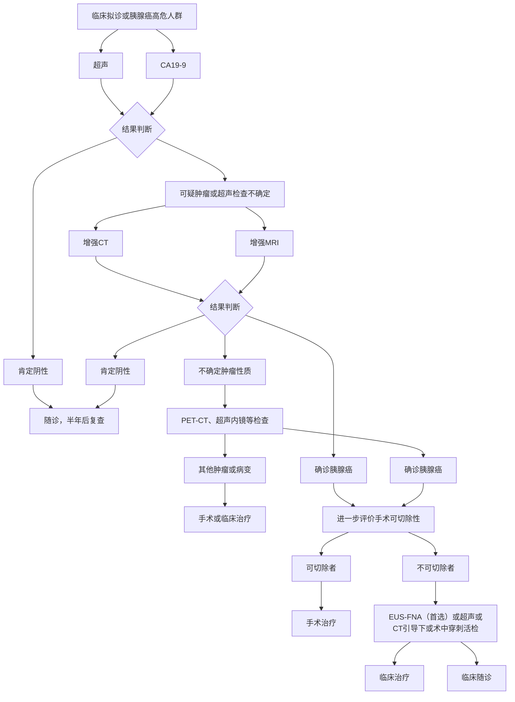
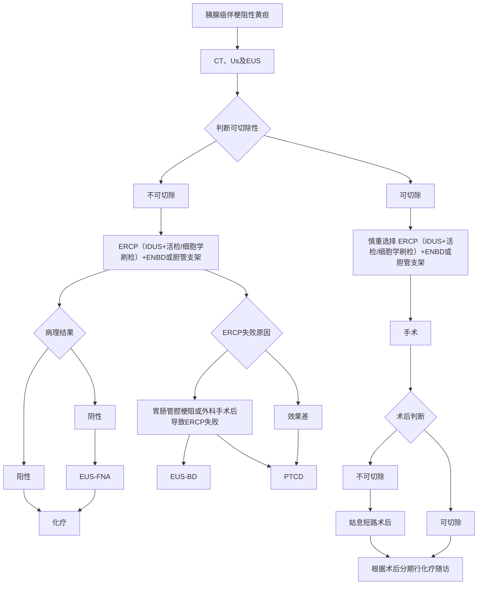
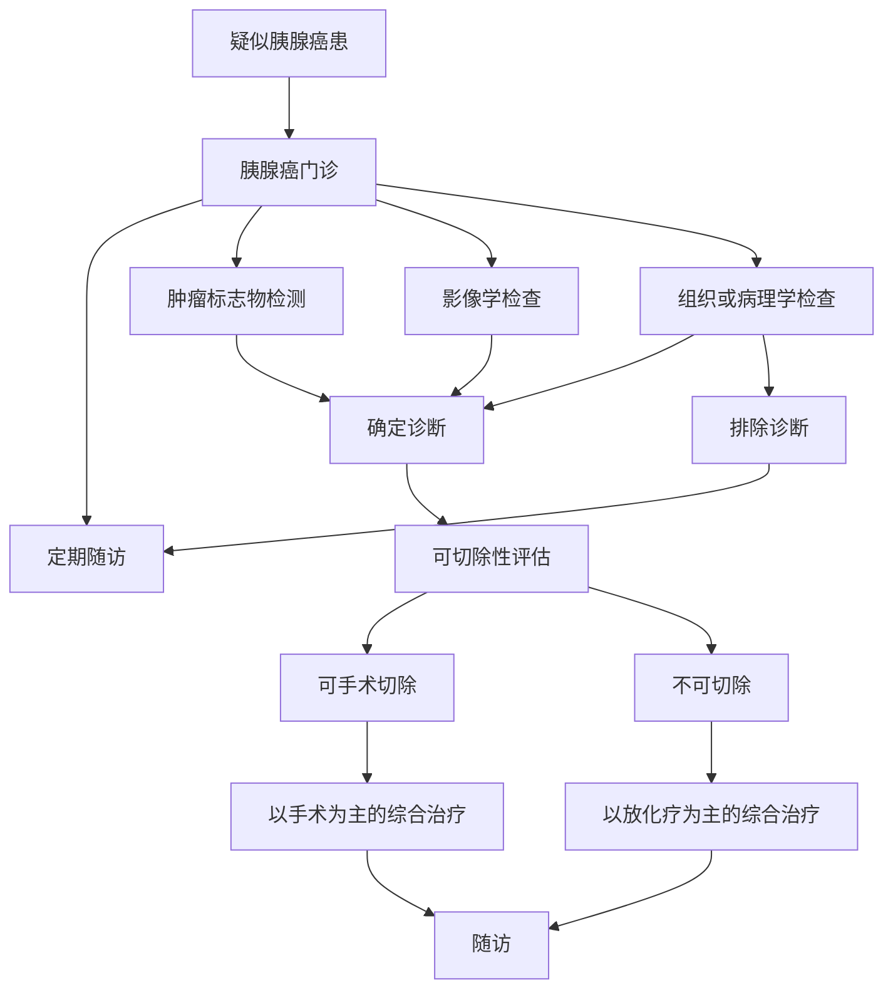

# 胰腺癌诊疗指南（2022年版）

## 一、概述

近年来，胰腺癌的发病率在国内外均呈明显的上升趋势。2021年统计数据显示，在美国所有恶性肿瘤中，胰腺癌新发病例男性位列第10位，女性第9位，占恶性肿瘤相关死亡率的第4位。中国国家癌症中心2021年统计数据显示，胰腺癌位居我国男性恶性肿瘤发病率的第7位，女性第11位，占恶性肿瘤相关死亡率的第6位。（本文所述胰腺癌均特指胰腺导管腺癌）

近年来，随着影像、内镜、病理等学科的发展，胰腺癌诊断水平有所提高；外科手术新理念和新技术（如腹腔镜技术、机器人等）的发展，局部治疗手段（如立体定向放射治疗、纳米刀消融治疗、粒子源植入等）以及抗肿瘤药物（如吉西他滨、纳米白蛋白紫杉醇、替吉奥、卡培他滨、伊立替康、奥沙利铂、尼妥珠单抗等）的应用等，为胰腺癌的治疗带来了机遇和进步。

为进一步规范我国胰腺癌诊疗行为，提高医疗机构胰腺癌诊疗水平，改善胰腺癌患者预后，保障医疗质量和医疗安全，特制定本指南。虽然该指南旨在帮助临床决策，但它不能纳入所有可能的临床变化。本指南仅适用于胰腺导管上皮来源的恶性肿瘤。

## 二、诊断技术与应用

### （一）高危因素

胰腺癌的病因尚未完全明确，流行病学调查显示胰腺癌发病与多种危险因素有关。非遗传性危险因素：长期吸烟，高龄，高脂饮食，体重指数超标、慢性胰腺炎或伴发糖尿病等是胰腺癌可能的非遗传性危险因素。遗传性危险因素：家族遗传也是胰腺癌的高危因素，大约 \(10\%\) 胰腺癌病例具有家族遗传性。患有遗传性胰腺炎、波伊茨-耶格综合征、家族性恶性黑色素瘤及其他遗传性肿瘤疾病的患者，胰腺癌的风险显著增加。目前这些遗传易感性的遗传基础尚未清楚，多达 \(80\%\) 的胰腺癌患者没有已知的遗传原因。CDKN2A、BRCA1/2、PALB2等基因突变被证实与家族性胰腺癌发病密切相关。

### （二）临床表现

胰腺癌恶性程度较高，进展迅速，但起病隐匿，早期症状不典型，临床就诊时大部分患者已属于中晚期。首发症状往往取决于肿瘤的部位和范围，如胰头癌早期便可出现梗阻性黄疸；而早期胰体尾部肿瘤一般无黄疸。主要临床表现包括：

1. 腹部不适或腹痛：是常见的首发症状。多数胰腺癌患者仅表现为上腹部不适或隐痛、钝痛和胀痛等。易与胃肠和肝胆疾病的症状混淆。若还存在胰液出口的梗阻，进食后可出现疼痛或不运加重。中晚期肿瘤侵及腹腔神经丛可导致持续性剧烈腹痛。
2. 消瘦和乏力： \(80\% \sim 90\%\) 胰腺癌患者在疾病初期即有消瘦、乏力、体重减轻，与缺乏食欲、焦虑和肿瘤消耗等有关。
3. 消化道症状：当肿瘤阻塞胆总管下端和胰腺导管时，胆汁和胰液体不能进入十二指肠，常出现消化不良症状。胰腺外分泌功能损害可能导致腹泻。晚期胰腺癌侵及十二指肠，可导致消化道梗阻或出血。
4. 黄疸：与胆道出口梗阻有关，是胰头痛最主要的临床表现，可伴有皮肤瘙痒、深茶色尿和陶土样便。
5. 其他症状：部分患者可伴有持续或间歇低热，且一般无胆道感染。部分患者还可出现血糖异常。

### （三）体格检查

胰腺癌早期无明显体征，随着疾病进展，可出现消瘦、上腹压痛和黄疸等体征。

1. 消瘦：晚期患者常出现恶病质。
2. 黄疸：多见于胰头痛，由于胆道出口梗阻导致胆汁淤积而出现。
3. 肝脏肿大：为胆汁淤积或肝脏转移的结果，肝脏质硬、大多无痛，表面光滑或结节感。
4. 胆囊肿大：部分患者可触及囊性、无压痛、光滑且可推动的胆囊，称为库瓦西耶征，是壶腹周围癌的特征。
5. 腹部肿块：晚期可触及腹部肿块，多位于上腹部，位置深，呈结节状，质地硬，不活动。
6. 其他体征：晚期胰腺癌可出现锁骨上淋巴结肿大、腹水等体征。脐周肿物，或可触及的直肠-阴道或直肠-膀胱后壁结节。

### （四）影像检查

影像检查是获得初步诊断和准确分期的重要工具，科学合理使用各种影像检查方法，对规范化诊治具有重要作用。根据病情，选择恰当的影像学技术是诊断胰腺占位病变的前提。影像学检查应遵循完整（显示整个胰腺）、精细（层厚1~2mm的薄层扫描）、动态（动态增强、定期随访）、立体（多轴面重建，全面了解毗邻关系）的基本原则。治疗前和治疗后的影像检查流程请见附件1和附件2。

1. 超声检查：超声检查因简便易行、灵活直观、无创无辐射、可多轴面观察等特点，是胰腺癌诊断的初筛检查方法。常规超声可以较好地显示胰腺内部结构，观察胆道有无梗阻及梗阻部位，并寻找梗阻原因。彩色多普勒超声可以帮助判断肿瘤对周围大血管有无压迫、侵犯等。实时超声造影技术可以揭示肿瘤的血流动力学改变，帮助鉴别和诊断不同性质的肿瘤，凭借实时显像和多切面显像的灵活特性，在评价肿瘤微血管灌注和引导介入治疗方面具有优势。超声检查的局限性包括视野较小，受胃肠道内气体、患者体型等因素影响，有时难以完整观察胰腺，尤其是胰尾部。

2. CT检查：具有较好的空间和时间分辨率，是目前检查胰腺最佳的无创性影像检查方法，主要用于胰腺癌的诊断、鉴别诊断和分期。平扫可显示病灶的大小、部位，但不能准确定性诊断胰腺病变，对肿瘤与周围结构关系的显示能力较差。三期增强扫描能够较好地显示胰腺肿物的大小、部位、形态、内部结构及与周围结构的关系，并能够准确判断有无肝转移及显示肿大淋巴结。

3. MRI及磁共振胰胆管成像检查：不作为诊断胰腺癌的首选方法，随着MR扫描技术的改进，时间分辨率及空间分辨率的提高，大大改善了MR的图像质量，提高了MRI诊断的准确度，在显示胰腺肿瘤、判断血管受侵、准确的临床分期等方面均显示出越来越高的价值，同时MRI具备具有多参数、多平面成像、无辐射的特点，胰腺病变鉴别诊断困难时，可作为CT增强扫描的有益补充；当患者对CT增强对比剂过敏时，可采用MR代替CT扫描进行诊断和临床分期；磁共振胰胆管成像及多期增强扫描的应用，在胰腺癌的定性诊断及鉴别诊断方面更具优势，有报道MRI使用特定组织的对比剂可诊断隐匿性胰头癌。MRI还可监测胰腺癌并可预测胰腺癌的复发，血管的侵袭，也可以预测胰腺肿瘤的侵袭性，而胰腺癌组织的侵袭可作为生存预测的指标。磁共振胰胆管成像可以清楚显示胰胆管系统的全貌，帮助判断病变部位，从而有助于壶腹周围肿瘤的检出及鉴别诊断，与内镜逆行胰胆管造影术（ERCP）及经皮穿刺肝胆道成像（PTC）相比，具有无创的优势；另外，MR功能成像可以从微观角度定量反映肿瘤代谢信息，包括弥散加权成像、灌注加权成像及波谱成像，需与 MR 常规序列紧密结合才能在胰腺癌的诊断、鉴别诊断及疗效观察中中发挥更大作用。

4. 正电子发射计算机体层显像（PET/CT）/和 PET-MRI: 显示肿瘤的代谢活性和代谢负荷，在发现胰外转移，评价全身肿瘤负荷方面具有明显优势。临床实践过程中：①不推荐作为胰腺癌诊断的常规检查方法，但它可以作为 CT 和（或）MRI 的补充手段检查不能明确诊断的病灶，有助于区分肿瘤的良恶性，然而其对于诊断小胰腺癌作用有限。②PET/CT 检查在排除及检测远处转移病灶方面具有优势，对于原发病灶较大、疑有区域淋巴结转移及糖类抗原 19-9（CA19-9）显著升高的患者，推荐应用。③在胰腺癌治疗后随访中，鉴别术后、放疗后改变与局部肿瘤复发，对 CA19-9 升高而常规影像学方法检查结果阴性时，PET/CT 有助于复发转移病灶的诊断和定位。④对不能手术而行放化疗的患者可以通过葡萄糖代谢的变化早期监测疗效，为临床及时更改治疗方案以及采取更为积极的治疗方法提供依据。

5. 超声内镜（EUS）：在内镜技术的基础上结合了超声成像，提高了胰腺癌诊断的敏感度和特异度；特别是超声内镜引导下细针穿刺活检（EUS-FNA），成为目前胰腺癌定位和定性诊断最准确的方法。另外，EUS 也有助于肿瘤分期的判断。近年来，基于 EUS 弹力成像的肿瘤弹性应变率检测可辅助判断胰腺癌间质含量，指导临床药物的选择。EUS 为有创操作，其准确性受操作者技术水平及经验的影响较大，临床更多是以其引导下穿刺获取组织标本为目的，对于诊断及手术适应证明确的病人，术前无需常规行 EUS。

6. ERCP 在胰腺癌诊断中的作用：胰腺癌最常见的 ERCP 表现是主胰管近端狭窄与远端扩张。ERCP 并不能直接显示肿瘤病变，其主要依靠胰管的改变及胆总管的形态变化对胰腺癌做出诊断，对胆道下端和胰管阻塞或有异常改变者有较大价值。另外，可以进行胰胆管内细胞刷检或钳夹活检组织，然后行胰液及胆汁相关脱落细胞学检查或病理学诊断。尤其对于无法手术的梗阻性黄疸患者，可以一次完成减黄操作及病理与细胞学检测。

7. 骨扫描：探测恶性肿瘤骨转移病变方面应用最广、经验丰富、性价比高，且具有较高的灵敏度。对高度怀疑骨转移的胰腺癌患者可以常规行术前骨扫描检查。

### （五）血液免疫生化检查

1. 血液生化检查：早期无特异性血生化改变，肿瘤累及肝脏、阻塞胆管时可引起相应的生化指标，如谷丙转氨酶、谷草转氨酶、胆汁酸、胆红素等升高。肿瘤晚期，伴随恶液质，可出现电解质紊乱以及低蛋白血症。另外，血糖变化也与胰腺癌发病或进展有关，需注意患者的血糖变化情况。

2. 血液肿瘤标志物检测：临床上常用的与胰腺癌诊断相关肿瘤标志物有 CA19-9、癌胚抗原（CEA）、糖类抗原 125（CA125）等，其中 CA19-9 是胰腺癌中应用价值最高的肿瘤标志物，可用于辅助诊断、疗效监测和复发监测。血清 CA19-9>37U/ml 为阳性指标，重复检测通常优于单次检测，而重复测定应至少相隔 14 天。未经治疗的胰腺导管癌患者 CA19-9 可表现为逐步升高，可高达 1000U/ml，敏感度与肿瘤分期、大小及位置有关，特异度 \(72\% \sim 90\%\) 。但需要指出的是约 \(10\%\) 的胰腺癌患者为 Lewis 抗原阴性血型结构，不表达 CA19-9，故此类胰腺癌患者检测不到 CA19-9 水平的异常，需结合其他肿瘤标记物，如 CEA、CA125 协助诊断。而且，CA19-9 在胆道感染（胆管炎）、炎症或胆道梗阻（无论病因为何）的病例中可能出现假阳性，无法提示肿瘤或晚期病变。因此 CA19-9 水平的术前检测最好在胆道减压完成和胆红素水平恢复正常后进行。CA19-9 测定值通常与临床病程有较好的相关性，外科根治术（I 期）后 2~4 周内，升高的 CA19-9 可恢复正常水平；肿瘤复发、转移时，CA19-9 可再次升高。血清 CA19-9 水平也可在一定程度上反映肿瘤负荷或存在微转移灶可能。胰腺癌术后血清 CA19-9 水平升高虽可提示复发或转移，但需要结合影像学证据等综合判断。

### （六）组织病理学和细胞学诊断

组织病理学或细胞学检查可确定胰腺癌诊断。通过术前或术中细胞学穿刺，活检，或转至有相应条件的上级医院行组织学穿刺活检获得明确诊断。手术标本包括胰十二指肠切除标本和胰体尾（+脾脏）切除标本。

#### 1. 胰腺癌的细胞病理诊断

胰腺癌的细胞病理诊断指南由标本的取材技术、制片技术和诊断报告等部分组成。

细胞标本的取材技术：常用胰腺细胞标本的取材技术有四种： ①影像（CT或超声）引导下的经皮细针穿刺活检（FNA）； ②EUS-FNA； ③剖腹术中的FNA； ④ERCP术中胰管和末端胆总管的细胞刷检。

细胞标本的制片技术：细胞标本的制片技术包括常规涂片、液基制片和细胞块切片。常规涂片是最常用的制片方法，FNA或刷出后的细胞直接涂在玻片上，潮干， \(95\%\) 酒精固定。如果FNA穿刺物为囊性液体，液基制片的方法会使囊液中的细胞富集，从而获得一张较常规涂片细胞量更为丰富的涂片。细胞块制备的主要目的是行免疫细胞化学检测，另外细胞块切片中可以还原一些小的组织结构，有助于形态学诊断。

各单位可视自身情况和病灶性质而选择不同的制片方法，3种制片方法同时采用有助于提高诊断的准确度。有条件的单位还可开展细胞标本的现场评估，以提高取材的满意率。

细胞病理学诊断报告：细胞病理学诊断报告采用美国细胞病理学会推荐的6级报告系统，在此报告系统中，细胞学诊断分为6个诊断级别：I级，不能诊断；II级，未见恶性；Ⅲ级，非典型；Ⅳ级 A，肿瘤性病变，良性；Ⅳ级 B，肿瘤性病变，其他；Ⅴ级，可疑恶性；Ⅵ级，恶性。其中最具挑战性的诊断分级是“肿瘤性病变，其他（Ⅳ B）”，该级诊断中的导管内乳头状黏液性肿瘤和黏液性囊性肿瘤囊壁被覆细胞可以呈轻、中度甚至是重度非典型性，呈重度非典型改变的细胞很难与腺癌细胞相鉴别。另外，一些小圆形细胞构成的肿瘤，如实性-假乳头状瘤、神经内分泌肿瘤、腺泡细胞癌的诊断往往需要借助细胞块免疫细胞化学检测。细胞学分级标准见附件 3。

#### 2. 胰腺癌的组织病理学诊断

（1）胰腺癌病理学诊断标准：胰腺占位病灶或者转移灶活检或手术切除组织标本，经病理组织学和（或）细胞学检查诊断为胰腺癌。病理诊断须与临床证据相结合，全面了解患者的临床表现以及影像学检查等信息。

（2）胰腺癌病理诊断指南：胰腺癌病理诊断指南由标本处理、标本取材、病理检查和病理报告等部分组成。

   1）标本处理要点

   ① 手术医师应在病理申请单上标注送检标本的部位、种类和数量，对手术切缘和重要病变可用染料染色或缝线加以标记。

   ② 尽可能将肿瘤标本在离体 30 分钟以内完整送达病理科切开固定。

   ③ 10% 中性甲醛溶液固定 12~24 小时。

   2）标本取材及检查

   ① 胰十二指肠切除标本：用探针经十二指肠乳头至胆总管打开，垂直胆总管切开肿瘤，观察肿瘤与胆总管、十二指肠壁的关系。胃切缘、幽门、小肠切缘、胰腺切缘、胆总管切缘各取一块；肿瘤主体（包括浸润最深处，与周围组织或器官的关系），根据肿瘤大小，至少每1cm取1块；大体各个切面颜色、质地不同区域也要取材。

   ② 胰体尾+脾脏切除标本：肿瘤主体书页状切开，根据肿瘤大小，至少每1cm取1块，包括胰腺被膜、胰腺导管、胰腺切缘、周围胰腺、与脾脏的关系等。淋巴结全部取材包括胰腺周围淋巴结及脾门淋巴结。多个肿瘤需取肿瘤之间的胰腺组织。

#### 3. 免疫组化检查

常用标志物有Vimentin，CK，EMA，CEA，CA19-9，CK19，CK7，CK20，MUC1，MUC4，CDX2，PR，CD10，syn，CgA，CD56，ACT，AAT，β-cantenin，Ki-67等。需要合理组合使用免疫组化标志物，对胰腺内分泌肿瘤以及各种类型的胰腺肿瘤进行鉴别诊断。

#### 4. 胰腺癌病理诊断报告

由大体标本描述、显微镜下描述、免疫组化检查结果、病理诊断名称，浸润范围（重点关注与胆总管、十二指肠及脾脏的关系，如果涉及门静脉切缘，需要回报门静脉切缘是否受累）、有无脉管瘤栓及神经浸润，胰腺被膜情况，淋巴结有无转移、TNM分期等部分组成。大体描述要求，详细要求见附件4和附件5。此外，还可附有与药物靶点检测、生物学行为评估以及预后判断等相关的分子病理学检查结果，提供临床参考。

### （七）胰腺癌的鉴别诊断

1. 慢性胰腺炎：慢性胰腺炎是一种反复发作的渐进性的广泛胰腺纤维化病变，导致胰管狭窄阻塞，胰液排出受阻，胰管扩张。主要表现为腹部疼痛，恶心，呕吐以及发热。与胰腺癌一样可有上腹不适、消化不良、腹泻、食欲不振、体重下降等临床表现，二者鉴别如下：

   （1）慢性胰腺炎发病缓慢，病史长，常反复发作，急性发作可出现血尿、淀粉酶升高，且极少出现黄疸症状。

   （2）腹部CT检查可见胰腺轮廓不规整，结节样隆起，胰腺实质密度不均。

   （3）慢性胰腺炎患者腹部平片和CT检查胰腺部位的钙化点有助于诊断。

   （4）血清IgG4的升高是诊断慢性胰腺炎的特殊类型——自身免疫性胰腺炎较敏感和特异的实验室指标，影像学检查难以鉴别时需要病理检查协助鉴别。

2. 壶腹癌：壶腹癌发生在胆总管与胰管交汇处。黄疸是最常见症状，肿瘤发生早期即可以出现黄疸。鉴别如下：

   （1）因肿瘤坏死脱落，胆道梗阻缓解，可出现间断性黄疸。

   （2）十二指肠低张造影可显示十二指肠乳头部充盈缺损、黏膜破坏双边征。

   （3）超声、CT、MRI、ERCP等检查可显示胰管和胆管扩张，胆道梗阻部位较低，双管征，壶腹部位占位病变。

   （4）超声内镜检查：超声内镜作为一种新的诊断技术，在鉴别胰腺癌和壶腹痛有独到之处，能发现较小的病变并且能观察到病变浸润的深度、范围、周围肿大淋巴结等。

3. 胰腺囊腺瘤与囊腺癌：胰腺囊性肿瘤临床少见，多发生于女性患者。影像检查是将其与胰腺癌鉴别的重要手段，肿瘤标记物CA19-9无升高。超声、CT、EUS可显示胰腺内囊性病变、囊腔规则，而胰腺癌只有中心坏死时才出现囊变且囊腔不规则。

4. 胆总管结石：胆总管结石往往反复发作，病史较长，黄疸水平波动较大，发作时多伴有腹痛、寒战发热、黄疸三联征，多数不难鉴别。

5. 胰腺其他占位性病变：主要包括胰腺假性囊肿、胰岛素瘤、实性假乳头状瘤等，临床上肿物生长一般较缓慢，病程较长，同时可有特定的临床表现：如胰岛素瘤可表现发作性低血糖症状，胰腺假性囊肿患者多有急性胰腺炎病史，结合CT等影像学检查一般不难鉴别，必要时可通过穿刺活检及病理检查协助诊断。

## 三、胰腺癌的分类和分期

### （一）胰腺癌的组织学类型

参照2019版WHO胰腺癌组织学分类（附件6）。

### （二）胰腺癌的分期（AJCC，第8版）

1. 胰腺癌TNM分期中T、N、M的定义。

   （1）原发肿瘤（pT）

   - pTx：不能评估。
   - pT0：无原发肿瘤证据。
   - pTis：原位癌，包括胰腺高级别胰腺上皮内肿瘤（PanIN3）、导管内乳头状黏液性肿瘤伴高级别上皮内瘤变、导管内管状乳头状肿瘤伴高级别上皮内瘤变以及黏液性囊性肿瘤伴高级别上皮内瘤变。
   - pT1：肿瘤最大径 \(\leq 2\mathrm{cm}\) 。
     - pT1a：肿瘤最大径 \(\leq 0.5\mathrm{cm}\) 。
     - pT1b：肿瘤最大径 \(\leq 1\mathrm{cm}\) ， \(>0.5\mathrm{cm}\) 。
     - pT1c：肿瘤最大径 \(1\sim 2\mathrm{cm}\) 。
   - pT2：肿瘤最大径 \(>2\mathrm{cm}\) ， \(\leq 4\mathrm{cm}\) 。
   - pT3：肿瘤最大径 \(>4\mathrm{cm}\) 。
   - pT4：任何大小肿瘤，累及腹腔干、肠系膜上动脉或肝总动脉。

   （2）区域淋巴结（pN）

   - pNx：无法评估。
   - pN0：无区域淋巴结转移。
   - pN1： \(1\sim 3\) 个区域淋巴结转移。
   - pN2： \(\geq 4\) 个区域淋巴结转移。

   （3）远处转移（pM）

   - pMx：无法评估。
   - pM0：无远处转移。
   - pM1：有远处转移。

2. 胰腺癌TNM分期（表1）

| 分期 | T    | N    | M    |
| :--- | :--- | :--- | :--- |
| 0    | Tis  | N0   | M0   |
| IA   | T1   | N0   | M0   |
| IB   | T2   | N0   | M0   |
| IIA  | T3   | N0   | M0   |
| IIB  | T1   | N1   | M0   |
| IIB  | T2   | N1   | M0   |
| IIB  | T3   | N1   | M0   |
| III  | T1   | N2   | M0   |
| III  | T2   | N2   | M0   |
| III  | T3   | N2   | M0   |
| III  | T4   | anyN | M0   |
| IV   | anyT | anyN | M1   |

## 四、治疗

### （一）治疗原则

多学科综合诊治是任何分期胰腺癌治疗的基础，可采用多学科会诊的模式，根据不同患者身体状况、肿瘤部位、侵及范围、临床症状，有计划、合理地应用现有的诊疗手段，以求最大幅度地根治、控制肿瘤，减少并发症和改善患者生活质量。胰腺癌的治疗主要包括手术治疗、放射治疗、化学治疗、介入治疗和最佳支持治疗等。对拟行放、化疗的患者，应作 Karnofsky（附件7）或ECOG评分（附件8）。

### （二）外科治疗

1. 手术治疗原则

   手术切除是胰腺癌患者获得治愈机会和长期生存的唯一有效方法。然而，超过 \(80\%\) 的胰腺癌患者因病期较晚而失去手术机会。外科手术应尽力实施根治性切除（R0）。外科切缘采用 \(1\mathrm{mm}\) 原则判断R0/R1切除标准，即距离切缘 \(1\mathrm{mm}\) 以上无肿瘤为R0切除，否则为R1切除。在对患者进行治疗前，应完成必要的影像学检查及全身情况评估，多学科会诊应包括影像诊断科、病理科、化疗科、放疗科等。

   外科治疗前对肿瘤情况进行评估具有重要临床意义。术前依据影像学检查结果将肿瘤分为可切除、可能切除和不可切除三类而制定具体治疗方案。判断依据肿瘤有无远处转移，肠系膜上静脉或门静脉是否受侵；腹腔干、肝动脉、肠系膜上动脉周围脂肪间隙是否存在肿瘤等，详细内容参见附件9。规范的外科治疗是获得良好预后的最佳途径，应遵循如下原则。

   （1）无瘤原则: 包括肿瘤不接触原则、肿瘤整块切除原则和肿瘤供应血管的阻断等。

   （2）足够的切除范围:
   ①标准的胰十二指肠切除术: 胰十二指肠切除术的范围包括远端胃的 \(1/3 \sim 1/2\) 、胆总管全段和胆囊、胰头切缘在肠系膜上静脉左侧/距肿瘤 \(3\mathrm{cm}\) 、十二指肠全部、近段 \(15\mathrm{cm}\) 的空肠；充分切除胰腺前方的筋膜和胰腺后方的软组织。钩突部与局部淋巴液回流区域的组织、区域内的神经丛。大血管周围的疏松结缔组织等。
   ②标准的远侧胰腺切除术: 范围包括胰腺体尾部，脾及脾动静脉，淋巴清扫，可包括左侧肾筋膜，可包括部分结肠系膜，但不包括结肠切除。
   ③标准的全胰腺切除术: 范围包括胰头部、颈部及体尾部，十二指肠及第一段空肠，胆囊及胆总管，脾及脾动静脉，淋巴清扫，可包括胃窦及幽门，可包括肾筋膜，可包括部分结肠系膜，但不包括结肠切除。

   （3）安全的切缘: 胰头癌行胰十二指肠切除需注意 6 个切缘，包括胰腺 (胰颈)、胆总管 (肝总管)、胃、十二指肠、腹膜后 (是指肠系膜上动静脉的骨骼化清扫)、其他的软组织切缘 (如胰后) 等，其中胰腺的切缘要大于 \(1\mathrm{mm}\) (镜下未见肿瘤残留)，为保证足够的切缘可于手术中对切缘行冰冻病理检查。

   （4）淋巴结清扫: 在标准的淋巴结清扫范围下，应获取 15 枚以上的淋巴结。新辅助治疗后的患者，获取淋巴结数目可少于 15 枚。是否进行扩大的淋巴结清扫目前仍有争议，因此不建议常规进行扩大的腹膜后淋巴结清扫。标准的胰腺癌根治术应进行的淋巴结清扫范围如下。

   ① 胰头癌行胰十二指肠切除术标准的淋巴结清扫范围：幽门上及下淋巴结（No.5，6），肝总动脉前方淋巴结（No.8a），肝十二指肠韧带淋巴结（肝总管、胆总管及胆囊淋巴结，No.12b1，12b2，12c），胰十二指肠背侧上缘及下缘淋巴结（No.13a，13b），肠系膜上动脉右侧淋巴结（No.14a,14b），胰十二指肠腹侧上缘及下缘淋巴结（No.17a,17b）。

   ② 胰体尾癌切除术标准的淋巴清扫范围：脾门淋巴结（No.10），脾动脉周围淋巴结（No.11），胰腺下缘淋巴结（No.18），上述淋巴结与标本整块切除。对于病灶位于胰体部者，可清扫腹腔干周围淋巴结（No.9）加部分肠系膜上动脉（No.14）+腹主动脉周围淋巴结（No.16）。

2. 术前减黄

   （1）术前减黄的主要目的是缓解胆道梗阻、减轻胆管炎等症状，同时改善肝脏功能，纠正凝血异常，降低手术死亡率。但不推荐术前常规行胆道引流。

   （2）对症状严重，伴有发热，败血症，化脓性胆管炎患者可行术前减黄处理。

   （3）减黄可通过经鼻胆管引流或经皮肝穿刺胆道引流（PTCD）完成，无条件的医院可行胆囊造瘘。

   （4）一般于减黄术2周以后，胆红素下降至初始数值一半以下、肝功能恢复、体温血象正常时可施行手术。

3. 根治性手术切除指证

   （1）年龄 \(< 80\) 岁，全身状况良好、多学科评估心/肺/肝/肾功能可以耐受手术。

   （2）临床分期为II期以下的胰腺癌。

   （3）无肝脏转移，无腹水。

   （4）术中探查肿物局限于胰腺内，未侵犯肠系膜门静脉和肠系膜上静脉等重要血管。

   （5）无远处播散和转移。

4. 手术方式

   （1）肿瘤位于胰头、胰颈部可行胰十二指肠切除术。

   （2）肿瘤位于胰腺体尾部可行胰体尾加脾切除术。

   （3）肿瘤较大，范围包括胰头、颈、体时可行全胰切除术。

   （4）微创根治性胰腺癌根治术在手术安全性、淋巴结清扫数目和RO切除率方面与开腹手术相当，但其“肿瘤学”获益性有待进一步的临床研究证实，推荐在专业的大型胰腺中心由有经验的胰腺外科医师开展。

5. 胰腺切除后残端吻合技术

   胰腺切除后残端处理的目的是防止胰漏，胰肠吻合是常用的吻合方式，胰肠吻合有多种吻合方式，应选择恰当的吻合方式，减少胰漏的发生。

6. 围手术期药物管理。开腹大手术患者，无论其营养状况如何，均推荐手术前使用免疫营养5~7天，并持续到手术后7天或患者经口摄食 \(>60\%\) 需要量时为止。免疫增强型肠内营养应同时包含 \(\omega-3\) 多不饱和脂肪酸、精氨酸和核苷酸3类底物。单独添加上述3类营养物中的任1种或2种，其作用需要进一步研究。首选口服肠内营养支持。

   中度营养不良计划实施大手术患者或重度营养不良患者建议在手术前接受营养治疗1~2周，即使手术延迟也是值得的。预期术后7天以上仍然无法通过正常饮食满足营养需求的患者，以及经口进食不能满足 \(60\%\) 需要量1周以上的患者，应给予术后营养治疗。

7. 并发症的处理及处理原则

   （1）术后出血：术后出血在手术后24小时以内为急性出血，超过24小时为延时出血。主要包括腹腔出血和消化道出血。ISGPS确立了术后出血的临床分期系统，将术后出血分为A期、B期和C期。参见附件14。

   ① 腹腔出血：主要是由于术中止血不彻底、术中低血压状态下出血停止的假象或结扎线脱落、电凝痂脱落所致；凝血机制障碍也是术中出血的原因之一。主要预防的方法是手术中严密止血，关腹前仔细检查，重要血管缝扎，术前纠正凝血功能。出现腹腔出血时应十分重视，少量出血可药物治疗、输血等保守治疗；短时间大量失血，导致失血性休克时，应尽快手术止血。

   ② 消化道出血：应激性溃疡出血，多发生在手术后3天以上。其防治主要是术前纠正患者营养状况，尽量减轻手术和麻醉的打击，治疗以保守治疗为主，应用止血药物，生长抑素、质子泵抑制剂等药物治疗，留置胃肠减压装置，经胃管注入 \(8\mathrm{mg/dl}\) 冰正肾上腺素盐水，还可经胃镜止血，血管造影栓塞。如经保守无效者，可手术治疗。

   （2）胰瘘：根据2016年版ISGPS标准，胰瘘的诊断需满足以下条件：术后第三天或以后引流液的淀粉酶数值达正常上限的3倍以上，同时产生了一定的临床影响，需积极临床治疗。原2005版的A级胰瘘变更为生化瘘，非术后胰瘘，与临床进程无关。B级胰瘘的诊断需要和临床相关并影响术后进程，包括：持续引流3周以上；出现临床相关胰瘘治疗措施的改变；使用经皮或内镜穿刺引流；采取针对出血的血管造影介入治疗；发生除器官衰竭外的感染征象。一旦由于胰瘘感染等原因发生单个或者多个器官功能障碍，胰瘘分级由B级调整为C级。胰瘘的处理包括适当禁食，有效且充分引流，控制感染，营养支持，抑酸、抑酶等。如出现腹腔出血可考虑介入栓塞止血。手术治疗主要适于引流不畅、伴有严重腹腔感染或发生大出血的胰瘘患者。

   （3）胃排空障碍

   ① 胃排空障碍目前尚无统一的标准，常用的诊断标准为经检查证实胃流出道无梗阻；胃液 \(>800\mathrm{ml/d}\) ，超过10天；无明显水电解质及酸碱平衡异常；无导致胃轻瘫的基础疾病；未使用影响平滑肌收缩药物。

   ② 诊断主要根据病史、症状、体征、消化道造影、胃镜等检查。

   ③ 胃排空障碍的治疗主要是充分胃肠减压，加强营养心理治疗或心理暗示治疗；应用胃肠道动力药物；治疗基础疾患和营养代谢的紊乱。传统中医药治疗对促进胃肠道功能恢复，缩短胃排空恢复时间具有良好效果。

   （4）其他并发症还有腹腔感染、胆瘘、乳糜漏以及术后远期并发症等。

8. 肿瘤可能切除者的外科治疗

   肿瘤可能切除的患者获得RO切除率较低，最佳治疗策略一直存在争议。目前提倡新辅助治疗先行的治疗模式，即多学科讨论有可能获益患者考虑新辅助治疗（化疗，或者放化疗，或者诱导化疗后同期放化疗等），评估达到肿瘤降期，再行手术治疗。对于新辅助治疗后序贯肿瘤切除的患者，联合静脉切除如能达到RO根治，则患者的生存获益与可切除患者相当。联合动脉切除对患者预后的改善存在争论，尚需前瞻性大样本的数据评价。鉴于目前缺乏足够的高级别的循证医学依据，对临界可切除胰腺癌患者推荐参加临床研究。如患者本人要求，亦可直接进行手术探查。不推荐这部分患者行姑息性R2切除，特殊情况如止血挽救生命除外。

9. 局部晚期不可切除胰腺癌的外科治疗

   对于此部分患者，积极治疗仍有可能获得较好的治疗效果。对暂未出现十二指肠梗阻但预期生存期≥3个月的患者，若有临床适应证，可做预防性胃空肠吻合术；肿瘤无法切除但合并胆道梗阻患者，或预期可能出现胆道梗阻的患者，可考虑进行胆总管/肝总管空肠吻合术；十二指肠梗阻患者，如预期生存期 \(\geq 3\) 个月，可行胃空肠吻合术。术中可采用术中放疗、不可逆电穿孔治疗（纳米刀消融）等方式对肿瘤进行局部治疗，达到增加局部控制率，缓解疼痛的作用。术后需联合化疗 \(\pm\) 放疗。

### （三）内科治疗

胰腺癌内科药物治疗可应用于各个期别的患者，包括可切除和临界可切除患者的术前新辅助/转化治疗、根治术后患者的辅助治疗、以及局部晚期或转移复发患者的治疗。内科药物治疗不仅可以延长患者的生存时间，同时可减轻晚期患者的疼痛、提高生存质量。根据患者病情及体力状况评分适时地进行药物及剂量的调整。重视改善患者生活质量及合并症处理，包括疼痛、营养、精神心理等。推荐内科药物治疗前对局部晚期和转移性胰腺癌进行基因检测，包括但不限于BRCA1/2、NTRK1/2/3、PALB2、ATM/ATR和RAS等，有助于指导最佳药物治疗方案并参与新药的临床研究。对晚期转移性胰腺癌标准治疗失败的患者，可考虑在有资质的基因检测机构行高通量测序来寻找适合参与的临床研究或药物治疗。

1. 可切除或临界可切除胰腺癌的新辅助/转化治疗

   可切除或临界可切除患者的新辅助/转化治疗的目的是提高手术R0切除率，从而延长患者无病生存期和总生存期。

2. 可切除胰腺癌的术后辅助治疗

   根治术后的胰腺癌患者如无禁忌证，均应行辅助化疗。辅助化疗方案推荐以吉西他滨或氟尿嘧啶类药物（5-FU、卡培他滨或替吉奥）为基础的治疗；体能状态良好的病人，建议联合化疗，包括吉西他滨+卡培他滨、mFOLFIRINOX等。常用方案见表3。体能状态较差的患者，建议给予吉西他滨或氟尿嘧啶类单药，并予以最佳支持治疗。辅助化疗起始时间尽可能控制在术后12周内，持续时间为6个月。

**表3 可切除胰腺癌的术后辅助治疗方案**

| 方案                                       | 具体用药                                                                                                                                        |
| :----------------------------------------- | :---------------------------------------------------------------------------------------------------------------------------------------------- |
| mFOLFIRINOX（仅用于ECOG PS评分0～1的患者） | 奥沙利铂85mg/m²静脉滴注第1日 伊立替康150mg/m²静脉滴注第1日 亚叶酸钙400mg/m²静脉滴注第1日 之后5-FU 2400mg/m²持续输注46小时 每2周重复 |
| 吉西他滨+卡培他滨                          | 吉西他滨1000mg/m²静脉滴注第1、8日 卡培他滨1660mg/(m²·d)分2次口服第1～14日 每3周重复                                                       |
| 吉西他滨                                   | 吉西他滨1000mg/m²静脉滴注第1、8日 每3周重复                                                                                                  |
| 替吉奥                                     | 替吉奥80～120mg/d分2次口服第1～14日 每3周重复                                                                                                |
| 卡培他滨                                   | 卡培他滨2000mg/(m²·d)分2次口服第1～14日 每3周重复                                                                                            |

3. 不可切除的局部晚期或转移性胰腺癌

   不可切除的局部晚期或转移性胰腺癌的常用化疗药物包括：吉西他滨、白蛋白结合型紫杉醇、5-FU/LV、顺铂、奥沙利铂、伊立替康、替吉奥、卡培他滨。靶向药物包括厄洛替尼。

   依据患者体能状态选择一线化疗方案（见表4）。对于一般状况好的患者建议联合化疗。常用含吉西他滨的两药联合方案，包括GN（吉西他滨/白蛋白结合型紫杉醇）、GP（吉西他滨/顺铂）、GX（吉西他滨/卡培他滨）、GS（吉西他滨/替吉奥）等。ECOG PS评分 \(0\sim 1\) 者，可考虑三药联合的FOLFIRINOX或mFOLFIRINOX方案。对于存在BRCA1/2胚系突变的晚期胰腺癌患者可能对铂类药物敏感，可考虑首选含顺铂或奥沙利铂的方案（GP或FOLFIRINOX、mFOLFIRINOX）。其他方案包括FOLFOX（奥沙利铂/5-FU/LV）、CapeOx（奥沙利铂/卡培他滨）、FOLFIRI（伊立替康/5-FU/LV）等常作为二线治疗方案。

   联合化疗有效患者的后续治疗策略包括继续应用之前的有效方案治疗、完全停止治疗、撤去之前联合方案中毒性较大的药物或者换一种新的药物进行维持治疗。对于存在 BRCA1/2 胚系基因突变、经含铂的方案一线治疗 \(\geqslant 16\) 周后未进展的患者，采用多腺苷二磷酸核糖聚合酶抑制剂奥拉帕利单药进行维持治疗。对于体系 BRCA1/2 基因突变或其他同源重组修复通路异常的病人，可参考胚系突变同等处理。如之前采用 GN 方案，则可采用吉西他滨单药维持；如之前采用（m）FOLFIRINOX 方案，可考虑卡培他滨或 5-FU/LV，或 FOLFIRI 方案进行维持治疗（因奥沙利铂的累积神经毒性，不推荐奥沙利铂维持治疗）。

   一线治疗失败的患者，如果身体状态良好，可选择纳米脂质体伊立替康+5-Fu/LV，或可依据一线已使用过的药物、病人合并症和毒副作用等选择非重叠药物作为二线化疗，或参加临床研究。对于有特殊基因变异的晚期胰腺癌（如 NTRK 基因融合、ALK 基因重排、HER2 扩增、微卫星高度不稳定）等，有研究显示其对应的靶向治疗或免疫检查点抑制剂治疗具有一定疗效。首先推荐此类患者参加与其对应的临床研究，也可考虑在有经验的肿瘤内科医生指导下采用特殊靶点靶向药物的治疗或免疫治疗。

   如果体能状态较差，建议行单药治疗或/和最佳支持治疗。一、二线化疗方案失败后的胰腺癌患者是否继续化疗尚存在争议，无明确化疗方案，建议开展临床研究。化疗后疗效评价可采用 WHO 实体瘤疗效评价标准和 RECIST 标准，具体见附件 10 和附件 11。

**表4 不可切除的局部晚期或转移性胰腺癌治疗方案**

| 方案                                                                                               | 具体用药                                                                                                                                                                  |
| :------------------------------------------------------------------------------------------------- | :------------------------------------------------------------------------------------------------------------------------------------------------------------------------ |
| GN:吉西他滨+白蛋白结合型紫杉醇                                                                     | 白蛋白结合型紫杉醇125mg/m²静脉滴注第1、8日 吉西他滨1000mg/m²静脉滴注第1、8日 每3周重复                                                                              |
| GP:吉西他滨+顺铂(特别对于可能存在BRCA1/2或者其他DNA修复基因突变的遗传性肿瘤患者)                   | 吉西他滨1000mg/m²静脉滴注第1、8日 顺铂75mg/m²静脉滴注第1日 每3周重复                                                                                                |
| FOLFIRINOX(仅用于ECOG PS评分0~1的患者)                                                             | 奥沙利铂85mg/m²静脉滴注第1日 伊立替康180mg/m²静脉滴注第1日 LV400mg/m²静脉滴注第1日 5-FU400mg/m²快速静脉注射第1日 之后5-FU2400mg/m²持续输注46小时 每2周重复 |
| mFOLFIRINOX(仅用于ECOG PS评分0~1的患者)                                                            | 奥沙利铂85mg/m²静脉滴注第1日 伊立替康150mg/m²静脉滴注第1日 亚叶酸钙400mg/m²静脉滴注第1日 之后5-FU2400mg/m²持续输注46小时 每2周重复                            |
| 吉西他滨+厄洛替尼                                                                                  | 吉西他滨 \(1000\mathrm{mg}/\mathrm{m}^{2}\) 静脉滴注，第1、8日 厄洛替尼 \(150\mathrm{mg}/\mathrm{d}\) 口服 每3周重复                                                |
| GX：吉西他滨+卡培他滨                                                                              | 吉西他滨 \(1000\mathrm{mg}/\mathrm{m}^{2}\) 静脉滴注第1、8日 卡培他滨 \(1660\mathrm{mg}/(\mathrm{m}^{2}\bullet \mathrm{d})\) 分2次口服第 \(1\sim 14\) 日 每3周重复  |
| GS：吉西他滨+替吉奥                                                                                | 吉西他滨 \(1000\mathrm{mg}/\mathrm{m}^{2}\) 静脉滴注第1、8日 替吉奥 \(80\sim 120\mathrm{mg}/\mathrm{d}\) 分2次口服第 \(1\sim 14\) 日 每3周重复                      |
| 吉西他滨                                                                                           | 吉西他滨 \(1000\mathrm{mg}/\mathrm{m}^{2}\) 静脉滴注第1、8日 每3周重复                                                                                                 |
| 替吉奥                                                                                             | 替吉奥 \(80\sim 120\mathrm{mg}/\mathrm{d}\) 分2次口服第 \(1\sim 14\) 日 每3周重复                                                                                      |
| 奥拉帕利维持治疗（对于BRCA1/2胚系突变，PS评分好，一线含铂方案治疗 \(\geq 16\) 周疾病无进展的患者） | 奥拉帕利 \(300\mathrm{mg}\) 口服，每日2次                                                                                                                                 |
| CapeOx：奥沙利铂+卡培他滨                                                                          | 奥沙利铂 \(130\mathrm{mg}/\mathrm{m}^{2}\) 静脉滴注第1日 卡培他滨 \(2000\mathrm{mg}/(\mathrm{m}^{2}\bullet \mathrm{d})\) 分2次口服第 \(1\sim 14\) 日 每3周重复      |
| 5-FU/LV                                                                                            | LV 400mg/m²静脉滴注 第1日 5-FU 400mg/m²静脉滴注 第1日 之后5-FU 2400mg/m²持续输注 46小时 每2周重复                                                                |
| 纳米脂质体伊立替康+5-FU/LV                                                                         | 纳米脂质体伊立替康 80mg/m²静脉滴注 第1日 LV 400mg/m²,静脉滴注 第1日 5-FU 2400mg/m²,持续输注 46小时 每2周重复                                                     |
| FOLFIRI                                                                                            | 伊立替康 180mg/m²静脉滴注 第1日 LV 400mg/m²,静脉滴注 第1日 5-FU 400mg/m²,静脉滴注 第1日 之后5-FU 2400mg/m²,持续输注 46小时 每2周重复                          |
| 帕博利珠单抗（仅用于微卫星高度不稳定或错配修复缺陷患者）                                           | 帕博利珠单抗 200mg 静脉滴注 第1日 每3周重复                                                                                                                            |

### （四）放射治疗

放射治疗是胰腺癌的重要局部治疗手段之一，贯穿各个分期。可手术切除局限性胰腺癌，如因内科疾病不耐受手术或拒绝手术，推荐精准根治性放射治疗结合同期化疗增敏，是提高这部分患者长期生存的新选择。临界可手术切除患者可直接接受高剂量放疗或联合化疗，根据治疗后疗效决定是否行手术切除。同期放化疗是局部晚期胰腺癌的首选治疗手段。对于寡转移（转移灶数目及器官有限）的胰腺癌患者，可通过同时照射原发灶、转移灶，实现缓解梗阻、压迫或减轻疼痛以及提高肿瘤局部控制的目的。胰腺癌的术后放疗的作用尚存争议，对于胰腺癌术后局部残存或切缘不净者，术后同步放化疗可以弥补手术的不足。调强放疗技术以及基于多线束（X 射线或γ射线）聚焦的立体定向放射治疗（SBRT）技术正越来越多地用于胰腺癌的治疗，放疗剂量模式也逐渐向高剂量、少分次（大分割放疗）方向改变，局部控制率、疼痛缓解率以及生存率都获得了改善和提高，但仍需大型III期临床试验进一步证实。

1. 胰腺癌的放疗指征

   （1）可手术切除胰腺癌

   对于拒绝接受手术治疗或因医学原因不能耐受手术治疗的可手术切除局限期胰腺癌，推荐接受高剂量少分次或SBRT放疗，同时结合新辅助或同期放化疗。SBRT的总剂量和分割剂量尚无明确的标准，目前推荐的分割剂量为每5次25~45Gy或每5次33~40Gy，每次6.6~8.0Gy。

   （2）临界可切除的胰腺癌

   对于临界可切除胰腺癌的放射治疗，目前没有标准模式。可以直接针对肿瘤区行高剂量少分次放疗或SBRT，放疗后行手术提高R0切除率，有利于改善患者生存。新辅助放化疗时，放疗总剂量为 \(45\sim 50.4\mathrm{Gy}\) ，每次 \(1.8\sim 2.0\mathrm{Gy}\) ，每周5次照射，也可使用总剂量36Gy，每次2.4Gy，每周5次照射。推荐可手术切除病例，新辅助放、化疗后4周左右手术；而对于临界可切除病例，手术最佳时间是新辅助放化疗后 \(4\sim\) 8周，以便肿瘤有足够的时间充分缩小后手术。也可以在8周以上接受手术，但放疗所致的纤维化可使手术难度增加。

   （3）局部晚期胰腺癌

   对于局部晚期胰腺癌，推荐接受高剂量少分次调强放射治疗或SBRT同时联合新辅助或同期放、化疗。与常规放疗模式相比，可拥有更好的预后。

   （4）寡转移性胰腺癌

   全身系统治疗疗效好，或进展速度相对慢的转移性胰腺癌患者，原发灶和转移灶均接受高剂量放疗，局部控制率可转化成生存时间延长。

   （5）复发性胰腺癌

   术后或射频治疗等其他局部治疗后复发性胰腺癌患者，因胃肠改道不利于显影及之前的治疗损伤，行放疗较初诊患者风险高。

   （6）术后辅助放疗

   术后辅助放疗尚存争议，目前缺乏高级别的循证医学依据。与单独化疗相比，采用常规放疗模式联合化疗可改善肿瘤局部复发率。放疗总剂量为 \(45\sim 50.4\mathrm{Gy}\) ，分割剂量每次 \(1.8\sim 2\mathrm{Gy}\) ，高复发危险的部位可加量 \(5\sim 9\mathrm{Gy}\) 。

2. 放疗技术

   SBRT 和 IMRT 技术包括容积旋转调强放疗技术及螺旋断层调强放疗等，比三维适形放疗拥有更好的剂量分布适形性和聚焦性，结合靶中靶或靶区内同步加量放疗剂量模式，可在不增加正常组织受照剂量的前提下，提高胰腺肿瘤照射剂量。开展胰腺癌的精准放射治疗，细化到放疗各个环节，提高靶区勾画准确度，减少摆位误差以及呼吸运动等因素干扰至关重要。

3. 放疗靶区

   对于未手术切除的病变，推荐照射胰腺原发灶或复发病灶、转移性淋巴结，不包括区域淋巴结引流区。

   术后放疗的靶区体积应基于手术前 CT 扫描结果或手术置入的银夹来确定，应包括原发肿瘤床和区域高危淋巴结区。

4. 放疗剂量

   提高放疗剂量是提高胰腺癌局控率的关键因素之一，采用剂量模式要根据设备技术决定，可选范围 \(40\sim 70\mathrm{Gy} / 5\sim 20\) 次，生物有效剂量越高局控率越高，前提是要保证避免或降低胃肠放射损伤发生。常规剂量模式总量为 \(45\sim 54\mathrm{Gy}\) ，单次剂量为 \(1.8\sim 2.0\mathrm{Gy}\) 。

5. 同期化疗

   同期化疗方案单药首选采用吉西他滨或氟尿嘧啶类（5-FU 持续静脉滴注，或卡培他滨，或 S-1），或者给予多药联合吉西他滨或氟尿嘧啶类为基础的方案。

6. 术中放疗

   术中放疗通常计划性实施或者在剖腹探查术中发现肿瘤无法切除、术中肿瘤切缘较近或切缘阳性时采用。建议术中电子线照射放疗 \(15\sim 20\mathrm{Gy}\) ，术后（1个月内）补充体外照射 \(30\mathrm{Gy} / 10\mathrm{f}\) 或 \(40\mathrm{Gy} / 20\mathrm{f}\) 。

### （五）ERCP及相关治疗

单纯的诊断性ERCP操作已不推荐作为胰胆系统疾病的诊断首选，而更多的是进行治疗性ERCP操作过程中进行胰胆管造影诊断。胰腺癌ERCP诊治作用流程图见附件12。

1. ERCP用于胰腺癌术前减黄的治疗

   胰腺癌压迫胆管狭窄导致的胆汁淤积理论上会提高手术治疗后的并发症发生率，导致术后高致死率及致残率，术前引流亦可以提高肝脏的合成功能，提高内源性毒素的清除以及改善消化道黏膜功能，从而有助于手术的顺利进行。而有手术适应证的胰腺癌患者术前减黄治疗需要谨慎考虑，有随机对照实验的研究结果表明，在手术可接受的黄疸范围内（ \(\leq 250\mu \mathrm{mol} / 1\) ），直接手术的患者术后效果要优于术前应用胆道支架进行前减黄处理的患者。因此应当严格掌控术前引流减黄者的适应证选择，术前减黄适应证如下。

   （1）伴有发热，败血症，有较明显的胆管炎等症状，需要术前改善相关症状者。

   （2）症状严重，瘙痒及化脓性胆管炎患者。

   （3）各种原因导致手术延误者。

   （4）需要术前放、化疗的患者。

   减黄尽量应用鼻胆引流管（ENBD）减黄，或可取出胆管支架，避免使用不可取出的裸金属支架。

2. ERCP 在无手术适应证胰腺癌治疗中的作用

   80%以上的胰腺癌患者在其初诊时因为局部侵犯进展或是远处转移而不能行根治性手术治疗，因此胰腺癌患者的姑息治疗显得特别重要，其目标是缓解症状、改善生活质量。晚期胰腺癌患者 \(70\% \sim 80\%\) 会出现胆管梗阻症状，晚期胰腺癌姑息治疗主要目的为胆管减压。相对于PTCD，内镜下胆管引流虽然有插管失败、胰腺炎等风险，但成功置管引流的机会更大，支架定位更准确，较少发生出血、胆漏等危险，总体并发症发生率较PTCD低。一般而言，推荐ERCP为姑息性胆管引流的首选方法，只有当不具备ERCP条件、操作失败或内镜治疗效果不佳时才考虑采用PTCD。基于疗效及成本效益分析，建议对于预期生存<3个月的患者应用塑料胆管支架植入，而对于预期生存≥3个月应用金属胆管支架植入，在支架植入前必要时可先行鼻胆引流管减压引流。

### （六）介入治疗

胰腺癌的介入治疗主要包括：针对胰腺癌及胰腺癌转移瘤的介入治疗及胰腺癌相关并发症的治疗，主要治疗手段包括经动脉灌注化疗、消融治疗、PTCD、胆道支架植入、消化道支架植入、出血栓塞治疗、癌痛腹腔神经丛阻滞治疗（celiac plexus neurolysis，CPN）等。

1. 介入治疗原则

   （1）必须具备数字减影血管造影机、CT/MR、超声等影像引导设备，严格掌握临床适应证及禁忌证，强调规范化和个体化治疗。

   （2）介入治疗主要适用于以下情况

   ① 经影像学检查评估不能手术切除的局部晚期胰腺癌。

   ② 因其他原因失去手术机会的胰腺癌。

   ③ 灌注化疗作为特殊形式的胰腺癌新辅助化疗方式。

   ④ 术后预防性灌注化疗或辅助化疗。

   ⑤ 伴肝脏转移的胰腺癌。

   ⑥ 控制疼痛、出血、消化道梗阻及梗阻性黄疸等胰腺癌相关并发症的治疗。

2. 经动脉灌注化疗

   （1）胰腺癌的灌注化疗：将导管分别选择性置于腹腔动脉、肠系膜上动脉行动脉造影，若可见明确肿瘤供血血管，仔细分析造影表现，明确肿瘤的部位、大小、数目以及供血动脉，超选择至肿瘤供血动脉进行灌注化疗；若未见肿瘤供血动脉，则需根据影像学显示的肿瘤部位、侵犯范围及供血情况确定靶血管。原则上胰腺头部及颈部肿瘤经胃十二指肠动脉灌注化疗；胰腺体部及尾部肿瘤多经腹腔动脉、肠系膜上动脉或脾动脉灌注化疗。

   （2）胰腺癌肝转移的灌注栓塞化疗：若患者同时伴有肝脏转移，则需同时行肝动脉灌注化疗和（或）栓塞治疗。

   （3）灌注化疗使用药物：常用药物包括吉西他滨、氟尿嘧啶、阿霉素类（表阿霉素）、铂类药物（顺铂以及新型化疗药物洛铂）等单药或联合应用。药物剂量根据患者体表面积、肝/肾功能、血常规等具体指标决定。

3. 消融治疗

   操作医师必须经过严格培训和足够的实践积累，治疗前应全面充分的评估患者的全身状况，肿瘤情况（大小、位置、数目等），并注意肿瘤与周围邻近器官的关系，制定合适的穿刺路径及消融范围。强调选择合适的影像引导技术（超声、CT或MRI）及消融手段（如不可逆电穿孔治疗）。

   消融范围应力求包括至少5mm的癌旁组织，以彻底杀灭肿瘤。对于部分边界不清晰、形状不规则的肿瘤，在邻近组织及结构条件允许的情况下，建议适当扩大消融范围。

4. 胰腺癌并发症的介入治疗

   （1）黄疸的介入治疗：接近 \(65\% \sim 75\%\) 胰腺癌的患者都伴有胆道梗阻症状，通过经皮经肝胆道内支架植入及PTCD治疗，可有效降低患者胆红素水平，减少黄疸，减低瘙痒等症状，预防其他如胆囊炎等并发症的发生，为手术及化疗提供机会。

   （2）消化道梗阻的介入治疗：约 \(5\% \sim 10\%\) 的胰腺癌患者会伴有胃流出道梗阻及十二指肠梗阻等消化道梗阻症状，通过消化道支架植入术，可减轻早饱、恶心、餐后呕吐、体重减轻等不适，提高患者生活质量。

   （3）出血的介入治疗：对于胰腺肿瘤原发部位出血、胰腺癌转移瘤出血及外科术后出血的患者，若经保守治疗无效，可行栓塞治疗，通过介入血管造影明确出血位置，栓塞出血血管以达到止血的目的。

   （4）癌痛神经阻滞治疗：胰腺癌导致上腹部持续性疼痛，口服止痛药物效果不佳，或者无法耐受阿片类止痛药物不良反应的患者，可考虑行CPN。该治疗是在CT/MR、超声/超声内镜等影像引导下将药物（无水乙醇和局麻药物）注射至腹腔神经丛，通过阻断支配内脏的交感神经通路，达到缓解腹痛的目的。

### （七）支持治疗

终末期胰腺癌患者常见的症状可分为4类：疼痛、营养不良、梗阻性黄疸、肿瘤相关性血栓等。最佳支持治疗应贯穿胰腺癌治疗的始终，尤其以终末期患者为主，目的是预防或减轻临床症状，提高生活质量。

1. 控制疼痛

   胰腺癌侵袭疼痛是绝大多数胰腺癌患者就诊时的主要症状。胰腺癌所致疼痛主要原因包括：胰腺癌对周围神经的直接浸润；胰腺周围神经炎症；胰腺肿物所致包膜张力增加和胰头肿块致胰管内压力增高。疼痛治疗以镇痛药物治疗为基础，常需要联合运用手术、介入、神经阻滞、化疗、放疗、心理等多学科合作和多方式联合，选择最佳的镇痛治疗方法。

   首先需要明确疼痛的原因，对于消化道梗阻或穿孔等急症引起的非癌性疼痛，常需外科处理。镇痛药物治疗遵循 WHO 三阶梯镇痛药物治疗。轻度疼痛可口服吲哚美辛、对乙酰氨基酚、阿司匹林等非阿片类药物；中度疼痛应用弱吗啡类如可待因等药物，常用氨芬待因、洛芬待因等，每日 3~4 次；重度疼痛应及时应用口服吗啡。对于癌痛，要明确疼痛的程度，根据患者的疼痛程度，按时、足量口服阿片类止痛药。避免仅肌内注射哌替啶等。注意及时处理口服止痛药物的不良反应如恶心呕吐、便秘、头晕头痛等。

2. 改善营养状况

   对胰腺癌患者需要进行常规营养筛查及评估，如果有营养风险或营养不良，应该给予积极的营养支持治疗，以预防或迟滞癌症恶病质的发生发展。建议热量 \(25\sim 30\mathrm{kcal/kg/}\) 日体重，蛋白质 \(1.2\sim 2.0\mathrm{g/kg}\) 体重，视患者营养及代谢状况变化调整营养供给量。有并发症者，热量可增加至 \(30\sim\) \(35\mathrm{kcal/kg}\) 体重，视患者营养及代谢状况变化调整营养供给量。常用的营养支持治疗手段包括：营养教育、肠内营养、肠外营养。推荐遵循营养不良五阶梯原则进行营养治疗。当患者伴有厌食或消化不良时，可以应用甲羟孕酮或甲地孕酮及胰酶片等药物，以改善食欲，促进消化。

### （八）胰腺癌的中医药治疗

中医药有助于促进胰腺癌术后机体功能恢复，减少放疗、化疗及靶向药物治疗的毒性反应，缓解患者症状，改善患者生活质量，可能延长生存期，可以作为胰腺癌治疗的重要手段之一，可单独应用或与其他抗肿瘤药物联合应用。

我国药监部门曾经批准了多种现代中药制剂可用于治疗胰腺癌，在临床上已经广泛应用并积累了一定实践经验，具有一定的疗效和各自的特点，患者的依从性、安全性和耐受性较好。但是这些药物已上市多年，早期的实验和临床研究比较薄弱，尚缺乏高级别的循证医学证据加以充分支持，需要积极进行深入研究。

除了这些上市的中成药外，遵从中医辨证论治原则采用中药复方治疗是中医最常用的方法之一，可根据患者个体差异，开展个体化治疗，具有一定优势；在减轻肿瘤相关并发症，改善患者生活质量，延长患者生存方面有一定的疗效。

## 五、诊疗流程和随访

### （一）胰腺癌诊疗流程

胰腺癌诊断与治疗的一般流程见附件13。

### （二）随访

随访的主要目的是发现尚可接受根治为目的的治疗的潜在转移复发，更早发现肿瘤复发或第二原发癌，并及时干预处理，以提高患者的总生存期，改善生活质量。胰腺癌术后患者，术后第1年，建议每3个月随访1次；第2~3年，每3~6个月随访1次；之后每6个月随访1次。随访项目包括血常规、生化、CA19-9、CA125、CEA等血清肿瘤标志物，超声、X线、胸部薄层CT扫描、上腹部增强CT等。随访时间至少 5 年。怀疑肝转移或骨转移的患者，加行肝脏 MRI 和骨扫描。晚期或合并远处转移的胰腺癌患者，应至少每 2~3 个月随访 1 次。随访包括血常规、生化、CA19-9、CA125、CEA 等血清肿瘤标志物，胸部 CT、上腹部增强 CT 等检查，必要时复查 PET/CT。随访目的是综合评估患者的营养状态和肿瘤进展情况等，及时调整综合治疗方案。

---

## 附件

### 附件1：治疗前胰腺癌影像检查优选路线图

### 附件2：胰腺癌治疗后影像学随诊优选路线图

（注：原文未提供此附件具体内容，仅列出标题）

### 附件3：胰胆管细胞学诊断分级

| 分级 | 描述                                                                                      |
| :--- | :---------------------------------------------------------------------------------------- |
| I    | 不能诊断                                                                                  |
| II   | 未见恶性                                                                                  |
| III  | 非典型                                                                                    |
| IV   | 肿瘤性病变                                                                                |
| IV A | 良性（浆液性囊腺瘤、神经内分泌微腺瘤、淋巴管瘤）                                          |
| IV B | 其他（导管内乳头状黏液性肿瘤、黏液性囊性肿瘤、分化好的神经内分泌肿瘤、实性-假乳头状肿瘤） |
| V    | 可疑恶性                                                                                  |
| VI   | 恶性（导管腺癌、高级别（G3）神经内分泌癌、腺泡细胞癌、胰母细胞瘤、淋巴瘤、继发性肿瘤）    |

### 附件4：胰腺癌标本大体所见的常规描述

胰十二指肠切除标本，远端胃，大弯长 厘米，小弯长 厘米，十二指肠长 厘米，周径 厘米，胆总管长 厘米，周径 厘米，胰腺大小- - - - - - - - - - - - - - - - - - - - - 厘米，于（十二指肠乳头/胆总管下端/胰头部）见（外观描写）肿物，大小- - - - - - - - - - - - - - - - - - - - - 厘米，切面性状 ；浸润深度（十二指肠乳头/胆总管下端）至 。累及/未累及肿物旁其它器官。肿物旁或肿物周围肠管黏膜/肌壁内所见（息肉/腺瘤/溃疡性结肠炎/必要的阴性所见）、胃壁所见（必要的阴性所见）、胰腺所见（必要的阴性所见）。十二指肠、胃、胆总管、胰腺断端及腹膜后切缘（标记或临床单独送检）。大弯找到淋巴结（数/多/十余/数十余）枚，直径 至 厘米；小弯找到淋巴结（数/多/十余/数十余）枚，直径 至 毫米。肠壁找到淋巴结（数/多/十余/数十余）枚，直径 至 厘米；肠系膜找到淋巴结（数/多/十余/数十余）枚，直径 至 厘米：胰腺周找到淋巴结（数/多/十余/数十余）枚，直径 至 厘米。

### 附件5：胰腺癌显微镜下所见的常规描述

1. 肿瘤。
   (1) 组织分型。
   (2) 组织分级。
   (3) 浸及范围。
   (4) 脉管浸润。
   (5) 神经周浸润。
2. 切缘。
   (1) 远端胰腺。
   (2) 胆总管。
   (3) 近端（胃）。
   (4) 远端（十二指肠）。
3. 其他病理所见。
   (1) 慢性胰腺炎。
   (2) 不典型增生。
   (3) 化生。
   (4) 其他。
4. 区域淋巴结（包括胃，十二指肠，胰腺旁及单独送检淋巴结）。
   (1) 总数。
   (2) 受累的数目。
5. 远处转移。
6. 其他组织/器官。
7. 特殊的辅助检查结果（组织化学染色，免疫组化染色等）。
8. 有困难的病理提交上级医院会诊（提供原始病理报告以核对送检切片的正确性、减少误差，提供充分的病变切片或蜡块，以及术中所见等）。

### 附件6：胰腺肿瘤组织学分类（WHO2019）

- **良性上皮性肿瘤及前驱病变**
  - 8441/0 浆液性囊腺瘤，非特殊型
  - 寡囊性浆液性囊腺瘤
  - 实性浆液性腺瘤
  - 脑视网膜血管瘤病相关性浆液性肿瘤
  - 混合性浆液-内分泌肿瘤
  - 8441/3 浆液性囊腺癌，非特殊型
  - 8148/0 胰腺上皮内瘤变，低级别
  - 8148/2 胰腺上皮内瘤变，高级别
  - 8453/0 导管内乳头状黏液性肿瘤伴低级别异型增生
  - 8453/2 导管内乳头状黏液性肿瘤伴高级别异型增生
  - 8453/3 导管内乳头状黏液性肿瘤伴浸润性癌
  - 8455/2 导管内嗜酸细胞乳头状肿瘤非特殊型
  - 8455/3 导管内嗜酸细胞乳头状肿瘤伴浸润性癌
  - 8503/2 导管内管状乳头状肿瘤
  - 8503/3 导管内管状乳头状肿瘤伴浸润性癌
  - 8470/0 黏液性囊性肿瘤伴低级别异型增生
  - 8470/2 黏液性囊性肿瘤伴高级别异型增生
  - 8470/3 黏液性囊性肿瘤伴浸润性癌

- **恶性上皮性肿瘤**
  - 8500/3 导管腺癌，非特殊型
  - 8480/3 胶样癌
  - 8490/3 低粘附性癌
  - 8490/3 印戒细胞癌
  - 8510/3 髓样癌，非特殊型
  - 8560/3 腺鳞癌
  - 8576/3 肝样癌
  - 8014/3 大细胞癌伴横纹肌表型
  - 8020/3 未分化癌，非特殊型
  - 8035/3 未分化癌伴破骨样巨细胞
  - 8550/3 腺泡细胞癌
  - 8551/3 腺泡细胞囊腺癌
  - 8154/3 混合性腺泡-内分泌癌
  - 8154/3 混合性腺泡-内分泌-导管癌
  - 8552/3 混合性腺泡-导管癌
  - 8971/3 胰母细胞瘤
  - 8452/3 胰腺实性-假乳头状肿瘤
  - 胰腺实性-假乳头状肿瘤伴高级别癌

- **胰腺神经内分泌肿瘤**
  - 8150/0 胰腺神经内分泌微腺瘤
  - 8240/3 胰腺神经内分泌瘤
  - 8240/3 神经内分泌肿瘤，G1
  - 8249/3 神经内分泌肿瘤，G2
  - 8249/3 神经内分泌肿瘤,G3
  - 8150/3 胰腺神经内分泌瘤，无功能性
    - 嗜酸性神经内分泌瘤，无功能性
    - 多形性神经内分泌瘤，无功能性
    - 透明细胞神经内分泌瘤，无功能性
    - 囊性神经内分泌瘤，无功能性
  - 功能性胰腺神经内分泌瘤
    - 8241/3 分泌 5-羟色胺肿瘤
    - 8153/3 胃泌素瘤
    - 8152/3 高血糖素瘤
    - 8151/3 胰岛素瘤
    - 8156/3 生长抑素瘤
    - 5155/3 VIP 瘤
    - 8158/3 分泌促肾上腺皮质激素肿瘤
    - 8241/3 肠嗜铬细胞类癌
  - 8246/3 神经内分泌癌
    - 8041/3 小细胞神经内分泌癌
    - 8013/3 大细胞神经内分泌癌
  - 8154/3 混合性神经内分泌-非神经内分泌肿瘤
    - 8154/3 混合性腺泡-内分泌癌
    - 8154/3 混合性腺泡-神经内分泌癌
    - 8154/3 混合性腺泡-内分泌-导管癌

- **其他**
  - 成熟性畸胎瘤
  - 间叶性肿瘤
  - 恶性淋巴瘤
  - 继发性肿瘤

### 附件7：Karnofsky评分（KPS，百分法）

| 评分 | 描述                                                     |
| :--- | :------------------------------------------------------- |
| 100  | 健康状况正常，无主诉和明显客观症状和体征。               |
| 90   | 能正常活动，有轻微症状和体征。                           |
| 80   | 勉强可进行正常活动，有一些症状或体征。                   |
| 70   | 生活可自理，但不能维持正常生活或工作。                   |
| 60   | 生活能大部分自理，但偶尔需要别人帮助，不能从事正常工作。 |
| 50   | 生活大部分不能自理，需经常治疗和护理。                   |
| 40   | 生活不能自理，需专科治疗和护理。                         |
| 30   | 生活完全失去自理能力，需要住院和积极的支持治疗。         |
| 20   | 病情严重，必须接受支持治疗。                             |
| 10   | 垂危，病情急剧恶化，临近死亡。                           |
| 0    | 死亡。                                                   |

### 附件8：Zubrod-ECOG-WHO评分（ZPS，5分法）

| 评分 | 描述                                                                     |
| :--- | :----------------------------------------------------------------------- |
| 0    | 正常活动。                                                               |
| 1    | 症状轻，生活自理，能从事轻体力活动。                                     |
| 2    | 能耐受肿瘤的症状，生活自理，但白天卧床时间不超过 \(50\%\) 。             |
| 3    | 肿瘤症状严重，白天卧床时间超过 \(50\%\) ，但还能起床站立，部分生活自理。 |
| 4    | 病重卧床不起。                                                           |
| 5    | 死亡。                                                                   |

### 附件9：胰腺癌可切除标准

| 可切除状态           | 动脉                                                                                                                                                                                                                                                                                                                                                                                                                                     | 静脉                                                                                                                                                                                                                                                                                                                                                                   |
| :------------------- | :--------------------------------------------------------------------------------------------------------------------------------------------------------------------------------------------------------------------------------------------------------------------------------------------------------------------------------------------------------------------------------------------------------------------------------------- | :--------------------------------------------------------------------------------------------------------------------------------------------------------------------------------------------------------------------------------------------------------------------------------------------------------------------------------------------------------------------- |
| **可切除胰腺癌**     | 肿瘤未侵犯腹腔干、肠系膜上动脉和肝总动脉。                                                                                                                                                                                                                                                                                                                                                                                               | 肿瘤未侵犯肠系膜上静脉和门静脉，或侵犯但没有超过180度，且静脉轮廓规则。                                                                                                                                                                                                                                                                                                |
| **临界可切除胰腺癌** | **胰头和胰颈部肿瘤：** 肿瘤侵犯肝总动脉，但未累及腹腔干或左右肝动脉起始部，可以被完全切除并重建；肿瘤侵犯肠系膜上动脉，但没有超过180度；若存在变异的动脉解剖（如：副肝右动脉，替代肝右动脉，替代肝总动脉，以及替代或副动脉的起源动脉），应注意明确是否肿瘤侵犯及侵犯程度，可能影响手术决策。 **局部进展期胰体/尾部肿瘤：** 肿瘤侵犯腹腔干未超过180度；肿瘤侵犯腹腔干超过180度，但未侵犯腹主动脉，且胃十二指肠动脉完整不受侵犯。 | **胰头和胰颈部肿瘤：** 肿瘤侵犯肠系膜上静脉或门静脉超过180度或侵犯虽未超过180度，但存在静脉轮廓不规则；或存在静脉血栓，切除后可进行安全的静脉重建；肿瘤触及下腔静脉。 **胰体/尾部肿瘤：** 肿瘤侵犯脾静脉门静脉汇入处，或侵犯门静脉左侧没有超过180度，但存在静脉轮廓不规则；且有合适的近端或远端血管可用来进行安全的和完整的切除和静脉重建；肿瘤触及下腔静脉。 |
| **合并远处转移**     | **胰头和胰颈部肿瘤：** 肿瘤侵犯肠系膜上动脉超过180度；肿瘤侵犯腹腔干超过180度；肿瘤侵犯肠系膜上动脉第一空肠支。 **胰体/尾部肿瘤：** 肿瘤侵犯肠系膜上动脉或腹腔干超过180度；肿瘤侵犯腹腔干和腹主动脉。                                                                                                                                                                                                                           | **胰头和胰颈部肿瘤：** 肿瘤侵犯或栓塞（瘤栓或血栓）导致肠系膜上静脉或门静脉不可切除重建； 肿瘤侵犯大部分肠系膜上静脉的近侧端空肠引流支。 **胰体/尾部肿瘤：** 肿瘤侵犯或栓塞（可能是瘤栓或血栓）导致肠系膜上静脉或门静脉不可切除重建。                                                                                                                      |

### 附件10：WHO实体瘤疗效评价标准

1. 完全缓解：肿瘤完全消失超过1个月。
2. 部分缓解：肿瘤最大直径及最大垂直直径的乘积缩小达 \(50\%\) ，其他病变无增大，持续超过1个月。
3. 病变稳定：病变两径乘积缩小不超过 \(50\%\) ，增大不超过 \(25\%\) ，持续超过1个月。
4. 病变进展：病变两径乘积增大超过 \(25\%\) 。

### 附件11：RECIST疗效评价标准

**目标病灶的评价**
- 完全缓解：所有目标病灶消失。
- 部分缓解：目标病灶最长径之和与基线状态比较，至少减少 30%。
- 病变进展：目标病灶最长径之和与治疗开始之后所记录到的最小的目标病灶最长径之和比较，增加 20%，或者出现一个或多个新病灶。
- 病变稳定：介于部分缓解和疾病进展之间。

**非目标病灶的评价**
- 完全缓解：所有非目标病灶消失和肿瘤标志物恢复正常。
- 未完全缓解/稳定：存在一个或多个非目标病灶和（或）肿瘤标志物持续高于正常值。
- 病变进展：出现一个或多个新病灶和（或）已有的非目标病灶明确进展。

**最佳总疗效的评价**
最佳总疗效的评价是指从治疗开始到疾病进展或复发之间所测量到的最小值。通常，患者最好疗效的分类由病灶测量和确认组成。

### 附件12：胰腺癌ERCP诊治作用流程图

### 附件13：胰腺癌诊疗流程

### 附件14：术后出血的临床分期系统

| 分级 | 出血发生时间、部位、严重程度和临床影响                       | 临床情况                       | 诊断结果                                   | 治疗结果                                                       |
| :--- | :----------------------------------------------------------- | :----------------------------- | :----------------------------------------- | :------------------------------------------------------------- |
| A    | 早期，腹腔内或消化道内，轻度                                 | 良好                           | 观察、血常规、超声、必要时CT               | 无                                                             |
| B    | 早期，腹腔内或消化道内，重度；晚期，腹腔内或者消化道内，轻度 | 通常良好或者中等，极少危及生命 | 观察、血常规、超声、CT、血管造影、内镜检查 | 输血/输液，重症监护，内镜止血，血管栓塞，早期出血剖腹探查术    |
| C    | 晚期，腹腔内或者消化道内，重度                               | 严重损害，危及生命             | 血管造影、CT、内镜检查                     | 明确出血位置，血管造影及栓塞，内镜止血，剖腹探查止血，重症监护 |