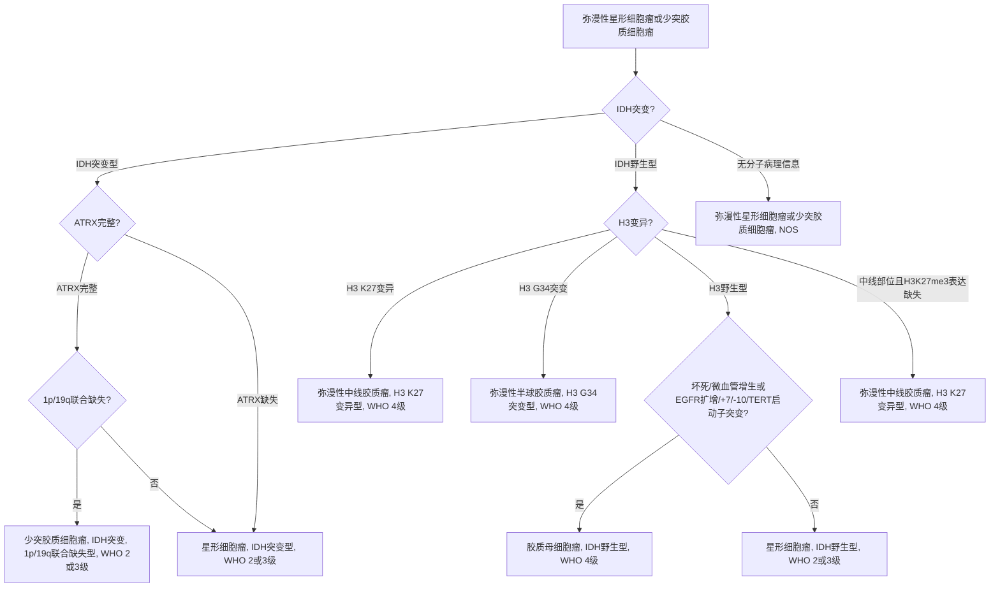

# 脑胶质瘤诊疗指南（2022年版）

## 一、概述

脑胶质瘤是指起源于脑神经胶质细胞的肿瘤，是最常见的原发性颅内肿瘤，2021年版WHO中枢神经系统肿瘤分类将脑胶质瘤分为1～4级，1、2级为低级别脑胶质瘤，3、4级为高级别脑胶质瘤。本指南主要涉及星形细胞、少突胶质细胞和室管膜细胞来源的成人高、低级别脑胶质瘤的诊治[2,3]。

我国脑胶质瘤年发病率为5～8/10万，5年病死率在全身肿瘤中仅次于胰腺癌和肺癌。脑胶质瘤发病机制尚不明了，目前确定的两个危险因素是：暴露于高剂量电离辐射和与罕见综合征相关的高外显率基因遗传突变。此外，亚硝酸盐食品、病毒或细菌感染等致癌因素也可能参与脑胶质瘤的发生。

脑胶质瘤临床表现主要包括颅内压增高、神经功能及认知功能障碍和癫痫发作三大类。目前，临床诊断主要依靠CT及MRI等影像学诊断，弥散加权成像（diffusion weighted imaging，DWI）、弥散张量成像（diffusion tensor imaging，DTI）、灌注加权成像（perfusion weighted imaging，PWI）、磁共振波谱成像（magnetic resonance spectroscopy，MRS）、功能磁共振成像（functional magnetic resonance imaging，fMRI）、正电子发射体层成像（positron emission tomography，PET）等对脑胶质瘤的鉴别诊断及治疗效果评价有重要意义。

脑胶质瘤确诊需要通过肿瘤切除手术或活检手术获取标本，进行组织病理和分子病理整合诊断，确定病理分级和分子亚型。分子标志物对脑胶质瘤的个体化治疗及临床预后判断具有重要意义。脑胶质瘤治疗以手术切除为主，结合放疗、化疗等综合治疗方法。手术可以缓解临床症状，延长生存期，并获得足够肿瘤标本用以明确病理学诊断和进行分子遗传学检测。手术治疗原则是最大范围安全切除肿瘤，而常规神经导航、功能神经导航、术中神经电生理监测和术中MRI实时影像等新技术有助于实现最大范围安全切除肿瘤。放疗可杀灭或抑制肿瘤细胞，延长患者生存期，常规分割外照射是脑胶质瘤放疗的标准治疗。胶质母细胞瘤（glioblastoma，GBM）术后放疗联合替莫唑胺同步并辅助替莫唑胺化疗，已成为成人新诊断GBM的标准治疗方案。

脑胶质瘤治疗需要神经外科、神经影像科、放射治疗科、神经肿瘤科、病理科和神经康复科等多学科合作（multi-disciplinary team，MDT），遵循循证医学原则，采取个体化综合治疗，优化和规范治疗方案，以期达到最大治疗效益，尽可能延长患者的无进展生存时间和总生存时间，提高生存质量。为使患者获得最优化的综合治疗，医师需要对患者进行密切随访和全程管理，定期影像学复查，兼顾考虑患者的日常生活、社会和家庭活动、营养支持、疼痛控制、康复治疗和心理调控等诸多问题。

## 二、影像学诊断

### （一）脑胶质瘤常规影像学特征

神经影像常规检查目前主要包括CT和MRI。这两种成像方法可以相对清晰精确地显示脑解剖结构特征及脑肿瘤病变形态学特征，如部位、大小、周边水肿状态、病变区域内组织均匀性、占位效应、血脑屏障破坏程度及病变造成的其他合并征象等。在图像信息上MRI优于CT。CT主要显示脑胶质瘤病变组织与正常脑组织的密度差值，特征性密度表现如钙化、出血及囊性变等，病变累及的部位，水肿状况及占位效应等；常规MRI主要显示脑胶质瘤出血、坏死、水肿组织等的不同信号强度差异及占位效应，并且可以显示病变的侵袭范围。多模态MRI不仅能反映脑胶质瘤的形态学特征，还可以体现肿瘤组织的功能及代谢状况。

常规MRI扫描，主要获取T1加权像、T2加权像、液体衰减反转恢复（fluid attenuated inversion recovery，FLAIR）序列成像及进行磁共振对比剂的强化扫描。脑胶质瘤边界不清，表现为长T1、长T2信号影，信号可以不均匀，周边水肿轻重不一。因肿瘤对血脑屏障的破坏程度不同，增强扫描征象不一。脑胶质瘤可发生于脑内各部位。低级别脑胶质瘤常规MRI呈长T1、长T2信号影，边界不清，周边轻度水肿影，局部轻度占位征象，如邻近脑室可致其轻度受压，中线移位不明显，脑池基本正常，病变区域内少见出血、坏死及囊变等表现；增强扫描显示病变极少数出现轻度异常强化影。高级别脑胶质瘤MRI信号明显不均匀，呈混杂T1、T2信号影，周边明显指状水肿影；占位征象明显，邻近脑室受压变形，中线结构移位，脑沟、脑池受压；增强扫描呈明显花环状及结节样异常强化影。

不同级别脑胶质瘤的PET成像特征各异。目前广泛使用的示踪剂为氟-18-氟代脱氧葡萄糖（\(^{18}\mathrm{F}\)-fluorodeoxyglucose，\(^{18}\mathrm{F}\)-FDG）及碳-11蛋氨酸（\(^{11}\mathrm{C}\)-methionine，\(^{11}\mathrm{C}\)-MET）。低级别脑胶质瘤一般代谢活性低于正常脑灰质，高级别脑胶质瘤代谢活性可接近或高于正常脑灰质，但不同级别脑胶质瘤之间的\(^{18}\mathrm{F}\)-FDG代谢活性存在较大重叠（2级证据）[4]。氨基酸肿瘤显像具有良好的病变-本底对比度，对脑胶质瘤的分级评价优于\(^{18}\mathrm{F}\)-FDG，但仍存在一定重叠。

临床诊断怀疑脑胶质瘤拟行活检时，可用PET确定病变代谢活性最高的区域。\(^{18}\mathrm{F}\)-FET和\(^{11}\mathrm{C}\)-MET比，\(^{18}\mathrm{F}\)-FDG具有更高的信噪比和病变对比度（2级证据）[5]。PET联合MRI检查比单独MRI检查更能准确界定放疗靶区（1级证据）[6]。相对于常规MRI技术，氨基酸PET可以提高勾画肿瘤生物学容积的准确度，发现潜在的被肿瘤细胞浸润/侵袭的脑组织（在常规MRI图像上可无异常发现），并将其纳入到患者的放疗靶区中（2级证据）[7,8]。\(^{18}\mathrm{F}\)-FDG PET由于肿瘤/皮层对比度较低，因而不适用于辅助制定放疗靶区（2级证据）[9]。

神经外科临床医师对神经影像诊断的要求很明确：首先是进行定位诊断，确定肿瘤的大小、范围、肿瘤与周围重要结构（包括重要动脉、皮层静脉、皮层功能区及神经纤维束等）的毗邻关系及形态学特征等，这对制定脑胶质瘤手术方案具有重要的作用；其次是对神经影像学提出功能状况的诊断要求，如肿瘤生长代谢、血供状态及肿瘤对周边脑组织侵袭程度等，这对患者术后的综合疗效评估具有关键作用。除基础T1、T2、增强T1等常规MRI序列，多模态MRI序列如DWI、PWI、MRS等，不仅能反映脑胶质瘤的形态学特征，还可以体现肿瘤组织的功能及代谢状况。DWI高信号区域提示细胞密度大，代表高级别病变区；PWI高灌注区域提示血容量增多，多为高级别病变区；MRS中胆碱（choline，Cho）和Cho／N-乙酰天门冬氨酸（N-acetyl-aspartate，NAA）比值升高，与肿瘤级别呈正相关。DTI、血氧水平依赖（blood oxygenation level dependent，BOLD）等fMRI序列，可明确肿瘤与重要功能皮层及皮层下结构的关系，为手术切除过程中实施脑功能保护提供证据支持。多模态MRI对于脑胶质瘤的鉴别诊断、确定手术边界、预后判断、监测治疗效果及明确有无复发等具有重要意义，是形态成像诊断的一个重要补充。

**表1 脑胶质瘤影像学诊断要点**

| 肿瘤类型                                                                                                                                                       | 影像学特征性表现                                                                                                                                                                                                                                                                                                            |
| -------------------------------------------------------------------------------------------------------------------------------------------------------------- | --------------------------------------------------------------------------------------------------------------------------------------------------------------------------------------------------------------------------------------------------------------------------------------------------------------------------- |
| **低级别脑胶质瘤**<br>主要指弥漫性星形胶质细胞瘤、少突胶质细胞瘤、少突星形胶质细胞瘤3种。特殊类型还包括：PXA、第三脑室脊索瘤样脑胶质瘤和毛细胞型星形细胞瘤等。 | 弥漫性星形胶质细胞瘤：MRI信号相对均匀，长T1、长T2和FLAIR高信号，多无强化；<br>少突胶质细胞瘤：表现同弥漫性星形脑胶质瘤，常伴钙化。<br>PXA：多见于颞叶，位置表浅，有囊变及壁结节。增强扫描，壁结节及邻近脑膜有强化。<br>第三脑室脊索瘤样脑胶质瘤：位于第三脑室内。<br>毛细胞型星形细胞瘤：以实性为主，常见于鞍上和小脑半球。 |
| **间变性脑胶质瘤（3级）**<br>主要包括间变性星形细胞瘤、间变性少突胶质细胞瘤。                                                                                  | 当MRI/CT表现似星形细胞瘤或少突胶质细胞瘤伴强化时，提示间变脑胶质瘤可能性大。                                                                                                                                                                                                                                                |
| **4级脑胶质瘤**<br>胶质母细胞瘤；弥漫性中线胶质瘤。                                                                                                            | 胶质母细胞瘤：特征为不规则形周边强化和中央大量坏死，强化外可见水肿。<br>弥漫中线胶质瘤：常发生于丘脑、脑干等中线结构，MRI表现为长T1长T2信号，增强扫描可有不同程度的强化。                                                                                                                                                   |
| **室管膜肿瘤**<br>主要指2级和3级室管膜肿瘤。特殊类型：黏液乳头型室管膜瘤为1级。                                                                                | 室管膜肿瘤边界清楚，多位于脑室内，信号混杂，出血、坏死、囊变和钙化可并存，瘤体强化常明显。<br>黏液乳头型室管膜瘤好发于脊髓圆锥和马尾。                                                                                                                                                                                      |

> 注：PXA，多形性黄色瘤型星形细胞瘤；FLAIR，液体抑制反转恢复序列。

### （二）脑胶质瘤鉴别诊断

#### 1. 脑内转移性病变

脑内转移性病变以多发病变较为常见，多位于脑皮层下，大小不等，水肿程度不一，表现多样，多数为环状或结节样强化影。脑内转移性病变的\(^{18}\mathrm{F}\)-FDG代谢活性可低于、接近或高于脑灰质；氨基酸代谢活性一般高于脑灰质。单发转移癌需要与高级别脑胶质瘤鉴别，影像学上可以根据病变大小、病变累及部位、增强表现，结合病史、年龄及相关其他辅助检查结果综合鉴别。

#### 2. 脑内感染性病变

脑内感染性病变，特别是脑脓肿，需与高级别脑胶质瘤鉴别。两者均有水肿及占位征象，强化呈环形。脑脓肿的壁常较光滑，无壁结节，而高级别脑胶质瘤多呈菜花样强化，囊内信号混杂，可伴肿瘤卒中。绝大部分高级别脑胶质瘤的氨基酸代谢活性明显高于正常脑组织，而脑脓肿一般呈低代谢。

#### 3. 脑内脱髓鞘样病变

与脑胶质瘤易发生混淆的是肿瘤样脱髓鞘病变，增强扫描可见结节样强化影，诊断性治疗后复查，病变缩小明显，易复发，实验室检查有助于鉴别诊断。

#### 4. 淋巴瘤

对于免疫功能正常的患者，淋巴瘤的MRI信号多较均匀，瘤内出血及坏死少见，增强呈明显均匀强化。\(^{18}\mathrm{F}\)-FDG代谢活性一般较高级别脑胶质瘤高且代谢分布较均匀。

#### 5. 其他神经上皮来源肿瘤

包括中枢神经细胞瘤等。可以根据肿瘤发生部位、增强表现进行初步鉴别诊断。

### （三）脑胶质瘤影像学分级

#### 1. 常规MRI检查

除部分2级脑胶质瘤（如多形性黄色星形细胞瘤、第三脑室脊索瘤样脑胶质瘤和室管膜瘤等）外，高级别脑胶质瘤...

（此处原文页码8内容不完整，跳过）

**表2 脑胶质瘤治疗效果评估RANO标准**

| 项目       | 完全缓解   | 部分缓解   | 疾病稳定         | 疾病进展 |
| ---------- | ---------- | ---------- | ---------------- | -------- |
| T1增强     | 无         | 缩小≥50%   | 变化在-50%～+25% | 增加≥25% |
| T2-FLAIR   | 稳定或减小 | 稳定或减小 | 稳定或减小       | 增加     |
| 新发病变   | 无         | 无         | 无               | 有       |
| 激素使用   | 无         | 稳定或减少 | 稳定或减少       | 不适用*  |
| 临床症状   | 稳定或改善 | 稳定或改善 | 稳定或改善       | 恶化     |
| 需满足条件 | 以上全部   | 以上全部   | 以上全部         | 任意一项 |

> 注：*在出现持续的临床症状恶化时，即为疾病进展，但不能单纯的将激素用量增加作为疾病进展的依据。

脑胶质瘤按照复发部位包括原位复发、远处复发和脊髓播散等特殊方式，其中以原位复发最为多见[15]。组织病理学诊断仍然是金标准。假性进展多见于放/化疗后3个月内，少数患者可见于10～18个月内。常表现为病变周边的环形强化，水肿明显，有占位征象，需要结合临床谨慎判断。对于高级别脑胶质瘤，氨基酸PET对鉴别治疗相关变化（假性进展、放射性坏死）和肿瘤复发/进展的准确度较高（2级证据）[16,17]。放射性坏死多见于放疗3个月后，目前尚无特异性检查手段鉴别放射性坏死与肿瘤进展/复发。对于高级别胶质瘤，\(^{18}\mathrm{F}\)-FDG PET用于评价术后肿瘤复发和放射性坏死较MRI优势不明显，氨基酸PET用于鉴别肿瘤进展和治疗相关反应具有较高的敏感度和特异度。对于低级别胶质瘤，\(^{18}\mathrm{F}\)-FDG PET不适用于评价肿瘤治疗反应，而氨基酸PET的评价作用也有限（1级证据）[18]。定期MRI或PET检查，有助于鉴别假性进展和肿瘤进展/复发（表3）。多模态MRI检查如PWI及MRS等也有一定的参考意义。

**表3 脑胶质瘤复发、假性进展及放射性坏死鉴别方法**

| 项目                                   | 肿瘤复发                     | 假性进展                                                            | 放射性坏死                            |
| -------------------------------------- | ---------------------------- | ------------------------------------------------------------------- | ------------------------------------- |
| 发生时间                               | 任何时间                     | 多见于放/化疗后3个月内，少数患者可见于10个月内                      | 治疗后数月至数年                      |
| 临床症状                               | 恶化                         | 不变或恶化                                                          | 不变或恶化                            |
| MRI增强扫描                            | 多病变和胼胝体受侵通常是复发 | 大片长T1和T2信号，内有不规则的强化，占位效应明显                    | MRI增强扫描可见强化，晚期表现为高信号 |
| PWI                                    | 通常高灌注                   | 通常低灌注                                                          | 通常低灌注                            |
| MRS                                    | Cho/NAA，Cho/Cr较高          | Cho/NAA，Cho/Cr较低                                                 | Cho/NAA，Cho/Cr较低                   |
| DWI                                    | 弥散受限                     | 比肿瘤信号低                                                        | 比肿瘤信号低                          |
| 葡萄糖PET                              | 通常高代谢                   | 高代谢或低代谢                                                      | 低代谢                                |
| 氨基酸PET和\(^{18}\mathrm{F}\)-FDG PET | 高代谢                       | 低代谢                                                              | 低代谢                                |
| 好发因素                               | 放射治疗+替莫唑胺            | 放射治疗                                                            | 与放疗关系                            |
| 可在放射治疗野范围外                   | 多在放射治疗野范围内         | 多在放射治疗野范围内                                                |
| 发生率                                 | 几乎全部                     | 总20%~30%，在同步放化疗中常见，特别是MGMT启动子区甲基化者发生率更高 | 与剂量有关，大约在2%~18%              |

## 三、神经病理学与分子病理学诊断

### （一）2021版WHO中枢神经系统肿瘤分类标准

脑胶质瘤是一组具有胶质细胞表型特征的神经上皮肿瘤的总称。随着病理学的发展和病理检测技术的进步，尤其是二代测序、DNA甲基化谱等组学技术的提高，胶质瘤的遗传背景和发生发展机制逐渐清晰。越来越多的分子标志物被证明在胶质瘤的分类、分型、分级、预后和治疗方面发挥着重要的作用[19-22]。2021年发布的第5版《WHO中枢神经系统肿瘤分类》整合了肿瘤的组织学特征和分子表型，提出了新的肿瘤分类标准，重点推进了分子诊断在中枢神经系统肿瘤分类中的应用。这一分类是目前脑胶质瘤诊断及分级的重要依据（表4）。

**表4 2021版WHO中枢神经系统胶质瘤分类标准**

| 分类                         | 详细内容                                                                                                                                                                                                                         |
| ---------------------------- | -------------------------------------------------------------------------------------------------------------------------------------------------------------------------------------------------------------------------------- |
| **成人型弥漫性胶质瘤**       | 星形细胞瘤，IDH突变型<br>少突胶质细胞瘤，IDH突变伴1p/19q联合缺失型<br>胶质母细胞，IDH野生型                                                                                                                                      |
| **儿童型弥漫性低级别胶质瘤** | 弥漫性星形细胞瘤，MYB或MYBL1变异型<br>血管中心型胶质瘤<br>青少年多形性低级别神经上皮肿瘤<br>弥漫性低级别胶质瘤，MAPK信号通路变异型                                                                                               |
| **儿童型弥漫性高级别胶质瘤** | 弥漫性中线胶质瘤，H3 K27变异型<br>弥漫性大脑半球胶质瘤，H3 G34突变型<br>弥漫性儿童型高级别胶质瘤，H3野生和IDH野生型<br>婴儿型半球胶质瘤                                                                                          |
| **局限性星形细胞胶质瘤**     | 毛细胞型星形细胞瘤<br>有毛细胞样特征的高级别星形细胞瘤<br>多形性黄色星形细胞瘤<br>室管膜下巨细胞星形细胞瘤<br>脊索样胶质瘤<br>星形母细胞瘤，伴MN1改变                                                                            |
| **室管膜肿瘤**               | 幕上室管膜瘤<br>幕上室管膜瘤，ZFTA融合阳性型<br>幕上室管膜瘤，YAP1融合阳性型<br>后颅窝室管膜瘤<br>后颅窝室管膜瘤，PFA组<br>后颅窝室管膜瘤，PFB组<br>脊髓室管膜瘤<br>脊髓室管膜瘤，MYCN扩增型<br>黏液乳头型室管膜瘤<br>室管膜下瘤 |

### （二）脑胶质瘤分类及其分子变异

#### 1. 肿瘤分类与分子表型

第5版《WHO中枢神经系统肿瘤分类》根据组织学和分子病理学特点将胶质瘤分为5个组别（表5）：
① 成人型弥漫性胶质瘤；
② 儿童型弥漫性低级别胶质瘤；
③ 儿童型弥漫性高级别胶质瘤；
④ 局限性星形胶质瘤；
⑤ 室管膜肿瘤。

**表5 胶质瘤常用分子病理学检测指标推荐**

| 标志物                                  | 遗传学变异                                               | 检测方法                                                                                                                       | 诊断价值                                                                                                                                 | 预后意义 |
| --------------------------------------- | -------------------------------------------------------- | ------------------------------------------------------------------------------------------------------------------------------ | ---------------------------------------------------------------------------------------------------------------------------------------- | -------- |
| IDH1突变 (R132H/C/L/S/G)                | 免疫组化，Sanger测序，焦磷酸测序，二代测序               | 胶质瘤分类的关键分子变异；可鉴别WHO I级胶质瘤与胶质增生。                                                                      | 提示预后相对良好；在临床试验中常作为重要分组指标；与MGMT启动子甲基化密切相关；对放疗和烷化剂相对敏感；潜在的治疗靶点（例如Ivosidenib）。 |
| IDH2突变 (R172K/M/G/W)                  | Sanger测序，焦磷酸测序，二代测序                         | 同上                                                                                                                           | 同上                                                                                                                                     |
| 染色体1p/19q联合缺失                    | FISH，PCR，甲基化芯片/表达谱芯片/二代测序相关方法        | 少突胶质细胞瘤的关键变异。                                                                                                     | 提示预后相对良好；对于放疗和烷化剂相对敏感。                                                                                             |
| H3 K27突变 (K27M)                       | 免疫组化，Sanger测序，二代测序                           | 诊断弥漫性中线胶质瘤，H3K27突变型的关键参考指标。                                                                              | 预后相对较差；可作为潜在治疗靶点（例如EZH2抑制剂）。                                                                                     |
| H3 G34突变 (G34R/V)                     | 免疫组化，Sanger测序，二代测序                           | 弥漫性中线胶质瘤，H3K27突变型。                                                                                                | 生存期比IDH突变型胶质母细胞瘤略长，但比IDH突变型WHO 4级胶质瘤短。                                                                        |
| ATRX突变                                | 免疫组化，Sanger测序，二代测序                           | ATRX核表达缺失和/或p53突变阳性，可在不检测1p19q的情况下诊断为IDH突变型星形细胞瘤。                                             | 相对于IDH突变型胶质母细胞瘤预后较好。                                                                                                    |
| TP53突变                                | 免疫组化，Sanger测序，二代测序                           | ATRX核表达缺失和/或p53突变阳性，可在不检测1p19q的情况下诊断为IDH突变型星形细胞瘤。                                             | 可用于鉴别弥漫或非弥漫性WHO 1级胶质瘤及胶质增生。                                                                                        |
| CDKN2A/B纯合性缺失                      | FISH，qPCR，MLPA，甲基化芯片/表达谱芯片/二代测序相关方法 | 组织学缺少坏死和微血管增生的星形细胞瘤，IDH突变，WHO 4级胶质瘤的诊断指标之一。                                                 | 在IDH突变型胶质瘤中预后较差。                                                                                                            |
| TERT启动子突变 (C228T/C250T)            | Sanger测序，焦磷酸测序，二代测序                         | 在少突胶质细胞瘤和胶质母细胞瘤中常见；在缺少组织学坏死和微血管增生的情况下，是胶质母细胞瘤，IDH野生型，WHO 4级的诊断指标之一。 | 在IDH野生型胶质瘤中预后较差；在IDH突变型胶质瘤中预后较好。                                                                               |
| 染色体+7/-10                            | FISH，二代测序，微阵列芯片                               | 在缺少组织学坏死和微血管增生的情况下，是胶质母细胞瘤，IDH野生型，WHO 4级的诊断指标之一。                                       | 在IDH野生型胶质瘤中预后较差。                                                                                                            |
| EGFR扩增                                | FISH，数字PCR，二代测序，微阵列                          | 星形细胞瘤，IDH突变型，WHO 4级胶质瘤的诊断指标之一；胶质母细胞瘤，IDH野生型，WHO 4级胶质瘤的诊断指标之一。                     |                                                                                                                                          |
| EGFRvIII重排                            | RT-PCR，数字PCR，免疫组化，MLPA，二代测序                | EGFRvIII发生在约半数EGFR扩增的胶质母细胞瘤中。                                                                                 | 靶向治疗的潜在靶点。                                                                                                                     |
| BRAF突变 (BRAFV600E)                    | 免疫组化Sanger测序，焦磷酸测序，二代测序                 | 在多种胶质瘤中出现，包括表皮型胶质母细胞瘤。                                                                                   | 靶向治疗的靶点（例如vemurafenib）。                                                                                                      |
| MGMT启动子区甲基化                      | 甲基化特异性PCR，焦磷酸测序，甲基化微阵列                | 在多种胶质瘤中出现，包括表皮型胶质母细胞瘤。                                                                                   | 靶向治疗的靶点（例如vemurafenib）。                                                                                                      |
| FGFR融合基因 (FGFR-TACC)                | Sanger测序，qPCR，二代测序                               | 在星形细胞瘤，IDH野生型，WHO 4级和胶质母细胞瘤，IDH野生型，WHO 4级中出现。                                                     | 可作为靶向治疗的潜在靶点（例如FGFR抑制剂）。                                                                                             |
| MET融合基因 (PTPRZ1-MET) 突变 (METex14) | Sanger测序，qPCR，二代测序                               | 在星形细胞瘤，IDH野生型，WHO 4级和胶质母细胞瘤，IDH野生型，WHO 4级中出现。                                                     | 在继发性胶质母细胞瘤（星形细胞瘤，IDH突变型，WHO 4级）中预后较差；可作为治疗靶点（例如MET抑制剂）。                                      |
| miR-181d高表达                          | microRNA表达谱芯片，qPCR，原位杂交染色                   | 在胶质母细胞瘤中表达较高时，对替莫唑胺化疗效果较好。                                                                           |                                                                                                                                          |
| TSC1/2突变                              | Sanger测序，NGS                                          | 诊断室管膜下巨细胞星形细胞瘤的特异性标志物。                                                                                   | mTOR信号通路抑制剂（如依维莫司）治疗靶点。                                                                                               |
| ZFTA基因融合 (C11orf95-RELA)            | FISH, NGS                                                | 诊断C11orf95融合阳性型幕上室管膜的特异性标志物。                                                                               | 发生该融合的幕上室管膜瘤患者预后相对较差。                                                                                               |
| YAP1基因融合 (YAP1-MAMLD1)              | FISH, NGS                                                | 诊断YAP1融合阳性型幕上室管膜的特异性标志物。                                                                                   | 发生该融合的幕上室管膜瘤患者预后相对较好。                                                                                               |
| MYCN扩增                                | FISH, NGS                                                | 诊断MYCN扩增型脊髓室管膜的特异性标志物。                                                                                       | 发生该扩增的脊髓室管膜瘤患者预后相对较差。                                                                                               |
| NF1突变                                 | Sanger测序，NGS                                          | 在视路胶质瘤和IDH野生型胶质母细胞瘤中突变频率较高。                                                                            | 携带该突变的毛细胞型星形细胞瘤预后相对较好。                                                                                             |

> 注：FISH，荧光原位杂交技术；PCR，聚合酶链式反应技术；qPCR，定量聚合酶链式反应技术；MLPA，多重连接依赖探针扩增技术。

1）**成人型弥漫性胶质瘤和儿童型弥漫性胶质瘤**：新版分类首次将弥漫性胶质瘤分为成人型和儿童型弥漫性胶质瘤两大类。需要注意的是，这一诊断分类并非完全依据肿瘤发病年龄，而是依据主要分子变异及此类肿瘤在不同年龄段分布等临床特征。成人型弥漫性胶质瘤是成人胶质瘤的主要类型，但可发生于儿童；而儿童型弥漫性胶质瘤主要发生在儿童，亦可发生于成人，尤其是青年。

异柠檬酸脱氢酶（isocitrate dehydrogenase，IDH）突变是成人型弥漫性胶质瘤重要的诊断标志物。IDH突变的弥漫性胶质瘤，如伴有1号染色体短臂/19号染色体长臂（1p/19q）联合缺失，可诊断为“少突胶质细胞瘤，IDH突变和1p/19q联合缺失型”；如无1p/19q联合缺失，但有ATRX突变的弥漫性胶质瘤，可诊断为“星形细胞瘤，IDH突变型”，CDKN2A/B纯合性缺失是此类型肿瘤分级标志物。IDH野生且组蛋白H3野生的弥漫性胶质瘤，如出现坏死或微血管增生，或具有EGFR扩增、7号染色体扩增/10号染色体缺失（+7/-10）、TERT启动子区突变三个分子变异之一，可诊断为“胶质母细胞瘤，IDH野生型”。

儿童型弥漫性低级别胶质瘤以MYB/MYBL1变异和丝裂原活化蛋白激酶（MAPK）信号通路变异为主要分子特征。其中，MYB/MYBL1基因拷贝数变异和基因融合是诊断“弥漫性星形细胞瘤，MYB或MYBL1变异型”和“血管中心型胶质瘤”的重要分子标志物；MAPK信号通路相关的基因变异，包括BRAF、FGFR1等，是“青少年多形性低级别神经上皮肿瘤”和“弥漫性低级别胶质瘤，MAPK通路变异型”的重要诊断标准。儿童型弥漫性高级别胶质瘤则以组蛋白H3变异为主要分子特征，包括发生在中线位置、H3 K27me3核表达缺失的“弥漫性中线胶质瘤，H3 K27变异型”和发生于半球、H3G34R/V突变的“弥漫性半球胶质瘤，H3 G34突变型”。对于缺乏IDH突变和H3变异，常发生于婴幼儿、儿童和青年人，具备高级别组织学特征的弥漫性胶质瘤，根据其分子变异和甲基化特征可诊断为“弥漫性儿童型高级别胶质瘤，H3野生和IDH野生型”或“婴儿型大脑半球胶质瘤”。

（2）**局限性星形细胞胶质瘤**：新版分类将毛细胞型星形细胞瘤、有毛细胞样特征的高级别星形细胞瘤、多形性黄色星形细胞瘤、室管膜下巨细胞型星形细胞瘤、脊索样胶质瘤，以及星形母细胞瘤，MN1变异型等6类胶质瘤归为局限性星形细胞胶质瘤。“局限性”是指它们相对可控的生长方式，与“弥漫性”肿瘤相对应，意味着此类胶质瘤的生长方式较局限，影像学可见肿瘤界限较清晰，但并不代表低级别，某些肿瘤存在侵袭甚至播散可能[23]。此类肿瘤大部分具有典型的组织学特点，如星形母细胞性假菊形团、毛细胞型星形细胞瘤中的双相结构和毛样细胞等，同时还具备一些特征型的分子变异，如KIAA1549:BRAF融合、BRAF V600E突变、TSC1/TSC2突变、PRKCA D463H突变等。其中，有毛细胞样特征的高级别星形细胞瘤是WHO CNS5中新定义的一类肿瘤，此类肿瘤的诊断需要依赖DNA甲基化谱；具有典型星形母细胞瘤形态的肿瘤，如果携带MN1变异，可以诊断为“星形母细胞，MN1变异型”。

（3）**室管膜肿瘤**：室管膜瘤的分子特征与其解剖位置、年龄等因素密切相关。幕上室管膜瘤以融合基因为主要特征，可分为ZFTA融合阳性型和YAP1融合阳性型。非ZFTA非YAP1融合的幕上室管膜瘤比例较低。后颅窝室管膜瘤表现为特征性的DNA甲基化谱改变，可分为PFA组和PFB组；PFA组室管膜瘤主要发生在婴幼儿，多数具有间变性特征，预后差，组蛋白H3K27me3表达缺失，EZHIP过表达，基因组较稳定；PFB组室管膜瘤主要发生于大龄儿童或成人，预后相对较好，H3K27me3表达正常。脊髓室管膜瘤中有一类以MYCN基因扩增为特征，具有很强的侵袭性和转移能力，预后较差。

#### 2. 肿瘤WHO分级

新版分类不再跨肿瘤实体分级，而是按照肿瘤类型分级，进一步强调了肿瘤类型内的生物学相似性。同时，在组织学分级的基础上引入分子特征，当肿瘤组织形态表现为低级别但具有特定分子变异时，可将该肿瘤定位高级别，如CDKN2A/B纯合性缺失的IDH突变型星形细胞瘤，即使没有出现微血管增生或坏死等高级别组织学特征，也将被诊断为CNS WHO 4级。需要注意的是，新版分级体系仍然保留了中枢神经系统的特点，因此建议在定级时使用“CNS WHO级别”一词。

#### 3. NOS（非特指）和NEC（未分类）诊断

使用NOS和NEC可以有效地标识（1）缺乏必要的分子信息或（2）分子检测无法进行有效分类或结果为阴性的不明确的肿瘤诊断。NOS表示无法建立组织形态学联合分子水平的整合诊断，进而临床医生分子检测尚未进行或技术原因导致的分子检测的失败。另一方面，NEC表示已成功进行了必要的诊断性检查，但鉴于临床、组织学、免疫组织化学和/或遗传特征不相匹配，无法做出WHO整合诊断。NEC提醒临床医生尽管进行了充分的病理检查，但检测结果不符合WHO的标准诊断。与WHO诊断一样，NEC和NOS诊断也应当通过分层整合报告。

#### 4. 病理报告整合和分层诊断

胶质瘤病理报告应当标准化、规范化，并按照新版分类进行整合及分层诊断。内容应包括：（1）整合诊断；（2）组织病理分类；（3）CNS WHO级别；（4）分子信息，应注明标本类型、检测方法、变异类型等详细信息。同时，病理报告中还应该包括患者基本临床信息、肿瘤部位及特殊情况备注等。

## 四、治疗

### （一）手术治疗

#### 1. 概述

脑胶质瘤手术治疗原则是最大范围安全切除，其基本目的包括：解除占位征象和缓解颅内高压症状；解除或缓解因脑胶质瘤引发的相关症状，如继发性癫痫等；获得病理组织和分子病理，明确诊断；降低肿瘤负荷，为后续综合治疗提供条件。

脑胶质瘤手术治疗方式主要可分为肿瘤切除术和病理活检术。

（1）肿瘤切除术适应证和禁忌证：

① 适应证：CT或MRI提示颅内占位；存在明显的颅内高压及脑疝征象；存在由于肿瘤占位而引起的神经功能障碍；有明确癫痫发作史；患者自愿接受手术。

② 禁忌证：严重心、肺、肝、肾功能障碍及复发患者，一般状况差不能耐受手术；其他不适合接受神经外科开颅手术的禁忌证。

（2）病理活检术适应证和禁忌证：

① 适应证：肿瘤位于优势半球，广泛浸润性生长或侵及双侧半球；肿瘤位于功能区皮质、白质深部或脑干部位，且无法满意切除；需要鉴别病变性质。

② 禁忌证：严重心、肺、肝、肾功能障碍及复发患者，一般状况差不能耐受手术；其他不适合接受神经外科手术的禁忌证。

（3）病理活检手术方式：活检可分为立体定向或导航下活检和开颅手术活检两类。立体定向或导航下活检适用于位置更加深在的病变；而开颅活检适用于位置浅表或接近功能区皮质的病变。开颅活检比立体定向活检可以获得更多的肿瘤组织，有利于结果的判定。活检的诊断准确率高于影像学诊断，但是受肿瘤的异质性和靶区选择等因素影响仍存在误诊率。

（4）围手术期处理：

① 术前处理：若术前出现明显的颅内高压症状，应及时给予脱水药物缓解颅内高压；若存在明显脑积水，可考虑先行脑室腹腔分流术或脑室穿刺外引流术。

② 术后处理：需根据颅内压情况选择是否使用脱水药物进行降颅压治疗，并适当使用激素稳定患者神经功能状态；若术后出现发热，需及时进行腰椎穿刺采集脑脊液进行实验室检查，积极防治颅内感染；术后应常规监测电解质，积极纠正电解质紊乱；对幕上脑胶质瘤患者，术后应常规应用抗癫痫药物预防癫痫发作。

（5）新型手术辅助技术的运用：新型手术辅助技术的应用有助于手术切除程度和肿瘤边界的判定及术中功能保护。

**推荐**：神经影像导航、功能神经影像导航（2、3级证据）[23]、术中神经电生理监测技术（例如，皮质功能定位和皮质下神经传导束定位）（3级证据）[24]和术中MRI实时影像神经导航（3级证据）[25]。多模态神经导航联合术中皮质及皮质下定位，可进一步提高手术安全性，保护神经功能，有利于最大范围安全切除（3级证据）[26]。

**可推荐**：荧光引导的显微手术（2级证据）[27]和术中B超影像实时定位。

（6）脑胶质瘤手术切除程度的判定：**强烈推荐**脑胶质瘤术后24～72小时内复查MRI，高级别脑胶质瘤以MRI增强、低级别脑胶质瘤以T2-FLAIR的容积定量分析为标准，并以此影像作为判断后续治疗疗效或肿瘤进展的基线。以此将切除程度按切除肿瘤体积分为4个等级，即全切除、次全切除、部分切除、活检，目前具体标准尚不统一。

#### 2. 高级别脑胶质瘤

**强烈推荐**最大范围安全切除（2、3级证据）[28,29]。手术目的包括：缓解由颅压高和压迫引起的症状；降低类固醇药物使用，维持较好的生存状态；降低肿瘤细胞负荷，为辅助放/化疗创造条件；延长生存期；获得精确病理诊断。与单纯活检相比，尽可能切除肿瘤是影响高级别脑胶质瘤患者预后的重要因素[30]。但由于高级别脑胶质瘤的浸润特性，实现病理上完全切除肿瘤常较困难。新型手术辅助技术的运用有助于高级别脑胶质瘤的最大范围安全切除。肿瘤切除程度是高级别脑胶质瘤的独立预后因素之一，肿瘤全切可延长术后肿瘤复发时间和患者生存期（2、3级证据）[28,29,31]。

#### 3. 低级别脑胶质瘤

低级别脑胶质瘤约占脑胶质瘤的30%，患者的发病年龄比高级别脑胶质瘤年轻，常位于或靠近重要功能区，如运动、语言、视空间和记忆。对于弥漫性低级别脑胶质瘤，**强烈推荐**最大范围安全切除肿瘤（2、3级证据）[32]。新型手术辅助技术可以有效提高患者影像学的肿瘤全切率，减低术后永久性神经功能障碍的发生率（2、3级证据）[24,25]。唤醒手术技术扩大了在脑功能区实施手术的指征（详见“功能区脑胶质瘤的手术治疗”部分）。针对非功能区或邻近功能区的低级别脑胶质瘤，脑功能定位技术可以识别与关键脑功能有关的皮质和皮质下结构，使手术切除范围扩大到重要功能结构的临界，以实现低级别脑胶质瘤的最大范围安全切除[33]。

#### 4. 复发脑胶质瘤

目前，复发脑胶质瘤的手术治疗获益，尚缺乏高级别的循证医学证据。手术原则是最大范围安全切除。手术目的包括：获取组织学和生物学信息，确定是复发还是假性进展，减小肿瘤负荷，缓解症状，术后可进行其他治疗[34]。新型手术辅助技术有助于实现最大范围安全切除复发脑胶质瘤。复发脑胶质瘤的手术治疗必须个体化，应该考虑患者年龄、临床功能状态、组织学类型、初始治疗反应、复发类型（局部还是弥漫性）、第一次手术和再次手术的时间间隔、既往治疗方式等[35]。

#### 5. 功能区脑胶质瘤

功能区脑胶质瘤是指根据术前磁共振影像显示肿瘤累及感觉运动区（中央前回、运动前区、辅助运动区和感觉区）、语言区（包括：优势半球的颞上回后部、颞中回和颞下回后部、颞下回后部、颞中回后部、缘上回、角回等）、顶叶视空间认知功能区和计算功能区、基底节或内囊、丘脑、距状沟视皮质等皮质及皮质下结构[36]。现代认知神经科学认为大脑的功能区分布是一个高度复杂的拓扑网络结构[37]，功能区胶质瘤往往侵犯拓扑网络结构的关键节点或连接，可直接或间接造成患者运动、语言、认知和记忆等神经功能损伤。功能区脑胶质瘤手术具有其特殊的手术方式和手术技巧。

（1）手术方式：目前，对功能区脑胶质瘤患者手术时推荐采用术中唤醒配合术中脑功能定位[38-42]，在提高肿瘤切除范围及切除程度的同时，可有效避免患者出现术后永久性功能障碍。

**适应证**包括：累及脑功能区的脑胶质瘤患者；对功能定位有主观配合意愿；自愿接受唤醒麻醉手术者。

除常规全身麻醉下开颅手术禁忌证外，**禁忌证**还应包括[43]：患者术前出现严重的颅内高压症状或已存在脑疝，常规术前使用脱水药物后功能无改善；存在意识障碍或重度认知障碍；明确精神病史；沟通交流障碍，存在严重神经功能缺失或难以配合完成术中指定检测任务；麻醉医师和手术医师无唤醒手术经验；患者拒绝接受唤醒麻醉手术；年龄小于18岁（相对禁忌），心理发育迟滞；患者不能长时间耐受固定体位等。

（2）术前评估：主要分为影像学评估、神经功能评估和术前宣教三部分内容。

① 术前影像学评估：**强烈推荐**MRI T1、T2、T2-FLAIR、T1增强、任务态BOLD-fMRI、DTI、3D-T1WI；**推荐**MRS、静息态功能磁共振（resting-state functional magnetic resonance imaging，Rs-fMRI）、PWI。

T1、T2、T2-FLAIR、T1增强MRI序列：可确定病变范围，水肿及恶性程度。肿瘤侵袭区域和功能区的距离与患者的功能状态相关。当肿瘤距离手运动区皮质<6mm时，肿瘤易造成患者术前肌力损伤[44]。BOLD-fMRI技术常用于对患者四肢运动功能区及语言功能区的定位（3级证据）[45,46]，但当肿瘤临近功能区（如肿瘤距离手运动区皮质<4mm时），其定位准确效度会受肿瘤影响而下降（3级证据）[47]，推荐使用ZOOMit序列进行功能定位，可以有效改善定位精度（3级证据）[48]。术前应用fMRI技术对患者进行功能区定位，有利于术者在术中确定肿瘤的切除范围，有效避免患者术后出现永久性功能损伤（3级证据）[49]。Rs-fMRI是一种不需要患者在检查中完成任务的成像方法，推荐将该技术作为一种补充检查手段（3级证据）[50]，应用于无法配合完成BOLD-fMRI检查的患者。DTI及纤维束追踪：**强烈推荐**在肿瘤侵犯脑功能区的脑胶质瘤患者中使用，可以提高肿瘤切除范围，同时保护患者的神经功能（3级证据）[51]。同时，推荐在非功能区脑胶质瘤患者中广泛应用该技术，以了解肿瘤与周围神经纤维解剖结构的情况。

② 术前神经功能评估：术前应用客观神经心理学量表评估患者的功能状态，为术者制定手术及术后治疗方案提供帮助。应用的量表应具备包含正常范围参考值、可重复性高等特点。

**强烈推荐**：卡诺夫斯凯计分（Kanofsky performance score，KPS）、爱丁堡利手检查。

**推荐**（根据肿瘤累及的脑功能区选择）：韦氏成人智力量表、西部失语症成套测验中文版、汉语失语成套测验、忽视测评（如线段等分划消实验等）。

**可推荐**：瓦达试验、中国康复研究中心失语症检查法、语言任务标准图库（2021SR0231666）、蒙特利尔认知评估量表（MoCA）、抑郁自评量表、焦虑自评量表、症状自评量表。

③ 术前癫痫评估：**强烈推荐**对患者的癫痫病史、癫痫发作的症状、癫痫发作程度及药物控制这四方面情况客观评估。具体细则参考《国际抗癫痫联盟（ILAE）癫痫治疗指南1981年版、1990年修订版及2013版癫痫治疗指南》[53]，《成人弥漫性胶质瘤相关癫痫临床诊疗指南（英文版）》[54]。

（3）手术准备：切口设计：根据病变的部位和功能区的位置设计切口，原则上应包含肿瘤和其累及的重要功能脑区（监测靶区）。基于以下因素综合考虑：①暴露病变及周围功能区，利于术中监测和功能定位保护。②复发率高的肿瘤（如脑胶质瘤）要考虑二次手术可能。③功能区分布的个体间差异性。④皮下动脉，静脉窦，发际线等常规需要考虑的结构因素。

体位：常采取侧卧位或仰卧位，以头架固定。若采取仰卧，应严密注意防范术中误吸的发生。选择的体位要保证患者术中舒适，摆好体位后使用保温毯有助于减少患者唤醒后寒战以及其引起的颅内压增高等。

麻醉方式：目前功能区脑胶质瘤唤醒手术包括术中唤醒麻醉开颅脑功能区肿瘤切除术和监护麻醉下全程清醒开颅脑功能区肿瘤切除术两种。睡眠-清醒-睡眠（AAA）麻醉模式，是目前最为常用的唤醒手术麻醉方式，是一种深度麻醉接近于全身麻醉的技术，此种技术需要喉罩、带套囊口咽气道等辅助气道工具来保持患者气道通常；在监护麻醉下进行的全程清醒开颅脑功能区肿瘤切除术，是一种使患者处于适度镇静的清醒状态下的肿瘤切除手术，其优势在于手术过程中患者一直处于自主呼吸状态，无需进行喉罩等辅助通气设备，可避免术中唤醒后因拔除喉罩诱发患者颅内压增高。

（4）术中操作：开颅过程：头架固定钉局部浸润麻醉、头皮重要神经阻滞（眶上神经和滑车上神经、耳颞神经、枕小神经、枕大神经和第三枕神经）和切口局部浸润麻醉，切口麻醉范围包括术野皮肤、皮下至骨膜，包括皮瓣基底部。告知麻醉医师唤醒患者，并对硬膜用2%利多卡因浸润棉片覆盖15～20min。待患者唤醒且一般状况及情绪稳定后，剪开硬脑膜并四周悬吊硬脑膜（不可过度牵拉），硬膜外彻底止血[55]。

**术中影像学技术**：**强烈推荐**使用神经导航系统；**推荐**使用术中MRI、术中超声等。
① 神经导航系统：术中可根据导航棒探针的位置，确定手术切除位置及切除深度（3级证据）[56]。
② 术中MRI技术：可以辅助术者确定肿瘤切除后残余肿瘤的体积，提高肿瘤的最终切除程度（3级证据）[57]。
③ 术中超声成像：可在术中辅助判断肿瘤范围和切除程度，提供病变周围及内部血流情况。

**术中脑功能定位技术**：**强烈推荐**直接电刺激定位功能区皮质（2、3级证据）[58,59]；**推荐**体感诱发电位定位中央沟，持续经颅或经皮质运动诱发电位监测运动通路完整性，直接电刺激定位皮质和皮质下功能结构，神经导航结合术前fMRI定位影像。

**运动区监测**：
① 运动区阳性表现为对侧肢体或面部相应部位肌肉出现不自主动作，同时可记录到肌电活动；电刺激运动前区或辅助运动区可能引起复杂运动。
② 运动区皮质下需要监测和保护的重要结构为锥体束[60-62]。

**感觉区监测**：感觉区阳性表现为对侧肢体或头部脉冲式的异常感觉，多表现为麻木感；刺激感觉区有时也可引起肢体运动。

**语言区监测**：推荐的语言任务有：数数和图片命名。电刺激过程中，患者出现的异常表现（包括：语言中断、构音障碍、命名错误、反应迟钝、语言重复等）均提示该区域为物体命名相关语言中枢[63]。图片材料推荐选用经过汉语语言标准化的物体图片。语言区皮质下需要监测和保护的重要结构有弓状束、上纵束、下枕额束、额斜束、下纵束等[64,65]。

**切除策略**：在保留重要功能结构的前提下，选择适当的手术入路尽可能切除病变。目前国际公认的切除安全范围应至少距离阳性刺激区5mm（3级证据）[66]。同时注意保护正常动脉及脑表面重要引流血管。通常先切除非功能区肿瘤，然后逐步推进至重要功能区附近，切除过程持续监测患者功能状态，可疑存在皮层下重要通路，即时进行皮质下电刺激，以确定重要皮质下功能结构并予以保护。切除病变后，可应用术中MRI、术中超声或肿瘤荧光显像等技术观察病变有无残留[67,68]。

（5）术后评估及预后：**强烈推荐**术后24～72h内行MRI检查，高级别脑胶质瘤以MRI增强、低级别脑胶质瘤以T2-FLAIR的容积定量分析为标准，评价肿瘤切除程度。推荐分别在术后1-3天、1个月、3个月、6个月评价患者的KPS评分、语言功能、运动功能及生活质量等。评价过程推荐采用神经影像与行为量表相结合的方式。

应用唤醒手术直接皮质及皮质下电刺激技术定位和保护功能区，可显著降低患者术后永久性神经功能障碍的发生率，术后暂时性神经功能障碍多可在3个月内恢复（3级证据）[69]。

#### 6. 合并癫痫症状的脑胶质瘤

（1）手术治疗控制脑胶质瘤相关癫痫：脑胶质瘤全切除优于次全切除对术后癫痫的控制（1级证据）[70,71]。脑胶质瘤全切除后大部分脑胶质瘤相关癫痫患者能达到无癫痫发作，在安全可行的情况下，尽可能做最大程度病变切除，以利于术后癫痫控制（2级证据）[72]。术前有继发性癫痫大发作及肿瘤有钙化的胶质瘤患者，术后癫痫预后更好（3级证据）[73]。与单纯病变切除相比，应用癫痫外科手术技术可以提高术后癫痫控制率，特别是颞叶脑胶质瘤相关癫痫的患者，行肿瘤切除联合钩回、杏仁核选择性切除和/或颞叶前部皮质切除后，更利于脑胶质瘤相关癫痫的控制（2级证据）。但是否保留海马结构，需结合患者对记忆以及学习能力的实际需求酌情考量。

脑胶质瘤引起的癫痫发作风险与肿瘤累及的脑区有关（2级证据）[74]。功能区脑胶质瘤的手术切除范围相对有限，术后癫痫发生率也相对较高，应充分利用现有技术，在保护脑功能的前提下，尽可能多地切除肿瘤，以减少术后癫痫发作（3级证据）[75]。

对于伴发癫痫的脑胶质瘤患者，建议酌情采用术中皮质脑电图或深部脑电监测，指导癫痫灶切除范围，以改善患者癫痫预后，提高长期癫痫治愈率（2级证据）[76]。

（2）术中癫痫的控制：累及脑功能区的脑胶质瘤，在术中电刺激功能区定位时，存在一定的癫痫发作风险（2级证据）[77,78]，当术中脑电监测或症状观察提示患者出现癫痫发作时，用冰林格氏液或冰生理盐水冲洗局部可控制大部分癫痫发作（2级证据）[79]。仍有癫痫持续发作者可以应用抗癫痫药物、镇静药物或者肌松药物终止发作（4级证据）[78,79]。

（3）难治性脑胶质瘤相关癫痫的手术治疗：应用抗癫痫药物过程中出现癫痫复发或加重常提示肿瘤进展（2级证据）[80]，脑胶质瘤术后无癫痫发作较长时间后再次出现癫痫发作，可能提示肿瘤复发（2级证据）[81]。脑胶质瘤复发伴频繁的药物难治性癫痫发作时，综合患者情况，可以手术治疗。无复发的术后脑胶质瘤伴频繁癫痫发作，可按照难治性癫痫进行全面评价，对于药物难治性脑胶质瘤相关癫痫且明显影响生活质量，可考虑手术（3级证据）[82]。

### （二）放射治疗

放射治疗通常是在明确肿瘤病理后，采用6～10MV直线加速器，常规分次，择机进行，立体定向放射治疗不适用于脑胶质瘤的初治。

#### 1. 高级别脑胶质瘤

手术是基础治疗，放/化疗等是不可或缺的重要治疗手段，高级别胶质瘤术后放疗可以取得显著生存获益（1级证据）。

（1）放疗时机：高级别胶质瘤生存时间与放疗开始时间密切相关，术后早期放疗能有效延长患者生存期，**强烈推荐**术后尽早（术后2-6周）开始放疗（2级证据）。

（2）放疗技术：**推荐**采用三维适形放射治疗或适形调强技术，常规分次，适形放疗技术可提高靶区剂量覆盖率、适形度及对正常组织保护，缩小不必要照射体积，降低并发症（2级证据）[84]，放疗前图像验证是放疗质控不可缺少的环节。

（3）放疗剂量：**推荐**放射治疗照射总剂量为54～60 Gy，常规分次，肿瘤体积较大和/或位于重要功能区及3级胶质瘤，可适当降低照射总剂量（1级证据）[85]。尽管三维适形放射治疗或适形调强技术具有提高靶区适形度、减少正常组织受量，最大限度缩小照射体积，能够给予靶区更高的放疗剂量，但提高剂量后的疗效尚未得到证实，盲目提高照射总剂量或分次量，应慎重。

（4）靶区确定：高级别胶质瘤放疗靶区争议至今，其焦点主要是最初的临床靶区（clinical target volume，CTV）是否需要包括瘤周水肿区，美国肿瘤放射治疗协会（The Radiation Therapy Oncology Group，RTOG）推荐CTV1需包括瘤周水肿区外2cm区域，给予46Gy，缩野后CTV2需在大体肿瘤靶区（gross target volume，GTV）外扩2cm，剂量为14Gy。2021年美国国家综合癌症网络（National Comprehensive Cancer Network，NCCN）指南推荐MRI T1增强或T2-FLAIR异常信号为GTV，外扩1～2cm形成CTV；如果考虑水肿区，建议包括在一程CTV1中（46Gy/23f），二程增量区（14Gy/7f）CTV2仅包括残余肿瘤和/或术后瘤腔并适当外扩。II期临床试验证实：靶区是否包括水肿区，在肿瘤控制和生存期上无明显差异[86,87]，欧洲癌症研究和治疗组织（European Organisation for the Research and Treatment of Cancer，EORTC）推荐的CTV设定并不强调一定要包括所有瘤周水肿区。

靶区勾画原则是在安全的前提下，尽可能保证肿瘤照射剂量60Gy，靶区勾画应参考术前/后MRI，正确区分术后肿瘤残留与术后改变，预判肿瘤侵袭路径，在临床实践中，医师应根据靶区位置、体积、患者年龄、KPS评分等因素综合考虑，灵活运用以上关于靶区设定的建议，平衡照射剂量、体积与放射性损伤之间的关系。

（5）联合放化疗：放疗和替莫唑胺同步应用：

① **GBM**：**强烈推荐**成人初治者放疗联合替莫唑胺（75mg/m²）同步化疗，并随后6周期替莫唑胺（150-200mg/m²）辅助化疗，在放疗中和放疗后应用替莫唑胺，显著延长患者生存期（1级证据）[88]，这一协同作用在MGMT启动子区甲基化患者中最为明显（2级证据）[89]。

② **3级胶质瘤**：对于存在1p/19q联合缺失的患者对化/放疗更敏感（1级证据）[90,91]，放疗联合PCV（甲基苄肼+洛莫司汀+长春新碱）化疗是一线治疗方案（1级证据），目前替莫唑胺对3级胶质瘤的治疗初步显示疗效（2级证据），且副反应更少。研究替莫唑胺、放疗、1p/19q联合缺失三者关系的2项大型临床随机试验正在进行，中期结果显示：对于无1p/19q联合缺失者，放疗联合12个周期替莫唑胺化疗，显著改善患者生存期[92]。IDH野生型伴或不伴TERT启动子区突变患者，临床预后最差，应提高放化疗强度，在2级胶质瘤中也同样存在这样的现象[93]。

3级胶质瘤放疗应根据患者具体情况，包括一般状态、分子病理和治疗需求等采用个体化治疗策略，治疗选择包括放疗联合PCV方案/替莫唑胺多种治疗模式，及参加临床试验等。

#### 2. 低级别脑胶质瘤

低级别胶质瘤术后放疗适应证、最佳时机、放疗剂量等存在争议，目前通常根据患者预后风险高低来制订治疗策略。

（1）危险因素：年龄≥40岁、肿瘤未全切除，肿瘤体积大，术前神经功能缺损，IDH野生型等是预后不良因素[94,95]。对于肿瘤未全切除或年龄≥40岁的患者，推荐积极行早期治疗。年龄<40岁且肿瘤全切除的患者，可选择密切观察[96]，但应综合考虑患者病情和分子病理后慎重决定。

（2）放疗剂量：推荐低级别胶质瘤放疗总剂量为45～54 Gy，分次剂量1.8～2.0 Gy（1级证据）[97]。对于IDH野生型低级别胶质瘤（2021版WHO分类定义4级星形细胞瘤）需提高剂量到59.4～60 Gy，随着适形调强放疗和分子分型在临床普遍应用，适度提高放疗剂量（54～59.4 Gy）有助于延长患者生存期，尤其对于分子病理定义的星形细胞瘤或MGMT启动子非甲基化患者[98,99]。分次剂量超过2 Gy会增加发生远期认知障碍的风险（2级证据）[100]。

（3）靶区确定：GTV主要是根据手术前/后MRI T2-FLAIR异常信号区域，正确区分肿瘤残留和术后改变尤其重要，推荐以GTV外扩1～2 cm作为低级别胶质瘤的CTV。

#### 3. 室管膜肿瘤

手术是室管膜肿瘤首选治疗方法，肿瘤全切后多数学者主张无需辅助治疗，室管膜瘤部分切除和间变性室管膜瘤是放疗适应证（3级证据）[101]。对放疗后短期复发或年幼不宜行放疗者，可以选择化疗作为辅助治疗，但疗效并不确定。

室管膜肿瘤术后3周，需行全脑全脊髓MRI和脑脊液脱落细胞学检查，无脑和脊髓肿瘤播散证据者，选择局部放疗，反之则推荐全脑全脊髓放疗（3级证据）[102,103]。

**局部放疗**：根据手术前/后MRI确定肿瘤局部照射范围，通常采用增强T1或T2-FLAIR异常信号为GTV，CTV为GTV外扩1～2 cm，分次剂量1.8～2.0 Gy/次，颅内肿瘤总剂量54～59.4 Gy，脊髓区肿瘤剂量45 Gy，如果肿瘤位于脊髓圆锥以下时，总剂量可以提高至60Gy。

**全脑全脊髓放疗**：全脑包括硬脑膜以内的区域，全脊髓上起第一颈髓、下至尾椎硬膜囊，全脑全脊髓照射总剂量36Gy，每次1.8～2.0Gy，后续颅内病灶区缩野局部追加剂量至54～59.4Gy，脊髓病灶区追加剂量至45Gy。

#### 4. 复发脑胶质瘤

评估复发脑胶质瘤再程放疗安全性时，应充分考虑肿瘤位置及大小。对于较小的复发病灶，回顾性研究多采用立体定向放射外科治疗或低分次立体定向放射治疗技术[104]，传统的常规分次放疗研究多集中在体积相对较大的复发病灶，由于复发前多接受过放疗，再次放疗剂量的叠加可能会造成脑组织的严重损伤，应充分考虑脑组织耐受性和放射性脑坏死的发生风险[106]。研究显示：放疗联合贝伐珠单抗及替莫唑胺，能延长部分患者的无进展生存时间和总生存时间[107,108]。

#### 5. 放射性脑损伤

放疗对脑组织损伤依据发生的时间和临床表现划分为三种不同类型：急性（放疗中或放疗后6周内）、亚急性（放疗后6周至6个月）和晚期（放疗后数月至数年）。

（1）急性和亚急性放射损伤：急性和亚急性放射损伤可能为血管扩张、血脑屏障受损和水肿所致。急性损伤表现为颅高压征象，如恶心、呕吐、头痛和嗜睡等。通常是短暂且可逆，应用皮质类固醇可缓解症状，在MRI上有时表现出弥漫性水肿；亚急性放射性脑损伤表现为嗜睡和疲劳，通常可在数周内自愈，必要时予以皮质类固醇类药物以控制症状。

（2）晚期放射损伤：晚期放射反应常常是进行性和不可逆的，包括白质脑病、放射性坏死和其他各种病变（多为血管性病变）。放疗总剂量、分次剂量等与白质脑病的发生直接相关[109,110]。非治疗相关因素包括一些使血管性损伤易感性增加的伴随疾病，如糖尿病、高血压及高龄等，均可使白质脑病的发生率增加。同步化疗也是另外一个危险因素[110]。脑胶质瘤替莫唑胺同步放化疗后假性进展发生率明显增高，其本质就是早期放射性坏死。放疗最严重的晚期反应是放射性坏死，发生率约为3%～24%。放疗后3年是出现高峰。放射性坏死的临床表现与肿瘤复发相似，如初始症状的再次出现，原有的神经功能障碍恶化和影像学上出现进展且不可逆的强化病灶，其周围有相关水肿。减少放射损伤根本在于预防，合理规划照射总剂量，分次量及合适的靶区体积可有效减少放射性坏死发生率。

### （三）药物治疗

化疗是通过使用化学药物杀灭肿瘤细胞的治疗方法，化疗可以延长脑胶质瘤患者的无进展生存时间及总生存时间[111,112]。高级别胶质瘤生长及复发迅速，进行积极有效的个体化化疗更有价值。其他药物治疗如分子靶向和生物免疫治疗等，目前均尚在临床试验阶段。鼓励有条件及符合条件的患者，在不同疾病阶段参加药物临床试验。

#### 1. 基本原则

（1）肿瘤切除程度影响化疗效果。推荐在最大范围安全切除肿瘤的基础上进行化疗。
（2）术后应尽早开始足量化疗。在保证安全的基础上，完成既定方案，可获得最佳治疗效果，同时应注意药物毒性并监测免疫功能。
（3）选择作用机制不同及毒性不重叠的药物进行联合化疗，减少毒性和耐药发生率。
（4）根据组织病理和分子病理，针对性选择合适化疗方案。
（5）某些抗肿瘤和抗癫痫药物会相互影响，同时使用时应酌情选择。
（6）积极参与有效可行的药物临床试验。

#### 2. 高级别脑胶质瘤

（1）经典化疗方案：

① **Stupp方案**：放疗期间同步口服替莫唑胺75mg/(m²·d)，连服42天；同步放化疗结束4周，进入辅助化疗阶段，口服替莫唑胺150～200mg/(m²·d)，连用5天，每28天重复，共6个周期。

② **PCV方案**：甲基苄肼60mg/(m²·d)第8～21天，洛莫司汀110mg/(m²·d)第1天，长春新碱1.4mg/m²第8、29天，8周为1个周期。

应用于胶质瘤治疗的药物还有卡莫司汀、伊立替康、依托泊苷、顺铂、卡铂等。

（2）3级胶质瘤化疗：3级胶质瘤化疗，目前没有标准方案，推荐在分子病理指导下选择放疗联合PCV/替莫唑胺的多种化疗方案（2级证据）[113]，或参加临床试验。

具有1p/19q联合缺失的3级少突胶质细胞瘤，推荐放疗加PCV化疗方案（1级证据）[90,91]，放疗加同步和/或辅助替莫唑胺化疗（2级证据）[90,91]；对于无1p/19q联合缺失者推荐放疗加辅助替莫唑胺化疗[114]。

KPS<60的3级胶质瘤，推荐短程或常规放疗联合替莫唑胺化疗（2级证据）[115]。

（3）GBM化疗（年龄≤70岁）：KPS≥60患者，若存在MGMT启动子区甲基化，推荐常规放疗加同步和辅助替莫唑胺化疗加或不加电场治疗（1级证据）[85]，还可推荐常规放疗加同步和辅助替莫唑胺联合洛莫司汀化疗（2级证据）[116]或临床试验；对于MGMT启动子区非甲基化或甲基化情况不明确者，推荐放疗加同步和辅助替莫唑胺化疗加或不加电场治疗（1级证据）[85]，或临床试验。

KPS<60患者，推荐短程放疗，加或不加同步和辅助替莫唑胺化疗（2级证据）[115]；存在MGMT启动子区甲基化者，也可单独替莫唑胺化疗（2级证据）。

（4）间变性室管膜瘤化疗：化疗通常在肿瘤复发，或出现全脑全脊髓播散时进行，常用药物：铂剂、依托泊苷、洛莫司汀、卡莫司汀以及替莫唑胺等，或参加临床试验。

#### 3. 低级别脑胶质瘤

目前低级别胶质瘤化疗争议较大，主要包括：化疗时机、化疗方案、化疗与放疗次序等。

根据目前循证医学证据，对于高危低级别胶质瘤患者，应积极考虑放疗联合化疗[117,118]。推荐化疗方案包括：PCV方案（1级证据）[119]；替莫唑胺化疗（2级证据）[120]；替莫唑胺同步和/或辅助化疗（2级证据）[120]。

对于有BRAFV600E激活突变或NTRK融合的低级别胶质瘤患者可推荐合适的靶向药物。

#### 4. 复发脑胶质瘤

目前尚无针对标准治疗后复发胶质瘤的标准化治疗方案。如为高级别复发胶质瘤，强烈建议优先选择临床试验，如果无合适临床试验，可采用以下方案：

（1）低级别胶质瘤复发后可选方案：
① 放疗加辅助PCV化疗；
② 放疗加辅助替莫唑胺化疗；
③ 放疗同步和辅助替莫唑胺化疗；
④ 既往没有替莫唑胺治疗史的患者使用替莫唑胺[120]；
⑤ 洛莫司汀或卡莫司汀；
⑥ PCV方案[121]；
⑦ 以卡铂或顺铂为基础的化疗方案[122]；
⑧ 如有BRAFV600E激活突变或NTRK融合者可推荐相应的靶向药物。

（2）3级胶质瘤复发后可选方案：
① 替莫唑胺[123]；
② 洛莫司汀或卡莫司汀[124]；
③ PCV方案；
④ 贝伐珠单抗[125]；
⑤ 贝伐珠单抗加化疗（卡莫司汀/洛莫司汀，替莫唑胺）；
⑥ 依托泊苷[126]；
⑦ 以卡铂或顺铂为基础的化疗方案；
⑧ 如有BRAFV600E激活突变或NTRK融合者可推荐相应的靶向药物。

（3）GBM复发后可选方案：
① 贝伐珠单抗[127]；
② 替莫唑胺[128]；
③ 洛莫司汀或卡莫司汀；
④ PCV方案；
⑤ 瑞戈非尼[129]；
⑥ 贝伐珠单抗加化疗（卡莫司汀/洛莫司汀，替莫唑胺）；
⑦ 依托泊苷；
⑧ 以卡铂或顺铂为基础的化疗方案；
⑨ 如有BRAFV600E激活突变或NTRK融合者可推荐相应的靶向药物。

### （四）电场治疗

肿瘤治疗电场的原理是通过中频低场强的交变电场持续影响肿瘤细胞内极性分子的排列，从而干扰肿瘤细胞有丝分裂，发挥抗肿瘤作用。用于脑胶质瘤治疗的电场治疗系统是一种无创便携式设备，通过贴敷于头皮的电场贴片发挥作用，目前研究显示电场治疗安全且有效[130]，推荐用于新诊断GBM（1级证据）和复发高级别脑胶质瘤的治疗（2级证据）。2020年5月，国家药品监督管理局通过了电场治疗的上市申请，并批准将其与替莫唑胺联合用于新诊断GBM患者的治疗，以及作为单一疗法用于复发GBM患者的治疗。

### （五）老年脑胶质瘤治疗原则

目前对老年的定义尚没有统一标准，本指南所指老年是指年龄>70周岁者。GBM是老年胶质瘤最常见的病理类型，老年GBM具有独特的分子遗传学特征，主要包括ATRX、BRAF、IDH和TP53突变率明显下降，PTEN突变率明显增加[131]，TP53突变和EGFR扩增可能与患者预后相关[132]。老年GBM患者的治疗方案主要包括手术切除、放疗以及替莫唑胺化疗。对于KPS≥60的老年GBM患者，美国2021年NCCN指南还推荐电场治疗（1级证据）。

#### 1. 手术治疗

手术切除肿瘤可以使老年GBM患者得到肯定的生存获益（1级证据）[133]，全切肿瘤更有利于术后功能的恢复（2级证据）[134]。综合老年状态评估评价较好者，手术切除具有良好的安全性和临床获益[135]。因此，老年胶质瘤患者同样优先推荐手术治疗，而80岁以上老年患者需要慎重考虑手术，术前评分较差的老年患者不推荐手术治疗。

#### 2. 放疗和化疗

放疗和化疗可以明确延长患者总生存时间。老年GBM患者，如KPS≥60推荐应用短程或常规放疗联合替莫唑胺化疗（1级证据）[136]；如KPS<60者则推荐短程放疗或替莫唑胺化疗。

### （六）弥漫性中线胶质瘤治疗原则

弥漫性中线胶质瘤是指发生于丘脑、脑干和脊髓的中线结构胶质瘤。国内目前尚无确切的流行病学数据，国外报道：儿童发病高峰6～7岁，成人20～50岁，没有明显性别差异[137]，治疗困难，预后极差。2021年WHO中枢神经系统肿瘤分类将弥漫性中线胶质瘤定为4级。临床和影像怀疑弥漫性中线胶质瘤患者建议检测H3K27M变异情况，主要包括H3.3 K27突变、H3.1/2 K27突变、H3野生伴EZHIP过表达、EGFR突变，其中H3K27M突变是小儿弥漫内生性桥脑胶质瘤最常见改变，患者预后更差[138,139]。

#### 1. 手术治疗

肿瘤位置险要且呈浸润性生长，手术难以做到肿瘤完全切除，通常不被常规优先推荐。多数情况下肿瘤活检可行并被推荐，目的是明确病理和分子病理，指导综合治疗[140]。

#### 2. 放疗和化疗

目前尚无成熟的放疗和化疗方案。放疗可提高部分患者肿瘤客观反应率（3级证据）[141]，可参考GBM治疗方案[142]，根据具体情况适当调整放疗剂量。放疗联合替莫唑胺化疗或靶向治疗也是治疗选择[142,143]，推荐合适的患者参加临床试验。

### （七）康复及姑息性治疗

脑胶质瘤患者术后大多存在不同程度的生理功能和社会心理方面的障碍，这些障碍限制了患者的日常活动和社会参与度，降低了患者的生活质量。合理适度的康复治疗能够有效降低脑胶质瘤相关致残率，是脑胶质瘤临床管理中不可或缺的重要环节。此外，脑胶质瘤患者在整个疾病发展过程中需要全面的姑息性治疗，适当的姑息性治疗可以有效减轻脑胶质瘤患者的症状负担，并改善患者（特别是终末期患者）及看护人员的生活质量。以上两类治疗的临床管理同样需要脑胶质瘤治疗团队的关注。

#### 1. 康复治疗的模式

对于胶质瘤患者的康复治疗，目前推荐采用国内已广泛应用的三级康复医疗服务体系：一级康复指患者早期在神经外科肿瘤病房的早期康复治疗，是神经外科肿瘤医师在术后针对患者术后可能的并发症及功能障碍进行的康复活动指导，推荐在患者接受手术或其他治疗后，生命体征稳定的情况下早期进行；二级康复是指患者转入综合医院康复病房或专业康复机构后进行的康复治疗；三级康复指患者在社区或家中继续进行的康复治疗，应由社区康复医师在二级康复的基础上重新制订康复计划并实施，如患者功能相对恢复较好，可由康复医师对患者及家属进行康复教育，使患者在家自行进行康复锻炼。

#### 2. 常见康复问题及评估

脑胶质瘤所导致的康复问题可分为残损、活动限制和参与受限3个层次。（1）残损：主要包括肢体肌肉无力、感觉缺失、平衡障碍、吞咽障碍、构音障碍、失语症、认知障碍和心理障碍等。肌力可用徒手肌力测试评定，感觉缺失可用Fugl-meyer四肢感觉功能评测法评定，平衡障碍则可用伯格平衡量表评定，吞咽障碍可用洼田饮水试验、视频吞咽造影检查评定，构音障碍可用改良Frenchay法评定，失语症可用波士顿诊断性失语检查法，认知障碍评定可用简易精神状态检查法、认知与精神测定量表评定，焦虑和抑郁可用汉密尔顿焦虑和抑郁量表评定。（2）活动限制：指上述神经残损导致患者在移动和自我照料方面的困难。可采用巴塞尔指数、功能独立性量表评定。（3）参与受限：指上述神经残损导致患者在就业、家庭生活及社会融合等方面的困难。可采用健康调查量表36评定。

#### 3. 常见康复治疗策略

脑胶质瘤患者的康复治疗涉及多学科跨领域的合作，需要遵循集体协同的工作模式，其康复治疗策略涵盖范围也较广，具体如下：

（1）运动障碍治疗：脑胶质瘤患者的运动功能障碍并非一定由胶质瘤本身造成，也可能是手术切除、放疗以及化疗的并发症。其康复治疗以运动疗法为主，包括正确体位的摆放、关节活动度练习、肌力训练、耐力训练、神经肌肉促进技术训练、平衡及协调性训练、步态训练和呼吸训练等。对于身体条件能支持正常锻炼的胶质瘤患者，国际专家组建议每周进行至少150分钟的中等强度或75分钟的高等强度有氧运动，并进行两组主要肌群的强化锻炼[144]。此外，针对部分术后出现运动功能障碍的患者，可采用经颅磁刺激的方式，对重要的功能网络节点进行刺激，促进节点功能重塑，加快患者术后运动功能康复[145]。

（2）感觉障碍治疗：在脑胶质瘤患者中，感觉障碍通常是由包括初级感觉皮质在内的体感通路的直接损伤引起的。在有效治疗原发肿瘤或停用引起并发症的化疗药物后，感觉障碍可能会得到明显缓解或改善。患有感觉障碍的患者需要接受适当的康复治疗以防止其感觉功能进行性下降，物理疗法通常是针对患者的静态姿势、转移和步态进行训练，并鼓励患者更多的依赖视觉而不是感觉去感知周围环境。此外，可以训练患者在行走和上下楼梯时使用拐杖一类的辅助设备，以补偿其下肢本体感觉敏锐度的降低。

（3）言语-语言障碍治疗：言语-语言障碍包括构音障碍及失语症等，需要根据患者言语-语言评定的结果分别采用促进言语功能恢复的训练和非言语交流方式的使用训练。前者包括语音训练、听觉理解能力训练、口语表达训练等，后者包括手势语、画图、交流板、交流手册及电脑交流装置使用训练。

（4）吞咽障碍治疗：63%的脑肿瘤患者在早期康复治疗中会出现吞咽障碍，吞咽障碍通常都会逐渐改善，50%的患者在出院时可以恢复正常饮食。吞咽障碍的康复治疗策略主要包括营养摄入途径的改变、促进吞咽功能恢复的康复训练、食物性状和进食体位的调整、吞咽康复相关的康复护理和教育四个方面。

（5）认知障碍治疗：脑胶质瘤及其相关治疗可以导致认知功能的跨领域损害，多表现为记忆缺陷（主要是工作记忆）、执行功能、注意力、定向力和视空间功能障碍等。既往研究已证实，规范的认知康复有助于脑胶质瘤患者认知功能的改善。认知康复治疗的内容主要包括增强对认知缺损认识和理解的教育、减少认知缺损所造成影响的适应性治疗及针对认知缺损的修复性治疗，其中适应性和修复性治疗应以患者的生活方式和工作需要为导向。

（6）心理治疗：针对脑胶质瘤患者出现的焦虑和抑郁，可通过心理干预的方法来缓解和消除。对于中、重度焦虑或抑郁患者可酌情给予抗焦虑和抑郁的药物。同时应兼顾对患者的家属、护工的心理支持和教育。

（7）作业治疗：作业治疗是指以应用与日常生活、工作有关的各种作业活动或工艺过程中的某个运动环节作为训练方式，以最终提高患者在生活自理、工作及休闲活动上的独立能力为目的的治疗方法。主要包括维持日常生活所必需的基本作业治疗、创造价值的作业治疗、消遣性或文娱性作业治疗、教育性作业治疗及辅助支具使用训练等。

（8）康复工程：对于脑胶质瘤患者的肢体无力和平衡障碍，可以通过康复工程制作各种辅助器具，以改善患者的日常生活能力。如：用佩戴踝足矫形器来改善足下垂，用宽基底的四脚杖、标准助行器或半助行器来增加支撑面从而降低步行或站立时的跌倒风险等。

（9）药物治疗：患者康复治疗过程中出现肢体痉挛或疼痛、肺部及尿路感染、抑郁或焦虑等症状时，酌情使用一些对症药物是很有必要的。但与此同时，应当慎重使用对症支持性药物，因为这些药物可能是导致认知功能障碍的潜在原因。此外，不建议基于预防或治疗认知功能下降的原因对脑胶质瘤患者进行相关药物治疗。

（10）祖国传统医学和其他康复治疗：可选择针灸、推拿和拳操用于脑胶质瘤患者的康复。

#### 4. 姑息性治疗的内涵及基本原则

姑息性治疗又称舒缓性治疗，是给予生存期有限的患者（包括恶性肿瘤以及非肿瘤患者，如恶性肿瘤被确诊为晚期时、慢性充血性心力衰竭晚期、慢性阻塞性肺疾病末期等）及家属全面的综合治疗和照护，尽力保障终末期患者的生存质量，同时也帮助其家属渡过这一艰难时期的治疗形式。姑息性治疗的主要目的不是延长生命或治愈疾病，而是减轻患者症状，维持或改善其功能和生活质量。世界卫生组织指出，姑息性治疗“应在疾病早期，与其他旨在延长生命的疗法结合使用”。由于大多数脑胶质瘤患者无法治愈，因此姑息性治疗在这一患者群体中显得尤为重要，特别是在生命终末期阶段。根据欧洲神经肿瘤协会在2017年发布的胶质瘤患者姑息性治疗指南，生命终末期被定义为临终前的最后3个月。

医师在进行姑息性治疗的过程中需注意以下基本原则：

（1）以患者为中心；
（2）关注患者的意愿、舒适和尊严；
（3）不以治愈疾病为焦点；
（4）接受不可避免的死亡；
（5）不加速也不延缓死亡。

#### 5. 姑息性治疗过程中的症状管理

症状控制是姑息性治疗的基础和核心内容。减轻症状，尽可能让患者保持身体上的舒适，是在心理、社会等其他层面对患者进行照顾的基础。

胶质瘤患者根据疾病性质、部位、治疗等的不同，其临床症状也具有较强的个体差异。其中头痛、癫痫、静脉血栓、疲劳、情绪和行为障碍是常见的问题。对症处理是帮助终末期患者的第一步，对症处理的方案需要随患者病情变化不断调整，直至达到最佳效果。在疾病的终末期，要尤其重视以下几点：（1）谵妄控制；（2）营养与呼吸支持；（3）预立治疗规划；（4）医患沟通与组织工作。

## 五、MDT

胶质瘤MDT是根据不同胶质瘤患者的疾病状况和各方面的实际情况，由多个相关学科专业人员共同讨论，综合不同学科的专业意见，作出诊断并制定治疗方案，定期进行疗效评估，根据评估结果不断调整诊疗方案，以期取得最佳疗效的一种诊疗模式，旨在为胶质瘤患者提供个体化、综合性的诊疗服务[146]。脑胶质瘤MDT的目标是整合神经肿瘤相关多学科优势，以患者为中心，提供一站式医疗服务，实现最佳序贯治疗。

MDT组织形式包括MDT病例讨论会和MDT联合门诊等形式[126,197]。MDT可为脑胶质瘤患者带来诸多获益：①方便患者就医的同时提高了患者对既定诊治方案的依从性；②MDT的实施可提高患者进入临床试验的可能性；③实施MDT可改善患者预后；④MDT有助于临床试验和科研的开展。MDT同时也为医疗团队带来诸多益处：①提高了医疗团队成员之间的沟通，增加了团队成员的学习和受教育机会；②实施MDT时团队成员共享决策，更易获得最佳实践和循证医学的建议；③MDT临床决策制定和治疗实施责任由成员们共同承担，可降低团队成员工作压力，减少医疗纠纷；④MDT还有利于科研工作的开展，提高医疗单位的学术水平。

MDT由相关专科医师和专业人员组成。推荐根据疾病诊治的不同阶段，以关键临床问题为导向，组织脑胶质瘤MDT成员实施。核心临床专业包括神经外科、医学影像、神经病理和分子病理、放射肿瘤学、神经肿瘤、神经内科。其他可选专业包括感染科、血液科、内分泌科、神经心理、神经康复、临床护理、生物样本库、姑息治疗等。MDT的组织机构包括：①召集人（首席专家）：由权威专家担任，对MDT项目全权负责；②各科专家：专家一般应具有副高职称或高年资主治医师以上资格，有良好的神经肿瘤诊治基础并热心从事该事业；专家定期参与MDT讨论，并负责提供病例，准备资料等；③记录员：全程记录MDT，统计MDT病例的临床资料；④秘书（协调员）：协助召集人进行MDT的全程组织；⑤MDT委员会：可考虑成立MDT委员会，制定MDT制度并监督MDT执行。MDT应根据亟待解决关键临床问题，设定每一期病例讨论会的召集人（首席专家）。召集人一般由患者的临床主诊科室的权威专家担任，主持并全程参与讨论。

对初次诊治患者，MDT实施路径包括讨论诊断及鉴别诊断，拟诊脑胶质瘤后决策是否手术及手术方式。对术后患者，获取组织标本，经过组织病理诊断和分子检测最终获得准确的整合病理报告，明确诊断脑胶质瘤，则讨论下一步治疗方案。如病理存疑，则讨论下一步措施（如转入其他相关科室治疗或观察）。在治疗及随访过程中，如有需要可再次提请MDT讨论，调整治疗方案，对可疑复发患者，需要讨论病变性质（如治疗反应、肿瘤进展）及下一步医疗措施。复发脑胶质瘤常规治疗无效且需要纳入新型药物临床试验的病例，建议进行MDT讨论。MDT应得到所属医院管理部门支持，并建立临床数据管理和疗效反馈制度。

## 六、附录

### 附录一 证据等级（牛津循证医学中心2011版）

| (临床)问题                           | 步骤1 (等级1*)                                                                                             | 步骤2 (等级2*)                                 | 步骤3 (等级3*)                                                                                        | 步骤4 (等级4*)                                | 步骤5 (等级5*) |
| ------------------------------------ | ---------------------------------------------------------------------------------------------------------- | ---------------------------------------------- | ----------------------------------------------------------------------------------------------------- | --------------------------------------------- | -------------- |
| 这个疾病有多普遍? (患病率)           | 当地的,当前的随机样本调查(或普查)与当地情况相匹配调查的系统综述**                                          | 当地的,非随机样本调查**                        | 病例系列**                                                                                            | N/A                                           |                |
| 诊断或监测试验是否准确 (诊断)        | 一致地应用了参考标准和盲法的横断面研究的系统综述                                                           | 一致地应用了参考标准和盲法的横断面研究         | 非连续病例研究,或研究未能一致地应用参考标准**                                                         | 病例对照研究,或应用了差的或非独立的参考标准** | 基于机制的推理 |
| 若不加这个治疗会发生什么? (预后)     | 起始队列研究的系统综述                                                                                     | 起始队列研究                                   | 队列研究或随机研究的对照组**                                                                          | 病例系列或病例对照研究,或低质量预后队列研究** | N/A            |
| 这个治疗有用吗? (治疗效果)           | 随机试验或单病例随机对照试验的系统综述                                                                     | 随机试验或具有巨大效果的观察性研究             | 非随机对照队列/随访研究**                                                                             | 病例系列,病例对照研究,或历史对照研究**        | 基于机制的推理 |
| 这个治疗常见的伤害是什么? (治疗伤害) | 随机试验的系统综述,巢式病例对照研究的系统综述,针对你所提临床问题患者的n-of-1试验，具有巨大效果的观察性研究 | 单个随机试验或(特殊地)具有巨大效果的观察性研究 | 非随机对照队列/随访研究(上市后监测)提供，足够数量来排除常见的伤害（对长期伤害需要足够长的随访时间）** | 病例系列,病例对照研究,或历史对照研究**        | 基于机制的推理 |
| 这个治疗少见的伤害是什么? (治疗伤害) | 随机试验或N-of-1试验的系统综述                                                                             | 随机试验或（特殊地）具有巨大效果的观察性研究   |                                                                                                       |                                               |                |
| 这个试验（早期发现）值得吗？（筛查） | 随机研究的系统综述                                                                                         | 随机试验                                       | 非随机对照队列/随访研究**                                                                             | 病例系列，病例对照研究，或历史对照研究**      | 基于机制的推理 |

### 附图1 脑胶质瘤整合病理诊断流程图

以下是根据指南内容推断的整合病理诊断流程图，已转换为 Mermaid 格式：



### 附图2 脑胶质瘤临床综合诊疗流程与推荐证据级别

以下是根据指南内容（尤其是治疗部分和表2、表3）推断的临床综合诊疗流程，已转换为 Mermaid 格式：

```mermaid
graph TD
    subgraph 证据级别
        G1[1级证据] --> G2[2级证据] --> G3[3级证据] --> G4[4级证据]
    end

    Diagnosis[确诊脑胶质瘤] --> Surgery[最大范围安全切除]
    Surgery --> Pathology[组织病理+分子病理整合诊断]
    
    Pathology --> Grade{WHO分级}
    
    Grade -->|WHO 2级| LowRisk{风险评估}
    LowRisk -->|低风险| Observe[观察]
    LowRisk -->|高风险| LRT[放疗 ± PCV/替莫唑胺]
    
    Grade -->|WHO 3级| KPS3{KPS评分}
    KPS3 -->|KPS≥60| Subtype3{分子亚型}
    Subtype3 -->|少突星形细胞瘤, IDH突变型| RT_PCV[放疗 + PCV]
    Subtype3 -->|其他类型| RT_TMZ[放疗 + 替莫唑胺]
    KPS3 -->|KPS<60| HFRT_TMZ[HFRT ± 替莫唑胺]
    
    Grade -->|WHO 4级 (GBM)| Age{年龄}
    Age -->|≤70岁| KPS4{KPS≥60}
    KPS4 -->|MGMT甲基化| RT_TMZ_TTF[放疗 + 替莫唑胺 ± 电场治疗]
    KPS4 -->|MGMT非甲基化或未知| RT_TMZ[放疗 + 替莫唑胺 ± 电场治疗]
    KPS4 -->|KPS<60| HFRT_TMZ[HFRT ± 替莫唑胺]
    Age -->|>70岁| KPS_old{KPS≥60}
    KPS_old -->|MGMT甲基化| RT_TMZ_TTF[短程/常规放疗 + 替莫唑胺 ± 电场治疗]
    KPS_old -->|MGMT非甲基化| RT_TMZ_TTF[短程/常规放疗 + 替莫唑胺 ± 电场治疗]
    KPS_old -->|KPS<60| HFRT_TMZ[HFRT ± 替莫唑胺]
    
    Grade -->|复发/进展| Decision{评估}
    Decision -->|弥漫/多发| BSC[最佳支持治疗]
    Decision -->|局限| Surgery_re[手术]
    Surgery_re -->|术后| Chemo_re[化疗 ± 放疗 ± 靶向治疗]
    
    RT_PCV --> FollowUp[定期随访: 每3-6个月 MRI]
    RT_TMZ --> FollowUp
    HFRT_TMZ --> FollowUp
    RT_TMZ_TTF --> FollowUp
    Observe --> FollowUp
    
    FollowUp --> Recurrence{复发/进展?}
    Recurrence -->|是| Return[按复发治疗流程]
    Recurrence -->|否| FollowUp

    note[备注: RT=放疗; PCV=甲基苄肼+洛莫司汀+长春新碱; TMZ=替莫唑胺; BSC=最佳支持治疗; HFRT=低分割放疗; KPS=卡诺夫斯凯计分; TTF=肿瘤电场治疗]
```

> 注：由于原图细节较多，以上 Mermaid 流程图是基于指南文本（特别是表2、表3、治疗部分及附录）的合理概括，基本反映了整合诊断和临床诊疗流程。