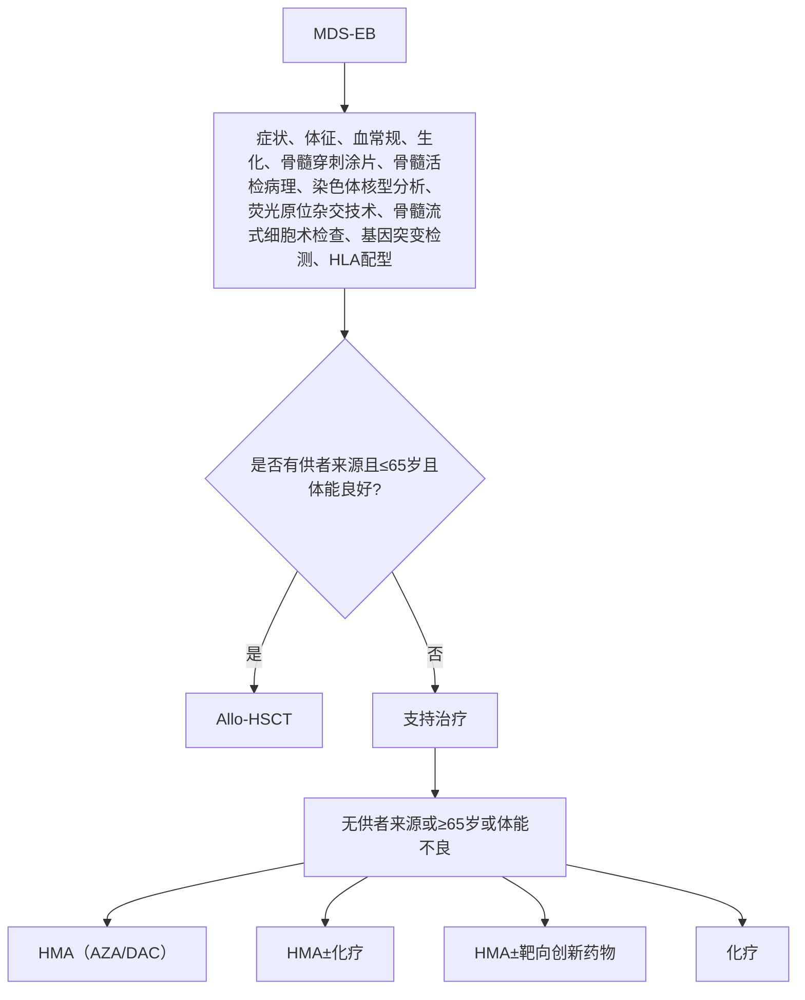

# 骨髓增生异常综合征伴原始细胞增多（MDS-EB）诊疗指南（2022年版）

## 一、概述

骨髓增生异常综合征（myelodysplastic syndromes，MDS）是一组起源于造血干细胞的异质性髓系克隆性疾病，其特点是髓系细胞发育异常，表现为无效造血、难治性血细胞减少，高风险向急性髓系白血病（acute myelogenous leukemia，AML）转化。

MDS的诊断与分型标准自1982年由FAB协作组首次确立以来，在过去近40年里几经补充修改，日趋完善。其中MDS伴原始细胞增多（myelodysplastic syndromes with excess blasts，MDS-EB）亚型是指骨髓中原始细胞达 \(5\% \sim 19\%\) ，较其他亚型向AML转化的风险进一步提高。

## 二、诊断技术和应用

### （一）发病情况

MDS全球发病率约为（2～12）/10万，中国发病率为 \((0.23\sim 1.51) / 10\) 万。MDS发病率随年龄增长而增加， \(80\%\) 发病年龄大于60岁。男性多于女性，德国资料 \(\geq 70\) 岁人群中MDS发病率，男性33.9/10万，女性18/10万；瑞典资料中MDS男性与女性之比为 \(1.8:1\) 。

### （二）临床表现

MDS-EB的临床表现无特异性，以全血细胞减少为主，常有明显贫血、出血及感染表现，可伴有脾肿大，常在短期内进展为急性白血病，转化率高达 \(40\%\) ，部分患者虽未进展为急性白血病，但常因感染及出血而死亡。

### （三）实验室检查

MDS诊断依赖于多种实验室检测技术的综合使用，其中骨髓穿刺涂片细胞形态学和细胞遗传学检测技术是MDS诊断的核心。

#### 1. 必需的检测项目

（1）**骨髓穿刺涂片**：MDS患者外周血和骨髓涂片的形态学异常分为2类：原始细胞比例增高和细胞发育异常。原始细胞可分为2型：1型（EB-1）为无嗜天青颗粒的原始细胞；2型（EB-1）为有嗜天青颗粒但未出现核旁空晕区的原始细胞，出现核旁空晕区者则判断为早幼粒细胞。典型的MDS患者，发育异常细胞占相应系别细胞的比例 \(\geq 10\%\) 。拟诊MDS患者均应进行骨髓铁染色计数环状铁粒幼红细胞，其定义为幼红细胞胞质内蓝色颗粒在5颗以上且围绕核周1/3以上者。

（2）**骨髓活检病理**：所有怀疑为MDS的患者均应行骨髓活检，通常在髂后上棘进行，长度不少于 \(1.5\mathrm{cm}\) 。骨髓活检细胞学分析有助于排除其他可能导致血细胞减少的因素或疾病，并提供骨髓细胞增生程度、巨核细胞数量、原始细胞群体、骨髓纤维化程度及肿瘤骨髓转移等重要信息。怀疑为MDS的患者应行Gomori银染色和原位免疫组化，常用的检测标志包括CD34、MPO、GPA、CD61、CD42、CD68、CD20和CD3。

（3）**染色体核型分析**：所有怀疑MDS的患者均应进行染色体核型检测，通常需分析 \(\geq 20\) 个骨髓细胞的中期分裂象，并按照《人类细胞遗传学国际命名体制（ISCN）2013》进行核型描述。 \(40\% \sim 60\%\) 的MDS患者具有非随机的染色体异常，其中以 \(+8\) 、 \(- 7 / \mathrm{del}(7\mathrm{q})\) 、 \(\mathrm{del}(20\mathrm{q})\) 、 \(- 5 / \mathrm{del}(5\mathrm{q})\) 和 - Y最为多见。MDS患者常见的染色体异常中，部分具有诊断价值：
   - ① 不平衡染色体异常： \(- 7 / \mathrm{del}(7\mathrm{q})\) ； \(\mathrm{del}(5\mathrm{q})\) ；（i17q）/t（17p）； \(- 13 / \mathrm{del}(13\mathrm{q})\) ； \(\mathrm{del}(11\mathrm{q})\) ； \(\mathrm{del}(12\mathrm{p})\) /t（12p）； \(\mathrm{del}(9\mathrm{q})\) ；idic（X）（q13）。
   - ② 平衡染色体异常：（t11;16）（q23.3;p13.3）；（t3;21）（q26.2;q22.1）；（t1;3）（p36.3;q21.2）；（t2;11）（p21;q23.3）；inv（3）（q21.3;q26.2）/t（3;3）（q21.3;q26.2）；（t6;9）（p23;q34.1）。

而 \(+8\) 、 \(\mathrm{del}(20\mathrm{q})\) 和 - Y亦可见于再生障碍性贫血及其他血细胞减少疾病。形态学未达到标准（1系或多系细胞发育异常比例 \(< 10\%\) ）、但同时伴有持续性血细胞减少的患者，如检出具有MDS诊断价值的细胞遗传学异常，应诊断为MDS未分类型（MDS-U）。

#### 2. 推荐的检测项目

（1）**荧光原位杂交技术**：应用针对MDS常见异常的主套探针进行荧光原位杂交（fluorescence in situ hybridization，FISH）检测，可提高部分MDS患者细胞遗传学异常检出率。因此，对疑似MDS者，骨髓干抽、无中期分裂象、分裂象质量差或可分析中期分裂象 \(< 20\) 个时，应进行FISH检测，通常探针应包括：5q31、CEP7、7q31、CEP8、20q、CEPY和TP53。

（2）**骨髓流式细胞术检查**：目前尚无MDS特异性的抗原标志或标志组合。对于缺乏确定诊断意义的细胞形态学或细胞遗传学表现的患者，不能单独依据流式细胞术检测结果确定MDS诊断。但流式细胞术对于MDS的预后分层有应用价值。

（3）**基因突变检测**：新一代基因测序技术可以在绝大多数MDS患者中检出至少1个基因突变。MDS常见基因突变包括TET2、RUNX1、ASXL1、DNMT3A、EZH2、SF3B1等。部分基因的突变状态对MDS的鉴别诊断和危险度分层中有一定的价值，推荐作为选做检测项目，包括：TP53、TET2、DNMT3A、IDH1/2、EZH2、ASXL1、SRSF2、RUNX1、U2AF1、SETBP1等。

### （四）诊断标准

原始细胞增多是MDS-EB主要的诊断标准：

1. **MDS-EB-1**：骨髓 \(5\% \sim 9\%\) 或外周血 \(2\% \sim 4\%\) ，无Auer小体。
2. **MDS-EB-2**：骨髓 \(10\% \sim 19\%\) 或外周血 \(5\% \sim 19\%\) 或有Auer小体。

### （五）预后分层

MDS患者常用危险度分层系统包括国际预后评分系统（international prognostic score system, IPSS）、WHO分型预后积分系统（WHO adapted prognostic scoring system，WPSS）和修订的国际预后积分系统（revised international prognostic scoring system，IPSS-R）。此外，安德森癌症中心（MD Anderson Cancer Center，MDACC分层系统除了常用主要参数外，还引入了年龄、体能状态等参数。

1. **IPSS**：IPSS危险度的分级1997制定，根据以下3个因素确定：骨髓原始细胞比例、血细胞减少的程度和骨髓细胞遗传学特征。骨髓原始细胞 \(5\% \sim 10\%\) （EB-1）积分0.5分，骨髓原始细胞 \(11\% \sim 20\%\) （EB-2）积分1.5分。

2. **WPSS**：2007年制定，红细胞输注依赖及铁过载不仅导致器官损害，也可直接损害造血系统功能，从而可能影响MDS患者的自然病程。2011年修订的WPSS预后评分系统将评分依据中的红细胞输注依赖改为血红蛋白水平。WPSS作为一个时间连续性的评价系统，可在患者病程中的任何时点对预后进行评估。骨髓原始细胞 \(5\% \sim 10\%\) （EB-1）积分2分，骨髓原始细胞 \(11\% \sim 20\%\) （EB-2）积分3分。

3. **IPSS-R**：IPSS-R积分系统被认为是MDS预后评估的金标准，是MDS预后国际工作组在2012年对IPSS预后评分系统修订的最新版本，其对预后的评估效力明显优于IPSS、WPSS。 \(2\% <\) 骨髓原始细胞 \(< 5\%\) 积分1分，骨髓原始细胞 \(5\% \sim 10\%\) （EB1）积分2分，骨髓原始细胞 \(>10\%\) （EB-2）积分3分。然而，IPSS-R也有其局限性。其预后评估是否适用于接受化疗或靶向药物治疗的患者依然未知；再者，其他具有独立预后意义的因素未包含其中，比如红细胞的输注依赖、基因突变，特别是基因突变可能有助于更精准的预后评估。

## 三、治疗

MDS治疗宜根据MDS患者的预后分组，同时结合患者年龄、体能状况、合并疾病、治疗依从性等进行综合分析，选择治疗方案。MDS可按预后积分系统分为2组：较低危组[IPSS低危组、中危-1组，IPSS-R极低危组、低危组和中危组（≤3.5分），WPSS极低危组、低危组和中危组]和较高危组[IPSS中危-2组、高危组，IPSS-R中危组（>3.5分）、高危组和极高危组，WPSS高危组和极高危组]。MDS-EB阶段患者如伴随血细胞计数减少，基本都在较高危组，其治疗目标是延缓疾病进展、延长生存期和治愈。

### （一）支持治疗

支持治疗最主要目标为提升患者生活质量。对于MDS-EB患者主要包括成分输血：一般在血红蛋白 \(< 60 \mathrm{~g} / \mathrm{L}\) 或伴有明显贫血症状时可给予红细胞输注。患者为老年、机体代偿能力受限、需氧量增加时，建议血红蛋白 \(\leq 80 \mathrm{~g} / \mathrm{L}\) 时给予红细胞输注。血小板计数 \(< 10 \times 10^9 / \mathrm{L}\) 或有活动性出血时，应给予血小板输注。

### （二）去甲基化药物

常用的去甲基化药物包括5-阿扎胞苷（azacitidine，AZA）和地西他滨。

1. **AZA**：推荐用法为每日 \(75 \mathrm{mg} / \mathrm{m}^2 \times 7\) 日，皮下注射，28日为1个疗程。接受AZA治疗的MDS患者，首次获得治疗反应的中位时间为3个疗程，约 \(90\%\) 治疗有效的患者在6个疗程内获得治疗反应。因此，推荐MDS患者接受AZA治疗6个疗程后评价治疗反应，有效患者可持续使用。
2. **地西他滨**：推荐方案为每日 \(20 \mathrm{mg} / \mathrm{m}^2 \times 5\) 日，每4周为1个疗程。推荐MDS患者接受地西他滨治疗4~6个疗程后评价治疗反应，有效患者可持续使用。

### （三）化疗

较高危组尤其是原始细胞比例增高的MDS-EB患者预后较差，化疗是选择非造血干细胞移植（hematopoietic stem cell transplantation，HSCT）患者的治疗方式之一。可采取AML标准 \(3 + 7\) 诱导方案或预激方案。预激方案在国内广泛应用于较高危MDS患者，为小剂量阿糖胞苷（ \(10 \mathrm{mg} / \mathrm{m}^2\) ，每12小时1次，皮下注射，14日）基础上加用粒细胞集落刺激因子，并联合阿克拉霉素或高三尖杉酯碱或去甲氧柔红霉素。预激方案治疗较高危MDS患者的完全缓解率可达 \(40\% \sim 60\%\) ，且老年或身体机能较差的患者对预激方案的耐受性优于常规AML化疗方案。预激方案也可与去甲基化药物联合。

### （四）创新药物

BCL-2抑制剂[Venetoclax（VEN）]、免疫检查点抑制剂（程序性死亡蛋白-1抑制剂等）、口服组蛋白脱乙酰酶抑制剂及CD47单抗等联合去甲基化药物在高危MDS治疗获得初步可观结果，未来有可能改善MDS-EB患者的总体预后。

### （五）异基因造血干细胞移植

异基因造血干细胞移植（allogeneic hematopoietic stem cell transplantation, allo-HSCT）是目前唯一能根治MDS的方法，造血干细胞来源包括同胞全相合供者、非血缘供者和单倍型相合血缘供者。allo-HSCT的适应证为：
- ① 年龄 \(< 65\) 岁、较高危组MDS患者；
- ② 年龄 \(< 65\) 岁、伴有严重血细胞减少、经其他治疗无效或伴有不良预后遗传学异常（如-7、3q26重排、TP53基因突变、复杂核型、单体核型）的较低危组患者。

拟行allo-HSCT的MDS-EB患者，在等待移植的过程中可应用化疗或去甲基化药物或二者联合桥接allo-HSCT，但不应耽误移植的进行。

## 四、疗效和随访

基于MDS国际工作组（International Working Group，IWG）2000年提出、2006年修订的国际统一疗效标准。MDS的治疗反应包括以下4种类型。

### （一）改变疾病的自然病程

1. **完全缓解**：
   - 骨髓：原始细胞 \(\leq 5\%\) 且所有细胞系成熟正常。
   - 外周血：原始细胞为0，血红蛋白 \(\geq 110 \mathrm{~g} / \mathrm{L}\) ，中性粒细胞 \(\geq 1.0 \times 10^9 / \mathrm{L}\) ，血小板 \(\geq 100 \times 10^9 / \mathrm{L}\) 。

2. **部分缓解**：外周血绝对值必须持续至少2个月，其他条件均达到完全缓解标准（凡治疗前有异常者），但骨髓原始细胞仅较治疗前减少 \(\geq 50\%\) ，但仍 \(>5\%\) ，不考虑骨髓细胞增生程度和形态学。

3. **骨髓CR**：骨髓：原始细胞 \(\leq 5\%\) 且较治疗前减少 \(\geq 50\%\) ；外周血：如果达到血液学改善，应同时注明。

4. **疾病稳定**：未达到部分缓解的最低标准但至少8周以上无疾病进展证据。

5. **失败**：治疗期间死亡或病情进展，表现为血细胞减少加重、骨髓原始细胞增高或较治疗前发展为更进展的FAB亚型。

6. **进展**：
   - 原始细胞 \(< 5\%\) 者：原始细胞增加 \(\geq 50\%\) 达到 \(5\%\) ；
   - 原始细胞 \(5\% \sim 10\%\) 者：原始细胞增加 \(\geq 50\%\) 达到 \(10\%\) ；
   - 原始细胞 \(10\% \sim 20\%\) 者：原始细胞增加 \(\geq 50\%\) 达到 \(20\%\) ；
   - 外周血：中性粒细胞或血小板较最佳缓解/疗效时下降 \(\geq 50\%\) ；血红蛋白下降 \(\geq 20 \mathrm{~g} / \mathrm{L}\) ；依赖输血。

### （二）细胞遗传学反应

1. **完全反应**：染色体异常消失且无新发异常。
2. **部分反应**：染色体异常细胞比例减少 \(\geq 50\%\) 。

### （三）血液学改善

1. **红系反应**（治疗前血红蛋白 \(< 110 \mathrm{~g} / \mathrm{L}\) ）：
   - 血红蛋白升高 \(\geq 15 \mathrm{~g} / \mathrm{L}\) ；
   - 红细胞输注减少，与治疗前比较，每8周输注量至少减少4U；仅治疗前血红蛋白 \(\leq 90 \mathrm{~g} / \mathrm{L}\) 且需红细胞输注者才纳入红细胞输注疗效评估。

2. **血小板反应**（治疗前血小板 \(< 100 \times 10^9 / \mathrm{L}\) ）：
   - 治疗前血小板 \(> 20 \times 10^9 / \mathrm{L}\) 者，净增值 \(\geq 30 \times 10^9 / \mathrm{L}\) ；
   - 或从 \(< 20 \times 10^9 / \mathrm{L}\) 增高至 \(> 20 \times 10^9 / \mathrm{L}\) 且至少增高 \(100\%\) 。

3. **中性粒细胞反应**（治疗前中性粒细胞 \(< 1.0 \times 10^9 / \mathrm{L}\) ）：
   - 增高 \(100\%\) 以上和绝对值增高 \(> 0.5 \times 10^9 / \mathrm{L}\) 。

4. **血液学改善后进展或复发**：至少有下列1项：
   - 中性粒细胞或血小板较最佳疗效时下降 \(\geq 50\%\) ，
   - 血红蛋白下降 \(\geq 15 \mathrm{~g} / \mathrm{L}\) ，
   - 依赖输血。

### （四）改善生存质量

使用各种问卷或WHO体能积分。

---

## 附录1

### MDS-EB 患者的诊断治疗流程

