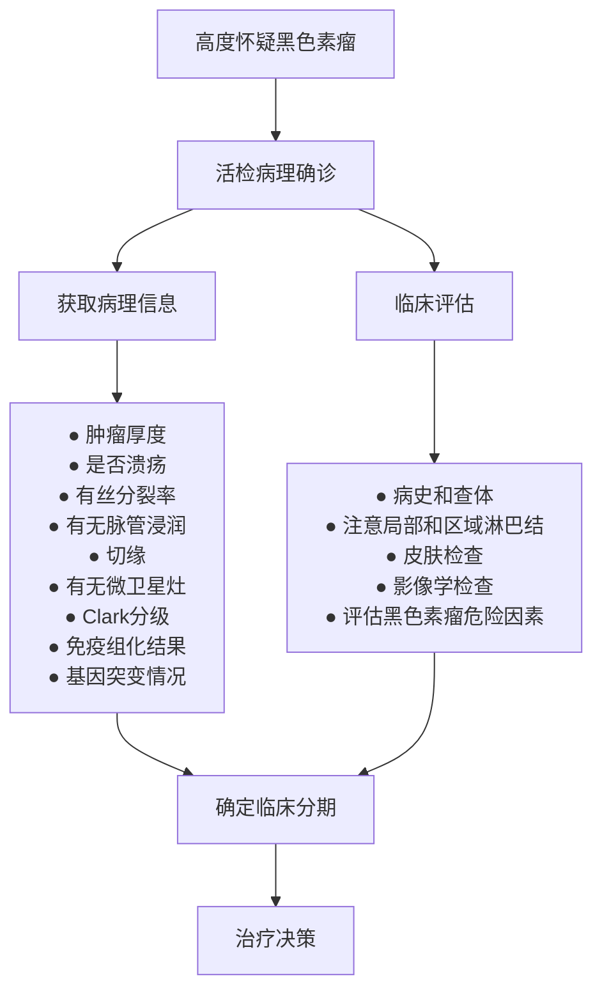

# 黑色素瘤诊疗指南（2022年版）

## 一、概述

黑色素瘤在我国虽然是少见恶性肿瘤，但病死率高，发病率也在逐年增加。我国黑色素瘤与欧美白种人差异较大，两者在发病机制、生物学行为、组织学形态、治疗方法以及预后等方面差异较大。在亚洲人和其他有色人种中，原发于肢端的黑色素瘤约占 \(50\%\) ，常见的原发部位多见于足底、足趾、手指末端及甲下等肢端部位，原发于黏膜，如直肠、肛门、外阴、眼、口鼻咽部位的黑色素瘤占 \(20\% \sim 30\%\) ；而对于白种人来说，原发于皮肤的黑色素瘤约占 \(90\%\) ，原发部位常见于背部、胸腹部和下肢皮肤；原发于肢端、黏膜的黑色素瘤分别只占 \(5\%\) 、 \(1\%\) 。

## 二、筛查和诊断

### （一）高危人群的监测筛查

对黑色素瘤高危人群的筛查，有助于早期发现、早期诊断、早期治疗，同时也是提高黑色素瘤疗效的关键。在我国，皮肤黑色素瘤的高危人群主要包括严重的日光晒伤史，皮肤癌病史，肢端皮肤有色素痣、慢性炎症，及其不恰当的处理，如盐腌、切割、针挑、绳勒等。黏膜黑色素瘤的高危因素尚不明确。建议高危人群定期自查，必要时到专科医院就诊，不要自行随意处理。

### （二）黑色素瘤的诊断

黑色素瘤好发于皮肤，因此视诊是早期诊断的最简便手段。原发病变、受累部位和区域淋巴结的视诊和触诊是黑色素瘤初步诊断的常用手段。

#### 1. 临床症状

皮肤黑色素瘤多由痣发展而来，痣的早期恶变症状可总结为以下ABCDE法则：

- **A 非对称（asymmetry）**：色素斑的一半与另一半看起来不对称。
- **B 边缘不规则（border irregularity）**：边缘不整或有切迹、锯齿等，不像正常色素痣那样具有光滑的圆形或椭圆形轮廓。
- **C 颜色改变（color variation）**：正常色素痣通常为单色，而黑色素瘤主要表现为污浊的黑色，也可有褐、棕、棕黑、蓝、粉、黑甚至白色等多种不同颜色。
- **D 直径（diameter）**：色素痣直径 \(>5\sim 6\mathrm{mm}\) 或色素痣明显长大时要注意，黑色素瘤通常比普通痣大，对直径 \(>1\mathrm{cm}\) 的色素痣最好做活检评估。
- **E 隆起（elevation）**：一些早期的黑色素瘤，整个瘤体会有轻微的隆起。

同样的，甲下黑色素瘤的临床大体特征也有ABCDEF法则，其含义分别为：

- **A** 代表年龄较大的成年人或老年人（age），亚洲人和非裔美国人好发（Asian or African-American race）；
- **B** 代表纵形黑甲条带颜色从棕色到黑色，宽度 \(>3\mathrm{mm}\)（brown to black）；
- **C** 代表甲的改变或病甲经过充分治疗缺乏改善（change）；
- **D** 代表指/趾端最常受累顺序，依次为大拇指 \(>\) 大跨趾 \(>\) 示指，单指/趾受累 \(>\) 多指/趾受累（digit）；
- **E** 代表病变扩展（extension）；
- **F** 代表有个人或家族发育不良痣及黑色素瘤病史（family history）。

ABCDE（F）法则的唯一不足在于没有将黑色素瘤的发展速度考虑在内，如几周或几个月内发生显著变化的趋势。皮肤镜可以弥补肉眼观察的不足，同时可以检测和对比可疑黑色素瘤的变化，其应用可显著提高黑色素瘤早期诊断的准确度。黑色素瘤进一步发展可出现卫星灶、溃疡、反复不愈、区域淋巴结转移和移行转移。晚期黑色素瘤根据不同的转移部位症状不一，容易转移的部位为肺、肝、骨、脑。眼和直肠来源的黑色素瘤容易发生肝转移。

#### 2. 影像学诊断

影像学检查应根据当地实际情况和患者经济情况决定，必查项目包括区域淋巴结（颈部、腋窝、腹股沟、腘窝等）超声，胸部CT，腹盆部超声，增强CT或MRI，全身骨扫描及头颅增强MRI或CT检查。影像学检查有助于判断患者有无远处转移，以及协助术前评估（包括X线、超声等）。如原发灶侵犯较深，局部应行CT、MRI检查。经济情况好的患者可行全身正电子发射计算机体层成像（positron emission tomography-computed tomography，PET-CT）检查，特别是原发灶不明的患者。正电子发射体层成像（positron emission tomography，PET）是一种更容易发现亚临床转移灶的检查方法。大多数检查者认为对于早期局限期的黑色素瘤，用PET发现转移病灶并不敏感，受益率低。对于III期患者，PET-CT扫描更有用，可以帮助鉴别CT无法明确诊断的病变，以及常规CT扫描无法显示的部位（比如四肢）。PET-CT较普通CT在发现远处病灶方面存在优势。

1. **超声检查**：超声检查因操作简便、灵活直观、无创便携等特点，是临床上最常用的影像学检查方法。黑色素瘤的超声检查主要用于区域淋巴结、皮下结节性质的判定，为临床治疗方法的选择及手术方案的制定提供重要信息。实时超声造影技术可以揭示转移灶的血流动力学改变，特别是帮助鉴别和诊断小的肝转移、淋巴结转移等方面具有优势。
2. **CT**：常规采用平扫+增强扫描方式（常用碘对比剂）。目前除应用于黑色素瘤临床诊断及分期外，也常应用于黑色素瘤的疗效评价，肿瘤体积测量、肺和骨等其他脏器转移评价，临床应用广泛。
3. **MRI**：常规采用平扫+增强扫描方式（常用对比剂钆喷酸葡胺），因其具有无辐射影响，组织分辨率高，可以多方位、多序列参数成像，并具有形态结合功能（包括弥散加权成像、灌注加权成像和波谱分析）综合成像技术能力，成为临床黑色素瘤诊断和疗效评价的常用影像技术。
4. **PET-CT**：氟-18-氟代脱氧葡萄糖PET-CT全身显像的优势在于：
   - ① 对肿瘤进行分期，通过1次检查能够全面评价淋巴结转移及远处器官的转移；
   - ② 再分期，因PET功能影像不受解剖结构的影响，可准确显示解剖结构发生变化后或者是解剖结构复杂部位的复发转移灶；
   - ③ 疗效评价，对于抑制肿瘤活性的靶向药物，疗效评价更加敏感、准确；
   - ④ 指导放疗生物靶区的勾画和肿瘤病灶活跃区域的穿刺活检；
   - ⑤ 评价肿瘤的恶性程度和预后。
   常规CT对于皮肤或者皮下转移的诊断灵敏度较差，而PET-CT可弥补其不足。

#### 3. 实验室检查

血常规、肝肾功能和乳酸脱氢酶，这些指标主要为后续治疗做准备，同时了解预后情况。尽管乳酸脱氢酶并非检测转移的敏感指标，但能指导预后。黑色素瘤尚无特异的血清肿瘤标志物，目前不推荐肿瘤标志物检查。

#### 4. 病灶活检

皮肤黑色素瘤的活检方式包括切除活检、切取活检和环钻活检，一般不采取削刮和穿刺活检。对于临床初步判断无远处转移的黑色素瘤患者，活检一般建议完整切除活检，切缘 \(0.3\sim 0.5\mathrm{cm}\) ，切口应沿皮纹走行方向（如肢体一般选择沿长轴的切口），不建议穿刺活检或局部切除。部分切取活检不利于组织学诊断和厚度测量，增加了误诊和错误分期风险。切取活检和环钻活检一般仅用于大范围病变或特殊部位的诊断性活检，比如在颜面部、手掌、足底、耳、手指、足趾或甲下等部位的病灶，或巨大的病灶，完整切除活检无法实现时，可考虑进行切取活检或者环钻活检。

### （三）黑色素瘤的病理学诊断

#### 1. 黑色素瘤病理学诊断标准

组织病理学是黑色素瘤确诊的最主要手段，免疫组织化学染色是鉴别黑色素瘤的主要辅助手段。无论黑色素瘤体表病灶或者转移灶活检或手术切除组织标本，均需经病理组织学诊断。病理诊断须与临床证据相结合，全面了解患者的病史和影像学检查等信息。

#### 2. 黑色素瘤病理诊断指南

黑色素瘤病理诊断指南由标本处理、标本取材、病理检查和病理报告等部分组成。

**（1）标本处理要点**：
- ① 手术医生应提供送检组织的病灶特点（溃疡/结节/色斑），对手术切缘和重要病变可用染料染色或缝线加以标记；
- ② 体积较大的标本必须间隔 \(3\mathrm{mm}\) 左右切开固定；
- ③ \(10\%\) 中性缓冲福尔马林（甲醛含量 \(4\%\) ）固定 \(6\sim 48\) 小时。

**（2）标本取材要点**：用颜料涂抹切缘。垂直皮面以 \(2\sim 3\mathrm{mm}\) 间隔平行切开标本，测量肿瘤厚度和浸润深度。根据临床要求、标本类型和大小以及病变与切缘的距离选择取材方式，病变最厚处、浸润最深处、溃疡处必须取材。主瘤体和卫星灶之间的皮肤必须取材，用以明确两者关系。肿瘤小于 \(2\mathrm{cm}\) 者全部取材，\(3\mathrm{cm}\) 以上者按 \(1\) 块/\(5\mathrm{mm}\) 取材。切缘取材有两种方法，分别为垂直切缘放射状取材和平行切缘离断取材，后者无法判断阴性切缘与肿瘤的距离，建议尽量采用垂直切缘放射状取材法，有助于组织学判断阴性切缘与肿瘤的距离（图1）。一个包埋盒内只能放置 \(1\) 块皮肤组织。包埋时应保证切面显示肿瘤发生部位皮肤、黏膜等的结构层次，以保证组织学进行T分期。

> **图1. 皮肤黑色素瘤切缘取材方法**  
> 示意图展示了两种取材方法：
> - ① 红色方框表示**垂直切缘放射状取材**：从肿瘤边缘垂直向外放射状切取，可判断阴性切缘与肿瘤的距离。
> - ② 绿色方框表示**平行切缘离断取材**：沿切缘平行切取，无法判断距离。
> （图片描述：外圈黑色椭圆代表标本边界，内部灰色不规则形状代表肿瘤，红色方框①位于肿瘤边缘垂直向外，绿色方框②位于切缘平行方向）

**（3）病理描述要点**：

① **大体标本描述**：根据临床提供的解剖位放置标本，观察并描述肿瘤的大小、形状和色泽。皮肤肿瘤必须描述表面有无溃疡，周围有无卫星转移灶，卫星转移灶的数量、大小及其与主瘤结节间距。

② **显微镜下描述**：黑色素瘤的诊断参照WHO2010版，重点描述以下内容：
- 黑色素瘤的来源：皮肤还是黏膜；
- 黑色素瘤的组织学类型：最常见的4种组织学类型为表浅播散型、恶性雀斑型、肢端雀斑型和结节型；少见组织学类型包含促结缔组织增生性黑色素瘤、起源于蓝痣的黑色素瘤、起源于巨大先天性痣的黑色素瘤、儿童黑色素瘤、痣样黑色素瘤；
- 黑色素瘤的浸润深度：定量用Breslow厚度，用毫米作为单位，定性用Clark水平分级，描述所浸润到的皮肤层级；
- 其他预后指标：包括溃疡、脉管侵犯、微卫星灶、有丝分裂率等。

   **Breslow厚度**：指皮肤黑色素瘤的肿瘤厚度，是T分期的基本指标。非溃疡性病变指表皮颗粒层至肿瘤浸润最深处的垂直距离；溃疡性病变指溃疡基底部至肿瘤浸润最深处的垂直距离。
   **Clark水平分级**：指皮肤黑色素瘤的浸润深度，分为5级。
   - 1级：肿瘤局限于表皮层（原位黑色素瘤）；
   - 2级：肿瘤浸润真皮乳头层但尚未充满真皮乳头层；
   - 3级：肿瘤细胞充满真皮乳头层到达乳头层和网状层交界处；
   - 4级：肿瘤浸润真皮网状层；
   - 5级：肿瘤浸润皮下组织。

③ **免疫组化检查**：黑色素瘤的肿瘤细胞形态多样，尤其是无色素性病变，常需要与癌、肉瘤和淋巴瘤等多种肿瘤进行鉴别。常用的黑色素细胞特征性标志物包括S-100、Sox-10、Melan-A、HMB45、Tyrosinase、MITF等。其中S-100敏感度最高，是黑色素瘤的过筛指标；但其特异度较差，一般不能用作黑色素瘤的确定指标。Melan-A、HMB45和Tyrosinase等特异度较高，但肿瘤性黑色素细胞可以出现表达异常，敏感度不一，因此建议在需要进行鉴别诊断时需同时选用2\~3个上述标记物，再加上S-100，以提高黑色素瘤的检出率。

④ **特殊类型黑色素瘤**：
- **黏膜型黑色素瘤**：一般为浸润性病变，可以伴有黏膜上皮内佩吉样播散。肿瘤细胞可呈上皮样、梭形、浆细胞样、气球样等，伴或不伴色素，常需借助黑色素细胞特征性标记物经过免疫组化染色辅助诊断；
- **眼色素膜黑色素瘤**：根据细胞形态分为梭形细胞型、上皮样细胞型和混合型。细胞类型是葡萄膜黑色素瘤转移风险的独立预测因素，梭形细胞型预后最好，上皮样细胞型预后最差。

#### 3. 黑色素瘤病理诊断报告

有条件的医院，皮肤黑色素瘤原发灶的常规病理组织学报告内容建议可包括：肿瘤部位、标本类型、肿瘤大小或范围、组织学类型、Breslow厚度、有无溃疡、浸润深度（Clark水平分级）、分裂活性、切缘状况（包括各切缘与肿瘤的距离以及切缘病变的组织学类型）、有无微卫星转移灶或卫星转移灶、有无脉管内瘤栓、有无神经侵犯等（表2）。前哨淋巴结和区域淋巴结需报告检见淋巴结的总数、转移淋巴结个数以及有无淋巴结被膜外受累。靶向治疗相关分子检测推荐至少包括BRAF、CKIT和NRAS等驱动基因。不推荐冷冻切片技术进行术中病理诊断。对于诊断困难的病例，建议提请多家医院会诊。

### （四）黑色素瘤的临床诊断标准及路线图

黑色素瘤主要靠临床症状和病理诊断，结合全身影像学检查得到完整分期（附录一）。

## 三、分期

黑色素瘤的分期对于预后的评估、合理治疗方案的选择至关重要。不同部位的黑色素瘤采用不同的pTNM分期指标，皮肤黑色素瘤pTNM分期见附录二，适用范围包括：唇、眼睑、外耳、面部其他部位、头皮和颈部皮肤、躯干、上肢和肩部、下肢和臀部、皮肤跨越性病变、皮肤、大阴唇、小阴唇、阴蒂、外阴跨越性病变、外阴、包皮、龟头、阴茎体、阴茎跨越性病变、阴茎、阴囊。头颈部黏膜黑色素瘤pTNM分期见附录三，适用范围包括：鼻腔、鼻窦、口腔、口咽、鼻咽、喉和下咽。眼黑色素瘤：眼虹膜黑色素瘤、睫状体脉络膜黑色素瘤及结膜黑色素瘤分别有不同pTNM分期，具体内容参考《AJCC肿瘤分期手册》（2016第8版）相关章节，见附录四。消化道（食管、小肠和大肠）暂无pTNM分期。根据我国的黑色素瘤临床诊疗指南，建议描述肿瘤浸润消化道层面。阴道暂无pTNM分期，宫颈黑色素瘤pTNM分期参照宫颈癌。脑膜黑色素瘤pTNM分期同其他脑膜肿瘤。

## 四、治疗

由于黑色素瘤的治疗涉及到多种方法和多个学科，因此黑色素瘤诊疗须重视多学科诊疗团队的模式，从而避免单科治疗的局限性，为患者提供一站式医疗服务、促进学科交流，并促进建立在多学科共识基础上的治疗原则和指南。合理治疗方法的选择需要有高级别循证依据支持，但也需要同时考虑地区和经济水平差异。

### （一）手术及术后辅助治疗

#### 1. 扩大切除

早期黑色素瘤在活检确诊后应尽快做原发灶扩大切除手术。扩大切除的安全切缘是根据病理报告中的肿瘤浸润深度（Breslow厚度）来决定的：
- （1）病灶厚度 \(\leq 1.0\mathrm{mm}\) 时，安全切缘为 \(0.5\sim 1\mathrm{cm}\)；
- （2）厚度在 \(1.01\sim 2\mathrm{mm}\) 时，安全切缘为 \(1\sim 2\mathrm{cm}\)；
- （3）厚度在 \(2.01\sim 4\mathrm{mm}\) 时，安全切缘为 \(2\mathrm{cm}\)；
- （4）当厚度 \(>4\mathrm{mm}\) 时，安全切缘为 \(2\mathrm{cm}\)。

对于活检病理未能报告明确深度，或病灶巨大的患者，可考虑直接扩大切除 \(2\mathrm{cm}\)。

特殊部位黑色素瘤的手术切缘可根据患者具体的原发病灶解剖结构和功能对切缘进行调整。颜面部黑色素瘤外科完整切除即可，不硬性要求切缘范围。肢端型黑色素瘤完整切除术后，一般根据病理分期决定扩切范围。从手术角度看，肢端型黑色素瘤手术不仅要考虑肿瘤切净，而且充分考虑尽可能保留功能，尤其是手指功能。不主张积极采用截肢手段治疗肢端型黑色素瘤。

#### 2. 前哨淋巴结活检

前哨淋巴结是皮肤和肢端黑色素瘤区域淋巴结转移的第一站，前哨淋巴结活检是病理分期评估区域淋巴结是否转移的手段。对于肿瘤Breslow厚度大于1mm的患者推荐进行前哨淋巴结活检。当活检和病理检测技术无法获得可靠的侵润深度时，合并溃疡的患者推荐行前哨淋巴结活检。前哨淋巴结活检可于完整切除的同时或分次进行，前哨淋巴结活检有助于准确获得N分期、提高患者的无复发生存率。淋巴引流路径只能为前哨活检提供解剖学参考，最终检出前哨淋巴结的检出需要依靠核素探测仪来确定。对前哨淋巴结及区域淋巴结病理诊断，不推荐冷冻切片进行术中病理诊断。

#### 3. 淋巴结清扫

**手术适应证**：前哨淋巴结阳性（如患者可以接受定期淋巴结B超随访，可以暂缓清扫），体检、影像学检查和病理学确诊为Ⅲ期的患者。

**手术原则**：要求受累淋巴结基部完整切除，腹股沟淋巴结清扫要求至少应在10个以上，颈部及腋窝淋巴结至少清扫15个。不建议做预防性淋巴结清扫术。

- **腹股沟淋巴结清扫**：对影像学诊断盆腔淋巴结转移的患者需行浅组+深组清扫；对术前可触及淋巴结的需行浅组+深组清扫；对术中发现浅组可疑淋巴结 \(\geq 3\) 个或Cloquet淋巴结可疑转移者（淋巴结黑色或肿大）需行浅组+深组清扫。
- **腋窝淋巴结清扫**：术前或术中明确证实腋上组淋巴结转移时行LEVEL I～III组淋巴结清扫，当无腋上组淋巴结转移证据或前哨淋巴结活检证实为微转移的患者则只进行LEVEL I～II组淋巴结清扫。
- **颈部淋巴结清扫**：尽量避免广泛性颈清扫术以及全颈清扫术，对于临床III期的患者根据肿大淋巴结及原发灶所在分区决定具体清扫范围。

#### 4. 局部复发或局部转移的治疗

局部复发或者肢体的移行转移可采取的治疗方法有手术、隔离肢体热输注化疗和隔离肢体热灌注化疗。对于局部复发，手术仍是最主要的治疗方法。

#### 5. 术后辅助治疗

术后的辅助治疗主要目的是降低患者复发、转移等风险。黑色素瘤目前主要的辅助治疗药物包括：大剂量干扰素 \(\alpha 2b\) 治疗，BRAF抑制剂 \(\pm\) MEK抑制剂（BRAF突变）、PD-1单抗。不同亚型黑色素瘤的辅助治疗原则：

**（1）皮肤黑色素瘤**：对于II期高危黑色素瘤，仍推荐大剂量干扰素辅助治疗为主。对III期皮肤黑素瘤术后患者，推荐PD-1单抗辅助。IIC期携带BRAFV600突变：维莫非尼1年；Ⅲ期携带BRAF V600突变：达拉非尼+曲美替尼1年。

**（2）肢端黑色素瘤**：仍推荐大剂量干扰素辅助治疗为主。对肢端黑色素瘤IIIB\~IIIC期或 \(\geq 3\) 个淋巴结转移患者，1年方案可能更加获益，针对IIB\~IIIA期或耐受性欠佳患者，4周方案亦可选择。

**（3）黏膜黑色素瘤**：推荐替莫唑胺联合顺铂辅助化疗6周期组延长了无复发生存时间。辅助大剂量干扰素、辅助PD-1单抗可作为备选，但总体改善无复发生存时间都不如辅助化疗。对头颈黏膜黑色素瘤术后，局部放疗有利于提高局控率。

**（4）葡萄膜黑色素瘤**：部分研究证实大剂量干扰素可改善葡萄膜黑色素瘤的无复发生存时间。鼓励患者入组临床研究。

### （二）放射治疗

一般认为黑色素瘤对放射治疗（简称放疗）不敏感，但在某些特殊情况下放疗仍是一项重要的治疗手段。放疗包括：不能耐受手术、手术切缘阳性但是无法行第二次手术患者的原发病灶根治性放疗；原发灶切除安全边缘不足，但无法再次扩大切除手术患者的原发灶局部术后辅助放疗；淋巴结清扫术后辅助、脑和骨转移的姑息放疗以及小型或中型脉络膜黑色素瘤的治疗。

### （三）全身治疗

对于没有禁忌证的晚期黑色素瘤患者，全身治疗可以减轻肿瘤负荷，改善肿瘤相关症状，提高生活质量，延长生存时间。

#### 1. 抗肿瘤治疗及其疗效评价

**（1）分子靶向药物**：目前国内上市的黑色素瘤靶向药物主要包括：BRAF抑制剂（维莫非尼、达拉非尼），MEK抑制剂（曲美替尼），KIT抑制剂（伊马替尼、尼洛替尼）。

**（2）系统化疗**：传统的细胞毒性药物，包括达卡巴嗪、替莫唑胺、福莫司汀、紫杉醇、白蛋白紫杉醇、顺铂和卡铂等，在黑色素瘤中的单药或传统联合用药有效率均为 \(10\% \sim 15\%\)。

**（3）免疫治疗**：目前国内获批的黑色素瘤免疫治疗药物主要包括PD-1单抗（帕博利珠单抗、特瑞普利单抗）。

**（4）全身治疗的疗效评估**：化疗和靶向治疗采用实体瘤临床疗效评价标准（response evaluation criteria in solid tumor，RECIST）1.1评价疗效，可同时参考乳酸脱氢酶以及肿瘤坏死程度的变化，一般在治疗期间每6～8周进行影像学评估，同时通过动态观察患者的症状、体征、治疗相关不良反应进行综合评估。免疫治疗可采用RECIST 1.1或实体瘤免疫治疗疗效评价标准（immune RECIST，iRECIST）评价疗效。

#### 2. 不同亚型晚期黑色素瘤

**（1）皮肤黑色素瘤**：如携带BRAF基因突变，可考虑给予BRAF抑制剂±MEK抑制剂治疗。对于无针对性突变的晚期皮肤黑色素瘤，可以选择化疗+抗血管生成药物或免疫治疗。对于有脑转移的患者，神经外科评估是否手术或者放疗科行立体定向放疗是推荐局部治疗选择。

**（2）肢端黑色素瘤**：如携带BRAF基因突变，可考虑给予BRAF抑制剂±MEK抑制剂治疗。对于无针对性突变的晚期肢端黑色素瘤，可以选择化疗或免疫治疗。但单纯免疫治疗对晚期肢端黑色素瘤疗效欠佳，目前针对肢端黑色素瘤的免疫联合临床研究还在进行中。

**（3）黏膜黑色素瘤**：对于晚期黏膜黑色素瘤，可考虑化疗+抗血管生成药物，BRAF抑制剂±MEK抑制剂是重要选择；正在临床研究中的PD-1单抗+阿昔替尼未来有望成为标准方案。

**（4）葡萄膜黑色素瘤**：晚期葡萄膜黑色素瘤治疗的特点主要有突变率低、易肝转移、免疫治疗不敏感等，总体预后较差。化疗+抗血管生成药物±肝动脉化疗栓塞治疗方案仍是临床上的重要选择。

#### 3. 特殊转移灶的治疗

**（1）黑色素瘤肝转移**：相比仅行全身治疗，联合以顺铂、福莫司汀等药物的肝动脉化疗栓塞治疗可以提高肝转移瘤疗效，改善生存。

**（2）黑色素瘤脑转移**：手术切除仍是脑转移的重要治疗方法，手术适应证：单发的、大体积肿瘤占位引起颅内压明显增高以及梗阻性脑积水、难控性癫痫者均应采取手术切除。对于黑色素瘤脑转移放疗建议首选立体定向放疗，对于无法执行立体定向放疗的有症状脑转移、临床或者病理发现脑膜转移患者推荐全脑放疗，对于PS评分差、过多脑转移灶的患者全脑放疗不一定可以获益。

**（3）黑色素瘤骨转移**：黑色素瘤骨转移主要根据转移的部位（是否承重骨）和症状进行治疗，治疗的目的在于降低骨事件的发生和缓解疼痛。孤立的骨转移灶可以考虑手术切除，术后可补充局部放疗。多发骨转移患者应在全身治疗的基础上加局部治疗，局部治疗包括手术、骨水泥填充和局部放疗，定期使用双膦酸盐治疗可降低骨事件的发生，伴疼痛的患者可以加用止疼药物。对于脊髓压迫的处理方案取决于患者的一般状态，对于预后较好、肿瘤负荷轻的患者可联合手术减压和术后放疗，一般情况差的患者考虑单纯放疗。放疗的适应证为缓解骨痛及内固定术后治疗。

#### 4. 对症支持治疗

适度的康复运动可以增强机体的免疫功能。另外，应加强对症支持治疗，包括在晚期黑色素瘤患者中的积极镇痛、纠正贫血、纠正低白蛋白血症、加强营养支持，控制合并糖尿病患者的血糖，处理胸腹腔积液、黄疸等伴随症状。对于晚期黑色素瘤患者，应理解患者及家属的心态，采取积极的措施调整其相应的状态，把消极心理转化为积极心理，通过舒缓疗护让其享有安全感、舒适感而减少抑郁与焦虑。

## 五、附录

### 附录一：黑色素瘤临床分期及治疗路线图

### 附录二：皮肤黑色素瘤分期（AJCC第8版）

#### T分期

| T分期                                                                  | 厚度        | 溃疡               |
| ---------------------------------------------------------------------- | ----------- | ------------------ |
| Tx：原发肿瘤厚度不能测量（比如搔刮活检诊断者）                         | 不适用      | 不适用             |
| T0：没有原发肿瘤的证据（比如不知道原发肿瘤在哪里或者原发肿瘤完全消退） | 不适用      | 不适用             |
| Tis（原位黑色瘤）                                                      | 不适用      | 不适用             |
| T1                                                                     | ≤1.0mm      | 不知道或未明确指出 |
| T1a                                                                    | <0.8mm      | 无溃疡             |
| T1b                                                                    | <0.8mm      | 有溃疡             |
| T1b                                                                    | 0.8～1.0mm  | 有或无溃疡         |
| T2                                                                     | >1.0～2.0mm | 不知道或未明确指出 |
| T2a                                                                    | >1.0～2.0mm | 无溃疡             |
| T2b                                                                    | >1.0～2.0mm | 有溃疡             |
| T3                                                                     | >2.0～4.0mm | 不知道或未明确指出 |
| T3a                                                                    | >2.0～4.0mm | 无溃疡             |
| T3b                                                                    | >2.0～4.0mm | 有溃疡             |
| T4                                                                     | >4.0mm      | 不知道或未明确指出 |
| T4a                                                                    | >4.0mm      | 无溃疡             |
| T4b                                                                    | >4.0mm      | 有溃疡             |

#### N分期（区域淋巴结）

| N分期 | 淋巴结受累个数                                                                                                        | 是否存在移行转移、卫星灶和/或微卫星灶 |
| ----- | --------------------------------------------------------------------------------------------------------------------- | ------------------------------------- |
| Nx    | 区域淋巴结未评估（比如未进行区域淋巴结活检，或者之前因为某种原因区域淋巴结已切除） 例外：T1肿瘤不需N分期，记为cN无 | -                                     |
| N0    | 无区域淋巴结转移                                                                                                      | 无                                    |
| N1a   | 1个临床隐匿淋巴结受累（镜下转移，如前哨淋巴结活检发现）                                                               | 无                                    |
| N1b   | 1个临床显性淋巴结受累                                                                                                 | 无                                    |
| N1c   | 无淋巴结受累                                                                                                          | 有                                    |
| N2a   | 2~3个临床隐匿的淋巴结受累（镜下转移，如前哨淋巴结活检发现）                                                           | 无                                    |
| N2b   | 2~3个淋巴结受累，其中至少1个为临床显性淋巴结                                                                          | 无                                    |
| N2c   | 至少1个临床隐匿或者显性淋巴结受累                                                                                     | 有                                    |
| N3a   | 4个或以上临床隐匿的淋巴结受累（镜下转移，如前哨淋巴结活检发现）                                                       | 无                                    |
| N3b   | 4个或以上淋巴结受累，其中至少1个为临床显性淋巴结，或任何数量的融合淋巴结                                              | 无                                    |
| N3c   | 2个或以上临床隐匿或者显性淋巴结受累和/或任何数量的融合淋巴结                                                          | 有                                    |

#### M分期

| M分期  | 分期标准                                                         | 血清乳酸脱氢酶水平* |
| ------ | ---------------------------------------------------------------- | ------------------- |
| M0     | 没有远处转移证据                                                 | 不适用              |
| M1     | 有远处转移                                                       | 见下                |
| M1a    | 远处转移至皮肤、软组织（包括肌肉）和/或非区域淋巴结              | 没有记录或不明确    |
| M1a(0) | 同上                                                             | 不升高              |
| M1a(1) | 同上                                                             | 升高                |
| M1b    | 远处转移至肺，包含或不包含M1a中的部位                            | 没有记录或不明确    |
| M1b(0) | 同上                                                             | 不升高              |
| M1b(1) | 同上                                                             | 升高                |
| M1c    | 远处转移至非中枢神经系统的内脏器官，包含或不包含M1a或M1b中的部位 | 没有记录或不明确    |
| M1c(0) | 同上                                                             | 不升高              |
| M1c(1) | 同上                                                             | 升高                |
| M1d    | 远处转移至中枢神经系统，包含或不包含M1a，M1b或M1c中的部位        | 没有记录或不明确    |
| M1d(0) | 同上                                                             | 不升高              |
| M1d(1) | 同上                                                             | 升高                |

### 附录三：头颈部黏膜黑色素瘤 TNM 分期（AJCC 第 8 版）

#### 分期组合表

| T\N | N0  | N1a | N1b | N1c | N2a | N2b | N2c | N3a | N3b | N3c |
| --- | --- | --- | --- | --- | --- | --- | --- | --- | --- | --- |
| Tis | 0   | -   | -   | -   | -   | -   | -   | -   | -   | -   |
| T0  | -   | -   | ⅢB  | ⅢB  | -   | ⅢC  | ⅢC  | -   | ⅢC  | -   |
| T1a | ⅠA  | ⅢA  | ⅢB  | ⅢB  | ⅢA  | ⅢB  | ⅢC  | ⅢC  | ⅢC  | ⅢC  |
| T1b | ⅠB  | ⅢA  | ⅢB  | ⅢB  | ⅢA  | ⅢB  | ⅢC  | ⅢC  | ⅢC  | ⅢC  |
| T2a | ⅠB  | ⅢA  | ⅢB  | ⅢB  | ⅢA  | ⅢB  | ⅢC  | ⅢC  | ⅢC  | ⅢC  |
| T2b | ⅡA  | ⅢB  | ⅢB  | ⅢB  | ⅢB  | ⅢB  | ⅢC  | ⅢC  | ⅢC  | ⅢC  |
| T3a | ⅡA  | ⅢB  | ⅢB  | ⅢB  | ⅢB  | ⅢB  | ⅢC  | ⅢC  | ⅢC  | ⅢC  |
| T3b | ⅡB  | ⅢC  | ⅢC  | ⅢC  | ⅢC  | ⅢC  | ⅢB  | ⅢC  | ⅢC  | ⅢC  |
| T4a | ⅡB  | ⅢC  | ⅢC  | ⅢC  | ⅢC  | ⅢC  | ⅢB  | ⅢC  | ⅢC  | ⅢC  |
| T4b | ⅡC  | ⅢC  | ⅢC  | ⅢC  | ⅢC  | ⅢC  | ⅡC  | ⅡD  | ⅡD  | ⅡD  |
| M1a | Ⅳ   | Ⅳ   | Ⅳ   | Ⅳ   | Ⅳ   | Ⅳ   | Ⅳ   | Ⅳ   | Ⅳ   | Ⅳ   |
| M1b | Ⅳ   | Ⅳ   | Ⅳ   | Ⅳ   | Ⅳ   | Ⅳ   | Ⅳ   | Ⅳ   | Ⅳ   | Ⅳ   |
| M1c | Ⅳ   | Ⅳ   | Ⅳ   | Ⅳ   | Ⅳ   | Ⅳ   | Ⅳ   | Ⅳ   | Ⅳ   | Ⅳ   |

#### T分期标准

| T分期 | 标准                                                                                                                     |
| ----- | ------------------------------------------------------------------------------------------------------------------------ |
| T3    | 肿瘤局限于黏膜和其下方紧邻的软组织，不论肿瘤厚度和最大径；比如鼻腔息肉样黑色素瘤，口腔、咽部或喉部富色素或无色素黑色素瘤 |
| T4    | 中度进展或高度进展                                                                                                       |
| T4a   | 中度进展：肿瘤侵犯深部软组织、软骨、骨或表面皮肤                                                                         |
| T4b   | 高度进展：肿瘤侵犯脑、硬脑膜、颅底、低位颅神经（IX、X、XI、XII）、咀嚼肌间隙、颈动脉、椎前间隙或纵膈结构                 |

#### N分期标准

| N分期 | 标准             |
| ----- | ---------------- |
| NX    | 区域淋巴结未评估 |
| N0    | 无区域淋巴结转移 |
| N1    | 有区域淋巴结转移 |

#### M分期标准

| M分期 | 标准       |
| ----- | ---------- |
| M0    | 无远处转移 |
| M1    | 有远处转移 |

### 附录四：脉络膜、睫状体黑色素瘤分期（AJCC 第8版）

#### T分期标准

| T分期 | 标准                                                  |
| ----- | ----------------------------------------------------- |
| T1    | 肿瘤大小1级                                           |
| T1a   | 肿瘤大小1级，不伴睫状体累及，无球外生长               |
| T1b   | 肿瘤大小1级，伴睫状体累及                             |
| T1c   | 肿瘤大小1级，不伴睫状体累及，伴球外生长，且最大径≤5mm |
| T1d   | 肿瘤大小1级，伴睫状体累及，伴球外生长，且最大径≤5mm   |
| T2    | 肿瘤大小2级                                           |
| T2a   | 肿瘤大小2级，不伴睫状体累及，无球外生长               |
| T2b   | 肿瘤大小2级，伴睫状体累及                             |
| T2c   | 肿瘤大小2级，不伴睫状体累及，伴球外生长，且最大径≤5mm |
| T2d   | 肿瘤大小2级，伴睫状体累及，伴球外生长，且最大径≤5mm   |
| T3    | 肿瘤大小3级                                           |
| T3a   | 肿瘤大小3级，不伴睫状体累及，无球外生长               |
| T3b   | 肿瘤大小3级，伴睫状体累及                             |
| T3c   | 肿瘤大小3级，不伴睫状体累及，伴球外生长，且最大径≤5mm |
| T3d   | 肿瘤大小3级，伴睫状体累及，伴球外生长，且最大径≤5mm   |
| T4    | 肿瘤大小4级                                           |
| T4a   | 肿瘤大小4级，不伴睫状体累及，无球外生长               |
| T4b   | 肿瘤大小4级，伴睫状体累及                             |
| T4c   | 肿瘤大小4级，不伴睫状体累及，伴球外生长，且最大径≤5mm |
| T4d   | 肿瘤大小4级，伴睫状体累及，伴球外生长，且最大径≤5mm   |
| T4e   | 任何肿瘤大小，伴有球外生长，最大径>5mm                |

#### N分期标准

| N分期 | 标准                                                 |
| ----- | ---------------------------------------------------- |
| N1    | 区域淋巴结转移或存在眼眶肿瘤                         |
| N1a   | 1个或以上区域淋巴结转移                              |
| N1b   | 无区域淋巴结转移，但有与眼球不连续的独立肿瘤侵犯眼眶 |

#### M分期标准

| M分期 | 标准                        |
| ----- | --------------------------- |
| M0    | 临床分期无远处转移          |
| M1    | 有远处转移                  |
| M1a   | 最大转移灶的最大径≤3.0cm    |
| M1b   | 最大转移灶的最大径3.1~8.0cm |
| M1c   | 最大转移灶的最大径≥8.1cm    |

#### AJCC第8版病理分期

| T\N   | N0  | N1  |
| ----- | --- | --- |
| T1a   | ⅡA  | Ⅳ   |
| T1b~d | ⅡA  | Ⅳ   |
| T2a   | ⅡA  | Ⅳ   |
| T2b   | ⅡB  | Ⅳ   |
| T3a   | ⅡB  | Ⅳ   |
| T2c~d | ⅢA  | Ⅳ   |
| T3b~c | ⅢA  | Ⅳ   |
| T4a   | ⅢA  | Ⅳ   |
| T3d   | ⅢB  | Ⅳ   |
| T4b~c | ⅢB  | Ⅳ   |
| T4d~e | ⅢC  | Ⅳ   |
| M1a~c | Ⅳ   | Ⅳ   |